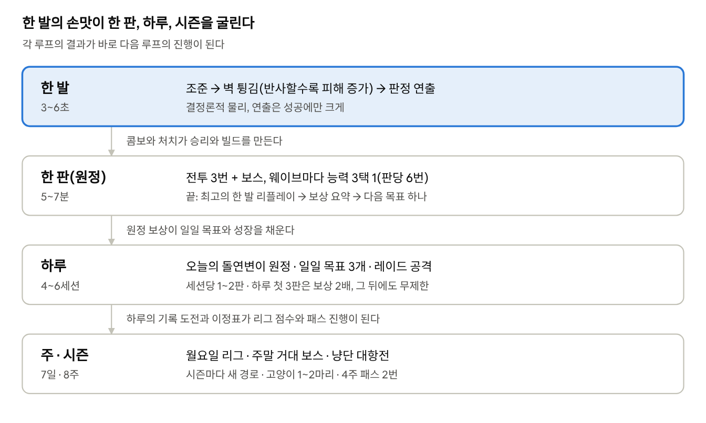
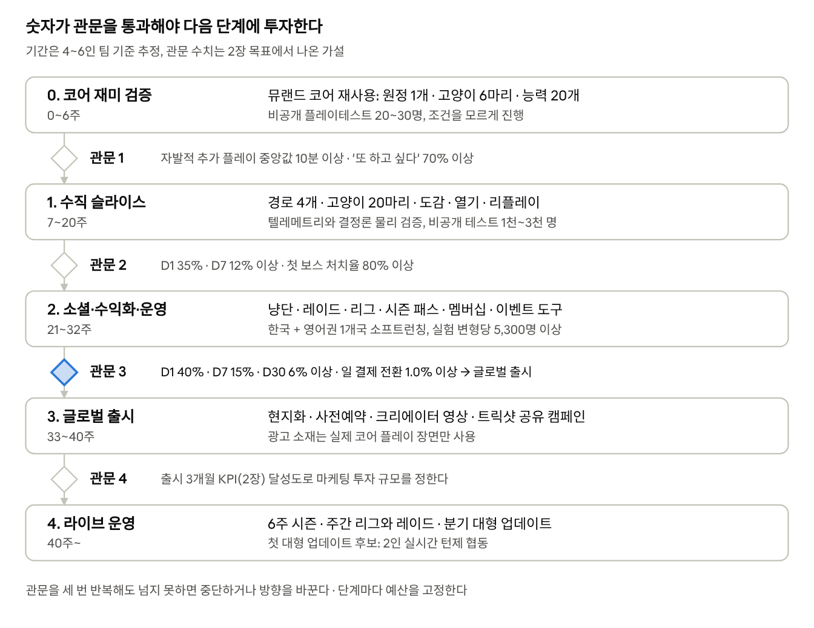

# 논문 기반 모바일 게임 기획서

작성일: 2026-10-01 · woweverstudio

> 이 문서는 Claude Docs 원본에서 내보낸 사본이다. 근거가 된 분야별 조사 노트는 [research/](research/README.md)에 있다.

## 한눈에 보는 요약

가제 「냥특공대」는 고양이 셋을 당겨 쏘고 벽에 튕겨 싸우는 5\~7분짜리 로그라이트 원정에 수집·성장 메타, 비동기 협동, 주간 리그를 얹은 광고 없는 결제 전용 모바일 게임이다. 목표는 글로벌 출시 3개월 시점에 D1 40%·D7 15%·D30 6%, 하루 플레이 40분으로 상위 10% 게임에 드는 것이다. 모든 결정은 6개 분야 조사 노트에서 검토한 약 270건 가운데 본문에 인용한 171건(논문·업계 자료·규제 원문)에 근거하며, 원문을 확인하지 못한 자료는 노트에 표시했다.

### 오래가는 게임의 조건과 현재 코어의 차이

연구가 말하는 '오래가고 재밌는 게임'의 조건을 스튜디오 사이트의 뮤랜드 2.0 소개와 비교하면, 한 판의 재미는 이미 갖췄고 돌아올 이유가 비어 있다.

| 조건(근거 장) | 뮤랜드 2.0(소개 페이지 기준) | 냥특공대 |
| --- | --- | --- |
| 한 발의 손맛과 의미 있는 선택(3장) | 당겨 쏘기·벽 튕김·능력 3택 1 있음 | 계승하고, 능력 선택을 판당 6번으로 늘린다 |
| 겹겹의 장기 목표와 수집(9장) | 경로별 메달·최고 점수 | 성장 축 6개(도감·열기 15단계 포함) |
| 관계성: 협동과 경쟁(10장) | 오프라인 싱글플레이 | 냥단 레이드·대항전, 주간 리그, 친구 도우미 |
| 돌아올 이유: 습관과 시즌(8·14장) | 소개 페이지에는 없음 | 일일 원정, 주간 리그, 8주 시즌 |
| 지속 가능한 수익(13장) | 소개 페이지에는 없음 | 시즌 패스·멤버십·코스메틱·성장 묶음 |

### 핵심 설계 결정 5가지

1. **코어**: 턴제 물리 슬링샷과 판당 6번의 능력 선택(3택 1). 아슬아슬한 결과는 즐거움을 높였고, "이번 한 발이 통할까"라는 호기심은 자발적 플레이를 예측했다(3장).
2. **난이도**: 기본은 쉽게, 어려움은 선택으로, 2연패면 도움을 제안한다. 배정된 난이도에서는 쉬운 쪽이 더 오래 플레이됐고(교육용 게임 대규모 실험), 이탈 위험군에게만 난이도를 낮춘 무작위 실험에서는 지출까지 늘었다(4·11장).
3. **소셜**: 상호의존 레이드와 30명 주간 리그. 다른 퍼즐 게임의 팀 대항전 A/B 테스트에서 모바일 매출이 85.9% 늘었다(10장).
4. **수익**: 유료 확률형과 유료 재화 없이 시즌 패스·멤버십·코스메틱·성장 묶음을 실제 가격으로 판다. 성장 묶음은 재화가 아니라 "삼색이 레벨 10" 같은 결과물로 판다. 확률형 지출은 문제성 도박과 연결되고, 한국·EU·미국의 규제는 빠르게 강해지고 있다(5·13·16장).
5. **운영**: 설정 기반 주간 이벤트와 8주 시즌. 2024년 모바일 게임 결제 매출의 84%가 라이브옵스 게임에서 나왔다(14장).

**다음 단계**는 뮤랜드 코어를 재사용한 8주짜리 프로토타입이다. 20\~30명 블라인드 테스트로 문제를 찾고, 80명 이상 테스트로 관문1을 판정한다(17장). 논문의 수치는 다른 게임에서 나온 값이므로, 우리 게임의 데이터로 다시 확인한다(15장).

## 성공의 정의와 목표 지표

성공 기준은 "글로벌 출시 3개월 시점에 상위 10% 게임 수준의 리텐션·플레이타임을 내고, 매출 100%를 광고가 아닌 결제에서 얻는 것"이다. 모바일 시장은 극단적인 멱법칙 구조라서, 2025년 중앙값 게임은 30일 뒤 설치자의 1% 미만만 남았다([GameAnalytics 2026 벤치마크](https://www.gameanalytics.com/reports/2026-mobile-pc-gaming-benchmarks), MAU 1천 이상 라이브 게임 16,262개). '평균보다 조금 나은 게임'은 사업이 되지 않으므로 목표를 상위 10%\~1% 구간에 둔다.

**참여 지표** — 업계 분포는 2025년 전 세계 모바일 게임 백분위(P50 중앙값 · P75 상위 25% · P90 상위 10% · P99 상위 1%).

| 지표 | 목표 (출시 3개월) | 2025 업계 분포 (P50 · P75 · P90 · P99) | 이 지표가 진단하는 것 |
| --- | --- | --- | --- |
| D1 리텐션 | 40% 이상 | 약 22% · 30%+ · 약 40% · 64\~68% | 첫 세션이 재미를 '증명'했는가 (온보딩) |
| D7 리텐션 | 15% 이상 | 4% 미만 · 6\~7% · 11\~12% · 25%+ | 코어 루프가 반복할 만한가 |
| D30 리텐션 | 6% 이상 (도전 목표 10%) | 0.7\~0.8% · 1.6\~1.8% · 4%+ (북미·유럽·오세아니아) · 13\~15% | 성장·소셜·라이브옵스가 작동하는가 |
| 일 플레이타임 (활성 유저당) | 40분 이상 | 약 12분 · 22\~24분 · 40\~42분 · 94분+ | 하루에 여러 번 돌아올 이유가 있는가 |
| 일 세션 수 | 4\~6회 | 3.8\~3.9회 · 5.3\~5.7회 · 약 9.6회 · 12\~14회 | 하루 리듬(일일 원정·레이드·리그)이 여러 번 부르는가 |
| 세션 길이 | 8\~12분 (1\~2판) | 3.1\~3.5분 · 약 5.2분 · 약 8분 · 22분+ | 한 세션이 1\~2판에서 자연스럽게 끝나는가 |

D1·D7·D28(본 기획의 D30)이 각각 온보딩·코어 게임플레이·콘텐츠 페이싱을 진단한다는 해석은 [GameAnalytics 2025 벤치마크](https://www.gameanalytics.com/reports/2025-mobile-gaming-benchmarks)의 프레임을 따랐다. 같은 보고서에서 미드코어 게임은 세션이 10\~15분, 하루 세션 수 중앙값이 6\~7회였다. 보드·카드·퍼즐 장르는 장기 리텐션이 가장 높고, 아케이드 장르는 D1은 최고지만 장기 리텐션이 약했다.

**수익 지표** — 광고 매출은 0으로 둔다.

| 지표 | 목표 | 참고 수치 | 비고 |
| --- | --- | --- | --- |
| 일 결제 전환율 (당일 결제자 ÷ DAU) | 1.0% 이상 (도전 1.5%) | 상위 15% 게임 0.8%, RPG 3%, 전략 2.5% ([GameAnalytics, 2018.6\~2019.5](https://gameworldobserver.com/2019/07/01/gameanalytics-benchmark-stats)) | 공개된 마지막 장르별 수치라 오래된 자료임 |
| ARPDAU | $0.10 이상 (도전 $0.15) | 상위 15% $0.10\~0.14, 전략·RPG $0.25 (같은 자료) | 결제만으로 달성해야 함. 상품별 구성은 13장 |
| 상위 5% 결제자의 월 매출 비중 | 40% 이하 (가드레일) | 상위 5% 결제자 = 매출 48%, 상위 10% = 64% ([Moloco·Sensor Tower 2025](https://files.gameindustrylibrary.com/documents/state-of-mobile-gaming-2025.pdf), Moloco 게임 광고주 상위 100개·24개월) | 소수 고액 결제자 의존은 규제·평판 리스크. 월 ₩30만 이상 결제자 비율도 추적한다 |

플레이타임 목표는 강제 대기나 손실 공포가 아니라 "자발적으로 돌아오고 싶은 이유"로 달성하며, 하루 첫 3판의 휴식 보너스(8장) 뒤의 플레이까지 포함한 수치다. 리텐션·결제 전환율·ARPDAU 목표는 17장 관문3의 기준이 된다. 다만 D30 상위 10%선이 북미 4.78%·유럽 4.05%인 데 비해 아시아는 2.59%이므로, 관문3의 리텐션 기준은 출시 국가의 지역 백분위로 다시 정한다([GameAnalytics 2026](https://www.gameanalytics.com/reports/2026-mobile-pc-gaming-benchmarks)).

## 연구 조사 ① — 무엇이 게임을 재밌고 흥분되게 만드는가

재미의 엔진은 유능감·자율성·관계성이라는 세 가지 심리 욕구의 충족이고, 흥분은 '내 성공이 아직 정해지지 않았다'는 불확실성에서 나온다. 세 욕구는 MMO 플레이어 730명의 즐거움 분산 중 45%를, 다른 실험에서는 51%를 설명했다. 아래는 기획에 직접 쓸 수 있는 발견만 추린 것이다.

| 발견 | 근거 (연구·표본) | 우리 게임에 적용 |
| --- | --- | --- |
| 세 가지 욕구 충족이 즐거움과 재플레이를 만든다 | 자율성 β=.49·유능감 .24·관계성 .12, 즐거움 R²=.45 ([Ryan et al., 2006](https://doi.org/10.1007/s11031-006-9051-8)). 욕구 충족 모델이 즐거움의 51% 설명([Tamborini et al., 2010](https://doi.org/10.1111/j.1460-2466.2010.01513.x)). 꾸미기·선택과 동적 난이도·성과 표시가 인과적으로 즐거움을 높임([Peng et al., 2012](https://doi.org/10.1080/15213269.2012.673850)) | 모든 시스템을 "어떤 욕구를 채우는가"로 심사한다. 플레이테스트에서 욕구 충족과 좌절을 함께 잰다 |
| 기본 난이도는 쉽게, 어려움은 스스로 고르게 | 약 1만·7만 명 실험에서 더 쉬운 버전을 더 오래 플레이([Lomas et al., 2013](https://doi.org/10.1145/2470654.2470668)). 중간 난이도는 스스로 골랐을 때만 가장 동기부여가 컸다(n=10,472, [Lomas et al., 2017](https://doi.org/10.1145/3025453.3025638)) | 기본 원정은 쉽게, '열기' 단계는 선택형 고난도로 둔다 |
| 흥분은 아슬아슬한 결과에서 나온다 | 압승보다 아슬아슬한 승리가 더 즐겁고, 69%가 접전을 다시 하기를 골랐다([Abuhamdeh et al., 2015](https://doi.org/10.1007/s11031-014-9425-2)). 서스펜스를 높이면 즐거움이 올랐다([Klimmt et al., 2009](https://doi.org/10.1089/cpb.2008.0060)) | 보스전과 마지막 한 발을 '아슬아슬하게' 설계한다 |
| 호기심이 자발적 플레이 시간을 예측한다 | 사전등록 실험(n=1,699)에서 호기심이 즐거움의 최강 예측 변수이자 자발적 플레이 시간의 유일한 예측 변수였다. 호기심 1점당 플레이 +0.88분(+10.8%). 무작위 연출 변화는 호기심을 높이지 못했다([Kao et al., 2024](https://doi.org/10.1145/3613904.3642656)) | "이번 한 발이 통할까?"라는 내 성공에 대한 호기심이 핵심이다 |
| 타격감(주스)은 중간\~높음이 최적 | 없음·극단 버전 모두 플레이 시간과 내적 동기가 낮았다(n=3,018, [Kao, 2020](https://doi.org/10.1016/j.entcom.2020.100359)). 과장된 연출이 행동과 결과의 연결을 가리면 유능감이 떨어졌다(Kao et al., 2024) | 연출은 성공에만, 등급(좋음·멋짐·퍼펙트)별로, 화면을 가리지 않게 |
| 보상은 '정보'일 때 돕고 '통제'일 때 해친다 | 128개 실험 메타분석: 예고된 조건부 보상은 내적 동기를 낮추고(d=−0.28\~−0.40), 칭찬형 피드백은 높였다(d=+0.33). 예상 못한 보상은 해가 없었다([Deci et al., 1999](https://doi.org/10.1037/0033-2909.125.6.627)). 점수·레벨·리더보드는 활동량만 늘렸다([Mekler et al., 2017](https://doi.org/10.1016/j.chb.2015.08.048)) | "5판 하면 코인" 같은 노동형 퀘스트를 줄이고, 깜짝 보상과 실력 피드백을 늘린다 |
| 모바일에서는 쉬운 조작·미려함·신선함이 재미를 만든다 | 디자인 미학·사용 용이성·새로움이 즐거움을, 즐거움이 계속 이용 의도를 예측(N=207, [Merikivi et al., 2016](https://doi.org/10.1109/HICSS.2016.473)). 즐거움과 이용 의도의 상관 r=.586(48개 연구 메타분석, [Hamari & Keronen, 2017](https://doi.org/10.1016/j.ijinfomgt.2017.01.006)) | 첫 화면부터 한 손 드래그 하나로 완결되는 조작 |
| 플레이 시간이 아니라 '강박'이 해롭다 | 7개 게임 38,935명 텔레메트리: 플레이 시간의 웰빙 효과는 거의 0, 내적 동기는 이후 삶의 만족을 예측했다([Vuorre et al., 2022](https://doi.org/10.1098/rsos.220411)). 강박적 열정은 플레이 시간을 늘리면서 즐거움은 낮췄다([Przybylski et al., 2009](https://doi.org/10.1089/cpb.2009.0083)) | "해야 해서"가 아니라 "하고 싶어서" 오래 하게 만든다 |
| 기분 상승은 세션 첫 15분에 몰린다 | 파워워시 시뮬레이터 8,695명·67,328세션: 약 72%가 플레이 중 기분 상승을 겪을 것으로 추정됐고, 상승은 대부분 첫 15분 안에 일어났다([Vuorre et al., 2024](https://doi.org/10.1145/3659464)) | 한 세션을 8\~12분(1\~2판) 단위로 설계하고 자연스러운 종료 지점을 둔다 |

**오해 바로잡기.** "게임은 도파민을 분비시킨다"는 근거로 자주 인용되는 [Koepp et al. (1998)](https://doi.org/10.1038/30498)은 8명 연구였고, 같은 연구진의 2009년 재분석에서 유의한 변화가 사라졌다([Egerton et al., 2009](https://doi.org/10.1016/j.neubiorev.2009.05.005)). 도파민은 보상 자체가 아니라 '예측과 다른 결과'에 반응한다는 연구([Schultz et al., 1997](https://doi.org/10.1126/science.275.5306.1593))가 더 길잡이가 된다. 즉 매번 똑같은 보상은 힘을 잃고, "예상보다 잘됐다"는 순간이 가장 강하다.

**흥분의 재료 세 가지(위 연구들의 종합).** ① 내 행동이 결과를 바꾼다는 감각, ② 결과가 아직 정해지지 않았다는 불확실성, ③ 결과가 즉시 읽히는 피드백. 셋 중 하나라도 빠지면 흥분은 단순한 운이나 소음이 된다. 물리 슬링샷은 조준(①), 튕김의 예측 불가능성(②), 충돌 연출(③)을 한 발에 모두 담는다.

## 연구 조사 ② — 무엇이 플레이어를 오래 붙잡는가

이탈은 대부분 첫날에 결정되고, 그 뒤에는 갑작스러운 난이도와 연패, 혼자 남은 느낌, 돌아올 이유의 부족이 이탈을 만든다. 필요한 것은 보상을 더 뿌리는 것이 아니라 경험 자체를 바꾸는 것이다. 아래는 게임사 데이터·대규모 실험 연구에서 추린 발견이다.

| 발견 | 근거 (연구·표본) | 우리 게임에 적용 |
| --- | --- | --- |
| 이탈 위험은 맨 처음이 가장 높다 | 이탈 위험도는 시간당 약 0.6에서 4시간 안에 절반으로, 10시간 뒤 약 0.2로 떨어졌다([Viljanen et al., 2018](https://doi.org/10.1109/TCIAIG.2017.2727642)). 대부분이 1\~2세션 만에 떠나는 게임에서는 이탈 예측이 무작위에 가까워, 메시지가 아니라 설계로만 고칠 수 있었다([Hadiji et al., 2014](https://doi.org/10.1109/CIG.2014.6932876)) | 첫 5분과 첫날에 가장 많은 개발 시간을 쓴다(12장) |
| 설치 후 20시간 안에 돌아와야 한다 | 젤리 스플래시 설치 13만 7천 건: 첫날의 판 수, 미접속 시간, 도달 레벨이 핵심 예측 변수였고 20시간 넘게 돌아오지 않으면 이탈 신호였다([Drachen et al., 2016](https://doi.org/10.1609/aiide.v12i1.12856)) | "내일 다시 올 이유"를 첫날 안에 보여 준다 |
| 초반 난이도가 급하면 떠난다 | 유비소프트 레이맨 레전드: 초반 난이도 급상승은 낮은 리텐션과, 후반의 높은 난이도는 오히려 낮은 이탈과 연관됐다([Allart et al., 2017](https://doi.org/10.1145/3102071.3102085)). 로비오 9만 5천 명: 레벨을 못 깬 채 떠난 이탈과 통과율의 상관은 r=−0.586([Roohi et al., 2020](https://doi.org/10.1145/3410404.3414235)) | 초반은 평탄하게, 난이도는 나중에 올린다 |
| 이탈 위험군에게 게임을 쉽게 해 주면 장기 지출이 는다 | 무작위 현장 실험: 이탈 위험 플레이어(20레벨 이상·지난주 20판 미만)에게만 게임을 쉽게 해 주자 그 판의 구매는 줄었지만 리텐션이 오르면서 단기·장기 지출이 모두 늘었다. 이전 결제자에게서 효과가 가장 컸다([Ascarza et al., 2025](https://doi.org/10.1016/j.ijresmar.2025.01.006)). 퍼즐 게임 구조 추정에서 평균 난이도는 이미 매출을 극대화하는 수준이었고, 매출 +71%의 이득은 난이도 개인화에서 나올 것으로 추정됐다([Pape et al., 2025](https://doi.org/10.1016/j.ijindorg.2024.103128)) | '고통을 만들고 해결책을 파는' 설계는 하지 않는다 |
| 연패가 이탈을 부른다 | EA 플레이어 168만 명·3,690만 매치: 3연패 뒤 7일 이탈 위험 5.1%, 안정 상태는 2.6\~2.7%([Chen et al., 2017](https://doi.org/10.1145/3038912.3052559)). 헤일로에서는 패배 뒤에 휴식이 따랐다([Huang et al., 2013](https://doi.org/10.1145/2470654.2470753)) | 연패를 감지하고 끊어 주는 장치를 둔다(11장) |
| 동적 난이도 조절은 효과가 있다 | EA: 참여도 최대 +9%, 수익에는 중립([Xue et al., 2017](https://doi.org/10.1145/3041021.3054170)). 퍼즐 게임 온라인 A/B에서 난이도 개입이 리텐션을 유의하게 높였다([Li et al., 2021](https://doi.org/10.1145/3447548.3467277)) | PvE에만 적용하고 리그에는 쓰지 않는다 |
| 튜토리얼보다 플레이로 가르친다 | 4만 5천 명 실험: 튜토리얼은 복잡한 게임에서만 효과가 있었고(플레이 시간 최대 +29%), 단순한 게임에서는 무효과였다([Andersen et al., 2012](https://doi.org/10.1145/2207676.2207687)). 강제 대기는 28명 중 19명을 짜증나게 했다([Petersen et al., 2017](https://doi.org/10.1145/3116595.3125499)) | 글 설명 없이 필요한 순간에만 알려 준다 |
| 공짜 재화로는 이탈을 못 막는다 | 우가: 이탈 예측된 고액 결제자에게 무료 재화를 줌 → 이탈·결제 모두 유의한 변화 없음([Runge et al., 2014](https://doi.org/10.1109/CIG.2014.6932875)). 위험도가 아니라 개입에 반응할 사람을 고르는 편이 효과적이었다([Ascarza, 2018](https://doi.org/10.1509/jmr.16.0163)) | 복귀 선물보다 경험을 바꾸는 개입에 투자한다 |
| 친구와의 플레이는 잔류를 예측한다 | 리그 오브 레전드 34만 명: 친구와의 플레이는 모든 단계에서 잔류를 예측했고, 만렙에서는 유일한 장기 예측 변수였다([Shores et al., 2014](https://doi.org/10.1145/2531602.2531724)) | 냥단·친구 시스템을 초반에 연결한다(10장) |
| 스트릭은 관대해야 효과가 있다 | 듀오링고: 스트릭 유지 조건을 낮추자 14일 리텐션 +3.3%([Duolingo](https://blog.duolingo.com/improving-the-streak)). 끊긴 스트릭을 강조하면 참여가 줄고, 복구할 수 있으면 그 효과가 약해졌다([Silverman & Barasch, 2023](https://doi.org/10.1093/jcr/ucac029)). 비상 여분(건너뛰기 2번)이 있으면 놓친 다음 날 재개율이 55% 대 37%였다([Sharif & Shu, 2021](https://doi.org/10.1016/j.obhdp.2019.01.004)) | 놓친 날을 메워 주는 '스트릭 보호권'을 둔다(8장) |
| 습관은 몇 달이 걸리고, 꾸준한 플레이가 실력을 키운다 | 습관 형성 중앙값 약 66일([Lally et al., 2010](https://doi.org/10.1002/ejsp.674)). 85만 명 데이터에서 플레이를 24시간 이상에 나눠 한 사람의 이후 점수가 더 높았다(d=0.11, [Stafford & Dewar, 2014](https://doi.org/10.1177/0956797613511466)) | 몰아치기보다 매일 조금씩을 보상한다 |

정리하면 이탈 대응은 시기마다 다르다. 첫 세션은 설계로, 첫날\~첫 주는 돌아올 이유와 부드러운 난이도로, 첫 달 이후는 성장·관계·라이브옵스로 막는다.

## 연구 조사 ③ — 사람들은 왜 돈을 쓰는가

사람들은 막힘없는 플레이, 사회적 교류, 가성비, 자기표현에 돈을 쓴다. 이기는 힘을 산 사람은 동료의 존중을 잃는다. 결제는 드물고 소수에게 몰려 있어서, 결국 리텐션이 곧 매출이다.

| 발견 | 근거 (연구·표본) | 우리 게임에 적용 |
| --- | --- | --- |
| 결제는 드물고 소수에게 몰린다 | 30일 안에 결제한 신규 플레이어는 2% 미만([Sifa et al., 2015](https://doi.org/10.1609/aiide.v11i1.12788)). 모바일 게임 2,873개·거래액 47억 달러 분석에서 극단적인 게임은 상위 1%가 매출의 약 38%를 냈다([Zendle et al., 2023](https://doi.org/10.1145/3582927)) | 소수 고액 결제자가 아니라 넓은 중간층을 노린다. 게임마다 매출 집중도가 크게 달랐다 |
| 광고 없는 결제 모델이 수요를 높인다 | 앱 수요 모형에서 인앱 구매 제공은 가격 28% 할인과 같은 수요 증가를, 인앱 광고는 가격 8% 인상과 같은 수요 감소를 낳았다([Ghose & Han, 2014](https://doi.org/10.1287/mnsc.2014.1945)) | '광고 없음' 자체가 제품의 장점이다 |
| 지출을 부르는 동기 | 막힘없는 플레이·사회적 교류·가성비가 지출을 예측했고 경쟁은 예측하지 못했다(N=519, [Hamari et al., 2017](https://doi.org/10.1016/j.chb.2016.11.045)). 24개 연구 메타분석에서는 자기표현·사회적 존재감·지각된 가치·즐거움이 구매를 예측했다([Hamari & Keronen, 2017](https://doi.org/10.1016/j.chb.2017.01.042)) | 성장 가속·묶음 가성비·선물·보이는 코스메틱을 판다 |
| 꾸미기만으로도 지갑을 연다 | 리그 오브 레전드 플레이어는 능력 없는 스킨을 즐거움·사회적 이유는 물론 "개발사를 응원하려고"도 샀다([Marder et al., 2019](https://doi.org/10.1016/j.chb.2018.09.006)). 스팀 인기 게임에서 코스메틱 판매 게임의 플레이 비중은 86%까지 늘었지만 페이투윈은 17%에서 멈췄다([Zendle et al., 2020](https://doi.org/10.1371/journal.pone.0232780)) | 코스메틱을 주력 상품군으로 둔다 |
| 힘을 사면 존중을 잃는다 | 기능적 우위를 산 플레이어는 실력·지위가 낮게 평가됐고, 치장품 구매는 그런 불이익이 훨씬 적었다(532명, [Evers et al., 2015](https://research.tilburguniversity.edu/en/publications/the-hidden-cost-of-microtransactions-buying-in-game-advantages-in/)). 플레이어들은 페이투윈을 '치팅'으로도 봤다([Freeman et al., 2022](https://doi.org/10.1145/3549510)) | 리그·대항전은 공용 로스터(전원 같은 레벨)로 겨룬다 |
| 불편을 팔면 리텐션을 잃는다 | 즐거움이 클수록 유료 구매 의향은 낮고 계속 이용은 높았다(N=869, [Hamari et al., 2020](https://doi.org/10.1016/j.ijinfomgt.2019.102040)). 무작위 실험에서는 이탈 위험군의 난이도를 낮추자 참여가 약 20% 늘고 30일 매출도 늘었으며 그 증가의 약 80%가 인앱 구매였다([Ascarza et al., 2025](https://doi.org/10.1016/j.ijresmar.2025.01.006)) | 일부러 만든 불편을 풀어 주는 상품은 팔지 않는다 |
| 시즌 패스는 표준 상품이다 | 2023년 매출 상위 20% 모바일 게임의 약 66%가 패스를 썼다([GameRefinery](https://www.gamerefinery.com/12-ways-to-take-battle-passes-to-the-next-level-in-mobile-games/)). 클래시 오브 클랜은 골드 패스 도입 달 매출이 전월 대비 58% 늘었다(상관, [Sensor Tower](https://sensortower.com/blog/battle-pass-success-stories-2021)). 기본 패스는 대개 $5\~15에 가격의 10\~20배 가치를 준다([Deconstructor of Fun](https://www.deconstructoroffun.com/blog/2022/6/4/battle-passes-analysis)). 패스는 새 유저 유입에는 거의 영향이 없었고, 플레이어는 돈 없이 닿기 어려운 보상을 싫어했다(동료심사 전, [Petrovskaya & Zendle](https://doi.org/10.31219/osf.io/vnmeq)) | 무료 트랙도 플레이만으로 끝까지 갈 수 있게 만든다 |
| 할인은 정직하면 효과가 있다 | 무작위 실험에서 프로모션은 전환과 매출을 높였고 구매 미루기나 가치 하락 인식은 나타나지 않았다([Runge et al., 2022](https://doi.org/10.1007/s11129-022-09248-3)) | 가짜 정가·가짜 카운트다운 없이 정기 할인을 한다 |
| 가상 화폐는 지불 의향을 부풀린다 | 실제 통화 대신 가상 화폐(1:1 환율)로 가격을 보여 주자 확률형 상자의 지불 의향이 약 4% 높아졌다(무작위 실험 N=753, [Toccafondi et al., 2025](https://doi.org/10.1017/eec.2026.10049)) | 유료 상품은 실제 가격으로 직접 판다 |
| 확률형 상자는 문제성 도박과 연결된다 | 확률형 지출과 문제성 도박의 연관(η²=.054)은 다른 인게임 구매(η²=.004)보다 훨씬 강했다(7,422명, [Zendle & Cairns, 2018](https://doi.org/10.1371/journal.pone.0206767)). 15개 연구 메타분석 r=0.26([Garea et al., 2021](https://doi.org/10.1080/14459795.2021.1914705)). 상위 5% 구매자가 매출의 절반을 냈고 그중 거의 3분의 1이 문제성 도박군이었다([Close & Lloyd, 2021](https://www.gambleaware.org/media/egljnu4x/gaming_and_gambling_report_final_0.pdf)) | 유료 확률형을 두지 않는다 |
| 확률 공개만으로는 부족하다 | 확률을 본 중국 플레이어 중 지출을 줄인 사람은 19.3%뿐이었고 86.9%가 천장(보장) 장치에 찬성했다([Xiao et al., 2023](https://doi.org/10.1007/s10899-022-10148-0)) | 후일 랜덤 상품을 검토하더라도 천장·중복 방지·지출 한도가 먼저다 |

한국에서는 2021년 메이플스토리 확률 조작 논란으로 '트럭 시위'가 벌어졌고([Korea Herald](https://www.koreaherald.com/article/2562759)), 공정거래위원회는 2024년 1월 넥슨에 과징금 116억 원을 부과했다([Xiao & Park, 2025](https://doi.org/10.1016/j.actpsy.2025.105490)). 한국 이용자들은 결제자조차 "노골적인 BM"에 강한 반감을 보였다([KOCCA 2025](https://www.kocca.kr/kocca/bbs/view/B0000147/2010445.do?menuNo=204153)). 공정한 과금은 윤리이자 마케팅 포인트다.

## 연구에서 도출한 설계 원칙

아래 13개 원칙이 이 기획의 모든 시스템을 결정한다. 새 기능을 넣거나 빼자는 의견이 나오면 "어느 원칙에 맞는가, 어긋나는가"로 판단한다. 근거는 가능한 한 무작위 실험·대규모 데이터 연구를 우선했다.

| # | 원칙 | 핵심 근거 | 이 기획에서의 구현 |
| --- | --- | --- | --- |
| 1 | 유능감·자율성·관계성의 충족이 재미의 엔진이다 | [Ryan et al., 2006](https://doi.org/10.1007/s11031-006-9051-8); [Tamborini et al., 2010](https://doi.org/10.1111/j.1460-2466.2010.01513.x); [Peng et al., 2012](https://doi.org/10.1080/15213269.2012.673850) | 모든 기능을 세 욕구로 심사하고 플레이테스트에서 충족·좌절을 잰다(15장) |
| 2 | 흥분은 '내 성공'에 대한 불확실성에서 나오고, 연출은 성공을 읽히게 해야 한다 | [Abuhamdeh et al., 2015](https://doi.org/10.1007/s11031-014-9425-2); [Kao et al., 2024](https://doi.org/10.1145/3613904.3642656); [Kao, 2020](https://doi.org/10.1016/j.entcom.2020.100359) | 조준→튕김→판정, 보스의 마지막 한 발, 등급별 연출(8장) |
| 3 | 첫 5분에 재미를 증명하고 첫날에 돌아올 이유를 준다 | [Andersen et al., 2012](https://doi.org/10.1145/2207676.2207687); [Hadiji et al., 2014](https://doi.org/10.1109/CIG.2014.6932876); [Drachen et al., 2016](https://doi.org/10.1609/aiide.v12i1.12856) | 글 없는 온보딩, 첫 보스의 아슬아슬한 승리, "내일 열리는 것"(12장) |
| 4 | 기본은 쉽게, 어려움은 스스로 고르게, 연패는 끊는다 | [Lomas et al., 2013](https://doi.org/10.1145/2470654.2470668), [2017](https://doi.org/10.1145/3025453.3025638); [Allart et al., 2017](https://doi.org/10.1145/3102071.3102085); [Chen et al., 2017](https://doi.org/10.1145/3038912.3052559) | 난이도 3층 구조, 열기 단계, 2연패 도움 제안(11장) |
| 5 | 고통을 만들고 그 해결책을 팔지 않는다 | [Ascarza et al., 2025](https://doi.org/10.1016/j.ijresmar.2025.01.006); [Hamari et al., 2017](https://doi.org/10.1016/j.chb.2016.11.045) | 에너지 제한 없음, 연패 도움은 무료, 이탈 위험군에게는 보이는 응원단 버프(8·11·13장) |
| 6 | 목표는 겹겹이, 다음 하나가 항상 보이게 | [Locke & Latham, 2002](https://doi.org/10.1037/0003-066X.57.9.705); [Kivetz et al., 2006](https://doi.org/10.1509/jmkr.43.1.39); [Anderson et al., 2013](https://doi.org/10.1145/2488388.2488398) | 다섯 겹 목표, 앞서 출발하는 트랙, 보상 즉시 다음 목표(9장) |
| 7 | 내 것이 생기면 돌아온다 | [Birk et al., 2016](https://doi.org/10.1145/2858036.2858062); [Birk & Mandryk, 2018](https://doi.org/10.1145/3173574.3174234); [Norton et al., 2012](https://doi.org/10.1016/j.jcps.2011.08.002) | 첫 세션의 특공대 꾸미기, 캣타워, 고양이 추억 기록(9장) |
| 8 | 습관 장치는 관대하게 만든다 | [Duolingo, 2020](https://blog.duolingo.com/improving-the-streak); [Silverman & Barasch, 2023](https://doi.org/10.1093/jcr/ucac029); [Sharif & Shu, 2021](https://doi.org/10.1016/j.obhdp.2019.01.004); [Frommel & Mandryk, 2022](https://doi.org/10.1145/3549489) | 스트릭 보호권, 누적형 7일 여정, 휴식 보너스(8·12장) |
| 9 | 정점에서 끝내고 다음 한 가지를 남긴다 | [Kahneman et al., 1993](https://doi.org/10.1111/j.1467-9280.1993.tb00589.x); [Gutwin et al., 2016](https://doi.org/10.1145/2858036.2858419); [Ghibellini & Meier, 2025](https://doi.org/10.1057/s41599-025-05000-w) | 결과 화면 = 최고의 한 발 → 보상 → 다음 목표(8장) |
| 10 | 진짜 협동은 깊게, 의무는 가볍게 | [Alsén et al., 2016](https://doi.org/10.1609/aiide.v12i2.12904); [Depping & Mandryk, 2017](https://doi.org/10.1145/3116595.3116639); [Drachen et al., 2018](https://doi.org/10.1145/3167918.3167925); [Zagal et al., 2013](http://www.fdg2013.org/program/papers/paper06_zagal_etal.pdf) | 상호의존 레이드, 냥단 대항전, 3일 참여 창, 공격 횟수 판매·기여 순위 공개 없음(10장) |
| 11 | 비슷한 사람끼리 작은 무대에서 경쟁하고, 신규·하위권은 강한 상대에게서 보호한다 | [Mazal, 2023](https://www.lennysnewsletter.com/p/how-duolingo-reignited-user-growth); [Butler, 2013](https://doi.org/10.1007/978-3-642-39371-6_15); [Shores et al., 2014](https://doi.org/10.1145/2531602.2531724); [Kang et al., 2024](https://doi.org/10.1016/j.heliyon.2024.e24891) | 30명 주간 리그, 신규 전용 리그, 제한된 소통(10·11장) |
| 12 | 랜덤의 재미는 플레이 안에, 돈으로는 확정된 것만 판다 | [Zendle & Cairns, 2018](https://doi.org/10.1371/journal.pone.0206767); [Close et al., 2021](https://doi.org/10.1016/j.addbeh.2021.106851); [Supercell GDC 2024](https://gdcvault.com/play/1034604/-Brawl-Stars-Learnings-from) | 능력 드래프트·물리·획득형 보상에만 랜덤, 유료 확률형 없음(13·16장) |
| 13 | 오래 하게 하되 강박은 만들지 않는다 | [Vuorre et al., 2022](https://doi.org/10.1098/rsos.220411); [Przybylski et al., 2009](https://doi.org/10.1089/cpb.2009.0083) | 자연스러운 종료 지점, 웰빙 가드레일 지표(15·16장) |

원칙 5·12·13은 일부 단기 매출을 포기하는 선택처럼 보인다. 하지만 무작위 실험에서는 고통을 줄이자 장기 지출이 오히려 늘었고(Ascarza et al., 2025), 한국에서는 불투명한 확률이 법적 책임으로 이어진다(16장).

## 게임 컨셉

가제 「냥특공대」는 고양이 세 마리를 당겨 쏘고 벽에 튕겨 몬스터를 부수는 5\~7분짜리 로그라이트 원정에, 고양이 수집·성장 메타와 냥단(길드) 협동을 얹은 결제 전용(광고 없음) 모바일 게임이다. 코어 전투는 뮤랜드 2.0의 구조(당겨서 발사, 벽 튕김 강화, 전투마다 능력 3택 1, 경로당 4전투(4번째가 보스))를 출발점으로 삼는다. 이미 만들어 본 코어를 쓰면 '재미 검증'에 드는 시간과 위험이 가장 작다.

- **한 줄 판타지**: "내가 그린 각도 하나로 화면 전체가 연쇄 폭발한다."
- **장르 위치**: 캐주얼처럼 바로 이해되는 코어 + 미드코어 수준의 여러 성장 축 + 비동기·협동 소셜(하이브리드 미드코어).
- **플랫폼·조작**: iOS·Android, 세로 화면 한 손 드래그, 턴제 발사(조준은 천천히, 결과는 물리로).

### 왜 이 장르인가

| 근거 | 데이터 | 기획에 주는 의미 |
| --- | --- | --- |
| 결제 매출이 의미 있게 성장한 제품 모델은 하이브리드캐주얼뿐 | 2025년 하이브리드캐주얼 IAP +20%([Sensor Tower](https://sensortower.com/press/press-release-sensor-tower-state-of-gaming-gaming-drove-52-billion-downloads-82b-iap-revenue-on-mobile-and-12b-premium-revenue-on-steam)), +88%·$733M([AppMagic](https://gamedevreports.substack.com/p/appmagic-mobile-games-monetization)). 상위작의 D7이 캐주얼을 앞질렀다 | 쉬운 코어 + 깊은 메타 구조를 택한다. 하이브리드캐주얼은 광고와 결제를 함께 쓰는 모델이므로, 광고 없는 우리는 그 몫을 패스·멤버십으로 메워야 한다 |
| 한국이 로그라이트 하이브리드의 핵심 시장 | [궁수의 전설 2(Archero 2)](https://www.pocketgamer.biz/archero-2-makes-328m-in-first-30-days-from-player-spending/) 첫 30일 $32.8M, 최대 시장은 한국(23%) | 한국 선출시 후 글로벌 |
| 물리 슬링샷의 일본 내 대중성 | [몬스터 스트라이크](https://gameworldobserver.com/2023/11/15/monster-strike-revenue-10-billion-in-japan-sensor-tower): 일본에서만 $10.5B(2013\~2023.10), 평균 MAU 580만, 매출의 97%가 일본. [최대 4인 협동](https://www.monster-strike.com/connect/)이 핵심 기능 | 협동이 슬링샷 장르의 성장 엔진이다. 일본 밖 수요는 검증되지 않았다 |
| 튕기는 물리 + 빌드 로그라이트의 현재 수요 | [BALL x PIT](https://www.gematsu.com/2025/12/ball-x-pit-sales-top-one-million-three-free-content-updates-set-for-2026): 2025년 10월 15일 출시, 12월 2일 100만 장 돌파 | 코어 재미의 시장성이 확인된다 |
| 시스템이 콘텐츠를 만든다 | [캔디크러시 소다](https://www.pocketgamer.biz/candy-crush-soda-saga-11-years-18000-levels-and-a-turning-point-for-the-candy-crush-franchise/)는 2025년 한 해에만 레벨 2,355개를 추가했다 | 레벨 수작업 대신 절차적 경로·빌드 조합으로 콘텐츠를 만든다 |
| 약점: 아케이드형 코어 | 아케이드 장르는 D1은 최고지만 장기 리텐션이 약하다([GameAnalytics 2025](https://www.gameanalytics.com/reports/2025-mobile-gaming-benchmarks)) | 9\~14장의 메타·소셜·라이브옵스로 보완한다 |

같은 분석에서 4X 전략(상위 10개가 장르 매출 64%), MMO·서브컬처 가차 RPG(대형 콘텐츠 물량 필요), 실시간 PvP(매칭 인구·넷코드 부담)는 소형 팀에게 비현실적이었다.

### 타깃 플레이어

- **1차 타깃**: 18\~39세, 짧고 손맛 있는 액션과 빌드 전략을 좋아하는 모바일 게이머(궁수의 전설·몬스트·로그라이트 경험자). 한국 20·30대의 수집형 RPG 이용률은 37.6%·38.3%였다([KOCCA 2025 게임이용자 실태조사](https://www.kocca.kr/kocca/bbs/view/B0000147/2010445.do?menuNo=204153), n=10,000).
- **이들이 하는 이유**: 주로 하는 모바일 게임을 고른 1순위 이유는 플레이 몰입(59.6%), 게임을 하는 1순위 이유는 스트레스 해소(54.2%)다(같은 조사).
- **이들의 제약**: 평일 모바일 게임 시간은 하루 약 91분이고 연간 평균 3.4개 게임에 나눠 쓴다. 휴면 이용자가 꼽은 1순위 이탈 이유는 '시간 부족'(44.0%)이다. 그래서 한 판은 5\~7분, 언제 끊어도 손해가 없게 만든다.

### 4대 기둥

1. **한 발의 짜릿함** — 조준, 튕김, 연쇄 폭발로 이어지는 3\~6초가 매번 작은 서스펜스가 된다.
2. **매 판 다른 나만의 빌드** — 판당 6번의 능력 선택과 특공대 조합으로 판마다 의미 있는 선택을 한다.
3. **함께 튕기면 더 세다** — 냥단 레이드와 친구 도우미는 서로를 강하게 만드는 협동이며, 어떤 경우에도 결제를 강요하지 않는다.
4. **공정하게 강해진다** — 랜덤의 재미는 플레이 안에 두고, 돈으로는 확정된 것만 판다.

### 차별점

- **vs 궁수의 전설류**: 자동 사격과 회피 대신 조준과 튕김의 물리 실력. 트릭샷은 공유할 만한 명장면이 된다.
- **vs 몬스트**: 짧은 로그라이트 원정, 유료 확률형 없는 공정한 과금, 소형 팀도 운영 가능한 비동기 협동.
- **vs PC 로그라이트(BALL x PIT 등)**: 세로 한 손 조작, 무료 시작, 8주 단위 시즌 라이브 운영.

## 코어 루프와 세션 설계

한 판(원정)은 전투 3번과 보스 1번, 총 5\~7분이고, 매 발사는 조준→튕김→판정으로 이어지는 3\~6초짜리 작은 서스펜스다. 루프는 세 겹으로 쌓는다. 한 세션에 끝나는 루프, 하루 여러 세션에 걸쳐 끝나는 루프, 며칠\~몇 주에 걸친 루프다. 이 구조는 "다시 돌아올 자연스러운 계기"를 여럿 만든다는 [GameAnalytics 2026 보고서](https://www.gameanalytics.com/reports/2026-mobile-pc-gaming-benchmarks)의 권고를 따른다.

한 발이 재미없으면 위의 어떤 루프도 돌지 않는다. 시즌의 새 고양이와 기믹이 다시 한 발의 선택지를 넓히기 때문에, 프로토타입은 한 발의 손맛부터 검증한다(17장).

### 한 발: 조준 → 튕김 → 판정 (3\~6초)

1. **조준** — 드래그로 당기고 놓는다. 첫 벽 반사까지만 궤적 가이드를 보여 주고 그 뒤는 숨긴다. 조작은 즉시 배우고, 결과는 예측하게 만든다. 직관적 조작은 유능감과 자율성을 통해 즐거움을 높였다([Ryan et al., 2006](https://doi.org/10.1007/s11031-006-9051-8)).
2. **튕김** — 벽에 튕길 때마다 피해 배율이 오르고 화면 상단 콤보 숫자가 올라간다. 아군 고양이에 부딪히면 그 고양이의 '우정 기술'이 터진다. 결과가 아직 정해지지 않은 이 구간이 서스펜스다([Klimmt et al., 2009](https://doi.org/10.1089/cpb.2008.0060)).
3. **판정** — 좋음·멋짐·퍼펙트 등급별로 연출을 달리하되, 화면을 가리거나 무엇이 통했는지 숨기지 않는다. 성공에 연동한 연출은 호기심과 유능감을 높였고, 과장된 연출은 유능감을 낮췄다([Kao et al., 2024](https://doi.org/10.1145/3613904.3642656)).

물리는 결정론적으로 만든다. 같은 각도와 힘이면 항상 같은 결과가 나오므로 실력이 쌓이고, 리플레이 공유와 리그 기록 검증이 가능해진다. 서버에서 기록을 다시 돌려 검증하려면 고정 타임스텝·고정 소수점 연산이 필요하므로, 물리는 뮤랜드 코드를 그대로 쓰지 않고 0\~1단계에서 새로 짠다(17장).

### 한 전투 (60\~90초)

- **적 배치**: 손으로 만든 패턴 조각 위에 절차적 변주를 얹는다. 플레이어가 생성 규칙을 익히고 전략을 세울 수 있는 것이 절차적 생성만의 재미다([Smith, 2014](https://doi.org/10.1145/2556288.2557341)).
- **가벼운 시간 압박**: 적에게는 "N턴 뒤 공격" 카운터가 있다. 조작 횟수를 늘리는 것은 몰입을 높이지 못했고, 시간 압박으로 인지적 도전을 더한 것은 높였다([Cox et al., 2012](https://doi.org/10.1145/2207676.2207689)).
- **웨이브마다 능력 3택 1**: 전투마다 웨이브가 2개라 보스 전까지 능력을 6번 고른다. 판마다 빌드가 달라지는 자율성의 핵심이다. 초반에는 추천 표시를 붙이고 선택지를 단계적으로 늘린다. 선택 과부하는 복잡하고 비교하기 어려울 때만 생긴다([Chernev et al., 2015](https://doi.org/10.1016/j.jcps.2014.08.002)). 플레이테스트에서는 "판마다 빌드가 달랐다" 응답률과 능력 선택의 다양성(엔트로피)을 잰다.

### 한 판: 전투 3번 + 보스 (5\~7분)

- **톱니형 긴장 곡선**: 쉬운 전투로 몸을 풀고 점점 조여 보스에서 정점을 찍는다. 기본 난이도는 쉬운 쪽에 둔다([Lomas et al., 2013](https://doi.org/10.1145/2470654.2470668)).
- **마지막 한 발**: 보스 체력이 조금 남으면 카메라 줌과 슬로모션으로 결말을 보여 준다. 아슬아슬한 승리는 압승보다 더 즐겁다([Abuhamdeh et al., 2015](https://doi.org/10.1007/s11031-014-9425-2)).
- **깜짝 보상**: 드물게 '황금 츄르' 적이 나타나 보너스를 준다. 예상 못한 보상은 내적 동기를 해치지 않는다([Deci et al., 1999](https://doi.org/10.1037/0033-2909.125.6.627)). 돈으로 사는 무작위 보상은 두지 않는다(13장).
- **끝맺음 = 정점 + 끝 + 다음 한 가지**: 결과 화면은 ① 이번 판 최고의 한 발 리플레이(공유 버튼), ② 얻은 것 요약, ③ 다음 목표 하나 순서다. 기억은 정점과 끝이 좌우하고([Kahneman et al., 1993](https://doi.org/10.1111/j.1467-9280.1993.tb00589.x); [Gutwin et al., 2016](https://doi.org/10.1145/2858036.2858419)), 중단된 과제는 67%가 다시 재개된다([Ghibellini & Meier, 2025](https://doi.org/10.1057/s41599-025-05000-w)).
- **지더라도 얻는다**: 패배 화면은 얻은 것과 기여한 한 발을 먼저 보여 주고, 결제 팝업으로 끝내지 않는다.

### 하루와 그 이상

| 루프 | 길이 | 내용 | 근거 |
| --- | --- | --- | --- |
| 하루 | 4\~6세션, 세션당 1\~2판 | 오늘의 돌연변이 원정(저중력·탱탱벽 등 이름 붙은 변주 1개), 일일 목표 3개, 냥단 레이드 공격. 일일 목표는 판 수가 아니라 기술·변주 목표다(예: 벽 3번 튕겨 처치, 오늘의 돌연변이 원정 클리어) | 이름을 붙여 세분화한 반복은 덜 질린다([Redden, 2008](https://doi.org/10.1086/521898)). 예고된 조건부 보상은 내적 동기를 낮췄다([Deci et al., 1999](https://doi.org/10.1037/0033-2909.125.6.627)) |
| 하루 보상 리듬 | 시간 경과로 충전 | 하루 첫 3판은 보상 2배(휴식 보너스). 그 뒤에도 무제한으로 플레이할 수 있고 에너지로 막지 않는다. 휴식 보너스는 보상 상한이며 어떤 상품으로도 늘리지 않는다 | 시간이 지나면 차오르는 보상이 습관을 가장 잘 만든다([Wood & Rünger, 2016](https://doi.org/10.1146/annurev-psych-122414-033417)). 에너지·관문과 묶인 일일 보상은 '숙제'로 느껴졌다([Frommel & Mandryk, 2022](https://doi.org/10.1145/3549489)) |
| 일일 스트릭 | 매일 | 하루 1판을 마치면 +1. 놓친 날은 스트릭 보호권(최대 2칸, 주 1칸 무료 충전)이 자동으로 막는다. 보호권은 팔지 않는다. 친구와 쌓는 '함께 스트릭'(10장)에도 같은 규칙을 쓴다 | 유지 조건을 낮추자 14일 리텐션이 3.3% 올랐다([Duolingo](https://blog.duolingo.com/improving-the-streak)). 비상 여분이 있으면 놓친 다음 날 재개율이 55% 대 37%였다([Sharif & Shu, 2021](https://doi.org/10.1016/j.obhdp.2019.01.004)) |
| 주 | 7일 | 월요일 시작 주간 리그, 금\~일 냥단 레이드 | 새 주가 시작될 때 실천 확률이 +33.4% 올랐다([Dai et al., 2014](https://doi.org/10.1287/mnsc.2014.1901)) |
| 시즌 | 8주 | 새 경로·보스, 고양이 1\~2마리. 시즌 패스는 4주 단위로 시즌마다 두 번 연다 | 포켓몬 GO가 늘린 걸음 수는 6주 안에 원래대로 돌아왔다([Howe et al., 2016](https://doi.org/10.1136/bmj.i6270)). 모바일 패스 시즌은 대개 한 달 안팎이다([Deconstructor of Fun](https://www.deconstructoroffun.com/blog/2022/6/4/battle-passes-analysis)). 콘텐츠는 소형 팀의 제작 속도에 맞춰 8주, 패스는 시장 관행에 맞춰 4주로 두고 출시 뒤 데이터로 다시 정한다 |

**모바일 맥락.** 발사 사이마다 자동 저장하고, 앱을 전환했다 돌아와도 그 자리에서 이어진다. 한 세션의 기분 상승은 대부분 첫 15분 안에 일어나므로([Vuorre et al., 2024](https://doi.org/10.1145/3659464)), 1\~2판마다 "오늘 목표 완료" 같은 자연스러운 종료 지점을 둔다. 플레이어가 스스로 끊고 나갈 수 있을 때 긍정적인 이탈 경험이 남았다([Alexandrovsky et al., 2024](https://doi.org/10.1145/3677066)).

## 메타 루프와 장기 진행

장기 리텐션은 "성장 축 여럿 + 항상 보이는 다음 목표 + 내가 만든 것"에서 나온다. 스쿼드 버스터즈는 다운로드 7,500만에도 서비스를 종료했다. 업계 분석은 성장 축 부족·숙련 깊이 부족·짧은 소프트런칭 등 네 가지를 원인으로 꼽았고([Deconstructor of Fun](https://www.deconstructoroffun.com/blog/2024/9/30/4-x-reasons-why-squad-busters-suffers-while-brawl-stars-soars)), 슈퍼셀은 베타의 리텐션이 글로벌에서 재현되지 않았다고 밝혔다([Supercell](https://supercell.com/en/news/the-best-games-havent-been-made-yet/)). 반대로 클래시 로얄은 성장 구조를 단순화한 뒤 복귀 플레이어가 2배, 신규 플레이어가 약 500% 늘었다(같은 Supercell 글). 그래서 축은 여럿 두되 각 축의 규칙은 단순하게 만든다.

### 성장 축 6개

| 성장 축 | 내용 | 주기 | 근거 |
| --- | --- | --- | --- |
| 고양이 수집(도감) | 출시 15마리, 시즌마다 1\~2마리. 고양이마다 물리 특성(무게·탄성·관통·분열)이 달라, 새 고양이는 곧 새 플레이 방식이다. 새 고양이는 출시 즉시 시즌 원정의 조각으로도 얻는다 | 수개월 | 수집품의 가치는 쓸모(26.5%)와 재미(23.8%)에서 나오고, 65%가 수집품을 남에게 보여준다([Toups et al., 2016](https://doi.org/10.1145/2967934.2968088)) |
| 고양이 레벨 | 코인과 츄르로 원하는 고양이를 키운다. 확률 뽑기 없이 계획한 대로 성장한다. 레벨은 새 경로·열기 단계의 진입 조건과 레이드 보스 처치 속도에 반영된다 | 매일 | 한국 결제자의 구매 1순위 동기는 빠른 성장(46.0%)이다([KOCCA 2025](https://www.kocca.kr/kocca/bbs/view/B0000147/2010445.do?menuNo=204153)) |
| 원정 열기(난이도 사다리) | 경로마다 열기 0\~15단계. 클리어할수록 적이 강해지고 보상은 칭호·테두리 같은 표식이다. 칭호 옆에 도달 당시 특공대 평균 레벨을 함께 보여 실력으로 깬 기록이 드러나게 한다 | 수개월 | 절차적 변주는 '변화 속 숙달'을 만들 때 가장 가치 있다([Smith, 2014](https://doi.org/10.1145/2556288.2557341)) |
| 계정 레벨 | 기능을 단계적으로 연다(도감 → 냥단 → 리그 → 열기) | 첫 2주 | 선택지 과부하는 복잡하고 비교하기 어려울 때만 생긴다([Chernev et al., 2015](https://doi.org/10.1016/j.jcps.2014.08.002)) |
| 캣타워(홈 꾸미기) | 모은 고양이가 사는 집을 가구로 꾸미고 냥단원에게 자랑한다 | 수시 | 스스로 완성한 창작물은 약 63% 더 높게 평가된다([Norton et al., 2012](https://doi.org/10.1016/j.jcps.2011.08.002)). 한국 이용자의 37.4%가 창작·꾸미기 몰입을 이유로 꼽았다(KOCCA 2025) |
| 업적·메달 | 경로·고양이·트릭샷 업적을 단계별로 잇는다. 결과 화면과 프로필에 노출한다 | 수시 | 배지 도입 뒤 활동은 늘었지만 효과 크기(r²=.01\~.03)는 작았다([Hamari, 2017](https://doi.org/10.1016/j.chb.2015.03.036)) |

### 재화 흐름

재화는 코인·츄르와 고양이 조각만 두고, 어느 것도 돈으로 팔지 않는다. 돈으로는 결과물(고양이, 레벨 달성, 코스메틱)만 판다(13장). 보석 같은 프리미엄 재화가 없으므로 EU 원칙의 다단계 환전·불일치 묶음 문제와 유료 재화 관련 스토어 규정이 처음부터 생기지 않는다(16장).

| 재화 | 얻는 곳 | 쓰는 곳 | 유료 상품과의 관계 | 하루 목표(안, 무과금 4\~6세션 기준) |
| --- | --- | --- | --- | --- |
| 코인 | 원정·레이드·리그 보상, 일일 목표 | 고양이 레벨업, 일부 캣타워 가구 | 팔지 않는다. 성장 묶음은 코인 대신 레벨 달성 결과를 직접 준다 | 레벨업 2\~3회분을 얻고 대부분 쓴다 |
| 츄르 | 일일 목표, 업적·도감 이정표, 패스 | 레벨 구간 돌파(10·20·30레벨) | 팔지 않는다 | 주 1회 구간 돌파분 |
| 고양이 조각 | 시즌 원정, 패스 무료 트랙, 도감 이정표 | 새 고양이 영입(30조각) | 직접 구매는 고양이 자체를 판다. 조각은 팔지 않는다 | 새 고양이 1마리를 약 3주에 |
| 무료 상자 | 원정 보상(드물게), 리그 승급 | 열면 코스메틱·코인·츄르·조각 중 하나 | 어떤 유료 상품·유료 재화로도 얻거나 열 수 없다. 확률은 공개한다(16장) | 하루 0\~1개 |

### 목표 설계 규칙

1. **목표는 다섯 겹으로 보여 준다**: 이번 판, 오늘(3개), 이번 주, 이번 시즌, 장기(도감·열기). 구체적이고 조금 어려운 목표는 "최선을 다하라"보다 성과가 높다(d = .42\~.80, [Locke & Latham, 2002](https://doi.org/10.1037/0003-066X.57.9.705)).
2. **새 트랙은 앞서 출발한다**: 패스·도감·퀘스트는 "환영 보너스 2/10"처럼 이유 있는 진행도를 주고 시작한다. 보너스 도장 2개를 받은 카드는 약 20% 빨리 완성됐다([Kivetz et al., 2006](https://doi.org/10.1509/jmkr.43.1.39); [Nunes & Drèze, 2006](https://doi.org/10.1086/500480)).
3. **보상을 주는 순간 다음 목표를 연다**: 보상 직후에는 노력이 리셋되고, 배지를 받은 뒤 활동은 기준선으로 돌아간다([Anderson et al., 2013](https://doi.org/10.1145/2488388.2488398)).
4. **긴 트랙의 중간에 마일스톤을 둔다**: 동기는 절반 지점에서 가장 낮다([Bonezzi et al., 2011](https://doi.org/10.1177/0956797611404899)). 신규 유저에게는 '지금까지 한 것', 베테랑에게는 'N개 남음'을 보여 준다([Koo & Fishbach, 2008](https://doi.org/10.1037/0022-3514.94.2.183)).
5. **선택 목표는 주 진행 경로 위에 둔다**: 경로 밖 수집 요소는 중간층의 플레이를 줄였고, 해를 본 플레이어가 도움을 받은 플레이어의 약 4배였다. 경로 위 수집 요소는 경로 밖 수집 요소보다 재방문율이 높았고(헬로 월즈 18.4%→23.2%), 수집 요소가 없을 때보다도 높았다(리프랙션 19.5%→21.0%)([Andersen et al., 2011](https://doi.org/10.1145/2159365.2159370)).

### 정체성과 소유감

- **첫 세션에서 특공대를 내 것으로 만든다**: 특공대 이름·엠블럼·대장 고양이 외형을 고르게 한다. 아바타를 직접 꾸민 사람은 더 몰입하고 자발적으로 더 오래 플레이했다([Birk et al., 2016](https://doi.org/10.1145/2858036.2858062)). 19일 실험에서는 접속일이 중앙값 7일 대 5일이었고, 알림이 꺼진 기간에 차이가 컸다([Birk & Mandryk, 2018](https://doi.org/10.1145/3173574.3174234)).
- **고양이마다 추억을 기록한다**: 언제, 어디서 만났는지와 최고의 한 발을 도감에 남기고, 캣타워에 전시한다.
- **만든 것은 절대 없애지 않는다**: 시즌이 바뀌어도 캣타워와 기록은 그대로 남는다. 창작물이 부서지면 애착 효과도 사라졌다(Norton et al., 2012).

### 장기 설계의 시간 단위

습관이 자리 잡는 데는 중앙값 약 66일([Lally et al., 2010](https://doi.org/10.1002/ejsp.674)), 운동은 4\~7개월이 걸렸다([Buyalskaya et al., 2023](https://doi.org/10.1073/pnas.2216115120)). 따라서 무과금 플레이어 기준으로 출시 콘텐츠의 핵심 목표(도감 80%, 열기 10단계)는 6개월 이상 걸리도록 설계한다. 복귀한 플레이어가 밀린 업데이트를 '공부'하지 않도록 복귀 요약과 따라잡기 보너스도 둔다(KOCCA 2025 집단심층면접).

## 소셜 시스템

소셜은 "혼자서도 되지만 함께하면 더 세지는" 구조로 만들고, 얼굴만 소셜인 '친구에게 하트 요청'이 아니라 진짜 팀 플레이에 예산을 쓴다. 우가(Wooga) 다이아몬드 대시에 팀 대항전을 넣은 무작위 A/B 테스트에서 모바일 매출은 +85.9%, 일간 활성 사용자는 +5%, 인당 일 세션은 +10.4% 늘었다([Alsén et al., 2016](https://doi.org/10.1609/aiide.v12i2.12904)). 반면 퍼즐 게임 21만 9천 명 데이터에서 친구 요청 같은 얕은 소셜 기능은 결제를 예측하지 못했고, 오히려 구매를 대체했다([Drachen et al., 2018](https://doi.org/10.1145/3167918.3167925)).

| 시스템 | 설계 | 근거 |
| --- | --- | --- |
| 냥단(길드) | 20\~30명. '친목·경쟁·초보 환영' 유형 태그와 추천 매칭. 단장·부단장·모집·보급 등 역할을 여럿 둔다. 활동 단원이 8명 미만인 상태가 2주 이어지면 활발한 냥단과의 병합을 제안한다 | 길드 없음·단원·간부의 이탈 경험률은 88%·79%·71%였다([Debeauvais et al., 2011](https://doi.org/10.1145/2159365.2159390)). 길드를 떠난 주된 이유는 목표 불일치와 리더십 부재였다([Williams et al., 2006](https://doi.org/10.1177/1555412006292616)) |
| 거대 보스 레이드(비동기 협동) | 금\~일 3일간 냥단원이 각자 원정으로 같은 보스를 공격한다. '탐지' 역할 고양이가 남긴 약점 표식을 다음 단원이 터뜨리는 식으로 서로의 공격이 이어진다. 피해량에는 고양이 레벨을 냥단 중앙값 +10%까지만 반영하고, 개인 기여 순위는 공개하지 않는다 | 상호의존적 협동은 실시간 음성 대화 실험에서 대화를 늘려 신뢰와 친밀감을 높였다([Depping & Mandryk, 2017](https://doi.org/10.1145/3116595.3116639)). 비동기·채팅 제한 레이드에서는 이 효과를 가정하지 않는다. 약점 표식을 남긴 단원에게 보내는 '고마워요' 이모트와 레이드 하이라이트 공유로 대신하고 플레이테스트로 확인한다. 게임 내 사회적 자본의 최강 예측 변수는 상호의존(+)과 유해 행동(−)이었다([Depping et al., 2018](https://doi.org/10.1145/3242671.3242702)) |
| 냥단 대항전 | 단원들의 주간 리그 기록을 냥단끼리 합산해 겨룬다. 개인 경쟁을 협동으로 감싼다 | 경쟁과 협동을 결합한 게임화가 특히 효과적이었다([Sailer & Homner, 2020](https://doi.org/10.1007/s10648-019-09498-w)) |
| 친구 도우미 | 원정마다 친구의 대표 고양이 1마리를 데려간다. 빌려준 쪽에도 작은 보상이 돌아간다. 두 친구는 '함께 스트릭'을 쌓고, 놓친 날은 스트릭 보호권(8장)이 막는다 | 친구와의 협동(최대 4인)은 몬스트의 핵심 기능이다. 친구 스트릭이 1개 이상인 학습자는 일일 레슨 완료 확률이 22% 높았다(상관, [Duolingo](https://blog.duolingo.com/friend-streak/)) |
| 주간 리그 | 30명 그룹, 10티어 승급·강등, 자동 참가와 옵트아웃. 모두가 같은 시드의 주간 원정을 같은 공용 로스터로 겨룬다(아래 규칙) | 듀오링고 리그 도입 후 학습 시간 +17%, 고몰입 학습자 3배([Mazal, 2023](https://www.lennysnewsletter.com/p/how-duolingo-reignited-user-growth)). 리더보드 양끝(1등 근처·꼴찌 근처)에 있을 때 재도전이 많았다([Butler, 2013](https://doi.org/10.1007/978-3-642-39371-6_15)) |
| 함께 있는 느낌 | 친구의 최고 샷 궤적(고스트), 냥단 활동 피드, 캣타워 방문 | 혼자 하는 플레이어에게도 다른 플레이어는 "관객이자 존재감"이었다([Ducheneaut et al., 2006](https://doi.org/10.1145/1124772.1124834)). 다른 플레이어의 비동기 흔적만으로 연결감이 올랐다([Hirsch et al., 2023](https://doi.org/10.1145/3611057)) |

### 주간 리그 규칙

- **점수**: 주간 고정 시드 원정의 최고 기록 1판으로 매긴다. 기록 도전은 하루 3회이고, 연습판은 무제한이되 기록에 넣지 않는다. 판 수를 늘려도 점수가 오르지 않으므로 몰아치기가 보상받지 않는다(원칙 13).
- **로스터**: 출전 고양이는 공용 로스터(전원 같은 레벨)에서 고른다. 신규 고양이는 출시 4주 뒤 로스터에 들어간다. 결제와 성장은 리그 점수에 영향을 주지 않는다.
- **공개 시점**: 그 주 시드의 고스트·리플레이는 리그가 끝난 뒤 공개해, 최적의 한 발을 그대로 베끼지 못하게 한다.
- **그룹**: 실력 구간과 지난주 활동량으로 묶는다(11장). 그룹이 30명이 안 되면 지난주 기록(고스트)으로 채우고 그렇다고 표시한다. 신규 유저 리그는 가입일 기준 7일 단위로 돈다.

### 설계 규칙

1. **혼자 먼저, 소셜은 곧**: 첫 세션은 혼자 완결한다. 냥단 추천은 계정 5레벨(약 2일차), 리그는 3일차에 연다. 초반에는 성장이, 후반에는 친구 관계가 잔류를 가장 잘 예측했다([Park et al., 2017](https://doi.org/10.1145/3041021.3054176)).
2. **의무감은 가볍게**: 레이드는 3일 창을 둔다. 빠진 단원에게 벌점이 없고, 공격 횟수는 돈으로 팔지 않는다. 한국 이용자 집단심층면접에서는 길드가 강요하는 결제가 이탈 사유로 꼽혔다([KOCCA 2025](https://www.kocca.kr/kocca/bbs/view/B0000147/2010445.do?menuNo=204153)). 사회적 의무감으로만 플레이하게 만드는 설계는 다크 패턴이다([Zagal et al., 2013](http://www.fdg2013.org/program/papers/paper06_zagal_etal.pdf)).
3. **이탈은 전염된다**: 친구가 많이 떠난 플레이어일수록 이탈 확률이 높았다([Kawale et al., 2009](https://doi.org/10.1109/CSE.2009.80)). 냥단 활동이 줄면 활발한 냥단으로의 이동이나 병합을 제안한다.
4. **신규·하위권이 강한 상대를 만나지 않게**: 한국 모바일 보드게임 「모두의마블」 600만 판 분석에서 강한 상대와의 매칭은 이탈을 늘렸고, 약한 상대와의 매칭은 비슷한 상대보다도 이탈을 더 줄였으며, 실력 격차가 커질수록 이탈이 늘었다([Kang et al., 2024](https://doi.org/10.1016/j.heliyon.2024.e24891)).
5. **소통은 제한하고 신규 유저를 보호한다**: 출시 때는 자유 채팅 없이 프리셋 문구·이모트와 원터치 음소거만 둔다. 냥단 채팅에는 필터와 신고를 붙인다. 유해한 팀원은 신규 유저의 장기 이탈을 예측했다([Shores et al., 2014](https://doi.org/10.1145/2531602.2531724)). 상대 팀 채팅을 기본 끄기로 바꾸자 부정 채팅이 32.7% 줄었다([Riot Games](https://www.gamedeveloper.com/business/more-carrot-less-stick-jeffrey-lin-on-tweaking-i-league-of-legends-i-player-behavior)).
6. **좋은 행동에 보상을 준다**: 레이드 후 '고마워요' 칭찬을 주고받고, 모인 칭찬은 코스메틱으로 바뀐다. 오버워치는 칭찬 시스템 도입 후 방해 행동이 있는 매치가 40% 줄었다고 발표했다(전후 비교, [PC Gamer](https://www.pcgamer.com/overwatchs-endorsement-system-has-cut-disruptive-behavior-by-40-percent/)).
7. **소셜은 표현과 선물로 수익화하고 힘은 팔지 않는다**: 멤버십 선물하기, 냥단 전원에게 같은 코스메틱이 가는 팩(받는 화면에 구매자 강조·답례 권유 없음), 남에게 보이는 코스메틱을 둔다. 친구가 유료 서비스를 쓰면 나의 구매 확률(오즈)이 60% 넘게 올랐다([Bapna & Umyarov, 2015](https://doi.org/10.1287/mnsc.2014.2081)). 사회적 구매 동기는 지출을 예측했고 경쟁 동기는 예측하지 못했다([Hamari et al., 2017](https://doi.org/10.1016/j.chb.2016.11.045)). 미국 플레이어의 20%는 괴롭힘 때문에 지출을 줄인다고 답했다([ADL, 2024](https://www.adl.org/resources/report/hate-no-game-hate-and-harassment-online-games-2023)).

2인 실시간 턴제 협동(몬스트식)은 글로벌 출시 후 첫 대형 업데이트 후보로 둔다. 턴제라서 각 발사의 각도와 힘만 동기화하면 되지만, 출시 범위에서는 빼서 개발 위험을 줄인다.

## 난이도와 매치메이킹

원칙은 네 가지다. 기본은 쉽게, 어려움은 스스로 고르게, 연패는 끊어 주고, 경쟁은 공정하게. 배정된 난이도에서는 쉬운 버전이 더 오래 플레이됐고, 중간 난이도는 스스로 고를 때만 가장 동기를 높였다([Lomas et al., 2017](https://doi.org/10.1145/3025453.3025638)).

### 난이도 3층 구조

| 층 | 대상 | 난이도 운영 | 근거 |
| --- | --- | --- | --- |
| 기본 원정 | 모든 플레이어 | 쉬운 쪽에 둔다. 보스는 "아슬아슬하게 이기는" 분포를 목표로 조율하고, PvE에서만 보조 장치를 켠다 | 아슬아슬한 승리가 압승보다 더 즐겁다([Abuhamdeh et al., 2015](https://doi.org/10.1007/s11031-014-9425-2)). 유비소프트 두 게임의 추정 실패 확률도 대부분 15\~30%였다([Allart et al., 2017](https://doi.org/10.1145/3102071.3102085)) |
| 열기 0\~15단계 | 숙련자 | 스스로 올리는 선택형 고난도. 보상은 칭호·테두리 같은 표식 | 스스로 고른 중간 난이도가 가장 동기부여가 컸다(Lomas et al., 2017) |
| 주간 리그·냥단 대항전 | 경쟁 참가자 | 고정 시드, 공용 로스터(전원 같은 레벨), 보조 장치 없음 | 모두가 같은 조건에서 겨루어야 순위가 공정하다 |

### 연패와 좌절 다루기 (PvE)

1. **2연패면 도움을 제안한다**: 같은 전투에서 두 번 지면 "응원단 고양이의 도움을 받을까요?"를 묻는다. 보이는 선택지로 두어 플레이어가 스스로 고르게 한다. EA의 동적 난이도는 참여도를 최대 9% 높였다([Xue et al., 2017](https://doi.org/10.1145/3041021.3054170)). 다만 숨은 조절은 실력에 대한 과신을 만들었으므로([Constant & Levieux, 2019](https://doi.org/10.1145/3290605.3300693)) 도움은 드러내고 준다.
2. **이탈 위험이 보이면 응원단 버프를 보여 주고 건다**: 다음 원정 시작 화면에 '응원단 버프(적 체력 −10%)'를 표시하고 적용하며, 플레이어가 끌 수 있다. 숨기지 않는 것은 1번 규칙 때문이다. 무작위 실험에서 이탈 위험군의 난이도를 낮추자 지출까지 늘었다([Ascarza et al., 2025](https://doi.org/10.1016/j.ijresmar.2025.01.006)).
3. **진 이유와 해결책을 한 줄로**: "보스의 방패는 뒤에서 튕기면 뚫립니다"처럼 다음 시도의 방법을 준다. 실패를 스스로 바꿀 수 있는 수단(강화·준비)이 있으면 난이도가 동기를 덜 꺾었다(Allart et al., 2017).
4. **지더라도 진행한다**: 패배해도 입힌 피해만큼 코인과 도감 기록을 준다. 노력과 부분 진행에 보상하자 어려움을 겪는 플레이어의 지속성이 올랐다([O'Rourke et al., 2014](https://doi.org/10.1145/2556288.2557157)).

### 난이도 곡선 만들기

- **기믹은 하나씩**: 소개 → 연습 → 기존 기믹과 결합 → 난이도 상승 → 다음 기믹 순서로 낸다. 포털·브레이드 등 성공한 퍼즐 게임 4종이 모두 이 패턴을 따랐다([Linehan et al., 2014](https://doi.org/10.1145/2658537.2658695)).
- **출시 전 자동 플레이테스트**: 규칙 기반 봇으로 전투·보스별 통과율과 이탈 지점을 미리 추정하고, 강화학습 에이전트는 출시 뒤 여력이 생기면 붙인다. 로비오 연구는 AI 플레이어와 인구 시뮬레이션으로 레벨별 통과율과 이탈을 출시 전에 예측했다([Roohi et al., 2020](https://doi.org/10.1145/3410404.3414235)). 결정론적 물리라서 자동 테스트가 쉬운 것도 이득이다.
- **이탈 위험도 곡선의 튀는 지점을 찾는다**: 잘 만든 레벨 디자인에서는 이탈이 고르게 일어난다. 갑자기 튀는 지점은 설계 결함이다([Viljanen et al., 2018](https://doi.org/10.1109/TCIAIG.2017.2727642)).

### 매치메이킹 (리그·대항전)

- **비슷한 실력끼리, 약자는 보호**: 리그 그룹은 실력 구간과 지난주 활동량으로 묶는다(10장). 실력 격차가 클수록 이탈이 늘었고, 약한 상대를 만날 때 이탈이 가장 적었다([Kang et al., 2024](https://doi.org/10.1016/j.heliyon.2024.e24891)).
- **신규 유저 보호 구간**: 계정 생성 후 2주는 신규 전용 리그에 배치하고, 이 리그는 가입일 기준 7일 단위로 돈다.
- **숨은 승패 조작은 하지 않는다**: EOMM 연구는 최근 승패에 따라 상대를 골라 참여를 높이는 매칭을 제안했고, 그 효과는 시뮬레이션으로 확인했다([Chen et al., 2017](https://doi.org/10.1145/3038912.3052559)). 승패를 몰래 조정하는 방식은 들키면 신뢰를 잃고 규제 위험도 크다고 우리는 판단한다. 결제 여부는 매칭·난이도 입력값에서 제외한다.

## 온보딩(FTUE)

첫 5분 안에 '재미의 증명'을 끝내고, 첫날 안에 내일 돌아올 이유를 심는다. 업계에서도 "진짜 승부는 첫 5분"이고 "온보딩은 튜토리얼이 아니라 즐거움의 시연이어야 한다"고 조언한다([GameAnalytics 2026](https://www.gameanalytics.com/reports/2026-mobile-pc-gaming-benchmarks)). 연구도 같다. 단순한 게임에서 튜토리얼은 효과가 없었고([Andersen et al., 2012](https://doi.org/10.1145/2207676.2207687)), 설치 후 20시간 안에 돌아오지 않으면 이탈 신호였다([Drachen et al., 2016](https://doi.org/10.1609/aiide.v12i1.12856)).

| 시점 | 무슨 일이 일어나나 | 왜 |
| --- | --- | --- |
| 0\~30초 | 로고·로딩을 최소화하고 바로 전투 화면. 손가락 드래그 애니메이션 하나로 첫 발사. 글 설명 없음 | 플레이어는 액션에 닿기 위해 튜토리얼을 건너뛰고, 건너뛸 수 없는 장면은 치명적이었다([Cheung et al., 2014](https://doi.org/10.1145/2658537.2658540)) |
| 30초\~3분 | 전투 1\~2. 벽에 튕길수록 세진다는 것을 체감한다. 3발 안에 반사를 안 쓰면 그때만 힌트를 준다. 첫 능력 3택 1(추천 표시) | 플레이어는 설명보다 액션에 닿기를 원했다(Cheung et al., 2014) |
| 3\~5분 | 첫 보스. 마지막 한 발 슬로모션으로 아슬아슬하게 이긴다. 결과 화면에 최고의 한 발 리플레이 | 기억은 정점과 끝이 좌우한다([Gutwin et al., 2016](https://doi.org/10.1145/2858036.2858419)) |
| 5\~8분 | 특공대 이름·엠블럼·대장 고양이 외형을 고른다. 첫 고양이를 영입하고, 도감은 4/15(시작 특공대 3마리 + 첫 영입)에서 시작한다 | 꾸민 아바타는 몰입과 자발적 플레이 시간을 늘렸다([Birk et al., 2016](https://doi.org/10.1145/2858036.2858062)). 앞서 출발한 진행도는 완료를 당긴다([Nunes & Drèze, 2006](https://doi.org/10.1086/500480)) |
| 8\~15분 | 새 고양이로 두 번째 원정. 캣타워에 첫 가구를 놓는다. "내일 열리는 것"(새 경로·누적 접속 보상)을 보여 주고 "오늘 목표 완료"로 자연스럽게 끝난다 | 앞으로 얻을 힘을 미리 보여 주는 '호기심'이 즐거움보다 강했다(Cheung et al., 2014). 플레이 중 기분 상승은 대부분 첫 15분 안에 일어났다([Vuorre et al., 2024](https://doi.org/10.1145/3659464)) |
| 2일차 | 냥단 추천(계정 5레벨), 친구 도우미 소개, 첫 구매 제안(스타터 팩, 계정당 1회·기한 없음) | 미래 결제자는 2% 미만이었고 구매의 최강 예측 변수는 이전 구매였다([Sifa et al., 2015](https://doi.org/10.1609/aiide.v11i1.12788)). 스타터 팩 실험에서 전환·재구매·리텐션 개선 조짐이 보였다([Runge et al., 2024](https://doi.org/10.1109/CoG60054.2024.10645582)) |
| 3일차 | 신규 전용 주간 리그 참가(가입일 기준 7일 주기) | 신규·하위권은 강한 상대를 만나지 않을 때 덜 떠났다(10장) |
| 1\~7일차 | '신입 대원 7일 여정'. 빠진 날이 있어도 보상이 쌓이는 누적형이다 | 하루만 빠져도 무의미해지는 개근상은 역효과를 냈다([Gubler et al., 2016](https://doi.org/10.1287/orsc.2016.1047)) |

### 금지 목록

- **강제 대기**: 자동 전투·긴 연출 대기는 28명 중 19명을 짜증나게 했다([Petersen et al., 2017](https://doi.org/10.1145/3116595.3125499)).
- **초반의 반복 패배**: 같은 연구에서 28명 중 24명이 반복된 죽음에 좌절했다. 첫 보스까지는 질 수 없게 만든다.
- **소리에 기대는 안내**: 많은 플레이어가 무음으로 플레이한다고 답했다(같은 연구). 모든 피드백은 화면만으로도 읽혀야 한다.
- **첫 세션의 결제 팝업**: 상점은 열어 두되 먼저 띄우지 않는다.

### 측정 지표

첫 발사까지 걸린 시간, 설치자 대비 첫 보스 처치 비율(퍼널), 첫날 3판 이상 플레이 비율, 20시간 내 복귀율, D1을 본다. 단계별 이탈은 퍼널이 아니라 분 단위 이탈 위험도 곡선으로 추적한다(15장).

## 수익화 설계(광고 제외)

돈은 "더 빨리, 더 나답게, 더 함께"에 쓰게 하고, 이기는 힘과 확률은 팔지 않는다. 한국 결제자의 구매 동기 1순위는 빠른 성장(46.0%), 경쟁 우위(32.3%), 꾸미기(15.3%) 순이었고 구매 판단 기준은 가격(36.7%)과 게임에 미치는 영향(35.9%)이었다([KOCCA 2025](https://www.kocca.kr/kocca/bbs/view/B0000147/2010445.do?menuNo=204153)). 국제 연구에서 지출을 예측한 것은 막힘없는 플레이·사회적 교류·가성비였고, 경쟁 동기는 예측하지 못했다([Hamari et al., 2017](https://doi.org/10.1016/j.chb.2016.11.045)). 그래서 성장 가속은 판매하되 리그·대항전은 공용 로스터로 겨뤄 돈으로 순위를 사지 못하게 한다. 경쟁 우위라는 두 번째 구매 동기는 일부러 포기하는 대신, 성장이 새 경로·열기 단계 진입과 레이드 보스 처치 속도로 이어지게 해 성장 상품의 쓸모를 만든다(9장).

### 상품 구성

| 상품 | 가격(안, 실험으로 확정) | 내용 | 설계 이유 |
| --- | --- | --- | --- |
| 스타터 팩 | $0.99\~2.99, 계정당 1회, 기한 없음 | 인기 고양이 1마리 + 스킨 1종 + 그 고양이 레벨 5 달성 | 추후 구매의 최강 예측 변수는 이전 구매였다([Sifa et al., 2015](https://doi.org/10.1609/aiide.v11i1.12788)). 낮은 가격의 스타터 팩은 전환·재구매·리텐션 개선 조짐을 보였다([Runge et al., 2024](https://doi.org/10.1109/CoG60054.2024.10645582)) |
| 시즌 패스(4주) | 무료 / 프리미엄 $4.99\~7.99 / 프리미엄+ $12.99\~16.99 | 50단계. 시즌 고양이는 무료 트랙 마지막 단계에도 두고, 프리미엄은 조기 획득·전용 스킨·가구로 차별화한다. 패스 경험치는 판 수보다 첫 승리·새 기록·도감 등록 같은 이정표에서 주로 얻는다. 지난 패스의 코스메틱은 6\~12개월 뒤 상점에서 다시 판다. 랜덤 요소는 넣지 않는다 | 보상이 미리 보이는 확정형이다. 매출 상위 20% 모바일 게임의 약 66%가 패스를 쓰고([GameRefinery](https://www.gamerefinery.com/12-ways-to-take-battle-passes-to-the-next-level-in-mobile-games/)), 기본 패스는 대개 $5\~15에 가격의 10\~20배 가치를 준다([Deconstructor of Fun](https://www.deconstructoroffun.com/blog/2022/6/4/battle-passes-analysis)). 한국 결제자의 신규 상품 구매 중 29.8%가 시즌 패스였다(KOCCA 2025). 돈 없이 닿기 어려운 보상은 반감을 샀다([Petrovskaya & Zendle](https://doi.org/10.31219/osf.io/vnmeq)) |
| 냥 멤버십(구독) | 월 $4.99, 한 번에 해지 | 매달 멤버 전용 스킨·캣타워 가구 1종, 멤버 프레임·이모트, 리플레이 보관함 확장, 친구에게 7일 체험권 선물(월 1회). 재화나 추가 판 수는 주지 않는다. 소프트런칭 후반에 상점에 추가하고, 그 뒤 가입한 유저에게는 14일차 전후에 처음 제안한다 | 모형 연구는 초기 성장을 먼저 키우고 구독은 나중에 도입하라고 권한다([Mai & Hu, 2023](https://doi.org/10.1287/mnsc.2022.4510)). 첫 제안 시점은 15장에서 실험한다. 「운빨존많겜(Lucky Defense)」은 확률형 소환과 VIP 구독·묶음을 함께 팔고 강제 광고는 두지 않았으며([Gamigion](https://www.gamigion.com/lucky/)), 5개월 만에 결제 매출 약 $47M을 기록했다([Sensor Tower, 2024](https://sensortower.com/blog/state-of-mobile-games-in-korea-2024)). 구독 단독의 효과는 알 수 없다. 친구가 유료 서비스를 쓰면 나의 구매 오즈가 60% 넘게 올랐다([Bapna & Umyarov, 2015](https://doi.org/10.1287/mnsc.2014.2081)) |
| 코스메틱 | $1.99\~9.99 | 고양이 스킨, 발사 궤적, 처치 연출, 이모트, 캣타워 가구 | 능력 없는 스킨은 즐거움·사회적 이유와 "개발사 응원"으로도 팔렸고([Marder et al., 2019](https://doi.org/10.1016/j.chb.2018.09.006)), 치장품 구매는 능력 구매와 달리 구매자의 지위를 깎지 않았다([Evers et al., 2015](https://research.tilburguniversity.edu/en/publications/the-hidden-cost-of-microtransactions-buying-in-game-advantages-in/)) |
| 신규 고양이 | $4.99\~9.99 | 시즌 고양이를 바로 데려온다. 같은 고양이를 출시 즉시 시즌 원정 조각으로도 얻을 수 있어(약 3주), 구매는 시간을 줄일 뿐이다. 리그·대항전 공용 로스터에는 출시 4주 뒤 들어간다 | 수집과 새 플레이 방식에 대한 기대를 확률 없이 판다 |
| 성장 묶음 | $4.99\~19.99 | 재화가 아니라 결과물로 판다(예: 「삼색이 레벨 10 달성 팩」). 할인은 과금 규칙 5를 따른다 | 한국 결제자의 구매 동기 1순위인 빠른 성장(46.0%)을 확률 없이 충족한다. 무작위 실험에서 할인은 전환과 매출을 높였고 6개월간 부작용이 없었다([Runge et al., 2022](https://doi.org/10.1007/s11129-022-09248-3)) |
| 원정 준비 아이템 | 5개 묶음 $0.99\~1.99 | 원정 시작 화면에서만 고르는 1회용 보조(시작 능력 1개 추가 등). 일반 원정과 열기에서만 쓰고, 열기 칭호에는 사용 여부를 표시한다. 레이드·리그·대항전에서는 쓸 수 없다 | 부스터형 상품을 패배 직후가 아니라 시작 전 선택으로만 판다(과금 규칙 3) |
| 냥단 선물 팩 | $9.99 | 구매자와 냥단원 전원에게 같은 확정 코스메틱(캣타워 가구 1종). 받는 화면에 구매자를 강조하거나 답례를 권하는 문구를 쓰지 않는다 | 로얄 매치는 패스 구매 시 팀원에게 선물을 준다([GameRefinery, 2022](https://www.pocketgamer.biz/gamerefinery-battle-pass-implementation-in-top-grossing-mobile-games/)). 사회적 구매 동기는 지출을 예측했다(Hamari et al., 2017) |

### 매출 구성(가정)

위 상품만으로 2장의 ARPDAU 목표 $0.10에 닿으려면 아래 정도의 구매가 필요하다. ARPDAU 기여는 "월 구매자 비율 × 구매자당 월 지출 ÷ 30"으로 계산했고, 모든 수치는 소프트런칭 데이터로 바꿀 가정이다.

| 상품 | 월 구매자(DAU 대비) | 구매자당 월 지출 | ARPDAU 기여 |
| --- | --- | --- | --- |
| 시즌 패스(4주) | 10% | $6.5 | $0.022 |
| 냥 멤버십 | 5% | $4.99 | $0.008 |
| 코스메틱 | 6% | $10 | $0.020 |
| 성장 묶음·신규 고양이 | 5% | $25 | $0.042 |
| 원정 준비 아이템 | 6% | $3 | $0.006 |
| 스타터 팩·냥단 선물 팩 | 2% | $5 | $0.003 |
| 합계 |  |  | 약 $0.10 |

가정이 맞으면 매출의 약 40%를 성장 묶음과 신규 고양이가 낸다. 이 비중이 50%를 넘거나 상위 5% 결제자 비중이 40%를 넘으면(2장 가드레일), 고액 상품을 늘리지 않고 패스·코스메틱의 가치를 먼저 올린다.

### 첫 구매까지의 동선

2일차 스타터 팩 → 첫 시즌 패스(7일차 전후) → 멤버십(14일차 전후) 순으로 제안하고, 코스메틱은 상점에 항시 둔다. 멤버십은 소프트런칭 후반에 상점에 들어가므로, 관문3의 결제 전환율은 멤버십 도입 이후 코호트로 계산한다(17장). 미래 결제자는 설치자의 2% 미만이라(Sifa et al., 2015) 초반에 낮은 가격의 첫 구매를 쉽게 만드는 것이 핵심이다.

### 과금 규칙

1. **유료 확률형은 없다**: 랜덤 보상은 플레이로 얻는 무료 상자에만 두고, 무료 상자라도 확률을 공개한다. 무료 상자는 어떤 유료 상품으로도 얻거나 열 수 없다(9장). 브롤스타즈는 확률형 상자를 없앤 뒤 "랜덤 보상은 재밌다"는 교훈으로 획득형 랜덤 보상을 다시 넣었다([GDC 2024](https://gdcvault.com/play/1034604/-Brawl-Stars-Learnings-from)).
2. **유료 상품은 실제 가격으로 직접 판다**: 유료 재화와 재화 묶음은 팔지 않고, 성장은 결과물로 판다. EU 소비자보호협력망(CPC)은 2025년 3월 게임 내 가상화폐 원칙에서 실제 가격 표시와 비용을 숨기는 관행 금지를 요구했다([원칙](https://commission.europa.eu/document/download/8af13e88-6540-436c-b137-9853e7fe866a_en?filename=Key%20principles%20on%20in-game%20virtual%20currencies.pdf)). 2026년 9월 30일에는 확률형 보상·다크 패턴·오해를 부르는 카운트다운과 희소성 문구를 겨냥해 슈퍼셀(클래시 오브 클랜)·킹(캔디크러시) 등 10개 회사에 공동 조치를 시작했다([EU 집행위원회](https://commission.europa.eu/topics/consumers/consumer-rights-and-complaints/enforcement-consumer-protection/coordinated-actions/social-media-online-games-and-search-engines_en)). 가상 화폐(1:1 환율)로 가격을 보여 주면 확률형 상자의 지불 의향이 약 4% 높아졌다([Toccafondi et al., 2025](https://doi.org/10.1017/eec.2026.10049)).
3. **패배 직후에는 팔지 않는다**: 아깝게 진 순간은 가장 좌절스럽고 계속하려는 충동이 가장 강했다([Larche et al., 2017](https://doi.org/10.1007/s10899-016-9633-7)). 이 순간에 유료 이어하기를 붙이는 것은 즐거움이 아니라 좌절을 파는 설계다. 원정 준비 아이템은 원정 시작 화면에서만 판다.
4. **기간 한정 판매는 코스메틱만, 가짜 긴박감은 없이**: 비코스메틱 1회 상품은 스타터 팩 하나이며 기한 없이 판다. 한정 코스메틱은 6\~12개월 뒤 재판매를 약속하고, 리셋되는 카운트다운이나 근거 없는 '마지막 기회' 문구는 쓰지 않는다(14·16장).
5. **할인은 정직하게**: 정기 할인은 시즌 시작 주에만 하고, 할인 전 가격은 직전 30일 최저가로 표시한다. 늘 할인하는 상품의 정가는 가짜 정가가 된다.
6. **가격·확률·제안을 개인의 약점에 맞추지 않는다**: 행동 추적으로 가격을 조작해 지출을 이어 가게 하는 특허들은 청소년·문제 게이머를 착취할 수 있다고 지적됐다([King et al., 2019](https://doi.org/10.1016/j.chb.2019.07.017)). 난이도 개인화는 플레이어를 돕는 데만 쓰고 결제와 연동하지 않는다.
7. **지출을 스스로 볼 수 있게**: 월 누적 결제액을 보여 주고 월 한도를 걸 수 있게 한다. 확률형 상자 구매자 상위 5%가 해당 매출의 절반을 냈고 그 지출은 소득이 아니라 문제성 도박과 상관이 있었다([Close et al., 2021](https://doi.org/10.1016/j.addbeh.2021.106851)). 구조 추정 연구도 전면 금지보다 지출 한도가 플레이어에게 이롭다고 봤다([Amano & Simonov, 워킹페이퍼](https://doi.org/10.2139/ssrn.4355019)).
8. **해지·환불은 쉽게**: 구독은 한 번에 해지하고, 결제에 이의를 제기한 계정을 잠그지 않는다. 미국 FTC는 숨긴 해지·환불 버튼과 계정 잠금 등을 이유로 에픽게임즈에 환불 2억 4,500만 달러를 부과했다([FTC, 2022](https://www.ftc.gov/news-events/news/press-releases/2022/12/fortnite-video-game-maker-epic-games-pay-more-half-billion-dollars-over-ftc-allegations)).
9. **매출 집중도를 감시한다**: 월 매출에서 상위 5% 결제자 비중이 40%를 넘거나 월 ₩30만 이상 결제자 비율이 늘면, 고액 상품을 늘리지 않고 중간 가격대 상품을 강화한다(2장 가드레일).

## 라이브옵스와 콘텐츠 캘린더

라이브옵스는 출시 후에 붙이는 기능이 아니라 출시 전부터 갖추는 생산 체계다. 2024년 모바일 게임 결제 매출의 84%가 라이브옵스를 하는 게임에서 나왔고([Sensor Tower, 2025](https://sensortower.com/blog/state-of-mobile-gaming-2025)), 기능 업데이트를 꾸준히 한 앱은 매출 순위권 생존 기간이 최대 3배 길었다([Lee & Raghu, 2014](https://doi.org/10.2753/MIS0742-1222310206)). 클래시 로얄은 출시 9년차인 2025년에도 매출이 147% 늘었다([PocketGamer.biz](https://www.pocketgamer.biz/the-top-grossing-mobile-games-of-2025/)).

| 주기 | 콘텐츠 | 제작 방식 |
| --- | --- | --- |
| 매일 | 오늘의 돌연변이 원정(규칙 변주 1개), 일일 목표 3개(기술·변주 목표) | 설정 데이터만 교체. 개발 불필요 |
| 매주 | 월요일 리그 시작(주간 고정 시드), 금\~일 냥단 레이드 | 보스 패턴 로테이션 + 수치 조정 |
| 2주 | 테마 미니 이벤트(코스메틱 보상) | 기존 자원 재조합, 스킨 1\~2종 신규 |
| 4주 | 시즌 패스(시즌마다 2번) | 시즌 코스메틱 + 기존 자원 재조합 |
| 8주(시즌) | 새 경로 1개(전투 3 + 보스), 고양이 1\~2마리, 새 기믹 1개, 리그 시즌 리셋 | 시즌당 신규 아트·레벨 디자인의 주력 분량 |
| 반기 | 대형 업데이트(새 모드: 2인 협동, 무한 탑 등) | 신규 기능 개발 |
| 연간 | 기념일 이벤트, 출시 1년 뒤 IP 협업 검토 | 외부 협업 |

### 운영 원칙

1. **이벤트는 코드가 아니라 설정으로 만든다**: 스페이스 에이프는 설정 기반 도구로 4명이 주간 이벤트를 운영했다([GDC 2017](https://gdcvault.com/play/1024649/Lean-Live-Ops-Free-Your)). 출시 전에 이벤트·상점·보상을 서버 설정으로 바꿀 수 있게 만든다.
2. **시간의 랜드마크에 맞춘다**: 새 주의 시작에 실천 확률이 +33.4%, 새해에 목표 서약이 +145.3% 늘었다([Dai et al., 2014](https://doi.org/10.1287/mnsc.2014.1901)). 시즌은 월요일에, 복귀 캠페인은 월초·명절에 시작하고 "새 시즌, 새 출발"로 알린다.
3. **시즌은 8주, 패스는 4주**: 포켓몬 GO가 늘린 걸음 수도 6주 안에 원래대로 돌아왔다([Howe et al., 2016](https://doi.org/10.1136/bmj.i6270)). 그래서 시즌 중간에 두 번째 패스로 새 목표를 연다. 한국 결제자는 신규 상품 주기로 '월 1회 이상'(23.6%)과 '분기 1회'(23.1%)를 비슷하게 선호했다([KOCCA 2025](https://www.kocca.kr/kocca/bbs/view/B0000147/2010445.do?menuNo=204153)).
4. **놓치는 공포 대신 다시 오는 즐거움**: 한정 보상은 코스메틱에만 쓰고, 6\~12개월 뒤 재등장을 약속한다. 소셜미디어 연구에서 놓칠까 봐 불안한 마음(FoMO)은 욕구 충족이 낮은 사람에게 많았고([Przybylski et al., 2013](https://doi.org/10.1016/j.chb.2013.02.014)), 게임 장애와도 양의 상관을 보였다([Caba-Machado et al., 2024](https://doi.org/10.1007/s40429-024-00595-7)).
5. **효과는 세그먼트별로, 대조군과 비교한다**: 엔씨소프트 아이온 이벤트 분석에서 주간 활성 유저는 18% 늘었고 중간 레벨 캐릭터의 접속이 약 44% 늘었다. 무료 선물은 결제자 수를 늘렸지만 헤비 결제자의 구매는 줄였다(전후 비교, [Kim & Kim, 2019](https://doi.org/10.1145/3341215.3354645)).
6. **복귀자가 공부하지 않게**: 업데이트마다 "달라진 것 3줄 요약"을 보여 주고 규칙을 늘리기보다 단순화한다. 클래시 로얄은 불필요한 시스템을 걷어낸 뒤 복귀 플레이어가 2배가 됐다([Supercell](https://supercell.com/en/news/the-best-games-havent-been-made-yet/)).
7. **지역 간 차별은 없게**: 한국 이용자들은 해외보다 불리한 운영에 집단 항의한 적이 있다([Fortune, 2022](https://fortune.com/2022/10/11/korean-gamers-horse-and-buggy-protest)). 이벤트·보상은 전 세계 동일하게 운영한다.

## 데이터·실험 계획

이 기획서의 수치와 규칙은 모두 가설이므로, 프로토타입 단계부터 텔레메트리·생존 분석·A/B 실험 체계를 깔고 우리 게임의 데이터로 다시 검증한다. 논문의 효과 크기는 다른 게임·다른 맥락의 값이다.

### 무엇을 기록하나

- **한 발**: 각도, 힘, 반사 횟수, 피해량, 콤보, 판정 등급.
- **한 판**: 시드, 특공대 구성, 고른 능력과 고르지 않은 능력, 전투별 결과, 소요 시간, 도움 제안 수락 여부.
- **세션·생애**: 세션 시작·종료, 세션 간격, 온보딩 단계, 기능 개방, 성장·도감 상태.
- **소셜**: 냥단 가입·탈퇴, 레이드 기여, 도우미 사용, 리그 순위, 신고·음소거.
- **경제**: 상품 노출·구매·환불, 재화 획득·소비 흐름.

### 핵심 분석

1. **리텐션을 생존 곡선으로 본다**: 빌드별 생존 곡선 비교는 플레이어가 빌드를 스스로 고르므로 가설 탐색용으로만 쓰고, 플레이 시간·전투별 이탈 위험도에서 튀는 지점을 찾는다([Viljanen et al., 2018](https://doi.org/10.1109/TCIAIG.2017.2727642)).
2. **첫날 규칙으로 조기 경보를 만든다**: 판 수, 미접속 시간, 도달 레벨 3\~4개 규칙의 의사결정나무가 머신러닝 모델과 0.3\~1.2%p 차이였다([Drachen et al., 2016](https://doi.org/10.1609/aiide.v12i1.12856)). 세션 간격과 현재 미접속 시간이 가장 강한 신호다([Hadiji et al., 2014](https://doi.org/10.1109/CIG.2014.6932876)).
3. **이탈 점수가 아니라 이탈 원인을 낸다**: "3번 경로 보스에서 막힘", "냥단원 절반 이탈"처럼 디자인 팀이 고칠 수 있는 형태로 낸다([Xiong et al., 2023](https://doi.org/10.1145/3580305.3599759)). 친구·냥단원의 이탈도 변수에 넣는다([Kawale et al., 2009](https://doi.org/10.1109/CSE.2009.80)).
4. **개입은 반응할 사람에게**: 위험도가 아니라 개입 효과(업리프트)로 대상을 고른다([Ascarza, 2018](https://doi.org/10.1509/jmr.16.0163)). 플레이어가 관심을 보인 콘텐츠로 개인화한 알림은 초기 이탈을 최대 28% 줄였다([Milošević et al., 2017](https://doi.org/10.1016/j.eswa.2017.04.056)). 공짜 재화 선물은 효과가 없었다([Runge et al., 2014](https://doi.org/10.1109/CIG.2014.6932875)).
5. **웰빙 가드레일을 함께 본다**: 상위 5% 결제자의 매출 비중과 심야 연속 플레이 비율은 주간 지표로 보고, 게임에 쓴 시간의 가치를 묻는 짧은 설문은 분기마다 돌린다(16장). 강박적 플레이는 플레이 시간을 늘리면서 즐거움을 낮추므로([Przybylski et al., 2009](https://doi.org/10.1089/cpb.2009.0083)), 플레이 시간만 보면 오판한다.

### 플레이테스트 측정 도구

- **욕구 충족·좌절**: PENS([Ryan et al., 2006](https://doi.org/10.1007/s11031-006-9051-8)), BANGS([Ballou et al., 2024](https://doi.org/10.1016/j.ijhcs.2024.103289)).
- **도전의 종류**: CORGIS — 실행·감정·인지·의사결정 도전([Denisova et al., 2020](https://doi.org/10.1016/j.ijhcs.2019.102383)).
- **불확실성**: PUGS([Power et al., 2019](https://doi.org/10.1080/10447318.2018.1507161)).
- **행동으로 본 내적 동기**: 정해진 플레이 뒤 "더 해도 되고 그만둬도 됩니다" 상황의 자발적 플레이 시간([Kao et al., 2024](https://doi.org/10.1145/3613904.3642656)).
- **주의**: "적응형 AI가 있다"는 말만으로도 몰입감이 올랐다([Denisova & Cairns, 2015](https://doi.org/10.1145/2793107.2793109)). 비교 실험은 참가자가 조건을 모르게 진행한다.

### A/B 실험 로드맵

| 실험 | 가설 | 판정 지표 | 근거 |
| --- | --- | --- | --- |
| 글 없는 온보딩 vs 최소 안내 | 글 없는 쪽이 같거나 낫다 | 첫날 판 수, D1 | Andersen et al., 2012 |
| 2연패 도움 제안 켜기/끄기 | 켜면 리텐션은 오르고 지출은 줄지 않는다 | D7, D30 지출 | Xue et al., 2017; Ascarza et al., 2025 |
| 결과 화면 순서(리플레이 먼저 vs 보상 먼저) | 정점을 먼저 보여 주면 다음 날 복귀가 늘어난다 | 20시간 내 복귀율 | Gutwin et al., 2016 |
| 스트릭 보호권 1칸 vs 2칸 | 2칸이 놓친 뒤 재개를 늘린다 | D14, 재개율 | Sharif & Shu, 2021; Duolingo |
| 리그 그룹 20명 vs 30명(리그 방 단위 배정) | 양끝(승급·강등권)에 가까운 비율이 클수록 참여가 늘어난다 | 주간 기록 도전 참여율 | Butler, 2013 |
| 타격 연출 중간 vs 높음 | 극단으로 가지 않는 한 차이는 작다 | 자발적 플레이 시간 | Kao, 2020 |
| 스타터 팩 가격 3안 | 낮은 가격이 첫 구매와 재구매를 늘린다 | 전환율, D30 매출 | Runge et al., 2024 |
| 멤버십 첫 제안 시점(14일차 vs 42일차, 유저 단위 배정) | 늦게 제안해도 장기 매출은 같거나 낫다 | D60 매출, D30 리텐션 | Mai & Hu, 2023 |

### 실험 원칙

- **홀드아웃 그룹을 항상 남긴다**: 이벤트·업적·할인의 효과는 대조군 없이는 알 수 없다. 배지의 효과는 작았고(r²=.01\~.03, [Hamari, 2017](https://doi.org/10.1016/j.chb.2015.03.036)), 이벤트는 헤비 결제자의 구매를 줄이기도 했다([Kim & Kim, 2019](https://doi.org/10.1145/3341215.3354645)).
- **장기 지표로 판정한다**: D30 매출과 D60 리텐션을 포함한다. 할인 프로모션 실험은 6개월 관찰로 부작용이 없음을 확인했다([Runge et al., 2022](https://doi.org/10.1007/s11129-022-09248-3)).
- **표본 크기를 미리 계산한다**: D7 15%→17%(2%p) 차이를 검출하려면 그룹당 약 5,300명이 필요하다(유의수준 5%, 검정력 80%, 이진 비율 검정 직접 계산). +1%p는 그룹당 약 2만 명, +0.5%p는 약 8만 명이 필요하다. 그래서 소프트런칭에서는 큰 변화만 실험하고 작은 개선은 출시 뒤 검증하며, 소프트런칭 설치 규모는 이 계산에서 거꾸로 정한다.
- **사회적 기능은 묶음 단위로 배정한다**: 리그·냥단 실험은 개인이 아니라 리그 방·냥단 단위로 무작위 배정한다. 한 방 안에서 조건이 섞이면 서로의 행동이 결과를 오염시킨다.
- **베타는 글로벌을 예측하지 못한다**: 스쿼드 버스터즈는 10만 명 넘는 베타의 리텐션이 글로벌에서 재현되지 않았다([Supercell](https://supercell.com/en/news/the-best-games-havent-been-made-yet/)). 장기 리텐션을 길게 확인하기 전에 마케팅을 키우지 않는다.

## 윤리·규제 가드레일

유료 확률형을 두지 않으면 가장 무거운 규제(확률 공개 의무, 최대 3배 손해배상, 미성년자 판매 금지)의 대부분을 구조적으로 피한다. 남는 의무는 가격 투명성, 미성년자 보호, 구독·환불, 무료 랜덤 보상의 투명성이다. 귀여운 고양이 게임은 청소년이 많이 할 것이므로 미성년자가 있다고 가정하고 설계한다.

| 관할·규정 | 시행 | 핵심 의무 | 이 기획의 대응 |
| --- | --- | --- | --- |
| 한국 게임산업법 확률형 아이템 정보 공개 | 2024.3.22 | 유료 확률형(캡슐·강화·합성)의 품목별 확률을 구매 화면에 표시, 천장·영구 여부·광고 내 표시. 법 시행 100일 만에 시정 요청 266건([Xiao & Park, 2025](https://doi.org/10.1016/j.actpsy.2025.105490)) | 유료 확률형 없음. 무료 상자 확률도 같은 형식으로 공개 |
| 한국 게임산업법 손해배상 | 2025.8.1 | 고의 위반 시 최대 3배 배상, 사업자가 고의·과실 없음을 입증([법률신문](https://www.lawtimes.co.kr/news/articleView.html?idxno=210245)) | 보상 난수·확률 로그와 변경 이력을 보관하고 변경은 모두 공지 |
| 한국 전자상거래법(공정거래위원회) | 상시 | 기만적 표시 금지. 넥슨 과징금 116억 원(2024.1), 그라비티·위메이드 제재(2025.4)([전자신문](https://www.etnews.com/20250421000458)) | 가짜 정가·과장 할인율 금지 |
| Apple 심사 지침 3.1.1·3.1.2 | 현행 | 랜덤 아이템 확률 사전 공개, IAP로 산 재화는 만료 불가, 자동 갱신 구독은 7일 이상·지속적 가치([Apple](https://developer.apple.com/app-store/review/guidelines/)) | 유료 재화 없음(성장은 결과물로 판매), 멤버십은 월 단위로 매달 새 코스메틱 제공 |
| Google Play 결제 정책 | 현행 | 랜덤 아이템 확률을 구매 전·구매 지점 가까이에 공개, 가격·구독 조건 명확히([Google](https://support.google.com/googleplay/android-developer/answer/9858738)) | 구독 조건을 구매 화면에 한 줄로 |
| EU 게임 내 가상화폐 원칙(CPC) | 2025.3.21 | 실제 가격 표시, 다단계 환전·불일치 묶음 금지, 미사용 재화 14일 철회권, 아동에게 구매 권유 금지, 성인 전용이 아닌 게임은 기본값으로 결제를 끄는 보호자 통제([원칙](https://commission.europa.eu/document/download/8af13e88-6540-436c-b137-9853e7fe866a_en?filename=Key%20principles%20on%20in-game%20virtual%20currencies.pdf)). 2026.9.30 확률형 보상·다크 패턴·오해를 부르는 카운트다운과 희소성 문구를 겨냥한 공동 조치 시작 | 유료 재화 없이 실제 가격으로 직접 판매, 가짜 카운트다운·희소성 문구 금지. 청소년 계정은 결제 기본 잠금 |
| 영국 업계 가이드 | 2023.7.18 | 18세 미만의 유료 확률형 구매는 보호자 동의, 지출 통제 도구([GOV.UK](https://www.gov.uk/guidance/loot-boxes-in-video-games-update-on-improvements-to-industry-led-protections)) | 지출 현황·월 한도 기능 |
| 브라질 법 15.211호 | 2026.3.17 | 아동·청소년 대상이거나 이용 가능성이 높은 게임의 확률형 상자 금지([브라질 정부](https://www.planalto.gov.br/ccivil_03/_ato2023-2026/2025/lei/L15211.htm)) | 유료 확률형 없음. 무료 상자도 현지 자문으로 검토 |
| 미국 FTC | 2022.12 / 2025.1 | 에픽게임즈: 다크 패턴 환불 2억 4,500만 달러. 호요버스: 2,000만 달러, 16세 미만 보호자 동의 없는 확률형 판매 금지·확률과 환율 공개([FTC](https://www.ftc.gov/news-events/news/press-releases/2025/01/genshin-impact-game-developer-will-be-banned-selling-lootboxes-teens-under-16-without-parental)) | 한 번에 해지·환불, 이의 제기 계정 잠금 금지 |
| 일본 경품표시법(컴프가챠) | 2012.7 | 가챠 세트 완성 보상 금지([소비자청](https://www.caa.go.jp/policies/policy/representation/fair_labeling/guideline/pdf/120518premiums_1.pdf)) | 세트 완성 보상은 확정형 도감에만 둔다 |

### 출시 전 점검 목록

- [ ] 모든 유료 상품에 실제 가격을 표시하고, 가짜 정가·리셋되는 카운트다운이 없는지, 할인 전 가격이 직전 30일 최저가인지 확인한다.
- [ ] 무료 상자의 품목별 확률을 상자 화면에서 검색 가능한 텍스트로 보여 준다.
- [ ] 나이 확인과 보호자 통제를 넣고, 미성년자 계정은 결제를 기본값으로 막아 두고 보호자 동의 뒤에 연다.
- [ ] 월 누적 결제액 표시와 자발적 월 한도를 구현한다.
- [ ] 구독 해지는 한 번에, 갱신 전에 알림을 보낸다.
- [ ] 다크 패턴 점검을 끝낸다: 강제 반복·시간 약속·돈으로 이기는 경쟁·친구 초대 강제([Zagal et al., 2013](http://www.fdg2013.org/program/papers/paper06_zagal_etal.pdf)), 플레이어가 불공정하다고 본 35가지 기법([Petrovskaya & Zendle, 2022](https://doi.org/10.1007/s10551-021-04970-6)).
- [ ] 스토어 등급 신청과 광고 문구가 실제 게임과 일치하는지 확인한다.
- [ ] 미성년자 결제·환불·청약 철회 절차는 출시국별로 법률 검토를 받는다. 이 조사에서는 한국 민법·전자상거래법상 세부 요건을 확인하지 못했다.

### 웰빙 가드레일

플레이 시간 자체는 웰빙에 거의 영향이 없었지만, 강제된 동기는 나쁜 방향을 가리켰다([Vuorre et al., 2022](https://doi.org/10.1098/rsos.220411)). 그래서 빠진 날을 벌주지 않고(스트릭 보호권·따라잡기), 심야에 오래 이어지는 플레이는 선택형 휴식 알림으로 다룬다. 분기마다 "이 게임에 쓰는 시간이 가치 있다고 느끼나요?" 같은 짧은 설문을 돌린다.

## 개발 로드맵

개발은 다섯 단계로 나누고 단계 사이마다 숫자로 된 관문을 두며, 글로벌 출시까지 약 16개월(소프트런칭 40주 포함)을 잡는다. 관문을 넘지 못하면 다음 단계에 돈을 쓰지 않는다. 브롤스타즈는 글로벌 출시 전 18개월 동안 코어와 메타를 세 번 바꿨고([Deconstructor of Fun](https://www.deconstructoroffun.com/blog/2024/9/30/4-x-reasons-why-squad-busters-suffers-while-brawl-stars-soars)), 슈퍼셀은 새 게임 팀에 고정 예산을 주고 관문을 넘지 못한 게임을 접는다([PocketGamer.biz](https://www.pocketgamer.biz/supercell-ceo-ilkka-paananen-thanks-players-as-squad-busters-prepares-to-shut-down-in-2026/)).

- **처음부터 만들지 않는다**: 0단계는 뮤랜드 2.0의 당겨 쏘기·벽 튕김·능력 선택을 재사용해 한 발의 손맛과 원정 한 판의 재미만 검증한다. 리그 기록 검증에 필요한 고정 소수점 결정론 물리는 0\~1단계에서 새로 짠다(8장).
- **출시 범위는 작게, 붙이는 순서는 데이터로**: 고양이 15마리와 경로 2개로 출시한다. 소프트런칭(한국 + 영어권 1개국)은 주간 리그·시즌 패스로 시작하고, 첫 코호트가 D7 15%·D30 4%를 넘으면 냥단·레이드·멤버십을 붙인다. 2인 실시간 협동, 자유 채팅, 웹 상점, IP 협업, 강화학습 플레이테스트 에이전트는 출시 뒤로 미룬다. 소형 팀의 위험은 기능 수가 아니라 운영 부담에서 온다.
- **관문 판정 규칙**: 20\~30명 블라인드 테스트는 문제 발견용이고, 관문1은 80명 이상 테스트(70% 기준 오차 약 ±10%p)로 판정한다. 자발적 추가 플레이는 절대 기준 대신 뮤랜드 2.0을 같은 조건에서 잰 값을 기준선으로 쓴다. 관문3은 D30 코호트 2개 이상으로 판정하고, 리텐션 기준은 출시 국가의 지역 백분위로 정하며(2장), 결제 전환율은 멤버십 도입 이후 코호트로 계산한다(13장).
- **관문 수치는 바꿀 수 있다**: 관문 1·2는 이 기획서의 가설이다. 비공개 테스트에서 2장 목표와의 관계가 확인되면 그 데이터로 다시 정한다.

## 리스크와 대응 방안

가장 큰 리스크는 "코어는 재밌는데 오래 가지 않는" 아케이드형의 약점과, 유료 확률형 없이 충분한 매출을 낼 수 있느냐다. 두 가지 모두 소프트런칭 단계의 수치로 조기에 판별한다.

| 리스크 | 조기 경보 신호 | 대응 |
| --- | --- | --- |
| 코어가 오래 가지 않음(아케이드형은 D1은 높고 장기 리텐션은 약함) | 플레이테스트의 유능감·자율성 점수와 자발적 플레이 시간이 낮음, 비공개 테스트 D7 12% 미만 | 메타를 더하기 전에 코어 손맛부터 고친다. 3회 반복 후에도 관문 미달이면 중단한다. 슈퍼셀도 기준에 못 미친 클래시 퀘스트를 소프트런칭 16개월 만에 접었다([Supercell](https://supercell.com/en/news/clash-quest-ending-development/7675/)) |
| 유료 확률형 없이 매출 부족 | 일 결제 전환율 0.7% 미만, ARPDAU $0.07 미만(목표의 70%) | 시즌 패스·멤버십의 가치와 가격을 실험하고 코스메틱 라인업을 늘린다. 브롤스타즈는 확률형 상자를 없앤 뒤 월 매출이 약 14% 줄었다([KOCCA](https://www.kocca.kr/global/2024_11+12/sub02_05.html)). 이후 획득형 랜덤 보상·패스 개편과 함께 마케팅 확대·IP 협업·운영 인력 증원을 병행했고, 2023년 6월 최저점 대비 8개월 만에 매출이 8.8배가 됐다([mobilegamer.biz](https://mobilegamer.biz/supercell-explains-brawl-stars-big-comeback-from-an-all-time-low-to-8-8x-revenue/)). 어느 요인의 효과인지는 분리되지 않는다 |
| 콘텐츠 소진 | D30 하락, "할 게 없다" 리뷰 증가 | 절차적 변주·열기 단계·돌연변이 규칙으로 콘텐츠를 만든다. 시즌 제작 파이프라인을 출시 전에 구축한다 |
| 물리 기록 조작·부정 | 리그 상위권의 비정상 점수 | 물리를 고정 타임스텝·고정 소수점으로 새로 짜 결정론을 보장하고(0\~1단계), 서버에서 리플레이를 재시뮬레이션해 검증한다 |
| 유저 확보 비용 | 설치당 비용이 30일 매출을 크게 넘음 | 전략·RPG 등 미드코어 장르는 설치당 비용이 캐주얼(iOS $1.41, Android $0.14)보다 높으므로, 30일 ROAS(전략 iOS 60%, RPG Android 39%)를 기준으로 본다([Liftoff, 2025](https://liftoff.ai/2025-casual-gaming-apps-report/)). 한국에서는 사전예약이 단기에, 이용자 제작 영상이 장기 매출에 효과가 있었고 IP·퍼블리셔 효과는 첫 달뿐이었다([Nam & Kim, 2020](https://doi.org/10.1016/j.telpol.2019.101855)). 트릭샷 리플레이 공유를 바이럴 채널로 쓴다 |
| 광고와 실제 게임의 불일치 | 광고 유입자의 D1 급락 | 광고 소재는 실제 코어 플레이만 쓴다. 라스트 워는 광고 노출의 50% 이상을 초반 미니게임으로 채웠고, iOS 미국 D30은 4%로 같은 장르 화이트아웃 서바이벌(8%)의 절반이었다([Naavik](https://naavik.co/digest/how-last-war-is-winning-the-4x-game/)) |
| 독성·커뮤니티 문제 | 신고 건수, 신규 유저 D7 하락 | 10장의 소통 제한·신규 보호·칭찬 보상을 적용한다 |
| 소형 팀의 라이브옵스 번아웃 | 시즌 일정 지연 | 설정 기반 도구, 8주 고정 주기, 2인 실시간 협동은 출시 뒤로 미룬다 |
| 한국 시장 축소 | 한국 매출 비중 과다 | 한국 모바일 게임 결제 매출은 2026년 상반기에 전년 대비 10% 줄었다([Sensor Tower 요약](https://gamedevreports.substack.com/p/sensor-tower-the-gaming-market-in)). 한국은 검증 시장으로 쓰고, 매출은 글로벌·북미에서 키운다 |
| 플랫폼·퍼블리셔 의존 | 스토어 정책 변경 | 마블 스냅은 퍼블리셔 문제로 미국 스토어에서 내려갔던 적이 있다([Pocket Gamer](https://www.pocketgamer.com/marvel-snap/second-dinner-new-publisher/)). 자체 퍼블리싱을 기본으로 하고, 매출이 쌓이면 웹 상점을 더한다 |

## 참고문헌

본문에 인용한 자료 171건이다. 학술 자료는 저자·연도·제목·발표처 순이며, 링크는 DOI 또는 원문이다. 업계 자료는 동료 심사를 거치지 않았으므로 방향을 읽는 데만 썼다.

### 재미·동기·흥분

- Abuhamdeh, S., Csikszentmihalyi, M., & Jalal, B. (2015). Enjoying the possibility of defeat: Outcome uncertainty, suspense, and intrinsic motivation. *Motivation and Emotion*, 39(1). [링크](https://doi.org/10.1007/s11031-014-9425-2)
- Ballou, N., Denisova, A., Ryan, R. M., Rigby, C. S., & Deterding, S. (2024). The Basic Needs in Games Scale (BANGS). *International Journal of Human-Computer Studies*, 188. [링크](https://doi.org/10.1016/j.ijhcs.2024.103289)
- Cox, A., Cairns, P., Shah, P., & Carroll, M. (2012). Not doing but thinking: The role of challenge in the gaming experience. *CHI '12*. [링크](https://doi.org/10.1145/2207676.2207689)
- Deci, E. L., Koestner, R., & Ryan, R. M. (1999). A meta-analytic review of experiments examining the effects of extrinsic rewards on intrinsic motivation. *Psychological Bulletin*, 125(6). [링크](https://doi.org/10.1037/0033-2909.125.6.627)
- Denisova, A., & Cairns, P. (2015). The placebo effect in digital games: Phantom perception of adaptive artificial intelligence. *CHI PLAY '15*. [링크](https://doi.org/10.1145/2793107.2793109)
- Denisova, A., Cairns, P., Guckelsberger, C., & Zendle, D. (2020). Measuring perceived challenge in digital games: Development & validation of the CORGIS. *International Journal of Human-Computer Studies*, 137. [링크](https://doi.org/10.1016/j.ijhcs.2019.102383)
- Egerton, A., et al. (2009). The dopaminergic basis of human behaviors: A review of molecular imaging studies. *Neuroscience & Biobehavioral Reviews*, 33(7). [링크](https://doi.org/10.1016/j.neubiorev.2009.05.005)
- Hamari, J., & Keronen, L. (2017). Why do people play games? A meta-analysis. *International Journal of Information Management*, 37(3). [링크](https://doi.org/10.1016/j.ijinfomgt.2017.01.006)
- Kao, D. (2020). The effects of juiciness in an action RPG. *Entertainment Computing*, 34. [링크](https://doi.org/10.1016/j.entcom.2020.100359)
- Kao, D., Ballou, N., Gerling, K., Breitsohl, H., & Deterding, S. (2024). How does juicy game feedback motivate? Testing curiosity, competence, and effectance. *CHI '24*. [링크](https://doi.org/10.1145/3613904.3642656)
- Klimmt, C., Rizzo, A., Vorderer, P., Koch, J., & Fischer, T. (2009). Experimental evidence for suspense as determinant of video game enjoyment. *CyberPsychology & Behavior*, 12(1). [링크](https://doi.org/10.1089/cpb.2008.0060)
- Koepp, M. J., et al. (1998). Evidence for striatal dopamine release during a video game. *Nature*, 393. [링크](https://doi.org/10.1038/30498)
- Lomas, D., Patel, K., Forlizzi, J. L., & Koedinger, K. R. (2013). Optimizing challenge in an educational game using large-scale design experiments. *CHI '13*. [링크](https://doi.org/10.1145/2470654.2470668)
- Lomas, J. D., et al. (2017). Is difficulty overrated? The effects of choice, novelty and suspense on intrinsic motivation in educational games. *CHI '17*. [링크](https://doi.org/10.1145/3025453.3025638)
- Mekler, E. D., Brühlmann, F., Tuch, A. N., & Opwis, K. (2017). Towards understanding the effects of individual gamification elements on intrinsic motivation and performance. *Computers in Human Behavior*, 71. [링크](https://doi.org/10.1016/j.chb.2015.08.048)
- Merikivi, J., Nguyen, D., & Tuunainen, V. K. (2016). Understanding perceived enjoyment in mobile game context. *HICSS-49*. [링크](https://doi.org/10.1109/HICSS.2016.473)
- Peng, W., Lin, J.-H., Pfeiffer, K. A., & Winn, B. (2012). Need satisfaction supportive game features as motivational determinants. *Media Psychology*, 15(2). [링크](https://doi.org/10.1080/15213269.2012.673850)
- Power, C., Cairns, P., Denisova, A., Papaioannou, T., & Gultom, R. (2019). Lost at the edge of uncertainty: Measuring player uncertainty in digital games. *International Journal of Human–Computer Interaction*, 35(12). [링크](https://doi.org/10.1080/10447318.2018.1507161)
- Przybylski, A. K., Weinstein, N., Ryan, R. M., & Rigby, C. S. (2009). Having to versus wanting to play. *CyberPsychology & Behavior*, 12(5). [링크](https://doi.org/10.1089/cpb.2009.0083)
- Ryan, R. M., Rigby, C. S., & Przybylski, A. K. (2006). The motivational pull of video games: A self-determination theory approach. *Motivation and Emotion*, 30(4). [링크](https://doi.org/10.1007/s11031-006-9051-8)
- Schultz, W., Dayan, P., & Montague, P. R. (1997). A neural substrate of prediction and reward. *Science*, 275(5306). [링크](https://doi.org/10.1126/science.275.5306.1593)
- Tamborini, R., Bowman, N. D., Eden, A., Grizzard, M., & Organ, A. (2010). Defining media enjoyment as the satisfaction of intrinsic needs. *Journal of Communication*, 60(4). [링크](https://doi.org/10.1111/j.1460-2466.2010.01513.x)
- Vuorre, M., Johannes, N., Magnusson, K., & Przybylski, A. K. (2022). Time spent playing video games is unlikely to impact well-being. *Royal Society Open Science*, 9(7). [링크](https://doi.org/10.1098/rsos.220411)
- Vuorre, M., Ballou, N., Hakman, T., Magnusson, K., & Przybylski, A. K. (2024). Affective uplift during video game play: A naturalistic case study. *ACM Games: Research and Practice*, 2(3). [링크](https://doi.org/10.1145/3659464)

### 리텐션·이탈·난이도·온보딩

- Allart, T., Levieux, G., Pierfitte, M., Guilloux, A., & Natkin, S. (2017). Difficulty influence on motivation over time in video games using survival analysis. *FDG '17*. [링크](https://doi.org/10.1145/3102071.3102085)
- Andersen, E., et al. (2012). The impact of tutorials on games of varying complexity. *CHI '12*. [링크](https://doi.org/10.1145/2207676.2207687)
- Ascarza, E. (2018). Retention futility: Targeting high-risk customers might be ineffective. *Journal of Marketing Research*, 55(1). [링크](https://doi.org/10.1509/jmr.16.0163)
- Ascarza, E., Netzer, O., & Runge, J. (2025). Personalized game design for improved user retention and monetization in freemium games. *International Journal of Research in Marketing*, 42(4). [링크](https://doi.org/10.1016/j.ijresmar.2025.01.006)
- Chen, Z., et al. (2017). EOMM: An engagement optimized matchmaking framework. *WWW '17*. [링크](https://doi.org/10.1145/3038912.3052559)
- Cheung, G. K., Zimmermann, T., & Nagappan, N. (2014). The first hour experience: How the initial play can engage (or lose) new players. *CHI PLAY '14*. [링크](https://doi.org/10.1145/2658537.2658540)
- Constant, T., & Levieux, G. (2019). Dynamic difficulty adjustment impact on players' confidence. *CHI '19*. [링크](https://doi.org/10.1145/3290605.3300693)
- Drachen, A., et al. (2016). Rapid prediction of player retention in free-to-play mobile games. *AIIDE*, 12(1). [링크](https://doi.org/10.1609/aiide.v12i1.12856)
- Hadiji, F., et al. (2014). Predicting player churn in the wild. *IEEE CIG 2014*. [링크](https://doi.org/10.1109/CIG.2014.6932876)
- Huang, J., Zimmermann, T., Nagappan, N., Harrison, C., & Phillips, B. C. (2013). Mastering the art of war: How patterns of gameplay influence skill in Halo. *CHI '13*. [링크](https://doi.org/10.1145/2470654.2470753)
- Kawale, J., Pal, A., & Srivastava, J. (2009). Churn prediction in MMORPGs: A social influence based approach. *IEEE CSE 2009*. [링크](https://doi.org/10.1109/CSE.2009.80)
- Li, J., et al. (2021). A difficulty-aware framework for churn prediction and intervention in games. *KDD '21*. [링크](https://doi.org/10.1145/3447548.3467277)
- Linehan, C., Bellord, G., Kirman, B., Morford, Z. H., & Roche, B. (2014). Learning curves: Analysing pace and challenge in four successful puzzle games. *CHI PLAY '14*. [링크](https://doi.org/10.1145/2658537.2658695)
- Milošević, M., Živić, N., & Andjelković, I. (2017). Early churn prediction with personalized targeting in mobile social games. *Expert Systems with Applications*, 83. [링크](https://doi.org/10.1016/j.eswa.2017.04.056)
- O'Rourke, E., Haimovitz, K., Ballweber, C., Dweck, C., & Popović, Z. (2014). Brain points: A growth mindset incentive structure boosts persistence in an educational game. *CHI '14*. [링크](https://doi.org/10.1145/2556288.2557157)
- Pape, L.-D., Helmers, C., Iaria, A., Wagner, S., & Runge, J. (2025). Personalized content, engagement, and monetization in a mobile puzzle game. *International Journal of Industrial Organization*, 98. [링크](https://doi.org/10.1016/j.ijindorg.2024.103128)
- Petersen, F. W., Thomsen, L. E., Mirza-Babaei, P., & Drachen, A. (2017). Evaluating the onboarding phase of free-to-play mobile games: A mixed-methods approach. *CHI PLAY '17*. [링크](https://doi.org/10.1145/3116595.3125499)
- Roohi, S., Relas, A., Takatalo, J., Heiskanen, H., & Hämäläinen, P. (2020). Predicting game difficulty and churn without players. *CHI PLAY '20*. [링크](https://doi.org/10.1145/3410404.3414235)
- Runge, J., Gao, P., Garcin, F., & Faltings, B. (2014). Churn prediction for high-value players in casual social games. *IEEE CIG 2014*. [링크](https://doi.org/10.1109/CIG.2014.6932875)
- Runge, J., Levav, J., & Nair, H. S. (2022). Price promotions and "freemium" app monetization. *Quantitative Marketing and Economics*, 20(2). [링크](https://doi.org/10.1007/s11129-022-09248-3)
- Runge, J., Drachen, A., & Grosso, W. (2024). Exploratory bandit experiments with "starter packs" in a free-to-play mobile game. *IEEE CoG 2024*. [링크](https://doi.org/10.1109/CoG60054.2024.10645582)
- Sifa, R., et al. (2015). Predicting purchase decisions in mobile free-to-play games. *AIIDE*, 11(1). [링크](https://doi.org/10.1609/aiide.v11i1.12788)
- Stafford, T., & Dewar, M. (2014). Tracing the trajectory of skill learning with a very large sample of online game players. *Psychological Science*, 25(2). [링크](https://doi.org/10.1177/0956797613511466)
- Viljanen, M., Airola, A., Heikkonen, J., & Pahikkala, T. (2018). Playtime measurement with survival analysis. *IEEE Transactions on Games*, 10(2). [링크](https://doi.org/10.1109/TCIAIG.2017.2727642)
- Xiong, Y., et al. (2023). A data-driven decision support framework for player churn analysis in online games. *KDD '23*. [링크](https://doi.org/10.1145/3580305.3599759)
- Xue, S., Wu, M., Kolen, J., Aghdaie, N., & Zaman, K. A. (2017). Dynamic difficulty adjustment for maximized engagement in digital games. *WWW '17 Companion*. [링크](https://doi.org/10.1145/3041021.3054170)

### 목표·습관·수집·세션 설계

- Alexandrovsky, D., et al. (2024). Disengagement from games: Characterizing the experience and process of exiting play sessions. *Proc. ACM HCI (CHI PLAY)*, 8. [링크](https://doi.org/10.1145/3677066)
- Andersen, E., et al. (2011). On the harmfulness of secondary game objectives. *FDG '11*. [링크](https://doi.org/10.1145/2159365.2159370)
- Anderson, A., Huttenlocher, D., Kleinberg, J., & Leskovec, J. (2013). Steering user behavior with badges. *WWW '13*. [링크](https://doi.org/10.1145/2488388.2488398)
- Birk, M. V., Atkins, C., Bowey, J. T., & Mandryk, R. L. (2016). Fostering intrinsic motivation through avatar identification in digital games. *CHI '16*. [링크](https://doi.org/10.1145/2858036.2858062)
- Birk, M. V., & Mandryk, R. L. (2018). Combating attrition in digital self-improvement programs using avatar customization. *CHI '18*. [링크](https://doi.org/10.1145/3173574.3174234)
- Bonezzi, A., Brendl, C. M., & De Angelis, M. (2011). Stuck in the middle: The psychophysics of goal pursuit. *Psychological Science*, 22(5). [링크](https://doi.org/10.1177/0956797611404899)
- Buyalskaya, A., et al. (2023). What can machine learning teach us about habit formation? *PNAS*, 120(17). [링크](https://doi.org/10.1073/pnas.2216115120)
- Caba-Machado, V., et al. (2024). Fear of missing out, gaming disorder and internet gaming disorder: Systematic review. *Current Addiction Reports*, 11. [링크](https://doi.org/10.1007/s40429-024-00595-7)
- Chernev, A., Böckenholt, U., & Goodman, J. (2015). Choice overload: A conceptual review and meta-analysis. *Journal of Consumer Psychology*, 25(2). [링크](https://doi.org/10.1016/j.jcps.2014.08.002)
- Dai, H., Milkman, K. L., & Riis, J. (2014). The fresh start effect: Temporal landmarks motivate aspirational behavior. *Management Science*, 60(10). [링크](https://doi.org/10.1287/mnsc.2014.1901)
- Frommel, J., & Mandryk, R. L. (2022). Daily quests or daily pests? The benefits and pitfalls of engagement rewards in games. *Proc. ACM HCI (CHI PLAY)*, 6. [링크](https://doi.org/10.1145/3549489)
- Ghibellini, R., & Meier, B. (2025). Interruption, recall and resumption: A meta-analysis of the Zeigarnik and Ovsiankina effects. *Humanities and Social Sciences Communications*, 12. [링크](https://doi.org/10.1057/s41599-025-05000-w)
- Gubler, T., Larkin, I., & Pierce, L. (2016). Motivational spillovers from awards: Crowding out in a multitasking environment. *Organization Science*, 27(2). [링크](https://doi.org/10.1287/orsc.2016.1047)
- Gutwin, C., Rooke, C., Cockburn, A., Mandryk, R. L., & Lafreniere, B. (2016). Peak-end effects on player experience in casual games. *CHI '16*. [링크](https://doi.org/10.1145/2858036.2858419)
- Hamari, J. (2017). Do badges increase user activity? A field experiment on the effects of gamification. *Computers in Human Behavior*, 71. [링크](https://doi.org/10.1016/j.chb.2015.03.036)
- Howe, K. B., et al. (2016). Gotta catch 'em all! Pokémon GO and physical activity among young adults. *BMJ*, 355. [링크](https://doi.org/10.1136/bmj.i6270)
- Kahneman, D., Fredrickson, B. L., Schreiber, C. A., & Redelmeier, D. A. (1993). When more pain is preferred to less: Adding a better end. *Psychological Science*, 4(6). [링크](https://doi.org/10.1111/j.1467-9280.1993.tb00589.x)
- Kim, K. H., & Kim, H. K. (2019). Oldie is goodie: Effective user retention by in-game promotion event analysis. *CHI PLAY '19 Extended Abstracts*. [링크](https://doi.org/10.1145/3341215.3354645)
- Kivetz, R., Urminsky, O., & Zheng, Y. (2006). The goal-gradient hypothesis resurrected. *Journal of Marketing Research*, 43(1). [링크](https://doi.org/10.1509/jmkr.43.1.39)
- Koo, M., & Fishbach, A. (2008). Dynamics of self-regulation: How (un)accomplished goal actions affect motivation. *Journal of Personality and Social Psychology*, 94(2). [링크](https://doi.org/10.1037/0022-3514.94.2.183)
- Lally, P., van Jaarsveld, C. H. M., Potts, H. W. W., & Wardle, J. (2010). How are habits formed: Modelling habit formation in the real world. *European Journal of Social Psychology*, 40(6). [링크](https://doi.org/10.1002/ejsp.674)
- Locke, E. A., & Latham, G. P. (2002). Building a practically useful theory of goal setting and task motivation. *American Psychologist*, 57(9). [링크](https://doi.org/10.1037/0003-066X.57.9.705)
- Norton, M. I., Mochon, D., & Ariely, D. (2012). The IKEA effect: When labor leads to love. *Journal of Consumer Psychology*, 22(3). [링크](https://doi.org/10.1016/j.jcps.2011.08.002)
- Nunes, J. C., & Drèze, X. (2006). The endowed progress effect. *Journal of Consumer Research*, 32(4). [링크](https://doi.org/10.1086/500480)
- Przybylski, A. K., Murayama, K., DeHaan, C. R., & Gladwell, V. (2013). Motivational, emotional, and behavioral correlates of fear of missing out. *Computers in Human Behavior*, 29(4). [링크](https://doi.org/10.1016/j.chb.2013.02.014)
- Redden, J. P. (2008). Reducing satiation: The role of categorization level. *Journal of Consumer Research*, 34(5). [링크](https://doi.org/10.1086/521898)
- Sharif, M. A., & Shu, S. B. (2021). Nudging persistence after failure through emergency reserves. *Organizational Behavior and Human Decision Processes*, 163. [링크](https://doi.org/10.1016/j.obhdp.2019.01.004)
- Silverman, J., & Barasch, A. (2023). On or off track: How (broken) streaks affect consumer decisions. *Journal of Consumer Research*, 49(6). [링크](https://doi.org/10.1093/jcr/ucac029)
- Smith, G. (2014). Understanding procedural content generation: A design-centric analysis of the role of PCG in games. *CHI '14*. [링크](https://doi.org/10.1145/2556288.2557341)
- Toups, Z. O., et al. (2016). "The collecting itself feels good": Towards collection interfaces for digital game objects. *CHI PLAY '16*. [링크](https://doi.org/10.1145/2967934.2968088)
- Wood, W., & Rünger, D. (2016). Psychology of habit. *Annual Review of Psychology*, 67. [링크](https://doi.org/10.1146/annurev-psych-122414-033417)

### 소셜·경쟁·독성

- Alsén, A., Runge, J., Drachen, A., & Klapper, D. (2016). Play with me? Understanding and measuring the social aspect of casual gaming. *AIIDE*, 12(2). [링크](https://doi.org/10.1609/aiide.v12i2.12904)
- Bapna, R., & Umyarov, A. (2015). Do your online friends make you pay? A randomized field experiment on peer influence in online social networks. *Management Science*, 61(8). [링크](https://doi.org/10.1287/mnsc.2014.2081)
- Butler, C. (2013). The effect of leaderboard ranking on players' perception of gaming fun. *HCII 2013, LNCS 8029*. [링크](https://doi.org/10.1007/978-3-642-39371-6_15)
- Debeauvais, T., Nardi, B., Schiano, D. J., Ducheneaut, N., & Yee, N. (2011). If you build it they might stay: Retention mechanisms in World of Warcraft. *FDG '11*. [링크](https://doi.org/10.1145/2159365.2159390)
- Depping, A. E., & Mandryk, R. L. (2017). Cooperation and interdependence: How multiplayer games increase social closeness. *CHI PLAY '17*. [링크](https://doi.org/10.1145/3116595.3116639)
- Depping, A. E., Johanson, C., & Mandryk, R. L. (2018). Designing for friendship: Modeling properties of play, in-game social capital, and psychological well-being. *CHI PLAY '18*. [링크](https://doi.org/10.1145/3242671.3242702)
- Drachen, A., et al. (2018). To be or not to be... social: Incorporating simple social features in mobile game customer lifetime value predictions. *ACSW 2018*. [링크](https://doi.org/10.1145/3167918.3167925)
- Ducheneaut, N., Yee, N., Nickell, E., & Moore, R. J. (2006). "Alone together?" Exploring the social dynamics of massively multiplayer online games. *CHI '06*. [링크](https://doi.org/10.1145/1124772.1124834)
- Hamari, J., Alha, K., Järvelä, S., Kivikangas, J. M., Koivisto, J., & Paavilainen, J. (2017). Why do players buy in-game content? An empirical study on concrete purchase motivations. *Computers in Human Behavior*, 68. [링크](https://doi.org/10.1016/j.chb.2016.11.045)
- Hirsch, L., et al. (2023). My heart will go on: Implicitly increasing social connectedness by visualizing asynchronous players' heartbeats in VR games. *Proc. ACM HCI (CHI PLAY)*, 7. [링크](https://doi.org/10.1145/3611057)
- Kang, H., Suh, C., & Kim, H. (2024). Match experiences affect interest: Impacts of matchmaking and performance on churn in a competitive game. *Heliyon*, 10(3). [링크](https://doi.org/10.1016/j.heliyon.2024.e24891)
- Park, K., Cha, M., Kwak, H., & Chen, K.-T. (2017). Achievement and friends: Key factors of player retention vary across player levels in online multiplayer games. *WWW '17 Companion*. [링크](https://doi.org/10.1145/3041021.3054176)
- Sailer, M., & Homner, L. (2020). The gamification of learning: A meta-analysis. *Educational Psychology Review*, 32(1). [링크](https://doi.org/10.1007/s10648-019-09498-w)
- Shores, K. B., He, Y., Swanenburg, K. L., Kraut, R. E., & Riedl, J. (2014). The identification of deviance and its impact on retention in a multiplayer game. *CSCW '14*. [링크](https://doi.org/10.1145/2531602.2531724)
- Williams, D., et al. (2006). From tree house to barracks: The social life of guilds in World of Warcraft. *Games and Culture*, 1(4). [링크](https://doi.org/10.1177/1555412006292616)
- Zagal, J. P., Björk, S., & Lewis, C. (2013). Dark patterns in the design of games. *FDG 2013*. [링크](http://www.fdg2013.org/program/papers/paper06_zagal_etal.pdf)

### 시장·업계 자료와 사례

- ADL Center for Technology & Society (2024). Hate is no game: Hate and harassment in online games 2023. [링크](https://www.adl.org/resources/report/hate-no-game-hate-and-harassment-online-games-2023)
- AppMagic (2025). Mobile Games Monetization Report 2025 (GameDev Reports 요약). [링크](https://gamedevreports.substack.com/p/appmagic-mobile-games-monetization)
- Deconstructor of Fun (2024). 4 x Reasons Why Squad Busters Suffers While Brawl Stars Soars. [링크](https://www.deconstructoroffun.com/blog/2024/9/30/4-x-reasons-why-squad-busters-suffers-while-brawl-stars-soars)
- Duolingo (2020). Improving the streak. [링크](https://blog.duolingo.com/improving-the-streak)
- Duolingo (2024). Friend Streak. [링크](https://blog.duolingo.com/friend-streak/)
- Fortune (2022). Korean gamers take to streets in horse and buggies to protest their treatment in popular title. [링크](https://fortune.com/2022/10/11/korean-gamers-horse-and-buggy-protest)
- GameAnalytics (2025). 2025 Mobile Gaming Benchmarks (2024년 데이터). [링크](https://www.gameanalytics.com/reports/2025-mobile-gaming-benchmarks)
- GameAnalytics (2026). 2026 Mobile & PC Gaming Benchmarks (2025년 데이터, 모바일 16,262개 게임). [링크](https://www.gameanalytics.com/reports/2026-mobile-pc-gaming-benchmarks)
- Game Developer (2015). More carrot, less stick: Jeffrey Lin on tweaking League of Legends player behavior. [링크](https://www.gamedeveloper.com/business/more-carrot-less-stick-jeffrey-lin-on-tweaking-i-league-of-legends-i-player-behavior)
- Game World Observer (2019). GameAnalytics 벤치마크 통계(2018.6\~2019.5). [링크](https://gameworldobserver.com/2019/07/01/gameanalytics-benchmark-stats)
- Game World Observer (2023). Monster Strike tops $10 billion in revenue in Japan alone since 2013. [링크](https://gameworldobserver.com/2023/11/15/monster-strike-revenue-10-billion-in-japan-sensor-tower)
- Gematsu (2025). BALL x PIT sales top one million. [링크](https://www.gematsu.com/2025/12/ball-x-pit-sales-top-one-million-three-free-content-updates-set-for-2026)
- Keienburg, F., & Yan, F. (2024). 'Brawl Stars': Learnings from the Removal of Loot Boxes. *GDC 2024*. [링크](https://gdcvault.com/play/1034604/-Brawl-Stars-Learnings-from)
- KOCCA 한국콘텐츠진흥원 (2024). 확률형 아이템 규제 이후 모바일 게임의 BM 변화. 『글로벌 게임산업 트렌드』 2024년 11+12월호. [링크](https://www.kocca.kr/global/2024_11+12/sub02_05.html)
- KOCCA 한국콘텐츠진흥원 (2025). 『2025 게임이용자 실태조사』(n=10,000). [링크](https://www.kocca.kr/kocca/bbs/view/B0000147/2010445.do?menuNo=204153)
- Lee, G., & Raghu, T. S. (2014). Determinants of mobile apps' success: Evidence from the App Store market. *Journal of Management Information Systems*, 31(2). [링크](https://doi.org/10.2753/MIS0742-1222310206)
- Liftoff (2025). 2025 Casual Gaming Apps Report. [링크](https://liftoff.ai/2025-casual-gaming-apps-report/)
- Mazal, J. (2023). How Duolingo reignited user growth. *Lenny's Newsletter*. [링크](https://www.lennysnewsletter.com/p/how-duolingo-reignited-user-growth)
- mixi. モンスターストライク 協力プレイ(공식). [링크](https://www.monster-strike.com/connect/)
- mobilegamer.biz (2024). Supercell explains Brawl Stars' big comeback, from an all-time low to 8.8x revenue. [링크](https://mobilegamer.biz/supercell-explains-brawl-stars-big-comeback-from-an-all-time-low-to-8-8x-revenue/)
- Moloco & Sensor Tower (2025). 2025 State of Mobile Gaming: In-App Purchase Trends of Leading Apps. [링크](https://files.gameindustrylibrary.com/documents/state-of-mobile-gaming-2025.pdf)
- Naavik (2025). Why Last War Is Winning the 4X Game. [링크](https://naavik.co/digest/how-last-war-is-winning-the-4x-game/)
- Nam, K., & Kim, H.-j. (2020). The determinants of mobile game success in South Korea. *Telecommunications Policy*, article 101855. [링크](https://doi.org/10.1016/j.telpol.2019.101855)
- PC Gamer (2019). Overwatch's endorsement system has cut disruptive behavior by 40 percent. [링크](https://www.pcgamer.com/overwatchs-endorsement-system-has-cut-disruptive-behavior-by-40-percent/)
- Pocket Gamer (2025). Marvel Snap: Second Dinner new publisher. [링크](https://www.pocketgamer.com/marvel-snap/second-dinner-new-publisher/)
- PocketGamer.biz (2025). Archero 2 makes $32.8m in first 30 days from player spending. [링크](https://www.pocketgamer.biz/archero-2-makes-328m-in-first-30-days-from-player-spending/)
- PocketGamer.biz (2025). Candy Crush Soda Saga: 11 years, 18,000 levels. [링크](https://www.pocketgamer.biz/candy-crush-soda-saga-11-years-18000-levels-and-a-turning-point-for-the-candy-crush-franchise/)
- PocketGamer.biz (2025). Supercell CEO Ilkka Paananen on the "bold" decision to close Squad Busters. [링크](https://www.pocketgamer.biz/supercell-ceo-ilkka-paananen-thanks-players-as-squad-busters-prepares-to-shut-down-in-2026/)
- PocketGamer.biz (2025). The top grossing mobile games of 2025. [링크](https://www.pocketgamer.biz/the-top-grossing-mobile-games-of-2025/)
- Raeburn, J. (2017). Lean Live Ops: Free Your Devs! *GDC 2017*. [링크](https://gdcvault.com/play/1024649/Lean-Live-Ops-Free-Your)
- Sensor Tower (2025). State of Mobile Gaming 2025. [링크](https://sensortower.com/blog/state-of-mobile-gaming-2025)
- Sensor Tower (2026). State of Gaming 2026(보도자료). [링크](https://sensortower.com/press/press-release-sensor-tower-state-of-gaming-gaming-drove-52-billion-downloads-82b-iap-revenue-on-mobile-and-12b-premium-revenue-on-steam)
- Sensor Tower (2026). The Gaming Market in H1 2026 (GameDev Reports 요약). [링크](https://gamedevreports.substack.com/p/sensor-tower-the-gaming-market-in)
- Supercell (2022). Clash Quest Ending Development. [링크](https://supercell.com/en/news/clash-quest-ending-development/7675/)
- Supercell (2026). The best games haven't been made yet. [링크](https://supercell.com/en/news/the-best-games-havent-been-made-yet/)

### 수익화·확률형·규제

- Amano, T., & Simonov, A. (2023). A welfare analysis of gambling in video games. SSRN 워킹페이퍼(동료 심사 전). [링크](https://doi.org/10.2139/ssrn.4355019)
- Apple. App Review Guidelines 3.1.1·3.1.2. [링크](https://developer.apple.com/app-store/review/guidelines/)
- Close, J., & Lloyd, J. (2021). *Lifting the lid on loot-boxes: Chance-based purchases in video games and the convergence of gaming and gambling*. GambleAware. [링크](https://www.gambleaware.org/media/egljnu4x/gaming_and_gambling_report_final_0.pdf)
- Close, J., Spicer, S. G., Nicklin, L. L., Uther, M., Lloyd, J., & Lloyd, H. (2021). Secondary analysis of loot box data: Are high-spending "whales" wealthy gamers or problem gamblers? *Addictive Behaviors*, 117. [링크](https://doi.org/10.1016/j.addbeh.2021.106851)
- Deconstructor of Fun (2022). Battle passes analysis. [링크](https://www.deconstructoroffun.com/blog/2022/6/4/battle-passes-analysis)
- European Commission, CPC Network (2025). Key principles on in-game virtual currencies. [링크](https://commission.europa.eu/document/download/8af13e88-6540-436c-b137-9853e7fe866a_en?filename=Key%20principles%20on%20in-game%20virtual%20currencies.pdf)
- European Commission (2026). Coordinated actions: social media, online games and search engines(2026.9.30 게임 공동 조치 포함). [링크](https://commission.europa.eu/topics/consumers/consumer-rights-and-complaints/enforcement-consumer-protection/coordinated-actions/social-media-online-games-and-search-engines_en)
- Evers, E. R. K., van de Ven, N., & Weeda, D. (2015). The hidden cost of microtransactions: Buying in-game advantages in online games decreases a player's status. *International Journal of Internet Science*, 10(1). [링크](https://research.tilburguniversity.edu/en/publications/the-hidden-cost-of-microtransactions-buying-in-game-advantages-in/)
- Freeman, G., Wu, K., Nower, N., & Wohn, D. Y. (2022). Pay to win or pay to cheat: How players of competitive online games perceive fairness of in-game purchases. *Proc. ACM HCI (CHI PLAY)*, 6. [링크](https://doi.org/10.1145/3549510)
- FTC (2022). Fortnite video game maker Epic Games to pay more than half a billion dollars over FTC allegations. [링크](https://www.ftc.gov/news-events/news/press-releases/2022/12/fortnite-video-game-maker-epic-games-pay-more-half-billion-dollars-over-ftc-allegations)
- FTC (2025). Genshin Impact game developer will be banned from selling lootboxes to teens under 16 without parental consent. [링크](https://www.ftc.gov/news-events/news/press-releases/2025/01/genshin-impact-game-developer-will-be-banned-selling-lootboxes-teens-under-16-without-parental)
- Gamigion (2025). Lucky Defense Analysis: 111%'s Risky Bet That Won Big. [링크](https://www.gamigion.com/lucky/)
- GameRefinery (2022). Creative battle pass implementation found in 60% of the top grossing mobile games (PocketGamer.biz). [링크](https://www.pocketgamer.biz/gamerefinery-battle-pass-implementation-in-top-grossing-mobile-games/)
- GameRefinery (2023). 12 ways to take battle passes to the next level in mobile games. [링크](https://www.gamerefinery.com/12-ways-to-take-battle-passes-to-the-next-level-in-mobile-games/)
- Garea, S. S., Drummond, A., Sauer, J. D., Hall, L. C., & Williams, M. N. (2021). Meta-analysis of the relationship between problem gambling, excessive gaming and loot box spending. *International Gambling Studies*, 21. [링크](https://doi.org/10.1080/14459795.2021.1914705)
- Ghose, A., & Han, S. P. (2014). Estimating demand for mobile applications in the new economy. *Management Science*, 60(6). [링크](https://doi.org/10.1287/mnsc.2014.1945)
- Google. Play Console 결제 정책. [링크](https://support.google.com/googleplay/android-developer/answer/9858738)
- GOV.UK (2023). Loot boxes in video games: update on improvements to industry-led protections. [링크](https://www.gov.uk/guidance/loot-boxes-in-video-games-update-on-improvements-to-industry-led-protections)
- Hamari, J., & Keronen, L. (2017). Why do people buy virtual goods: A meta-analysis. *Computers in Human Behavior*, 71. [링크](https://doi.org/10.1016/j.chb.2017.01.042)
- Hamari, J., Hanner, N., & Koivisto, J. (2020). "Why pay premium in freemium services?" A study on perceived value, continued use and purchase intentions in free-to-play games. *International Journal of Information Management*, 51. [링크](https://doi.org/10.1016/j.ijinfomgt.2019.102040)
- King, D. L., Delfabbro, P. H., Gainsbury, S. M., Dreier, M., Greer, N., & Billieux, J. (2019). Unfair play? Video games as exploitative monetized services. *Computers in Human Behavior*, 101. [링크](https://doi.org/10.1016/j.chb.2019.07.017)
- Korea Herald (2021). Call for transparency as gamers take issue with real odds of 'random' items. [링크](https://www.koreaherald.com/article/2562759)
- Larche, C. J., Musielak, N., & Dixon, M. J. (2017). The Candy Crush sweet tooth: How "near-misses" in Candy Crush increase frustration, and the urge to continue gameplay. *Journal of Gambling Studies*, 33(2). [링크](https://doi.org/10.1007/s10899-016-9633-7)
- Mai, Y., & Hu, B. (2023). Optimizing free-to-play multiplayer games with premium subscription. *Management Science*, 69(6). [링크](https://doi.org/10.1287/mnsc.2022.4510)
- Marder, B., Gattig, D., Collins, E., Pitt, L., Kietzmann, J., & Erz, A. (2019). The Avatar's new clothes: Understanding why players purchase non-functional items in free-to-play games. *Computers in Human Behavior*, 91. [링크](https://doi.org/10.1016/j.chb.2018.09.006)
- Petrovskaya, E., & Zendle, D. (2022). Predatory monetisation? A categorisation of unfair, misleading and aggressive monetisation techniques in digital games from the player perspective. *Journal of Business Ethics*, 181(4). [링크](https://doi.org/10.1007/s10551-021-04970-6)
- Petrovskaya, E., & Zendle, D. (2020, v2 2025). The Battle Pass: A mixed-methods investigation into a growing type of video game monetisation. OSF 프리프린트(동료 심사 전). [링크](https://doi.org/10.31219/osf.io/vnmeq)
- Presidência da República (2025). Lei nº 15.211, de 17 de setembro de 2025(브라질). [링크](https://www.planalto.gov.br/ccivil_03/_ato2023-2026/2025/lei/L15211.htm)
- Sensor Tower (2021). Battle pass success stories. [링크](https://sensortower.com/blog/battle-pass-success-stories-2021)
- Sensor Tower (2024). 2024 South Korean Mobile Gaming Market Insights. [링크](https://sensortower.com/blog/state-of-mobile-games-in-korea-2024)
- Toccafondi, N., Di Paolo, R., & Di Guida, S. (2025). Virtual currencies in online gaming increase the willingness to pay for loot boxes: An experimental analysis. *Experimental Economics*, 28(6). [링크](https://doi.org/10.1017/eec.2026.10049)
- Xiao, L. Y., Fraser, T. C., & Newall, P. W. S. (2023). Opening Pandora's loot box: Weak links between gambling and loot box expenditure in China, and player opinions on probability disclosures and pity-timers. *Journal of Gambling Studies*, 39. [링크](https://doi.org/10.1007/s10899-022-10148-0)
- Xiao, L. Y., & Park, S. (2025). Better than industry self-regulation: Compliance of mobile games with newly adopted and actively enforced loot box probability disclosure law in South Korea. *Acta Psychologica*, 260. [링크](https://doi.org/10.1016/j.actpsy.2025.105490)
- Zendle, D., & Cairns, P. (2018). Video game loot boxes are linked to problem gambling: Results of a large-scale survey. *PLOS ONE*, 13(11). [링크](https://doi.org/10.1371/journal.pone.0206767)
- Zendle, D., Meyer, R., & Ballou, N. (2020). The changing face of desktop video game monetisation. *PLOS ONE*, 15. [링크](https://doi.org/10.1371/journal.pone.0232780)
- Zendle, D., Flick, C., Deterding, S., Cutting, J., Gordon-Petrovskaya, E., & Drachen, A. (2023). The many faces of monetisation: Understanding the diversity and extremity of player spending in mobile games via massive-scale transactional analysis. *Games: Research and Practice*, 1(1). [링크](https://doi.org/10.1145/3582927)
- 법률신문 (2025). 게임산업법 개정(확률형 아이템 손해배상 조항) 관련 기사. [링크](https://www.lawtimes.co.kr/news/articleView.html?idxno=210245)
- 소비자청(일본) (2012). 「コンプガチャ」と景品表示法の景品規制について. [링크](https://www.caa.go.jp/policies/policy/representation/fair_labeling/guideline/pdf/120518premiums_1.pdf)
- 전자신문 (2025.4.21). 공정위의 그라비티·위메이드 확률형 아이템 제재 관련 기사. [링크](https://www.etnews.com/20250421000458)

### 조사 방법

6개 분야(재미 심리, 리텐션·이탈, 수익화·규제, 소셜, 시장·사례, 행동 설계)를 나눠 조사했다. 모든 학술 자료는 Crossref·Semantic Scholar·PubMed·출판사 기록으로 서지 정보를 대조했고, 원문 또는 공식 초록에서 수치를 확인했다. 동료 심사 전 자료와 업계 자체 발표 수치는 본문에 표시했고, 출처별 검증 상태(원문 확인인지 초록만 확인인지)는 저장소의 분야별 조사 노트(`docs/game-design/research/`, 영문)에 기록했다.
