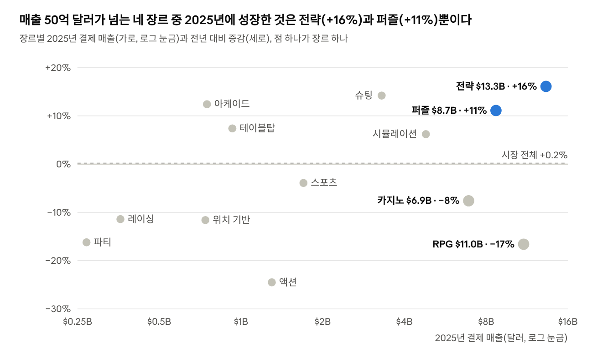
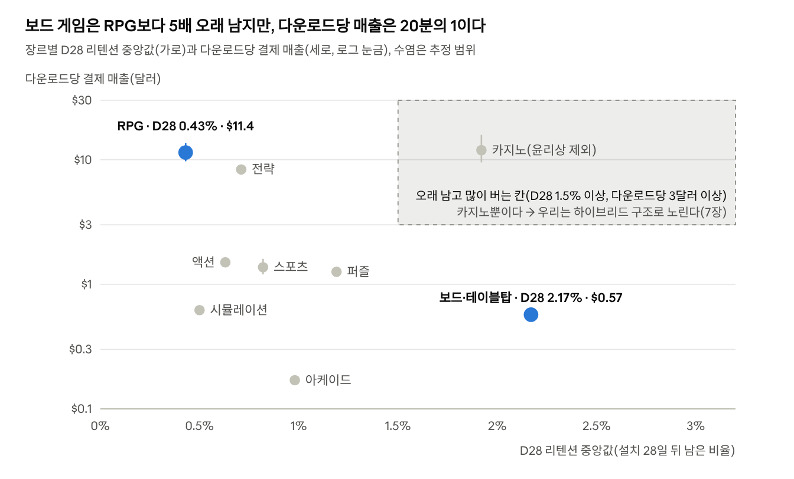
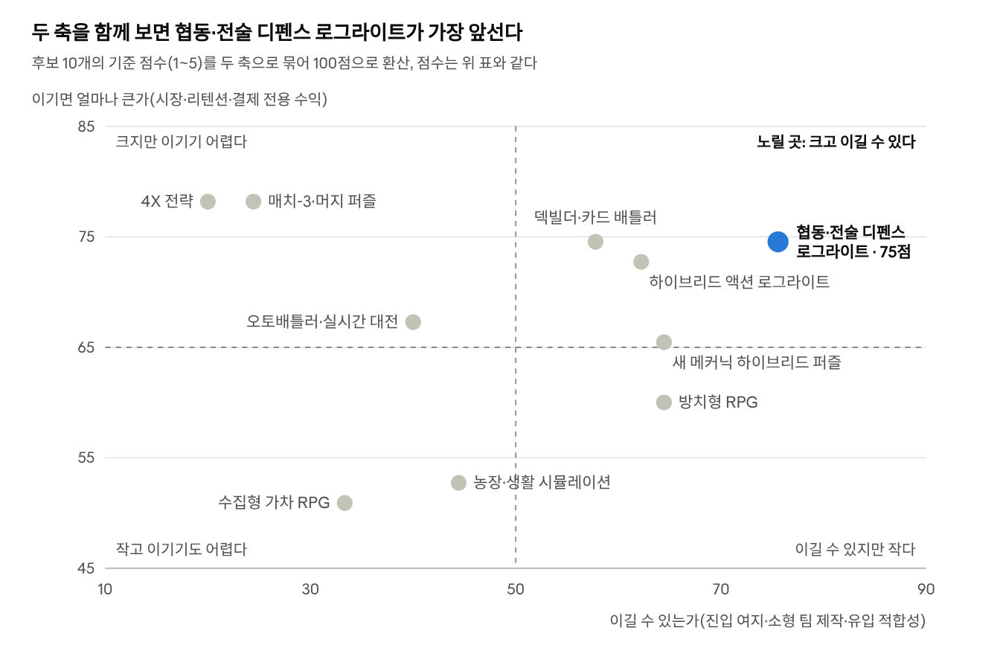
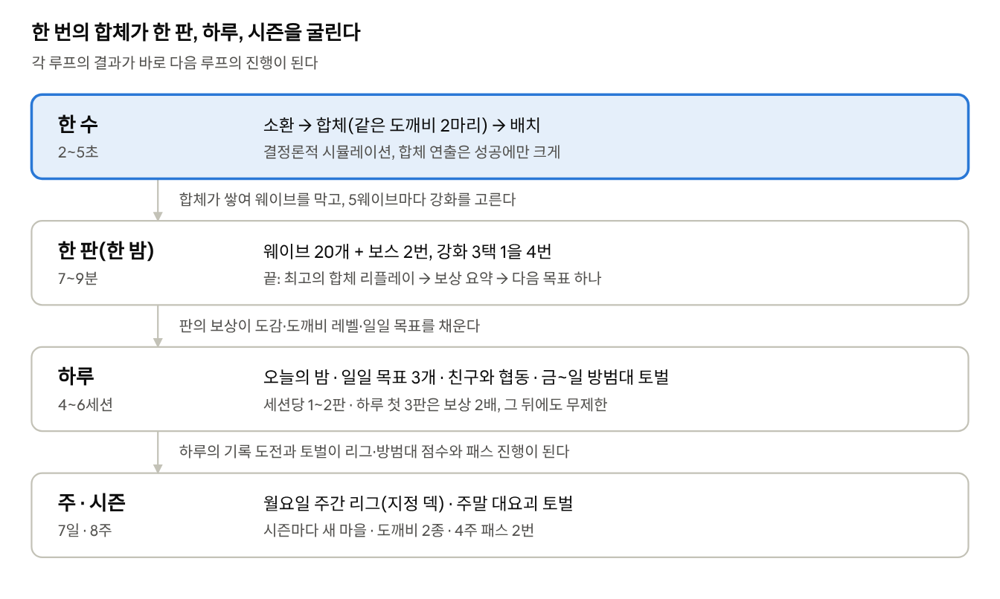
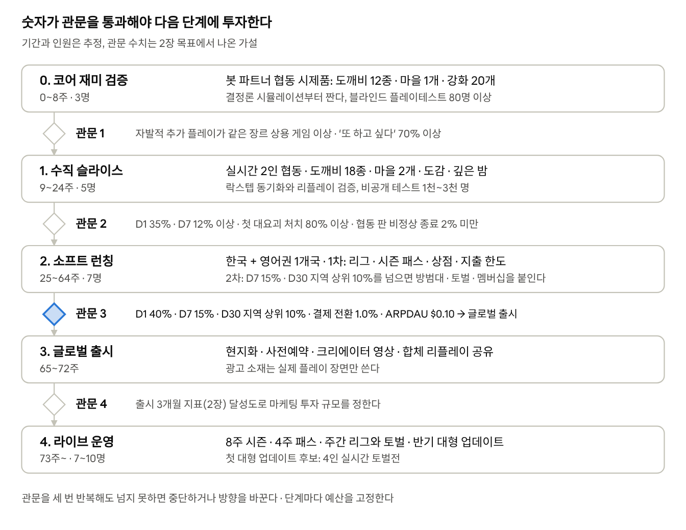

# 신작 모바일 게임 기획서: 장르 분석부터 설계까지

작성일: 2026-10-01 · woweverstudio

> 이 문서는 Claude Docs 원본에서 내보낸 사본이다. 근거가 된 분야별 조사 노트는 [research/](research/README.md)에 있다.

## 요약

광고 없이 결제만으로 오래 버는 모바일 게임을 처음부터 기획했다. 성공한 게임들의 공통점(3장)과 2025\~2026년 트렌드(4장)를 정리하고, 후보 장르 10개를 시장·리텐션·결제 수익·제작 규모 기준으로 채점해(5\~7장) '협동·전술 디펜스 로그라이트'를 골랐다. 그 위에 새 게임 「도깨비 방범대」를 설계했다(8\~19장).

- **왜 이 장르인가**: 75점으로 2위(68점)를 7점 앞섰고, 가중치를 바꾼 30가지 경우에서 모두 1위였다(7장). 운빨존많겜이 1년 만에 누적 1,200억 원을 넘겨 한국에서 수요를 증명했지만 지배적인 강자는 없다. 전략 장르의 다운로드당 매출은 8.33달러로 퍼즐의 6배가 넘는다(6장).
- **무슨 게임인가**: 도깨비를 소환·합체해 밤마다 몰려오는 잡귀를 막는 2인 협동 디펜스 로그라이트다. 한 판은 7\~9분이고, 출전 덱 5종과 판마다 고르는 강화 4번, 숨은 합체법이 매 판을 다르게 만든다. 혼자 해도 봇 파트너가 같은 역할을 한다(8·9장).
- **오래 하게 만드는 장치**: 성장 축 6개(도감·레벨·비급·깊은 밤·초소·업적), 하루 4\~6세션의 리듬, 주간 리그와 방범대 대요괴 토벌, 8주 시즌이다(9\~11·15장).
- **어떻게 버는가**: 시즌 패스, 월간 멤버십, 새 도깨비, 결과물로 파는 성장 묶음, 코스메틱을 판다. 유료 확률형·부스터·재화는 팔지 않는다. ARPDAU 목표 $0.10을 이 구성으로 계산했다(14장).
- **목표**: 글로벌 출시 3개월에 D1 40%·D7 15%·D30 6%·하루 40분 이상(업계 상위 10% 수준), 일 결제 전환율 1.0%, ARPDAU $0.10(2장).
- **어떻게 만드는가**: 3명에서 시작해 글로벌 출시 때 7명, 라이브 운영에서 7\~10명으로 늘리는 5단계 계획으로, 글로벌 출시까지 약 17개월이 걸린다. 숫자 관문 4개를 넘지 못하면 다음 단계에 돈을 쓰지 않는다(18장).
- **가장 큰 불확실성**: 유료 확률형 없이도 충분한 결제가 나오는가, 운과 협동의 재미가 오래 가는가. 소프트 런칭의 결제 전환율 0.7%·ARPDAU $0.07, 비공개 테스트의 D7 12%를 조기 경보선으로 둔다(19장).

| 핵심 결정 | 선택 | 근거 |
| --- | --- | --- |
| 장르 | 협동·전술 디펜스 로그라이트 | 5\~7장 |
| 수익 모델 | 결제 전용, 확정형 상품만 판매 | 14·17장 |
| 경쟁 | 실시간 1:1 대전 대신 지정 덱 주간 리그 | 7·11장 |
| 소셜 | 2인 협동 + 방범대(20\~30명) + 비동기 토벌 | 11장 |
| 테마 | 한국 민담의 도깨비(광고 소재 테스트로 확정) | 8·16장 |
| 출시 | 한국 + 영어권 1개국 소프트 런칭 뒤 글로벌 | 18장 |

읽는 법: 외부 근거가 있는 수치에는 원문 링크를 달았고, 근거 없이 정한 값은 '안', '가정', '설계 가정'으로 표시했다. 논문의 효과 크기는 다른 게임에서 잰 값이므로, 모두 16장의 실험으로 다시 확인한다.

## 성공의 정의와 목표 지표

성공은 "글로벌 출시 3개월 시점에 리텐션과 플레이타임이 상위 10% 게임 수준이고, 매출 100%가 광고가 아닌 결제에서 나오는 것"이다. 모바일 시장은 극단적인 멱법칙 구조라서, 2025년 중앙값 게임은 30일 뒤 설치자의 1% 미만만 남았다([GameAnalytics 2026 벤치마크](https://www.gameanalytics.com/reports/2026-mobile-pc-gaming-benchmarks), MAU 1천 이상 라이브 게임 16,262개). '평균보다 조금 나은 게임'은 사업이 되지 않으므로 목표를 상위 10%\~1% 구간에 둔다.

**참여 지표** — 업계 분포는 2025년 전 세계 모바일 게임 백분위(P50 중앙값 · P75 상위 25% · P90 상위 10% · P99 상위 1%)다. 장르마다 분포가 다르므로 7장에서 고른 장르의 수치(6장)와 다시 맞춘다.

| 지표 | 목표 (출시 3개월) | 2025 업계 분포 (P50 · P75 · P90 · P99) | 이 지표가 진단하는 것 |
| --- | --- | --- | --- |
| D1 리텐션 | 40% 이상 | 약 22% · 30%+ · 약 40% · 64\~68% | 첫 세션이 재미를 '증명'했는가 |
| D7 리텐션 | 15% 이상 | 4% 미만 · 6\~7% · 11\~12% · 25%+ | 코어 루프가 반복할 만한가 |
| D30 리텐션 | 6% 이상 (도전 10%) | 0.7\~0.8% · 1.6\~1.8% · 4%+ (북미·유럽·오세아니아) · 13\~15% | 성장·소셜·라이브옵스가 작동하는가 |
| 일 플레이타임 (활성 유저당) | 40분 이상 | 약 12분 · 22\~24분 · 40\~42분 · 94분+ | 하루에 여러 번 돌아올 이유가 있는가 |

세션 수(P50 3.8회, P90 약 9.6회)와 세션 길이(P50 3.1\~3.5분, P90 약 8분)는 고른 장르의 한 판 길이에 맞춰 9장에서 정한다. D1·D7·D28(본 기획의 D30)이 각각 온보딩·코어 게임플레이·콘텐츠 페이싱을 진단한다는 해석은 [GameAnalytics 2025 벤치마크](https://www.gameanalytics.com/reports/2025-mobile-gaming-benchmarks)의 프레임을 따랐다.

**수익 지표** — 광고 매출은 0으로 둔다.

| 지표 | 목표 | 참고 수치 | 비고 |
| --- | --- | --- | --- |
| 일 결제 전환율 (당일 결제자 ÷ DAU) | 1.0% 이상 (도전 1.5%) | 상위 15% 게임 0.8%, RPG 3%, 전략 2.5% ([GameAnalytics, 2018.6\~2019.5](https://gameworldobserver.com/2019/07/01/gameanalytics-benchmark-stats)) | 공개된 마지막 장르별 수치라 오래된 자료임 |
| ARPDAU | $0.10 이상 (도전 $0.15) | 상위 15% $0.10\~0.14, 전략·RPG $0.25 (같은 자료) | 결제만으로 달성해야 함. 상품별 구성은 14장 |
| 상위 5% 결제자의 월 매출 비중 | 40% 이하 (가드레일) | 상위 5% 결제자 = 매출 48%, 상위 10% = 64% ([Moloco·Sensor Tower 2025](https://files.gameindustrylibrary.com/documents/state-of-mobile-gaming-2025.pdf), Moloco 게임 광고주 상위 100개·24개월) | 소수 고액 결제자 의존은 규제·평판 리스크. 월 30만 원 이상 결제자 비율도 추적한다 |

플레이타임 목표는 강제 대기나 손실 공포가 아니라 "자발적으로 돌아오고 싶은 이유"로 달성한다. D30 상위 10%선은 북미 4.78%·유럽 4.05%인 데 비해 아시아는 2.59%이므로, 출시 관문의 리텐션 기준은 출시 국가의 지역 백분위로 정한다(18장, [GameAnalytics 2026](https://www.gameanalytics.com/reports/2026-mobile-pc-gaming-benchmarks)).

## 성공한 게임들의 공통점

오래가는 게임은 운이 아니라 운영으로 만들어진다. 2020년 이후 출시된 약 5만 3천 개 게임 중 누적 매출 10억 달러를 넘긴 게임은 22개(0.04%)뿐이고([Supercell](https://supercell.com/en/news/the-best-games-havent-been-made-yet/)), 출시 5년이 넘은 게임이 매출 상위 200개 매출의 약 57%를 가져간다([Naavik](https://naavik.substack.com/p/h1-2026-mobile-gamings-stability)). 살아남은 게임들은 아래 열두 가지를 공유한다.

| 공통점 | 근거 | 이 기획에 주는 뜻 |
| --- | --- | --- |
| 스스로 변주를 만드는 코어 | 오래가는 게임은 대전·협동 판, 카드 메타, 판 단위 런처럼 규칙의 조합으로 매번 다른 판을 만든다. 손으로 만드는 콘텐츠는 비싸다. 원신은 유지에 해마다 2억 달러 이상이 든다고 알려졌다([GameRefinery](https://www.gamerefinery.com/breaking-down-the-biggest-trends-shaping-the-mobile-gaming-landscape/)) | 규칙의 조합으로 매 판이 달라지는 코어를 고른다(7장) |
| 가끔 터지는 큰 불꽃 | 클래시 로얄은 4인 오토배틀러 모드 '머지 택틱스'를 낸 지 4일 만에 일 매출 380만 달러를 기록했다([PocketGamer.biz](https://www.pocketgamer.biz/clash-royale-hits-post-pandemic-record-of-38m-daily-revenue-with-new-mode-merge-tactics/)). 크고 드문 업데이트는 참여를 11\~49% 늘렸지만, 작고 잦은 업데이트는 −4.7\~+5.9%에 그쳤다([Zhong & Xu, 2022](https://doi.org/10.1016/j.entcom.2022.100506)) | 해마다 큰 모드나 시스템 1\~2개, 시즌마다 헤드라인 기능 1개를 둔다(15장) |
| 쉬운 입문, 천천히 열리는 깊이 | 스쿼드 버스터즈는 숙련의 깊이와 성장 축이 부족했다는 분석 속에 다운로드 7,500만에도 문을 닫았다([Deconstructor of Fun](https://www.deconstructoroffun.com/blog/2024/9/30/4-x-reasons-why-squad-busters-suffers-while-brawl-stars-soars)). 포켓몬 GO 이용자 종단 조사에서 몰입은 앱 생존 확률을 12% 높였다([Balapour et al., 2023](https://doi.org/10.1108/jsit-03-2023-0056)) | 첫 5분은 탭 몇 번으로, 깊이는 몇 주에 걸쳐 연다(13장) |
| 여러 성장 축과 수집 | 수집 요소는 게임의 약 80%에 있고, 미드코어에서 앨범 이벤트는 2025년 92% 늘었다([AppMagic LiveOps 2025](https://investgame.net/wp-content/uploads/2026/01/2026-01-15-LiveOps_Report_2025_EN.pdf)) | 여러 성장 축과 도감으로 매 세션 무언가 전진한다(10장) |
| 규모에 맞는 소셜 | 스팀 무료 게임 9,700개 분석에서 소셜 기능을 많이 넣으면 플랫폼 이용자 기반이 클 때 대박 확률이 49%p 올랐지만 작을 때는 26%p 내려갔다([Rietveld & Ploog, 2022](https://doi.org/10.1002/smj.3362), 저자 요약 기준). 클랜 가입과 친구 플레이는 다음 주 플레이 시간과 구매를 늘렸다([Jiao et al., 2022](https://doi.org/10.1111/poms.13772)) | 인원이 적어도 돌아가는 2인 협동(4인 토벌전은 출시 뒤)을 두고, 빈자리는 봇이 채운다(11장) |
| 촘촘한 라이브옵스 | 결제 매출의 84%가 라이브옵스 게임에서 나왔고([Sensor Tower 2025](https://sensortower.com/blog/state-of-mobile-gaming-2025)), 게임당 월 이벤트 수는 2025년 73개에서 89개로 늘었다(AppMagic). 이벤트 메뉴는 도입 사례의 83.4%에서 매출 상승이 따랐다([Sensor Tower 2026](https://investgame.net/wp-content/uploads/2026/02/2026-02-26-sensor_tower__state_of_gaming_2026__en_wp.pdf)) | 출시 전에 설정만으로 바꾸는 이벤트 허브를 만든다(15장) |
| 마찰 제거와 단순화 | 클래시 로얄은 상자 대기열·타이머·열쇠를 없앤 뒤 월 매출이 2,090만 달러에서 5,140만 달러로 늘었고(같은 PocketGamer.biz 기사), 복귀 플레이어가 2배, 신규 플레이어가 약 500% 늘었다(Supercell) | 타이머로 보상을 묶지 않고, 주기적으로 시스템을 덜어 낸다 |
| 신뢰를 지키는 변경과 가격 | 클래시 로얄은 좋은 뜻의 상점 개편도 예고 없이 하자 반발을 샀다([PocketGamer.biz](https://www.pocketgamer.biz/we-killed-clash-royale-what-supercell-learned-from-failed-updates/)). 브롤스타즈 총괄은 50달러 스킨 가격과 밸런스 실수를 2025년의 실패로 꼽았다([Supercell](https://supercell.com/en/games/brawlstars/blog/community/2025-in-review-franks-blog-post/)) | 경제 변경은 미리 알리고, 가격 상한을 둔다(17장) |
| 공정하지만 깊은 결제 | 다단계 패스는 매출 상승이 가장 꾸준한 기능 3위였고, 최상위 상품은 대개 99.99달러다(Sensor Tower 2026). 한국 이용자는 결제자조차 노골적인 BM에 강한 반감을 보였다([KOCCA 2025](https://www.kocca.kr/kocca/bbs/view/B0000147/2010445.do?menuNo=204153)) | 패스·구독·성장 묶음을 지출 단계별로 두되, 유료 확률형은 팔지 않는다(14장) |
| 2년차가 진짜 관문 | 출시 2년 미만인 상위 200위 진입작 4개 중 1개만 5년 장수작이 된다(Naavik). 로얄 킹덤은 출시 2년차 상반기에 누적 매출의 42%를 벌었다([PocketGamer.biz](https://www.pocketgamer.biz/royal-kingdom-surpasses-750m-with-42-of-all-revenue-made-in-h1-2026/)) | 출시 초반 성적이 아니라 D30·D90 코호트와 2년 운영 예산으로 판단한다 |
| 오리지널 IP와 자체 운영 | 파이널 판타지 14 모바일은 라이선스가 끝나 글로벌 출시 전에 서비스를 접었다([TechTimes](https://www.techtimes.com/articles/320911/20260718/final-fantasy-xiv-mobile-ends-before-global-launch-character-data-deleted-september.htm)). 2025년 종료·삭제 목록 32개 중 22개가 라이선스·프랜차이즈 게임이었다([GamingOnPhone](https://gamingonphone.com/editorial/the-biggest-mobile-gaming-disappointments-of-2025/) 목록을 집계). 한국에서 IP 효과는 출시 첫 달뿐이었다([Nam & Kim, 2020](https://doi.org/10.1016/j.telpol.2019.101855)) | 오리지널 IP로 만들고, 콜라보는 출시 뒤 골라서 한다 |
| 숫자 관문과 장르에 대한 애정 | 슈퍼셀은 헤이데이 팝이 장르 이해 없이 지표에만 기대었고, 클래시 미니는 수년간 조금씩 고치느라 결정을 미뤘다고 돌아봤다([PocketGamer.biz](https://www.pocketgamer.biz/supercell-opens-up-on-cancelled-projects-and-the-role-of-failure-in-creativity/)) | 단계별 고정 예산과 장기 리텐션 관문을 둔다(18장) |

### 플레이어 심리에서 나온 조건

업계 사례가 '무엇을' 보여 준다면, 심리 연구는 '왜' 통하는지를 보여 준다. 설계 장(9\~17장)은 아래 발견을 기준으로 삼는다.

| 발견 | 근거 | 이 기획에 주는 뜻 |
| --- | --- | --- |
| 유능감·자율성·관계성의 충족이 재미의 엔진이다 | 자율성 β=.49·유능감 .24·관계성 .12, 즐거움 분산의 45% 설명([Ryan et al., 2006](https://doi.org/10.1007/s11031-006-9051-8)) | 모든 기능을 세 욕구로 심사한다 |
| 흥분은 아슬아슬한 결과에서 나온다 | 압승보다 접전이 더 즐겁고, 69%가 접전을 다시 하기를 골랐다([Abuhamdeh et al., 2015](https://doi.org/10.1007/s11031-014-9425-2)) | 보스 웨이브를 '간신히 막는' 분포로 조율한다 |
| 호기심이 자발적 플레이를 예측한다 | 사전등록 실험(n=1,699)에서 호기심 1점당 자발적 플레이 +0.88분([Kao et al., 2024](https://doi.org/10.1145/3613904.3642656)) | "이 합체와 배치가 통할까"를 코어에 두고, 소환의 운은 긴장을 만드는 데 쓴다 |
| 연패가 이탈을 부른다 | EA 플레이어 168만 명: 3연패 뒤 7일 이탈 위험 5.1%, 안정 상태 2.6\~2.7%([Chen et al., 2017](https://doi.org/10.1145/3038912.3052559)) | 연패를 감지하고 보이는 도움을 준다(12장) |
| 이탈 위험군을 쉽게 해 주면 지출까지 늘었다 | 무작위 현장 실험: 참여 약 20% 증가, 30일 매출 증가분의 약 80%가 인앱 구매([Ascarza et al., 2025](https://doi.org/10.1016/j.ijresmar.2025.01.006)) | 고통을 만들고 해결책을 팔지 않는다 |
| 보상은 정보일 때 돕고 통제일 때 해친다 | 128개 실험 메타분석: 예고된 조건부 보상은 내적 동기를 낮추고(d=−0.28\~−0.40), 예상 못한 보상은 해가 없었다([Deci et al., 1999](https://doi.org/10.1037/0033-2909.125.6.627)) | "5판 하면 보상" 같은 노동형 퀘스트를 줄이고 깜짝 보상을 늘린다 |
| 플레이 시간이 아니라 강박이 해롭다 | 7개 게임 38,935명 텔레메트리: 플레이 시간의 웰빙 효과는 거의 0이었고 내적 동기는 이후 삶의 만족을 예측했다([Vuorre et al., 2022](https://doi.org/10.1098/rsos.220411)) | "해야 해서"가 아니라 "하고 싶어서" 오래 하게 만든다 |
| 힘을 사면 존중을 잃고, 확률형은 문제성 도박과 이어진다 | 기능적 우위를 산 플레이어는 실력·지위가 낮게 평가됐다([Evers et al., 2015](https://research.tilburguniversity.edu/en/publications/the-hidden-cost-of-microtransactions-buying-in-game-advantages-in/)). 확률형 지출과 문제성 도박의 연관(η²=.054)은 다른 인게임 구매(.004)보다 훨씬 강했다([Zendle & Cairns, 2018](https://doi.org/10.1371/journal.pone.0206767)) | 경쟁에는 돈의 영향을 없애고, 유료 확률형을 두지 않는다 |

## 2025\~2026 시장 트렌드

시장은 커지지 않고, 이미 가진 유저에게서 더 많은 가치를 내는 게임이 이긴다. 2025년 모바일 게임 결제 매출은 약 820억 달러(+1.3%)로 제자리였고 다운로드는 7% 줄었다([Sensor Tower 2026](https://investgame.net/wp-content/uploads/2026/02/2026-02-26-sensor_tower__state_of_gaming_2026__en_wp.pdf)). 아래 트렌드는 모두 결제 전용 소형 팀의 선택에 영향을 준다.

| 트렌드 | 근거 | 결제 전용 소형 팀에게 주는 뜻 |
| --- | --- | --- |
| 정체된 시장, 유저당 가치 경쟁 | 2026년 상반기에도 매출 −2%, 다운로드 −12%였다([Naavik](https://naavik.substack.com/p/h1-2026-mobile-gamings-stability)) | 신규 유입이 비싸므로 리텐션과 유저당 생애 가치(LTV)를 먼저 설계한다 |
| 기존 강자와 아시아 퍼블리셔의 선전 | 2025년 아시아 본사 퍼블리셔의 매출은 25.8억 달러 늘고 북미는 17.8억 달러 줄었다. 그해의 대표 신작 5개는 모두 액션·전략이었다(Sensor Tower 2026). 2026년 7\~8월에는 캐주얼화한 4X 7개가 한꺼번에 광고를 늘렸다([GameRefinery](https://www.gamerefinery.com/mobile-game-market-review-july-august-2026/)) | 4X·머지와 정면 승부하지 않는다 |
| 정렬·나사·블록 퍼즐 붐 | 세 하위 장르가 2026년 상반기에만 약 6억 달러를 벌었고 정렬은 229% 늘었다. 픽셀 플로우는 다운로드당 4.33달러, 하루 51.4분·9.4세션을 기록했다([PocketGamer.biz](https://www.pocketgamer.biz/one-genre-three-strategies-how-magic-sort-knit-out-and-pixel-flow-are-redefining-sort-puzzle-monetisation/)). 하지만 하이브리드캐주얼 라이프스타일·퍼즐 매출의 41%는 광고다(미국·일본·영국·브라질 합산, Sensor Tower 2026) | 하루에 여러 번 부르는 짧은 판은 배우되, 광고 없는 퍼즐은 불리하다 |
| 내러티브·꾸미기 메타와 생활 시뮬레이션의 부활 | 2026년 상반기 머지-2는 74%, 생활 시뮬레이션은 76% 늘었다. 헤이데이는 출시 14년차에 일 매출 100만 달러를 찍었다([AppMagic 2026 상반기](https://gamedevreports.substack.com/p/appmagic-mobile-casual-games-in-h1)) | 가벼운 캐릭터·꾸미기 층을 리텐션과 광고 소재에 쓴다 |
| 라이브옵스 경쟁 | 미니 패스, 탐험, 앨범, 연승 이벤트가 퍼졌고, 캐주얼 이벤트의 약 70%가 결제자·고관여층을 겨냥한다([AppMagic LiveOps 2025](https://investgame.net/wp-content/uploads/2026/01/2026-01-15-LiveOps_Report_2025_EN.pdf)) | 검증된 이벤트 틀을 설정으로 재사용하고, 새로움은 코어에 쓴다 |
| 협동과 친구 그룹 | 2025년 협동 이벤트는 17%(미드코어 36%), 경쟁 이벤트는 24% 늘었다(AppMagic LiveOps 2025). 퍼즐·카지노 게임도 최대 4인이 진행도를 함께 채우는 협동 분대를 넣었다([GameRefinery](https://www.gamerefinery.com/mobile-game-market-review-april-2025/)) | 2\~4인 협동 목표, 비동기 기여, 봇 채우기를 기본으로 한다 |
| 판 단위 모드와 덱빌더 | 발라트로는 500만 장 넘게 팔렸고([Playstack](https://www.playstack.com/news/balatro-5-million-copies-sold/)), 마블 스냅·브롤스타즈·클래시 로얄이 판 단위 모드를 붙였다. 반면 포켓몬 TCG 포켓의 월 매출은 17개월 만에 2.35억 달러에서 3,100만 달러로 줄었다([PocketGamer.biz](https://www.pocketgamer.biz/pokemon-tcg-pocket-makes-16bn-in-15-years/)) | 판 단위 구조는 소형 팀의 콘텐츠 엔진이다. 팩 뽑기의 열기가 아니라 영구 성장 메타와 묶는다 |
| 웹 상점과 결제 수수료 변화 | 미국 iOS의 외부 결제 링크는 2025년 4월부터 수수료가 없지만, 대법원 심리가 남았다([9to5Mac](https://9to5mac.com/2026/06/30/supreme-court-agrees-to-hear-apple-appeal-over-epic-games-ruling/)). 한국은 제3자 결제 수수료 26%에 대한 제재 결정이 다시 미뤄졌다([Korea Herald](https://www.koreaherald.com/article/10840244)). 웹 상점은 결제 매출의 약 15%다([PocketGamer.biz](https://www.pocketgamer.biz/report-mobile-game-d2c-revenues-reach-17bn-as-publishers-push-beyond-app-stores/)) | 출시는 스토어로만 하되, 계정과 서버 인벤토리는 처음부터 웹 상점을 붙일 수 있게 만든다 |
| IP 콜라보가 핵심 광고 소재가 됨 | 브롤스타즈×스폰지밥은 미국 iOS 매출을 300% 넘게 올렸다([GameRefinery](https://www.gamerefinery.com/what-to-expect-from-the-mobile-gaming-industry-in-2025/)). 모노폴리 GO의 스코플리는 콜라보에 대해 "적을수록 좋다"고 했다([GamesBeat](https://gamesbeat.com/building-a-forever-franchise-with-the-magic-of-monopoly-go-gamesbeat-insider-series/)) | 출시 뒤 웹툰·인디 IP와 고른 콜라보를 매출 이벤트로 쓴다 |
| 제작에 쓰는 AI | 게임 개발자의 36%가 생성형 AI를 쓰지만 주로 조사·아이디어 용도(81%)이고, 52%는 업계에 해롭다고 봤다([Game Developer](https://www.gamedeveloper.com/business/one-third-of-game-workers-use-generative-ai-but-half-think-it-s-bad-for-the-industry)) | 코드·도구·자동 테스트에 쓰고, 플레이어에게 보이는 생성 아트는 신중하게 쓴다 |
| 유료 확률형 규제의 확산 | 미국 FTC는 호요버스(원신) 합의에서 16세 미만에게 보호자 동의 없이 확률형을 팔지 못하게 했고([FTC](https://www.ftc.gov/news-events/news/press-releases/2025/01/genshin-impact-game-developer-will-be-banned-selling-lootboxes-teens-under-16-without-parental)), 브라질은 2026년 3월부터 18세 미만 판매를 금지했다([PocketGamer.biz](https://www.pocketgamer.biz/brazil-bans-loot-boxes-for-under-18s-in-online-child-safety-measure/)). 슈퍼셀은 브라질에서 유료 랜덤 보상을 없애거나 바꾸겠다고 밝혔다([Supercell](https://supercell.com/en/news/brazil-update/)) | 유료 확률형은 두지 않고, 플레이로 얻는 랜덤 보상은 확률을 공개한다(17장) |

트렌드가 가리키는 방향은 3장의 공통점과 같다. 규칙의 조합으로 매 판이 달라지는 코어, 작은 규모의 협동, 촘촘한 라이브옵스, 공정한 결제다.

## 장르 분석 ① 시장 규모·성장·집중도

결제 매출이 큰 장르에는 이미 주인이 있다. 2025년 매출 50억 달러가 넘는 네 장르 중 성장한 곳은 전략과 퍼즐뿐이고, 그 성장도 4X·머지 같은 과점 하위 장르나 광고 비중이 큰 정렬·블록 퍼즐로 갔다([AppMagic 2026](https://appmagic.rocks/files/view/upload/Reports/EN_MobileMarkeLandscape2026.pdf)). 그래서 소형 팀의 기회는 장르의 크기가 아니라, 결제 중심이면서 아직 주인이 정해지지 않은 하위 장르에 있다.

*AppMagic Mobile Market Landscape 2026 · 2024→2025 결제 매출(앱스토어·구글 플레이, 중국은 iOS만, 순매출 추정) · 13개 장르*

신작이 큰 장르를 뚫기 어려운 이유는 기존 게임의 점유다. 2024년에는 라이프스타일과 RPG를 뺀 모든 장르에서 출시 2년이 넘은 게임이 결제 매출의 80% 이상을 가져갔다([Sensor Tower 2025](https://sensortower.com/blog/state-of-mobile-gaming-2025)). RPG는 상위 3개 비중이 12.0%로 가장 덜 집중된 장르라, 매출이 줄어도 신작이 계속 나온다.

### 하위 장르별 기회

아래 매출은 AppMagic 순매출 추정치이고, 표시한 곳만 Sensor Tower 총매출이다. 두 회사의 수치는 섞어 비교하지 않는다.

| 하위 장르 | 2025 결제 매출 | 성장 | 집중도 | 결제 비중 | 최근 히트작 | 소형 팀 관점 |
| --- | --- | --- | --- | --- | --- | --- |
| 매치-3 | 약 48억 달러([AppMagic 캐주얼 2025](https://mobidictum.com/appmagic-casual-games-report-2025-summary/)) | +0.1% (정체) | 2025년 신작 367개 중 월 10만 달러를 넘겨 본 게임 4개 | 결제 중심 | 로얄 킹덤 | 레벨 제작량과 광고 자본 때문에 불가 |
| 머지 | 14억 달러(같은 자료) | +80% | 상위 10개가 약 80% | 결제 중심(1\~25달러 특가) | 가십 하버, 테이스티 트래블 | 과점 |
| 정렬·블록·나사 퍼즐 | 2.8억·2.1억·1.8억 달러 | 2\~10배 | 2026 상반기 신작 정렬 840개·블록 2,000개 이상([AppMagic 2026 상반기](https://gamedevreports.substack.com/p/appmagic-mobile-casual-games-in-h1)) | 광고 비중 큼 | [픽셀 플로우](https://www.pocketgamer.biz/scopely-acquires-majority-stake-in-istanbuls-pixel-flow-developer-loom-games/)(약 20명, 1년이 안 돼 결제 1.25억 달러) | 만들 수는 있지만 광고 몫을 포기해야 함 |
| 코인 루터(주사위 보드) | 24억 달러 | −3% | 상위 3개 약 90% | 결제와 웹 상점 | 모노폴리 GO | IP와 대규모 광고 자본, 카지노형이라 제외 |
| 농장·생활 시뮬레이션 | 농장 9.6억, 생활 1.4억 달러 | −2%, +1% (2026 상반기 +15%, +76%) | 타운십이 농장의 42% 이상 | 결제 중심, 구독 비중 12% 이상 사례 | [하트토피아](https://mobilegamer.biz/data-digest-roblox-shares-jump-11-augusts-top-publishers-heartopia-clash-of-critters-newzoo-stats-more/)(월 2천만 달러) | 아트·콘텐츠 부담이 크고 새 강자는 중국 대형사 |
| 하이브리드캐주얼 액션(서바이버류·궁수의 전설류) | 제품 모델 전체 31억 달러(2024, Sensor Tower 총매출) | +20% | 확인 못 함 | 4개 시장(미국·일본·영국·브라질) 결제 82%, 광고 18%([Sensor Tower 2026](https://investgame.net/wp-content/uploads/2026/02/2026-02-26-sensor_tower__state_of_gaming_2026__en_wp.pdf)) | 궁수의 전설 2, 카피바라 GO | 가능하지만 붐비고, 다운로드의 51%가 유료 광고에서 옴 |
| 4X 전략 | 약 82억 달러(2024, Sensor Tower 총매출) | +21% (2026 상반기 하락 전환) | 상위 10개 64% | 결제 중심, 99달러 상품이 매출의 약 30% | 킹샷 | 불가 |
| 타워·협동 디펜스 | 장르 합계 없음 | '전술' 하위 장르 +35% | 확인 못 함 | 결제 중심(운빨존많겜은 강제 광고 없음·VIP 구독) | [운빨존많겜](https://v.daum.net/v/20250414171632765)(누적 1,200억 원 이상), 클래시 오브 크리터스 | 한국에서 검증된 틈새 |
| 오토배틀러·실시간 전략 | 약 14억 달러(2024, Sensor Tower 총매출) | 보합 | 확인 못 함 | 결제 중심 | 클래시 로얄 부활(+147%) | 대전 인구와 밸런스 인력이 필요 |
| 카드 배틀러·TCG·덱빌더 | 포켓몬 TCG 포켓 하나가 9.5억 달러(총매출) | 출시 효과로 급증 | 포켓몬 TCG 포켓 독주 | 결제 중심 | TCG 포켓, 발라트로(유료 판매) | F2P 승자는 IP 기반이고, 마블 스냅은 2년 새 매출이 4분의 1로([Udonis](https://www.blog.udonis.co/statistics/marvel-snap)) |
| 방치형 RPG | 약 14억 달러(2024, Sensor Tower 총매출) | 한국 RPG 안 비중 1.7%(2020)→16%(2024) | 확인 못 함 | 결제 중심 | 메이플스토리 키우기, [픽셀 히어로](https://gamedevreports.substack.com/p/sensor-tower-pixel-hero-is-the-leader) | 콘텐츠 비용은 낮지만 직접 플레이하는 시간이 짧음 |
| 수집형·턴제 RPG | 턴제 약 21억 달러(2024, Sensor Tower 총매출) | 한국 턴제 +138% | 확인 못 함 | 결제·가차 | SD건담 G제네레이션 이터널 | 캐릭터 아트와 가차에 의존해 불가 |

### 한국 시장

- **줄고 있다**: 한국 모바일 게임 결제 매출은 2025년 12%(AppMagic 2026), 2026년 상반기 10% 줄었다([Sensor Tower 2026 상반기](https://gamedevreports.substack.com/p/sensor-tower-the-gaming-market-in)).
- **중국 4X가 선두다**: 2026년 1월 4X 전략이 9년 만에 MMORPG를 제치고 1위 하위 장르가 됐다([Sensor Tower 코리아](https://sensortower.com/ko/blog/4X-strategy-emerges-as-the-top-grossing-mobile-game-genre-for-the-first-time)). 2026년 5월 매출 상위 5개 중 3개가 중국 4X였다([모바일인덱스](https://www.igaworksblog.com/post/mobilegame-chart-2606)).
- **성장한 하위 장르**: 2025년 턴제 RPG +138%, 머지 +89%, 하이브리드캐주얼 +37%였다([Sensor Tower 코리아 2025](https://sensortower.com/ko/blog/state-of-gaming-in-korea-2025-report-KR)).
- **가벼운 글로벌 게임의 핵심 시장**: 궁수의 전설 2는 매출의 23%([PocketGamer.biz](https://www.pocketgamer.biz/archero-2-makes-328m-in-first-30-days-from-player-spending/)), 픽셀 히어로는 29.4%, 버섯커 키우기는 31%를 한국에서 냈다([Sensor Tower, 2024](https://sensortower.com/blog/state-of-mobile-games-in-korea-2024)).

그래서 한국은 검증 시장으로 쓰고, 매출은 글로벌에서 키운다.

## 장르 분석 ② 플레이어 반응과 수익성

오래 남는 장르와 많이 버는 장르가 다르고, 둘 다 높은 장르는 윤리적으로 제외한 카지노뿐이다. 보드·카드·퍼즐은 설치 28일 뒤에도 많이 남고 하루 30\~49분을 플레이하지만, 다운로드당 매출은 RPG·전략의 약 7분의 1에서 20분의 1이다. 그래서 결제 전용 소형 팀은 클래식형의 반복 가능한 코어에 미드코어형 성장·수집 메타를 더한 하이브리드를 노려야 한다.

*GameAnalytics 2025 벤치마크(2024년 장르별 중앙값) · Sensor Tower State of Mobile Gaming 2025(2024년 장르 결제 매출 ÷ 다운로드로 계산, 코호트 LTV 아님) · 9개 장르*

아래 표의 D1·D7·플레이타임은 GameAnalytics에 등록된 게임의 2024년 장르별 중앙값이다. 작은 게임이 대부분이라 상위작보다 낮다([GameAnalytics 2025](https://www.gameanalytics.com/reports/2025-mobile-gaming-benchmarks)). 설치당 비용(CPI)과 30일 ROAS는 2024.2\~2025.2 Singular 데이터다([Liftoff 2025](https://liftoff.ai/2025-casual-gaming-apps-report/)).

| 장르 | D1 | D7 | 하루 플레이 | CPI (안드로이드 · iOS) | 30일 ROAS (안드로이드 · iOS) | 콘텐츠 소모 |
| --- | --- | --- | --- | --- | --- | --- |
| 보드·카드 | 18.8\~19.1% | 5.8\~6.7% | 41\~49분 | $1.79 · $5.42 (테이블탑) | 7% · 19% | 규칙형은 낮고, 대전형은 새 카드와 밸런스가 필요 |
| 퍼즐 | 20.2% | 4.5% | 30분 | $0.64 · $2.80 | 18% · 42% | 레벨형은 높음(2주마다 새 레벨), 절차 생성형은 낮음 |
| 카지노 | 19.4% | 5.5% | 35분 | $4.10 · $21.03 | 11% · 41% | 새 머신·테마, 규제 대응 |
| 전략 | 19.9% | 3.4% | 24분 | $1.67 · $4.16 | 27% · 60% | 4X는 높음, 디펜스·오토배틀러는 새 유닛과 밸런스 |
| 캐주얼(하이브리드 포함) | 20.7% | 3.3% | 14분 | $0.14 · $1.41 | 15% · 47% | 중간, 시즌 패스가 표준 |
| 액션(서바이버류 포함) | 18.4% | 2.9% | 14분 | $0.15 · $1.50 | 35% · 16% | 낮음\~중간, 규칙의 조합으로 런을 만듦 |
| 시뮬레이션 | 17.0% | 2.4% | 15분 | $0.37 · $4.72 | 25% · 57% | 중간\~높음, 꾸미기 콘텐츠 |
| RPG | 15.1% | 2.1% | 16분 | $4.29 · $8.29 | 39% · 55% | 가차형은 매우 높음, 방치형은 중간 |

- **리텐션은 D28에서 갈린다**: 장르별 D1 중앙값은 15\~22%로 비슷하지만 D28은 RPG 0.43%에서 카드 3.00%까지 약 7배 차이가 난다. 상위 25개 게임끼리 비교하면 미드코어의 D7이 약 21%로 가장 높고, 하이브리드캐주얼(약 15%)이 캐주얼을 앞질렀다([Sensor Tower 2026](https://investgame.net/wp-content/uploads/2026/02/2026-02-26-sensor_tower__state_of_gaming_2026__en_wp.pdf)).
- **결제 전용은 미드코어의 방식이다**: 미드코어 앱의 90%가 결제 전용이다([AppsFlyer 2026](https://www.appsflyer.com/resources/reports/app-marketing-monetization-report/)). iOS 미드코어에서 결제 전용 모델의 90일 ROAS는 215%로 하이브리드(73%)보다 높았지만, 안드로이드에서는 하이브리드 146%, 결제 전용 93%로 뒤집혔다([AppsFlyer 2024](https://www.appsflyer.com/company/newsroom/pr/app-monetization-report/)). 한국 매출의 약 75%가 구글 플레이이므로(Sensor Tower 코리아 2025), 광고가 하던 일(무과금 유저의 시간을 가치로 바꾸기)을 패스·구독·일일 보상이 대신해야 한다.
- **설치비는 30일 안에 회수되지 않는다**: 장르별 30일 ROAS는 7\~80%였다. 한국 게임의 설치당 비용은 2025년 1.50달러로 1년 새 23% 올랐고, 유료 설치가 자연 설치의 약 4배다([Adjust 2026](https://investgame.net/wp-content/uploads/2026/03/2026-03-26-gaming-app-insights-report-2026_wp.pdf)). 그래서 90\~365일 LTV를 보고, 자연 유입 엔진을 게임 안에 함께 설계한다.
- **자연 유입은 미드코어가 강하다**: 상위 게임의 자연 다운로드 비중은 미드코어 63.6%, 하이브리드캐주얼 39.8%였다(Sensor Tower 2026). [스텀블 가이즈](https://mobilegamer.biz/how-stumble-guys-beat-fall-guys-at-its-own-game/)는 5\~6명으로 출시해 크리에이터 영상으로 컸고, 영상 제작에 돈을 쓰지 않았다.
- **한국 결제자는 30대가 핵심이다**: 30대 모바일 게이머의 51%가 결제하고 결제자 평균 연 15.1만 원을 써 두 수치 모두 전 연령 중 가장 높다(표에서 계산). 20·30대의 수집형 RPG 이용률은 37.6·38.3%다. 구매 1순위 이유는 빠른 성장 46.0%, 경쟁 우위 32.3%, 꾸미기 15.3%였다([KOCCA 2025](https://www.kocca.kr/kocca/bbs/view/B0000147/2010445.do?menuNo=204153)).
- **소형 팀의 히트는 모두 규칙의 조합으로 콘텐츠를 만들었다**: [발라트로](https://www.pocketgamer.biz/balatro-approaches-1-million-in-seven-days-on-mobile/)(1인), [뱀파이어 서바이벌](https://gameworldobserver.com/2023/01/17/vampire-survivors-mobile-3-million-downloads-appmagic)(1인으로 시작), [레전드 오브 슬라임](https://m.inven.co.kr/webzine/wznews.php?idx=294142)(6명으로 시작), 픽셀 플로우(약 20명)가 그렇다. 레전드 오브 슬라임은 광고비를 끊은 2024년에 회사 매출이 88% 줄었다([전자신문](https://www.etnews.com/20250416000271)). 오래 남는 리텐션이 없으면 광고비가 끊기는 날 게임도 끝난다.

## 장르 분석 ③ 장르 선택

고른 장르는 '협동·전술 디펜스 로그라이트'다. 후보 10개를 여섯 기준으로 채점했더니 75점으로 2위(68점)를 7점 앞섰다. 두 기준 사이에서 가중치를 10점씩 옮기는 30가지 경우에서도 모두 1위를 지켰다.

점수는 5·6장의 근거를 종합한 판단(1\~5점)이고, 괄호 안은 가중치다. 총점은 가중합을 100점으로 환산했다. 카지노·코인 루터(윤리), 슈팅·MOBA·스포츠(제작 규모와 라이선스), 단어·퀴즈(광고 의존)는 채점 전에 제외했다.

| 후보 장르 | 시장 (15) | 진입 여지 (15) | 리텐션 (20) | 결제 전용 수익 (20) | 소형 팀 제작 (20) | 유입·한국 적합 (10) | 총점 | 결정적 근거 |
| --- | --- | --- | --- | --- | --- | --- | --- | --- |
| 협동·전술 디펜스 로그라이트 | 3 | 4 | 4 | 4 | 4 | 3 | 75 | 지배적 강자가 없고, 2024년 신작 운빨존많겜이 1년 만에 누적 1,200억 원을 넘겼다. 전략 장르의 다운로드당 매출은 8.33달러다 |
| 하이브리드 액션 로그라이트 | 4 | 2 | 3 | 4 | 4 | 3 | 68 | 결제 비중 82%로 결제 전용에 맞지만, 하비·중국 스튜디오로 붐비고 다운로드의 51%가 유료 광고에서 온다 |
| 덱빌더·카드 배틀러 | 3 | 2 | 5 | 3 | 4 | 2 | 67 | 카드 장르 D28 3.00%로 리텐션 1위지만, F2P 승자는 IP와 팩 뽑기에 기댄다 |
| 새 메커닉 하이브리드 퍼즐 | 4 | 3 | 4 | 2 | 4 | 2 | 65 | 픽셀 플로우가 약 20명으로 성공했지만, 하이브리드캐주얼 퍼즐 매출의 41%가 광고다(4장) |
| 방치형 RPG | 3 | 3 | 2 | 4 | 4 | 2 | 62 | 제작비는 낮지만 RPG D28은 0.43%다. 레전드 오브 슬라임은 광고비를 끊자 회사 매출이 88% 줄었다 |
| 오토배틀러·실시간 대전 | 3 | 2 | 4 | 3 | 2 | 2 | 55 | 이용자 기반이 작으면 소셜 기능이 오히려 불리하고, 넷코드와 매칭 인구가 필요하다 |
| 매치-3·머지 퍼즐 | 5 | 1 | 4 | 3 | 1 | 2 | 54 | 2025년 매치-3 신작 367개 중 4개만 월 10만 달러를 넘겼고, 2주마다 새 레벨이 필요하다 |
| 4X 전략 | 5 | 1 | 2 | 5 | 1 | 1 | 52 | 상위 10개가 64%를 가져가고 99달러 상품과 대규모 광고에 기댄다 |
| 농장·생활 시뮬레이션 | 3 | 2 | 2 | 3 | 2 | 3 | 49 | 타운십이 농장의 42% 이상을 가져가고, 새 강자는 중국 대형사이며, 꾸미기 콘텐츠 부담이 크다 |
| 수집형 가차 RPG | 4 | 3 | 2 | 2 | 1 | 1 | 43 | 개발 인력이 수백 명 들고, 가차를 빼면 수익 구조가 무너진다 |

*이 문서의 장르 점수표(5·6장 근거를 종합한 판단) · 후보 10개 · 가로 = 진입 여지·제작·유입, 세로 = 시장·리텐션·결제 수익*

### 선택: 협동·전술 디펜스 로그라이트

운빨존많겜처럼 유닛을 무작위로 소환하고(운) 합성·배치해(전략) 적의 물결을 막는 디펜스에, 판마다 다른 강화를 고르는 로그라이트 구조와 판 밖에서 짜는 출전 덱을 더한 장르다.

- **빈자리가 있다**: 매출은 검증됐는데 지배적인 강자가 없다. 운빨존많겜은 누적 1,200억 원 이상([연합뉴스](https://v.daum.net/v/20250414171632765)), 타워 디펜스에 몬스터 수집을 더한 클래시 오브 크리터스는 출시 3개월 만에 2,400만 달러를 벌었다([mobilegamer.biz](https://mobilegamer.biz/data-digest-roblox-shares-jump-11-augusts-top-publishers-heartopia-clash-of-critters-newzoo-stats-more/)).
- **결제 전용과 맞다**: 전략 장르의 다운로드당 매출은 8.33달러로 퍼즐(1.26달러)의 6배가 넘는다(6장). 운빨존많겜은 강제 광고 없이 VIP 구독으로 운영했다([Gamigion](https://www.gamigion.com/lucky/)).
- **소형 팀이 만들 수 있다**: 유닛 조합·무작위 소환·강화 선택이 매 판을 다르게 만들어, 레벨이나 캐릭터를 계속 손으로 찍어 낼 필요가 없다. 협동은 소환·합성 같은 드문 입력만 주고받으면 돼 넷코드 부담이 작다.
- **한국에서 검증됐고 글로벌로 나갈 수 있다**: 운빨존많겜은 출시 직후 한국 양대 스토어 매출 1위에 올랐고, 2026년 4월까지 전 세계 1,100만 다운로드를 넘겼다([뉴스웨이](https://v.daum.net/v/20260428070902472)).

2·3위에서 강점을 빌려 온다. 덱빌더에서는 리텐션이 가장 높은 '덱 짜기'를, 액션 로그라이트에서는 판 단위 런과 영구 성장을 가져온다. 반대로 운빨존많겜의 유료 확률형 소환은 버리고 유닛을 확정 방식으로만 주며, 매칭 인구가 필요한 실시간 1:1 대전은 비동기 경쟁으로 바꾼다.

**남은 불확실성**: 이 하위 장르의 전 세계 매출 합계는 찾지 못했고, 운빨존많겜의 매출은 유료 확률형에도 기댄다. 확률형 없이 같은 수준의 결제가 나오는지는 소프트 런칭 관문에서 판정한다(18장).

## 게임 컨셉

가제 「도깨비 방범대」는 도깨비들을 소환·합체해 밤마다 마을로 몰려오는 잡귀를 막는 2인 협동 디펜스 로그라이트다. 한 판은 7\~9분이고, 광고 없이 결제로만 벌며, 한국에서 검증한 뒤 글로벌로 나간다.

- **한 줄 판타지**: "내가 고른 다섯 도깨비가 마지막 보스 웨이브에서 전설 수호신으로 합체해, 화면을 덮은 잡귀 떼를 한 번에 쓸어 낸다."
- **장르 위치**: 운빨존많겜식 협동 랜덤 디펜스에, 판마다 고르는 강화(로그라이트)와 판 밖에서 짜는 출전 덱(덱빌더)을 더했다(7장).
- **플랫폼·조작**: iOS·Android, 세로 화면. 소환은 버튼 탭, 합체는 같은 도깨비끼리 끌어서 겹치기로, 한 손으로 끝난다.
- **테마**: 한국 민담의 도깨비·구미호·해태·불가사리·장승 등. 우리가 소유하는 오리지널 IP가 되고(3장), 국내에는 친숙하면서 해외에는 새롭다. 한국 인디 게임 이용자가 꼽은 이용 이유 1위도 '신선한 소재'(55.7%)였다([KOCCA 2025](https://www.kocca.kr/kocca/bbs/view/B0000147/2010445.do?menuNo=204153)). 테마는 가설이므로, 아트 제작 전에 광고 소재 테스트로 대안 테마 2개와 비교한다(16장).

### 4대 기둥

1. **운과 실력이 섞인 한 판의 짜릿함** — 소환은 운, 합체·배치·강화 선택은 실력이다. 마지막 보스 웨이브를 간신히 막는 순간이 한 판의 정점이다.
2. **둘이 하면 더 세다** — 내 부적 도깨비가 친구의 공격을 키우고, 남는 기운을 나눠 준다. 혼자 해도 봇 파트너가 같은 역할을 해, 사람이 적은 시간에도 돌아간다.
3. **매 판 다른 나만의 덱** — 출전 도깨비 5종을 고르고, 판 중에는 강화를 골라 쌓으며, 숨은 합체법(비급)을 찾아낸다.
4. **공정하게 강해진다** — 랜덤의 재미는 판 안에만 두고 돈으로는 확정된 것만 판다. 경쟁은 주간 지정 덱으로 해 돈의 영향을 없앤다.

### 타깃 플레이어

- **1차 타깃**: 20·30대 한국 모바일 게이머. 이 연령대는 수집형 RPG 이용률이 37.6·38.3%로 가장 높고, 30대는 결제율(51%)과 결제액(연 평균 15.1만 원)도 가장 높다(6장). 운빨존많겜·궁수의 전설 같은 게임을 해 본 사람이다.
- **2차 타깃**: 미국·일본의 전략 게이머. 미국에서 전략 게임을 정기적으로 하는 비율은 남성 39%, Z세대 42%다([ESA 2026](https://www.theesa.com/wp-content/uploads/2026/06/2026-Essential-Facts-Booklet-05-27-26.pdf)).
- **이들의 제약**: 한국 이용자는 평일 모바일 게임 시간 약 91분을 게임 3.4개에 나눠 쓰고, 휴면 이용자의 이탈 이유 1위는 '시간 부족'(44.0%)이다(KOCCA 2025). 그래서 한 판을 7\~9분으로 끊고, 언제 그만둬도 손해가 없게 만든다.

### 차별점

| 비교 대상 | 그들의 강점 | 우리가 다르게 하는 것 |
| --- | --- | --- |
| 운빨존많겜 | 한국에서 검증된 협동 랜덤 디펜스, VIP 구독 | 유료 확률형 없이 유닛을 확정 방식으로 주고, 판마다 다른 강화와 출전 덱을 더한다 |
| 궁수의 전설·카피바라 GO | 판 단위 로그라이트와 깊은 성장 | 손놀림 대신 배치·합체·강화 판단의 깊이, 2인 협동 |
| 마블 스냅·포켓몬 TCG 포켓 | 덱 짜기의 재미와 수집 | IP 없이 시작하고, 팩 뽑기 없이 덱을 완성한다 |

## 코어 루프와 세션 설계

한 판(한 밤)은 웨이브 20개와 보스 2번으로 7\~9분이고, 그 안의 최소 단위는 '소환 → 합체 → 배치'로 이어지는 2\~5초짜리 결정이다. 루프는 네 겹으로 쌓는다. 한 수, 한 판, 하루, 주와 시즌이다.

*루프 구조 · 4단계, 아래로 갈수록 길어지는 주기*

한 수가 재미없으면 위의 어떤 루프도 돌지 않는다. 그래서 프로토타입은 소환과 합체의 손맛부터 검증한다(18장).

### 한 수: 소환 → 합체 → 배치 (2\~5초)

1. **소환** — 잡귀를 잡으면 '기운'이 쌓이고, 기운을 써서 소환하면 출전 덱 5종 중 하나가 1단계로 나온다. 소환할수록 비용이 조금씩 오른다. 소환의 운은 긴장을 만들 뿐이고, 호기심은 합체와 배치에서 나오게 한다. 자발적 플레이 시간을 예측한 것은 자기 행동이 통할지에 대한 호기심이었고, 무작위로 바뀌는 피드백은 호기심을 높이지 않았다([Kao et al., 2024](https://doi.org/10.1145/3613904.3642656)).
2. **합체** — 같은 종류·같은 단계 도깨비 2마리를 겹치면 한 단계 높은 도깨비가 덱 안에서 무작위로 나온다(최고 5단계). 정해진 조합(예: 4단계 불도깨비 + 4단계 해태)은 예외적으로 서로 다른 종류끼리 합쳐져 '전설 수호신'이 된다. 합체는 섬광·피해 숫자·짧은 진동으로 즉시 보여 주되, 무엇이 통했는지 가리지 않는다. 타격감 연출은 중간\~높음일 때 플레이 시간과 내적 동기가 가장 높았다([Kao, 2020](https://doi.org/10.1016/j.entcom.2020.100359)).
3. **배치** — 도깨비를 끌어 자리를 바꿔 사거리와 인접 시너지(부적 도깨비 옆 칸은 공격력 증가)를 맞춘다. 판단의 깊이는 여기서 나온다.

시뮬레이션은 고정 틱·고정 소수점으로 결정론적으로 만든다. 같은 시드에 같은 입력이면 항상 같은 결과가 나오므로, 협동 동기화(입력만 주고받기), 리그 기록 검증, 리플레이, 자동 밸런스 테스트가 모두 가능해진다.

### 한 웨이브 (약 20초)

- **쌓이는 압박**: 잡귀는 마을을 도는 길을 따라 걷고, 길 위의 잡귀가 100마리를 넘으면 진다. 숨 막히는 숫자가 접전을 만든다. 접전은 압승보다 더 즐겁다([Abuhamdeh et al., 2015](https://doi.org/10.1007/s11031-014-9425-2)).
- **웨이브마다 다른 적**: 빠른 잡귀, 단단한 잡귀, 죽으면 둘로 갈라지는 잡귀를 섞는다. 손으로 만든 패턴 조각 위에 절차적 변주를 얹는다. 플레이어가 생성 규칙을 익히고 전략을 세우는 것이 절차적 생성만의 재미다([Smith, 2014](https://doi.org/10.1145/2556288.2557341)).
- **5웨이브마다 강화 3택 1**: "불 속성 피해 +30%", "합체 시 10% 확률로 두 단계 상승" 같은 강화를 판당 4번 고른다. 초반에는 추천 표시를 붙인다. 선택 과부하는 복잡하고 비교하기 어려울 때만 생긴다([Chernev et al., 2015](https://doi.org/10.1016/j.jcps.2014.08.002)).

### 한 판: 한 밤 (7\~9분)

- **톱니형 긴장 곡선**: 1\~10웨이브는 몸풀기, 10웨이브 뒤에 중간 보스, 11\~20웨이브는 조이기, 20웨이브 뒤에 대요괴다. 기본 난이도는 쉬운 쪽에 둔다([Lomas et al., 2013](https://doi.org/10.1145/2470654.2470668)).
- **마지막 일격**: 대요괴의 체력이 조금 남으면 카메라 줌과 슬로모션으로 결말을 보여 준다.
- **깜짝 보상**: 드물게 '황금 잡귀'가 나타나 보너스를 준다. 예상 못한 보상은 내적 동기를 해치지 않았다([Deci et al., 1999](https://doi.org/10.1037/0033-2909.125.6.627)). 돈으로 사는 무작위 보상은 두지 않는다(14장).
- **끝맺음 = 정점 + 끝 + 다음 한 가지**: 결과 화면은 ① 이번 판 최고의 합체 리플레이(공유 버튼), ② 얻은 것 요약, ③ 다음 목표 하나 순서다. 기억은 정점과 끝이 좌우하고([Kahneman et al., 1993](https://doi.org/10.1111/j.1467-9280.1993.tb00589.x); [Gutwin et al., 2016](https://doi.org/10.1145/2858036.2858419)), 중단된 과제는 67%가 재개됐다([Ghibellini & Meier, 2025](https://doi.org/10.1057/s41599-025-05000-w)).
- **지더라도 얻는다**: 막은 웨이브만큼 보상과 도감 기록을 주고, 결제 팝업으로 끝내지 않는다.

### 협동 판 (2인)

- **역할을 나눈다**: 두 사람은 같은 마을의 왼쪽·오른쪽 길을 맡고, 대요괴는 두 길을 차례로 지나간다.
- **서로 돕는 장치**: 남는 기운 보내기, 경계선에 놓인 부적 도깨비의 버프가 상대 쪽에도 닿기, 상대 길의 잡귀가 80마리를 넘으면 내 기운으로 상대 쪽에 소환하는 '구원 소환'이 있다. 상호의존적 협동은 실시간 음성 대화 실험에서 신뢰와 친밀감을 높였다([Depping & Mandryk, 2017](https://doi.org/10.1145/3116595.3116639)). 채팅이 없는 우리 환경에서의 효과는 플레이테스트로 확인한다.
- **사람이 없어도 돌아간다**: 빠른 매칭에서 10초 안에 사람을 못 찾으면 봇 파트너로 시작한다. 봇은 실제 플레이어의 지난 판 입력을 따라 하는 고스트 방식이다. 플랫폼 이용자 기반이 작을 때는 소셜 기능이 많을수록 오히려 불리했기 때문이다([Rietveld & Ploog, 2022](https://doi.org/10.1002/smj.3362)).
- **통신은 가볍게**: 소환·합체·배치 입력만 서버를 거쳐 주고받는 결정론적 락스텝 방식이다. 한 판의 입력은 수백 개 수준이라 넷코드 부담이 작다(설계 가정, 프로토타입에서 검증).

### 하루와 그 이상

| 루프 | 길이 | 내용 | 근거 |
| --- | --- | --- | --- |
| 하루 | 4\~6세션, 세션당 1\~2판 | 오늘의 밤(안개·쌍둥이 잡귀 등 이름 붙은 규칙 변주 1개), 일일 목표 3개, 방범대 대요괴 토벌 공격(금\~일). 일일 목표는 판 수가 아니라 기술 목표다(예: 전설 수호신 1번 만들기, 강화 없이 10웨이브 막기) | 이름을 붙여 세분화한 반복은 덜 질린다([Redden, 2008](https://doi.org/10.1086/521898)). 예고된 조건부 보상은 내적 동기를 낮췄다(Deci et al., 1999) |
| 하루 보상 리듬 | 시간 경과로 충전 | 하루 첫 3판은 보상 2배(휴식 보너스). 그 뒤에도 무제한으로 하고 에너지로 막지 않는다. 휴식 보너스는 어떤 상품으로도 늘리지 않는다 | 시간이 지나면 차오르는 보상이 습관을 가장 잘 만든다([Wood & Rünger, 2016](https://doi.org/10.1146/annurev-psych-122414-033417)). 에너지와 묶인 일일 보상은 '숙제'로 느껴졌다([Frommel & Mandryk, 2022](https://doi.org/10.1145/3549489)) |
| 일일 스트릭 | 매일 | 하루 1판을 마치면 +1. 놓친 날은 스트릭 보호권(최대 2칸, 주 1칸 무료 충전)이 자동으로 막는다. 보호권은 팔지 않고, 친구와 쌓는 '함께 스트릭'에도 같은 규칙을 쓴다 | 유지 조건을 낮추자 14일 리텐션이 3.3% 올랐다([Duolingo](https://blog.duolingo.com/improving-the-streak)). 비상 여분이 있으면 놓친 다음 날 재개율이 55% 대 37%였다([Sharif & Shu, 2021](https://doi.org/10.1016/j.obhdp.2019.01.004)) |
| 주 | 7일 | 월요일 시작 주간 리그(지정 덱), 금\~일 방범대 대요괴 토벌 | 새 주가 시작될 때 실천 확률이 33.4% 올랐다([Dai et al., 2014](https://doi.org/10.1287/mnsc.2014.1901)) |
| 시즌 | 8주 | 새 마을(맵)과 대요괴, 도깨비 2종, 새 강화 묶음. 시즌 패스는 4주 단위로 두 번 연다 | 포켓몬 GO가 늘린 걸음 수는 6주 안에 원래대로 돌아왔다([Howe et al., 2016](https://doi.org/10.1136/bmj.i6270)). 모바일 패스 시즌은 대개 한 달 안팎이다([Deconstructor of Fun](https://www.deconstructoroffun.com/blog/2022/6/4/battle-passes-analysis)) |

**모바일 맥락.** 웨이브마다 자동 저장하고, 혼자 하는 판은 앱을 전환했다 돌아와도 그 자리에서 이어진다. 협동 판은 30초 안에 돌아오면 이어서 하고, 그 뒤에는 봇이 대신 맡는다. 한 세션의 기분 상승은 대부분 첫 15분 안에 일어났으므로([Vuorre et al., 2024](https://doi.org/10.1145/3659464)) 1\~2판마다 '오늘 목표 완료' 같은 자연스러운 종료 지점을 둔다. 플레이어가 스스로 끊고 나갈 수 있을 때 긍정적인 이탈 경험이 남았다([Alexandrovsky et al., 2024](https://doi.org/10.1145/3677066)).

## 메타와 장기 진행

장기 리텐션은 "성장 축 여럿 + 항상 보이는 다음 목표 + 내가 만든 것"에서 나온다. 축은 여럿 두되 각 축의 규칙은 단순하게 만든다. 클래시 로얄은 성장 구조를 단순화한 뒤 복귀 플레이어가 2배, 신규 플레이어가 약 500% 늘었다([Supercell](https://supercell.com/en/news/the-best-games-havent-been-made-yet/)).

### 성장 축 6개

| 성장 축 | 내용 | 주기 | 근거 |
| --- | --- | --- | --- |
| 도깨비 도감 | 출시 24종(불·물·바람·흙 네 속성 × 단일 공격·광역·둔화·부적 등 역할), 시즌마다 2종. 새 도깨비는 곧 새 플레이 방식이다. 새 도깨비는 출시 즉시 시즌 마을의 조각으로도 얻는다 | 수개월 | 수집품의 가치는 쓸모(26.5%)와 재미(23.8%)에서 나오고, 65%가 수집품을 남에게 보여 준다([Toups et al., 2016](https://doi.org/10.1145/2967934.2968088)) |
| 도깨비 레벨 | 엽전과 조각으로 원하는 도깨비를 키운다. 확률 뽑기 없이 계획한 대로 성장한다. 레벨은 깊은 밤 단계 진입과 토벌 피해에 반영되고, 리그에는 반영되지 않는다 | 매일 | 한국 결제자의 구매 1순위 동기는 빠른 성장(46.0%)이다([KOCCA 2025](https://www.kocca.kr/kocca/bbs/view/B0000147/2010445.do?menuNo=204153)) |
| 비급(합체법) | 전설 수호신을 만드는 합체법 30가지를 판에서 직접 만들어 보며 비급서에 기록한다. 처음에는 힌트만 보인다 | 수주\~수개월 | 호기심은 즐거움의 최강 예측 변수였다([Kao et al., 2024](https://doi.org/10.1145/3613904.3642656)) |
| 깊은 밤(난이도 사다리) | 마을마다 1\~15단계. 단계가 오를수록 잡귀가 강해지고 보상은 칭호·테두리 같은 표식이다. 칭호 옆에 도달 당시 덱의 평균 레벨을 함께 보여 실력으로 깬 기록이 드러나게 한다 | 수개월 | 스스로 고른 중간 난이도가 가장 동기를 높였다(n=10,472, [Lomas et al., 2017](https://doi.org/10.1145/3025453.3025638)) |
| 초소 꾸미기 | 모은 도깨비가 사는 초소를 가구로 꾸미고 방범대원에게 자랑한다 | 수시 | 스스로 완성한 창작물은 약 63% 더 높게 평가됐다([Norton et al., 2012](https://doi.org/10.1016/j.jcps.2011.08.002)). 한국 이용자의 37.4%가 창작·꾸미기 몰입을 플레이 이유로 꼽았다(KOCCA 2025) |
| 업적·메달 | 마을·도깨비·합체 업적을 단계별로 잇고, 결과 화면과 프로필에 노출한다 | 수시 | 배지 도입 뒤 활동은 늘었지만 효과 크기(r²=.01\~.03)는 작았다([Hamari, 2017](https://doi.org/10.1016/j.chb.2015.03.036)) |

### 재화 흐름

재화는 엽전과 도깨비 조각 두 가지만 두고(아래 표의 무료 상자는 재화가 아닌 보상이다), 어느 것도 돈으로 팔지 않는다. 돈으로는 결과물(도깨비, 레벨 달성, 코스메틱)만 판다(14장). 보석 같은 프리미엄 재화가 없으므로 EU 원칙의 다단계 환전·불일치 묶음 문제가 처음부터 생기지 않는다(17장).

| 재화 | 얻는 곳 | 쓰는 곳 | 유료 상품과의 관계 | 하루 목표(안, 무과금 4\~6세션 기준) |
| --- | --- | --- | --- | --- |
| 엽전 | 판 보상, 토벌·리그 보상, 일일 목표 | 도깨비 레벨업, 초소 가구 일부 | 팔지 않는다. 성장 묶음은 엽전 대신 레벨 달성 결과를 직접 준다 | 레벨업 2\~3회분을 얻고 대부분 쓴다 |
| 도깨비 조각 | 판 보상(덱에 넣은 도깨비의 조각), 시즌 마을, 패스 무료 트랙, 도감 이정표 | 새 도깨비 영입(30조각), 레벨 구간 돌파(10·20·30레벨) | 팔지 않는다. 직접 구매는 도깨비 자체를 판다 | 새 도깨비 1종을 약 3주에 |
| 무료 상자 | 판 보상(드물게), 리그 승급 | 열면 코스메틱·엽전·조각 중 하나 | 어떤 유료 상품으로도 얻거나 열 수 없다. 확률은 공개한다(17장) | 하루 0\~1개 |

### 목표 설계 규칙

1. **목표는 다섯 겹으로 보여 준다**: 이번 판, 오늘(3개), 이번 주, 이번 시즌, 장기(도감·비급·깊은 밤). 구체적이고 조금 어려운 목표는 "최선을 다하라"보다 성과가 높았다(d = .42\~.80, [Locke & Latham, 2002](https://doi.org/10.1037/0003-066X.57.9.705)).
2. **새 트랙은 앞서 출발한다**: 패스·도감·퀘스트는 "환영 보너스 2/10"처럼 이유 있는 진행도를 주고 시작한다. 보너스 도장 2개를 받은 카드는 더 빨리 완성됐다([Kivetz et al., 2006](https://doi.org/10.1509/jmkr.43.1.39); [Nunes & Drèze, 2006](https://doi.org/10.1086/500480)).
3. **보상을 주는 순간 다음 목표를 연다**: 배지를 받은 뒤 활동은 기준선으로 돌아갔다([Anderson et al., 2013](https://doi.org/10.1145/2488388.2488398)).
4. **긴 트랙의 중간에 마일스톤을 둔다**: 동기는 절반 지점에서 가장 낮았다([Bonezzi et al., 2011](https://doi.org/10.1177/0956797611404899)). 신규 유저에게는 '지금까지 한 것', 베테랑에게는 'N개 남음'을 보여 준다([Koo & Fishbach, 2008](https://doi.org/10.1037/0022-3514.94.2.183)).
5. **선택 목표는 주 진행 경로 위에 둔다**: 경로 밖 수집 요소는 중간층의 플레이를 줄였고, 경로 위 수집 요소는 경로 밖 수집 요소보다 재방문율이 높았다(헬로 월즈 18.4%→23.2%, [Andersen et al., 2011](https://doi.org/10.1145/2159365.2159370)).

### 정체성과 소유감

- **첫 세션에서 초소를 내 것으로 만든다**: 초소 이름·깃발·대장 도깨비 외형을 고르게 한다. 아바타를 직접 꾸민 사람은 더 몰입하고 자발적으로 더 오래 플레이했다([Birk et al., 2016](https://doi.org/10.1145/2858036.2858062)). 19일 실험에서는 접속일이 중앙값 7일 대 5일이었다([Birk & Mandryk, 2018](https://doi.org/10.1145/3173574.3174234)).
- **도깨비마다 추억을 기록한다**: 처음 만난 밤과 최고의 합체를 도감에 남기고 초소에 전시한다.
- **만든 것은 없애지 않는다**: 시즌이 바뀌어도 초소와 기록은 남는다. 창작물이 부서지면 애착 효과도 사라졌다(Norton et al., 2012).

### 장기 설계의 시간 단위

습관이 자리 잡는 데는 중앙값 약 66일([Lally et al., 2010](https://doi.org/10.1002/ejsp.674)), 운동은 4\~7개월이 걸렸다([Buyalskaya et al., 2023](https://doi.org/10.1073/pnas.2216115120)). 따라서 무과금 플레이어 기준으로 출시 콘텐츠의 핵심 목표(도감 80%, 깊은 밤 10단계)는 6개월 이상 걸리도록 설계한다. 복귀한 플레이어가 밀린 업데이트를 '공부'하지 않도록 복귀 요약과 따라잡기 보너스도 둔다(KOCCA 2025 집단심층면접).

## 소셜 시스템

소셜은 "혼자서도 되지만 함께하면 더 세지는" 구조로 만들고, 얼굴만 소셜인 '친구에게 하트 요청'이 아니라 진짜 팀 플레이에 예산을 쓴다. 우가(Wooga) 다이아몬드 대시에 팀 대항전을 넣은 무작위 A/B 테스트에서 모바일 매출은 +85.9%, 일간 활성 사용자는 +5%, 인당 일 세션은 +10.4% 늘었다([Alsén et al., 2016](https://doi.org/10.1609/aiide.v12i2.12904)). 모바일 게임 플레이어 10만 명의 3년치 주간 데이터에서도 클랜 가입과 친구와의 플레이는 다음 주 플레이 시간과 구매를 늘렸다([Jiao et al., 2022](https://doi.org/10.1111/poms.13772)). 반면 퍼즐 게임 21만 9천 명 데이터에서 친구 요청 같은 얕은 소셜 기능은 결제를 예측하지 못했고, 오히려 구매를 대체했다([Drachen et al., 2018](https://doi.org/10.1145/3167918.3167925)). 그리고 소셜 기능은 사람이 충분할 때만 힘을 쓴다(9장). 그래서 모든 소셜 기능은 사람이 적어도 돌아가게 만든다. 협동의 빈자리는 봇이, 리그의 빈자리는 고스트가 채운다.

| 시스템 | 설계 | 근거 |
| --- | --- | --- |
| 2인 협동 판 | 빠른 매칭·친구 초대·방범대원 초대로 들어간다. 빠른 매칭은 깊은 밤 단계가 비슷한 사람끼리(가입 2주 이내 신규는 신규끼리) 묶고, 10초 안에 못 찾으면 고스트 봇으로 시작한다(9장). 사람과 함께 마친 판은 엽전 +20%다. 처음 만난 파트너와 판을 마치면 친구 추가를 한 번만 제안한다 | 리그 오브 레전드 34만 명 데이터에서 친구와의 플레이는 모든 단계에서 잔류를 예측했고, 만렙 구간에서는 유일한 장기 예측 변수였다([Shores et al., 2014](https://doi.org/10.1145/2531602.2531724)) |
| 방범대(길드) | 20\~30명. '친목·경쟁·초보 환영' 유형 태그와 추천 매칭. 대장·부대장·모집·보급 등 역할을 여럿 둔다. 활동 대원이 8명 미만인 상태가 2주 이어지면 활발한 방범대와의 병합을 제안한다 | 한 달 이상 게임을 쉰 적이 있는 비율은 길드 없음 88%, 길드원 79%, 간부 71%였다([Debeauvais et al., 2011](https://doi.org/10.1145/2159365.2159390)). 길드를 떠난 이유로는 목표 불일치, 엘리트주의, 나쁜 리더십, 비슷한 수준의 동료 부재 등이 꼽혔다([Williams et al., 2006](https://doi.org/10.1177/1555412006292616)) |
| 대요괴 토벌(비동기 협동) | 금\~일 3일 동안 방범대원이 각자 3분짜리 토벌 판으로 같은 대요괴의 체력을 깎는다. 공격은 하루 3번이다. 앞 대원이 남긴 부적 표식을 다음 대원의 합체가 터뜨리는 식으로 서로의 공격이 이어진다. 피해량에는 도깨비 레벨을 방범대 중앙값 +10%까지만 반영하고, 개인 기여 순위는 공개하지 않는다 | 게임 내 사회적 자본의 최강 예측 변수는 상호의존(+)과 유해 행동(−)이었다([Depping et al., 2018](https://doi.org/10.1145/3242671.3242702)). 비동기 협동에서도 이 효과가 나는지는 '고마워요' 반응과 플레이테스트로 확인한다 |
| 방범대 대항전 | 대원 상위 20명의 주간 리그 기록을 방범대끼리 합산해 겨룬다. 개인 경쟁을 협동으로 감싼다 | 게임화 메타분석에서 경쟁과 협동을 결합한 설계가 특히 효과적이었다([Sailer & Homner, 2020](https://doi.org/10.1007/s10648-019-09498-w)) |
| 친구 도우미 | 판마다 친구의 대표 도깨비 1마리를 도우미로 데려가, 판 중 한 번 불러내 30초 동안 함께 싸운다. 합체 대상이 아니어서 덱의 소환 확률을 흐트러뜨리지 않는다. 빌려준 쪽에도 엽전이 조금 돌아간다. 두 친구는 '함께 스트릭'을 쌓는다(9장) | 친구 스트릭이 1개 이상인 학습자는 일일 레슨 완료 확률이 22% 높았다(상관, [Duolingo](https://blog.duolingo.com/friend-streak/)) |
| 주간 리그 | 30명 그룹, 10티어 승급·강등, 자동 참가와 옵트아웃. 모두가 같은 시드의 '시련의 밤'을 같은 지정 덱 조건으로 겨룬다(아래 규칙) | 듀오링고 리그 도입 후 학습 시간 +17%, 고몰입 학습자 3배([Mazal, 2023](https://www.lennysnewsletter.com/p/how-duolingo-reignited-user-growth)). 리더보드 양끝(1등 근처·꼴찌 근처)에 있을 때 재도전이 많았다([Butler, 2013](https://doi.org/10.1007/978-3-642-39371-6_15)) |
| 함께 있는 느낌 | 같은 시드를 먼저 한 친구의 진행 막대(고스트), 방범대 활동 피드, 친구 초소 방문 | 혼자 하는 플레이어에게도 다른 플레이어는 "관객이자 존재감"이었다([Ducheneaut et al., 2006](https://doi.org/10.1145/1124772.1124834)). 다른 플레이어의 비동기 흔적만으로 연결감이 올랐다([Hirsch et al., 2023](https://doi.org/10.1145/3611057)) |

### 주간 리그 규칙

- **점수**: 매주 공개하는 고정 시드 '시련의 밤'은 20웨이브 뒤에도 끝없이 이어지고, 버틴 웨이브 수가 점수다. 동점이면 마지막 웨이브에서 더 오래 버틴 쪽이 앞선다. 기록 도전은 하루 3회이고, 연습 판은 무제한이되 기록에 넣지 않는다. 판 수를 늘려도 점수가 오르지 않으므로 몰아치기가 보상받지 않는다.
- **덱**: 매주 지정 도깨비 8종을 공개하고, 그중 5종을 골라 출전한다. 모든 도깨비는 리그 전용의 같은 레벨로 맞추고, 친구 도우미는 쓰지 않는다. 새 도깨비는 출시 4주 뒤부터 지정 후보에 들어간다. 결제와 성장은 리그 점수에 영향을 주지 않는다.
- **검증**: 시뮬레이션이 결정론적이므로 서버가 입력 기록만으로 판을 다시 돌려 기록을 검증한다(9장).
- **공개 시점**: 그 주 시드의 리플레이는 리그가 끝난 뒤 공개해, 최적 해법을 그대로 베끼지 못하게 한다.
- **그룹**: 실력 구간과 지난주 활동량으로 묶는다(12장). 그룹이 30명이 안 되면 지난주 기록(고스트)으로 채우고 그렇다고 표시한다. 신규 유저 리그는 가입일 기준 7일 단위로 돈다.
- **보상**: 승급하면 무료 상자 1개와 엽전을, 상위 티어에서는 칭호·테두리를 준다(10장). 강등돼도 이미 받은 것은 잃지 않는다.

### 설계 규칙

1. **혼자 먼저, 소셜은 곧**: 첫 세션은 다른 사람 없이 봇 파트너와 완결한다. 친구 협동은 2일차, 방범대 추천은 계정 5레벨(약 2일차), 리그는 3일차에 연다. 초반에는 성장이, 후반에는 친구 관계가 잔류를 가장 잘 예측했다([Park et al., 2017](https://doi.org/10.1145/3041021.3054176)).
2. **의무감은 가볍게**: 토벌은 3일 창을 둔다. 빠진 대원에게 벌점이 없고, 공격 횟수는 돈으로 팔지 않는다. 한국 이용자 집단심층면접에서는 길드가 강요하는 결제가 이탈 사유로 꼽혔다([KOCCA 2025](https://www.kocca.kr/kocca/bbs/view/B0000147/2010445.do?menuNo=204153)). 사회적 의무감으로만 플레이하게 만드는 설계는 다크 패턴이다([Zagal et al., 2013](http://www.fdg2013.org/program/papers/paper06_zagal_etal.pdf)).
3. **이탈은 전염된다**: 친구가 많이 떠난 플레이어일수록 이탈 확률이 높았다([Kawale et al., 2009](https://doi.org/10.1109/CSE.2009.80)). 방범대 활동이 줄면 활발한 방범대로의 이동이나 병합을 제안하고, 자주 함께하던 파트너가 떠난 플레이어에게는 새 파트너를 추천한다.
4. **신규·하위권이 강한 상대와 겨루지 않게**: 한국 모바일 보드게임 「모두의마블」 600만 판 분석에서 강한 상대와의 매칭은 이탈을 늘렸고, 약한 상대와의 매칭은 비슷한 상대보다도 이탈을 더 줄였으며, 실력 격차가 커질수록 이탈이 늘었다([Kang et al., 2024](https://doi.org/10.1016/j.heliyon.2024.e24891)). 실시간 1:1 대전을 비동기 리그로 바꾼 것(7장)도 이 위험을 줄이고, 리그 그룹과 협동 매칭은 실력 구간 안에서 짠다.
5. **소통은 제한하고 신규 유저를 보호한다**: 협동 판에는 자유 채팅 없이 프리셋 문구·이모트와 원터치 음소거만 둔다. 방범대 채팅은 자유 채팅이되 필터·신고·음소거를 붙인다. 유해한 팀원은 만렙 전 플레이어의 장기 이탈을 예측했다([Shores et al., 2014](https://doi.org/10.1145/2531602.2531724)). 상대 팀 채팅을 기본 끄기로 바꾸자 부정 채팅이 32.7% 줄었다([Riot Games](https://www.gamedeveloper.com/business/more-carrot-less-stick-jeffrey-lin-on-tweaking-i-league-of-legends-i-player-behavior)).
6. **좋은 행동에 보상을 준다**: 협동 판과 토벌 뒤에 '고마워요' 칭찬을 주고받고, 모인 칭찬은 코스메틱으로 바뀐다. 오버워치는 칭찬 시스템 도입 후 방해 행동이 있는 매치가 40% 줄었다고 발표했다(전후 비교, [PC Gamer](https://www.pcgamer.com/overwatchs-endorsement-system-has-cut-disruptive-behavior-by-40-percent/)).
7. **소셜은 표현과 선물로 수익화하고 힘은 팔지 않는다**: 멤버가 친구에게 주는 7일 체험권, 방범대 전원에게 같은 코스메틱이 가는 선물 팩(받는 화면에 구매자 강조·답례 권유 없음), 남에게 보이는 코스메틱을 둔다(14장). 친구가 유료 서비스를 쓰면 나의 구매 확률(오즈)이 60% 넘게 올랐다([Bapna & Umyarov, 2015](https://doi.org/10.1287/mnsc.2014.2081)). 사회적 구매 동기는 지출을 예측했고 경쟁 동기는 예측하지 못했다([Hamari et al., 2017](https://doi.org/10.1016/j.chb.2016.11.045)). 미국 플레이어의 20%는 괴롭힘 때문에 지출을 줄인다고 답했다([ADL, 2024](https://www.adl.org/resources/report/hate-no-game-hate-and-harassment-online-games-2023)).

**출시 순서.** 2인 협동·친구·주간 리그는 소프트 런칭 1차부터 넣고, 방범대·대요괴 토벌·대항전은 첫 코호트가 리텐션 기준을 넘은 뒤 소프트 런칭 2차에서 연다(18장). 길드는 사람이 모여야 돌아가는 기능이라, 이용자가 적은 시기에 열면 빈 방범대만 늘어난다.

## 난이도와 매치메이킹

원칙은 다섯 가지다. 기본은 쉽게, 어려움은 스스로 고르게, 운의 폭은 좁게, 연패는 끊어 주고, 경쟁은 공정하게. 난이도를 배정하면 가장 쉬운 판이, 스스로 고르게 하면 중간 난이도가 가장 동기를 높였다(n=10,472, [Lomas et al., 2017](https://doi.org/10.1145/3025453.3025638)). 캐주얼 타워 디펜스 실험에서도 쉬운 모드가 유능감을 높였고, 그것이 즐거움으로 이어졌다(n=121, [Schmierbach et al., 2014](https://doi.org/10.1027/1864-1105/a000120)).

### 난이도 3층 구조

| 층 | 대상 | 난이도 운영 | 근거 |
| --- | --- | --- | --- |
| 기본 밤 | 모든 플레이어 | 쉬운 쪽에 둔다. 대요괴를 아슬아슬하게 막는 판이 많도록, 이긴 판의 절반 이상이 길 위 잡귀 50\~90마리에서 끝나게 조율한다(목표값 안). 아래의 보조 장치는 기본 밤에서만 켠다 | 크게 이긴 판보다 아슬아슬하게 이긴 판이 더 즐거웠고, 69%가 아슬아슬하게 이긴 게임을 다시 골랐다([Abuhamdeh et al., 2015](https://doi.org/10.1007/s11031-014-9425-2)). 유비소프트 두 게임의 추정 실패 확률도 대부분 15\~30%였다([Allart et al., 2017](https://doi.org/10.1145/3102071.3102085)) |
| 깊은 밤 1\~15단계 | 숙련자 | 마을마다 스스로 올리는 선택형 고난도. 단계마다 잡귀가 강해지고 규칙이 하나씩 붙는다(예: 소환 비용 증가, 갈라지는 잡귀 증가). 보상은 칭호·테두리 같은 표식이다(10장) | 스스로 고른 중간 난이도가 가장 동기를 높였다(Lomas et al., 2017) |
| 주간 리그·방범대 대항전 | 경쟁 참가자 | 고정 시드, 지정 덱(전원 같은 레벨), 보조 장치 없음(11장) | 모두가 같은 조건에서 겨뤄야 순위가 공정하다 |

### 운의 폭 다루기

운은 이 장르의 재미이지만, 지나치면 불만거리가 된다고 보고 설계한다. 매 순간의 긴장은 운이 만들고, 판의 결과는 판단이 가르게 한다.

1. **소환은 주머니에서 뽑는다**: 출전 5종을 2개씩 넣은 10개들이 주머니에서 뽑고, 다 뽑으면 다시 채운다. 무엇이 나올지 모르는 긴장은 남기고, 한 종류가 한참 안 나오는 극단적인 불운은 막는다(설계 가정, 프로토타입에서 검증).
2. **운을 판단으로 되돌리는 수단을 준다**: 판마다 강화 다시 뽑기 1회와 '바꿔치기'(도깨비 한 마리를 같은 단계의 다른 종류로 바꾸기) 2회를 준다. 이 횟수는 팔지 않는다(14장). 더 디비전에서는 난이도 변화가 이탈에 영향을 주지 않았는데, 저자들은 플레이어가 실패를 금방 키울 수 있는 캐릭터 능력 탓으로 돌렸기 때문이라고 해석했다(Allart et al., 2017).
3. **운이 결과를 가르는 정도를 잰다**: 같은 덱과 같은 실력의 봇이 시드만 바꿔 수천 판을 돌린 결과 차이를, 실력이 다른 봇 사이의 결과 차이와 비교한다. 시드에 따른 차이가 더 크면 주머니 크기와 바꿔치기 횟수로 운의 폭을 좁힌다. 결정론적 시뮬레이션이라 이런 대량 테스트가 싸다(9장).

### 연패와 좌절 다루기 (기본 밤)

1. **2연패면 도움을 제안한다**: 같은 마을에서 두 번 지면 "수호 장승을 세울까요?"라고 묻는다. 장승은 길 한가운데서 잡귀를 느리게 한다. 보이는 선택지로 두어 플레이어가 스스로 고르게 한다. EA의 동적 난이도 조절은 매출에 중립적이면서 참여도를 최대 9% 높였다([Xue et al., 2017](https://doi.org/10.1145/3041021.3054170)). 다만 자동 난이도 조절은 성공 가능성에 대한 과신을 만들었으므로([Constant & Levieux, 2019](https://doi.org/10.1145/3290605.3300693)) 도움은 드러내고 준다.
2. **이탈 위험이 보이면 응원을 보여 주고 건다**: 다음 판 시작 화면에 '마을 사람들의 응원(잡귀 체력 −10%)'을 표시해 적용하고, 플레이어가 끌 수 있게 한다. 숨기지 않는 이유는 1번 규칙과 같다. 이탈 위험군의 난이도를 무작위로 낮춘 실험에서 그 판의 구매는 줄었지만, 플레이와 장기 리텐션이 늘어 단기·장기 지출이 모두 늘었다([Ascarza et al., 2025](https://doi.org/10.1016/j.ijresmar.2025.01.006)).
3. **진 이유와 해결책을 한 줄로**: "갈라지는 잡귀가 많았어요. 광역 도깨비를 덱에 넣어 보세요"처럼 다음 판의 방법을 준다.
4. **지더라도 진행한다**: 막은 웨이브만큼 보상과 도감 기록을 준다(9장). 노력과 부분 진행에 보상하자 어려움을 겪는 플레이어가 더 오래 버텼다(n=15,491, [O'Rourke et al., 2014](https://doi.org/10.1145/2556288.2557157)).

### 난이도 곡선 만들기

- **새 잡귀와 규칙은 하나씩**: 소개 → 연습 → 기존 요소와 결합 → 난이도 상승 → 다음 요소 순서로 낸다. 포털·브레이드 등 성공한 퍼즐 게임 4종이 모두 이 패턴을 따랐다([Linehan et al., 2014](https://doi.org/10.1145/2658537.2658695)). 레이맨 레전드에서는 첫 몇 시간의 급격한 난이도 상승이 리텐션 악화와 함께 나타났다(Allart et al., 2017).
- **출시 전 자동 플레이테스트**: 규칙 기반 봇으로 마을·웨이브별 통과율과 이탈 지점을 미리 추정하고, 강화학습 에이전트는 출시 뒤 여력이 생기면 붙인다. 로비오 연구는 AI 플레이어와 인구 시뮬레이션으로 레벨별 통과율과 이탈을 출시 전에 예측했다([Roohi et al., 2020](https://doi.org/10.1145/3410404.3414235)).
- **이탈 위험도 곡선의 튀는 지점을 찾는다**: 잘 만든 레벨 디자인에서는 이탈이 고르게 일어나고 갑자기 튀는 지점은 설계 결함이라는 것이 저자들의 주장이다([Viljanen et al., 2018](https://doi.org/10.1109/TCIAIG.2017.2727642)). 웨이브·보스 단위로 이탈 위험도를 그려 튀는 곳을 고친다.

### 매치메이킹 (협동·리그·대항전)

- **협동 파트너는 비슷한 단계끼리**: 빠른 매칭은 최고 깊은 밤 단계 ±1 안에서 찾고, 가입 2주 이내의 신규 유저는 신규끼리 묶거나 봇과 시작한다(11장). 경쟁 게임에서는 실력 격차가 클수록 이탈이 늘었다([Kang et al., 2024](https://doi.org/10.1016/j.heliyon.2024.e24891)). 협동에서도 격차가 크면 한쪽이 판을 혼자 끌고 가게 되므로 같은 원칙을 쓴다(설계 가정).
- **리그 그룹**: 실력 구간과 지난주 활동량으로 묶고, 계정 생성 후 2주는 신규 전용 리그에 둔다. 신규 리그는 가입일 기준 7일 단위로 돈다(11장).
- **숨은 조작은 하지 않는다**: EOMM 연구는 최근 승패에 따라 상대를 골라 참여를 높이는 매칭을 제안했고, 효과는 시뮬레이션으로만 확인했다([Chen et al., 2017](https://doi.org/10.1145/3038912.3052559)). 우리는 시드·난이도·매칭을 몰래 바꾸지 않고, 보조 장치는 모두 화면에 보이게 건다. 몰래 바꾸다 들키면 신뢰를 잃고 규제 위험도 크다고 판단한다. 결제 여부와 결제 예측값은 난이도·시드·매칭의 입력값에서 뺀다.

## 온보딩(FTUE)

첫 5분 안에 '재미의 증명'을 끝내고, 첫날 안에 내일 돌아올 이유를 심는다. 설치 후 20시간 넘게 돌아오지 않는 것은 이탈의 믿을 만한 신호였다(젤리 스플래시 약 11만 명, [Drachen et al., 2016](https://doi.org/10.1609/aiide.v12i1.12856)). 튜토리얼은 가장 복잡하고 낯선 게임에서만 효과가 있었고, 단순하고 장르가 익숙한 게임에서는 효과가 거의 없었다(4만 5천 명 이상, [Andersen et al., 2012](https://doi.org/10.1145/2207676.2207687)). 합체 디펜스는 익숙한 장르이므로 설명은 최소로 하고, 덱·강화·협동처럼 새로운 규칙만 필요한 순간에 하나씩 가르친다.

| 시점 | 무슨 일이 일어나나 | 왜 |
| --- | --- | --- |
| 0\~30초 | 로고·로딩을 최소화하고 바로 잡귀가 몰려오는 마을 길로 들어간다. 손가락 애니메이션 하나로 첫 소환을 한다. 글 설명은 없다 | 플레이어는 액션에 닿으려고 튜토리얼을 건너뛰었고, 건너뛸 수 없는 장면이 너무 많으면 다른 장점을 덮는 치명적 결함이 됐다([Cheung et al., 2014](https://doi.org/10.1145/2658537.2658540)) |
| 30초\~3분 | '첫 밤'(웨이브 10개와 대요괴 1번, 약 4분)의 전반. 같은 도깨비 두 마리가 처음 나오면 그때 한 번만 겹치기 손짓을 보여 준다. 첫 합체로 단계가 오르는 손맛을 보고, 5웨이브 뒤 첫 강화 3택 1(추천 표시)을 고른다 | 복잡한 게임에서는 필요한 순간에 맥락 안에서 주는 안내가 플레이 시간을 16% 늘렸다(Andersen et al., 2012) |
| 3\~5분 | 옆 길을 맡은 봇 파트너가 위기 때 기운을 보내 준다. 첫 대요괴를 마지막 일격 줌·슬로모션으로 아슬아슬하게 막고, 결과 화면에서 최고의 합체 리플레이를 본다 | 기억은 정점과 끝이 좌우한다([Gutwin et al., 2016](https://doi.org/10.1145/2858036.2858419)). 협동의 맛은 사람 없이 먼저 보여 준다(11장) |
| 5\~8분 | 초소 이름·깃발·대장 도깨비 외형을 고른다. 첫 도깨비를 영입해 출전 덱 5종을 채우고, 도감은 5/24에서 시작한다 | 아바타를 직접 꾸민 사람은 더 몰입하고 자발적으로 더 오래 플레이했다([Birk et al., 2016](https://doi.org/10.1145/2858036.2858062)). 앞서 출발한 진행도는 완료를 당긴다([Nunes & Drèze, 2006](https://doi.org/10.1086/500480)) |
| 8\~17분 | 완성한 덱으로 첫 정식 판(웨이브 20개)을 한다. 초소에 첫 가구를 놓는다. '내일 열리는 것'(친구 협동, 새 강화 묶음, 2일차 보상)을 보여 주고 '오늘 목표 완료'로 자연스럽게 끝낸다 | 앞으로 얻을 힘을 미리 맛보여 주는 호기심이 즐거움보다 강했다("Intrigue trumps enjoyment", Cheung et al., 2014). 플레이 중 기분 상승은 대부분 첫 15분 안에 일어났다([Vuorre et al., 2024](https://doi.org/10.1145/3659464)) |
| 2일차 | 친구 협동과 친구 도우미가 열리고, 계정 5레벨에서 방범대를 추천한다. 첫 구매 제안(스타터 팩, 계정당 1회·기한 없음)도 이때 처음 보여 준다 | 미래 결제자는 2% 미만이었고 구매의 최강 예측 변수는 이전 구매였다([Sifa et al., 2015](https://doi.org/10.1609/aiide.v11i1.12788)). 스타터 팩 실험에서 유저당 매출·재구매·리텐션 개선 조짐이 보였다([Runge et al., 2024](https://doi.org/10.1109/CoG60054.2024.10645582)) |
| 3일차 | 신규 전용 주간 리그에 들어간다(가입일 기준 7일 주기) | 실력 격차가 큰 매칭은 이탈을 늘렸다(12장) |
| 1\~7일차 | '신입 대원 7일 여정'. 빠진 날이 있어도 보상이 쌓이는 누적형이고, 7일째에는 새 도깨비 1종을 준다 | 하루만 빠져도 무의미해지는 개근상은 역효과를 냈다([Gubler et al., 2016](https://doi.org/10.1287/orsc.2016.1047)) |

### 금지 목록

- **강제 대기**: 자동 전투를 지켜보게 하는 대기는 28명 중 19명을 짜증 나게 했다([Petersen et al., 2017](https://doi.org/10.1145/3116595.3125499)). 결과 화면 연출은 탭 한 번으로 넘긴다.
- **초반의 반복 패배**: 같은 연구에서 28명 중 24명이 반복된 죽음에 좌절했다. 첫 대요괴까지는 질 수 없게 만든다.
- **소리에 기대는 안내**: 많은 참가자가 평소 소리를 끄고 플레이한다고 답했다(같은 연구). 모든 피드백은 화면과 진동만으로도 읽혀야 한다.
- **첫 세션의 결제 팝업**: 상점은 열어 두되 먼저 띄우지 않는다.
- **첫 세션의 낯선 사람 매칭**: 첫 세션의 협동은 봇과만 한다. 유해한 팀원은 만렙 전 플레이어의 장기 이탈을 예측했다(11장).

### 측정 지표

첫 소환과 첫 합체까지 걸린 시간, 설치자 대비 첫 대요괴를 막은 비율(퍼널), 첫날 3판 이상 플레이 비율, 20시간 안 복귀율, D1을 본다. 단계별 이탈은 퍼널과 함께 분 단위 이탈 위험도 곡선으로 추적한다(16장).

## 수익화 설계(광고 제외)

돈은 "더 빨리, 더 나답게, 더 함께"에 쓰게 하고, 이기는 힘과 확률은 팔지 않는다. 한국 결제자의 구매 동기 1순위는 빠른 성장(46.0%)이었고 경쟁 우위(32.3%)와 꾸미기(15.3%)가 뒤를 이었다. 구매 판단 기준은 가격(36.7%)과 게임에 미치는 영향(35.9%)이었다([KOCCA 2025](https://www.kocca.kr/kocca/bbs/view/B0000147/2010445.do?menuNo=204153)). 국제 연구에서 지출을 예측한 것은 막힘없는 플레이·사회적 교류·가성비였고, 경쟁 동기는 예측하지 못했다([Hamari et al., 2017](https://doi.org/10.1016/j.chb.2016.11.045)). 그래서 성장 가속은 팔되 리그·대항전은 지정 덱으로 겨뤄 돈으로 순위를 사지 못하게 한다. 경쟁 우위라는 두 번째 구매 동기는 일부러 포기하고, 대신 성장이 깊은 밤 단계 진입과 토벌 피해로 이어지게 해 성장 상품의 쓸모를 만든다(10장).

7장이 남긴 질문도 여기서 다룬다. 운빨존많겜의 매출은 유료 확률형 소환에도 기댔다. 브롤스타즈는 2022년 12월 확률형 상자를 없앤 뒤 월 매출이 약 14% 줄었고, 이후 플레이로 얻는 랜덤 보상을 다시 넣었다([KOCCA, 2024](https://www.kocca.kr/global/2024_11+12/sub02_05.html); [GDC 2024](https://gdcvault.com/play/1034604/-Brawl-Stars-Learnings-from)). 우리는 같은 수요를 확정 방식으로 받는다. 새 도깨비는 확률 없이 직접 팔고, 성장은 결과물로 판다. 확률 없이도 충분히 버는지는 소프트 런칭 관문에서 판정한다(18장).

### 상품 구성

| 상품 | 가격(안, 실험으로 확정) | 내용 | 설계 이유 |
| --- | --- | --- | --- |
| 스타터 팩 | $0.99\~2.99, 계정당 1회, 기한 없음 | 인기 도깨비 1종 + 외형 1종 + 그 도깨비 레벨 5 달성 | 추후 구매의 최강 예측 변수는 이전 구매였다([Sifa et al., 2015](https://doi.org/10.1609/aiide.v11i1.12788)). 낮은 가격의 스타터 팩은 유저당 매출·재구매·리텐션 개선 조짐을 보였다([Runge et al., 2024](https://doi.org/10.1109/CoG60054.2024.10645582)) |
| 시즌 패스(4주) | 무료 / 프리미엄 $4.99\~7.99 / 프리미엄+ $12.99\~16.99 | 50단계. 시즌 도깨비는 무료 트랙 마지막 단계에도 두고, 프리미엄은 조기 획득·전용 외형·초소 가구로 차별화한다. 패스 경험치는 판 수보다 첫 대요괴 처치·깊은 밤 새 단계·비급 발견·도감 등록 같은 이정표에서 주로 얻는다. 지난 패스의 코스메틱은 6\~12개월 뒤 상점에서 다시 판다. 랜덤 요소는 넣지 않는다 | 보상이 미리 보이는 확정형이다. 매출 상위 20% 모바일 게임의 약 66%가 패스를 쓰고([GameRefinery](https://www.gamerefinery.com/12-ways-to-take-battle-passes-to-the-next-level-in-mobile-games/)), 기본 패스는 대개 $5\~15에 가격의 10\~20배 가치를 준다([Deconstructor of Fun](https://www.deconstructoroffun.com/blog/2022/6/4/battle-passes-analysis)). 한국 결제자의 신규 상품 구매 중 29.8%가 시즌 패스였다(KOCCA 2025). 플레이어들은 패스를 대체로 긍정적으로 봤지만, 돈 없이 보상에 닿기 어렵다는 점을 걱정했다([Petrovskaya & Zendle](https://doi.org/10.31219/osf.io/vnmeq), 2020, 프리프린트) |
| 월간 멤버십(구독) | 월 $4.99, 한 번에 해지 | 매달 멤버 전용 외형·초소 가구 1종, 멤버 테두리·이모트, 리플레이 보관함과 덱 프리셋 확장, 친구에게 7일 체험권 선물(월 1회). 재화나 추가 판 수는 주지 않는다. 소프트 런칭 2차에서 상점에 넣고, 그 뒤 가입한 유저에게는 14일차 전후에 처음 제안한다 | 모형 연구는 초기 성장을 먼저 키우고 구독은 나중에 도입하라고 권한다([Mai & Hu, 2023](https://doi.org/10.1287/mnsc.2022.4510)). 운빨존많겜은 강제 광고 없이 VIP 구독을 운영했다(7장). 다만 구독 단독의 효과는 알 수 없다. 친구가 유료 서비스를 쓰면 나의 구매 오즈가 60% 넘게 올랐다([Bapna & Umyarov, 2015](https://doi.org/10.1287/mnsc.2014.2081)) |
| 코스메틱 | $1.99\~9.99 | 도깨비 외형, 합체 연출, 처치 연출, 이모트, 초소 가구 | 능력 없는 스킨은 즐거움·사회적 이유와 "개발사 응원"으로도 팔렸고([Marder et al., 2019](https://doi.org/10.1016/j.chb.2018.09.006)), 치장품 구매는 능력 구매보다 구매자의 지위를 훨씬 덜 깎았다([Evers et al., 2015](https://research.tilburguniversity.edu/en/publications/the-hidden-cost-of-microtransactions-buying-in-game-advantages-in/)) |
| 새 도깨비 | $4.99\~9.99 | 시즌 도깨비를 바로 데려온다. 같은 도깨비를 출시 즉시 시즌 마을의 조각으로도 얻을 수 있어(약 3주) 구매는 시간을 줄일 뿐이다. 리그 지정 후보에는 출시 4주 뒤 들어간다(11장) | 수집과 새 플레이 방식에 대한 기대를 확률 없이 판다 |
| 성장 묶음 | $4.99\~19.99 | 재화가 아니라 결과물로 판다(예: 「불도깨비 레벨 10 달성 팩」). 할인은 과금 규칙 5를 따른다 | 한국 결제자의 구매 동기 1순위인 빠른 성장(46.0%)을 확률 없이 채운다. 무작위 실험에서 할인은 전환과 매출을 높였고 6개월 동안 부작용의 증거는 없었다([Runge et al., 2022](https://doi.org/10.1007/s11129-022-09248-3)) |
| 방범대 선물 팩 | $9.99 | 구매자와 방범대원 전원에게 같은 확정 코스메틱(초소 가구 1종). 받는 화면에 구매자를 강조하거나 답례를 권하는 문구를 쓰지 않는다 | 로얄 매치는 패스를 사면 팀원에게 선물을 준다([GameRefinery, 2022](https://www.pocketgamer.biz/gamerefinery-battle-pass-implementation-in-top-grossing-mobile-games/)). 사회적 구매 동기는 지출을 예측했다(Hamari et al., 2017) |

**팔지 않는 것**: 유료 뽑기·상자, 판 시작 전 부스터와 패배 후 이어하기, 재화(엽전·조각), 리그 기록 도전과 토벌 공격 횟수, 휴식 보너스·스트릭 보호권, 강화 다시 뽑기·바꿔치기 횟수.

### 매출 구성(가정)

위 상품만으로 2장의 ARPDAU 목표 $0.10에 닿으려면 아래 정도의 구매가 필요하다. ARPDAU 기여는 "월 구매자 비율(DAU 대비) × 구매자당 월 지출 ÷ 30"으로 계산했고, 모든 수치는 소프트 런칭 데이터로 바꿀 가정이다.

| 상품 | 월 구매자(DAU 대비) | 구매자당 월 지출 | ARPDAU 기여 |
| --- | --- | --- | --- |
| 시즌 패스(4주) | 10% | $6.5 | $0.022 |
| 월간 멤버십 | 5% | $4.99 | $0.008 |
| 코스메틱 | 7% | $10 | $0.023 |
| 성장 묶음·새 도깨비 | 5% | $25 | $0.042 |
| 스타터 팩·방범대 선물 팩 | 2% | $5 | $0.003 |
| 합계 |  |  | 약 $0.10 |

가정이 맞으면 매출의 약 40%를 성장 묶음과 새 도깨비가 낸다. 2장의 일 결제 전환율 1.0%와 함께 보면, 결제한 날 평균 약 $10을 쓴다는 뜻이다. 성장 상품 비중이 이보다 크게 늘거나 상위 5% 결제자 비중이 40%를 넘으면(2장 가드레일), 고액 상품을 늘리지 않고 패스·코스메틱의 가치를 먼저 올린다.

### 첫 구매까지의 동선

2일차 스타터 팩 → 첫 시즌 패스(7일차 전후) → 월간 멤버십(14일차 전후) → 코스메틱은 항시 순으로 제안한다. 멤버십은 소프트 런칭 2차에 상점에 들어가므로, 관문 3의 결제 전환율은 멤버십 도입 이후 코호트로 계산한다(18장). 미래 결제자는 설치자의 2% 미만이라(Sifa et al., 2015) 초반에 낮은 가격의 첫 구매를 쉽게 만드는 것이 핵심이다.

### 과금 규칙

1. **유료 확률형은 없다**: 랜덤 보상은 플레이로 얻는 무료 상자에만 두고, 무료 상자라도 확률을 공개한다. 무료 상자는 어떤 유료 상품으로도 얻거나 열 수 없다(10장).
2. **유료 상품은 실제 가격으로 직접 판다**: 유료 재화와 재화 묶음은 팔지 않고, 성장은 결과물로 판다. 가상 화폐(1:1 환율)로 가격을 보여 주면 확률형 상자의 지불 의향이 약 4% 높아졌다(n=753, [Toccafondi et al., 2025](https://doi.org/10.1017/eec.2026.10049)). 관련 규제는 17장에서 다룬다.
3. **패배 직후에는 팔지 않는다**: 아깝게 진 순간은 가장 좌절스럽고 계속하려는 충동이 가장 강했다([Larche et al., 2017](https://doi.org/10.1007/s10899-016-9633-7)). 대요괴를 거의 잡고도 잡귀가 100마리를 넘어 지는 판이 흔한 이 장르에서 유료 이어하기는 즐거움이 아니라 좌절을 파는 설계가 된다. 그래서 이어하기와 부스터는 아예 두지 않는다.
4. **기간 한정 판매는 코스메틱만, 가짜 긴박감은 없이**: 비코스메틱 1회 상품은 스타터 팩 하나이며 기한 없이 판다. 한정 코스메틱은 6\~12개월 뒤 재판매를 약속하고, 리셋되는 카운트다운이나 근거 없는 '마지막 기회' 문구는 쓰지 않는다(17장).
5. **할인은 정직하게**: 정기 할인은 시즌 시작 주에만 하고, 할인 전 가격은 직전 30일 최저가로 표시한다. 늘 할인하는 상품의 정가는 가짜 정가가 된다.
6. **가격과 제안을 개인의 약점에 맞추지 않는다**: 행동 추적으로 가격을 조작해 지출을 이어 가게 하는 특허들은 청소년·문제 게이머를 착취할 수 있다고 지적됐다([King et al., 2019](https://doi.org/10.1016/j.chb.2019.07.017)). 개인화는 플레이어를 돕는 데만 쓰고 결제와 연동하지 않는다(12장).
7. **지출을 스스로 볼 수 있게**: 월 누적 결제액을 보여 주고 월 한도를 걸 수 있게 한다. 확률형 상자 구매자 상위 5%가 해당 매출의 절반을 냈고, 그 지출은 소득이 아니라 문제성 도박과 상관이 있었다([Close et al., 2021](https://doi.org/10.1016/j.addbeh.2021.106851)). 구조 추정 연구도 전면 금지보다 지출 한도가 플레이어에게 이롭다고 봤다([Amano & Simonov, 2023, 워킹페이퍼](https://doi.org/10.2139/ssrn.4355019)).
8. **해지·환불은 쉽게**: 구독은 한 번에 해지하고, 결제에 이의를 제기한 계정을 잠그지 않는다(17장).
9. **매출 집중도를 감시한다**: 월 매출에서 상위 5% 결제자 비중이 40%를 넘거나 월 30만 원 이상 결제자 비율이 늘면, 고액 상품을 늘리지 않고 중간 가격대 상품을 강화한다(2장 가드레일).

## 라이브옵스와 콘텐츠 캘린더

라이브옵스는 출시 후에 붙이는 기능이 아니라 출시 전부터 갖추는 생산 체계다. 결제 매출의 84%가 라이브옵스 게임에서 나왔고(3장), 기능 업데이트를 꾸준히 한 앱은 매출 순위권 생존 기간이 최대 3배 길었다([Lee & Raghu, 2014](https://doi.org/10.2753/MIS0742-1222310206)). 업데이트의 크기와 주기도 중요하다. 크고 드문 업데이트는 참여를 11\~49% 늘렸지만 작고 잦은 업데이트의 효과는 −4.7\~+5.9%에 그쳤고, 큰 이벤트 기간에 업데이트를 겹치면 효과가 희석됐다([Zhong & Xu, 2022](https://doi.org/10.1016/j.entcom.2022.100506)). 그래서 매주의 변화는 설정으로 싸게 만들고, 시즌과 반기의 변화는 크게 만든다.

| 주기 | 콘텐츠 | 제작 방식 |
| --- | --- | --- |
| 매일 | 오늘의 밤(이름 붙은 규칙 변주 1개), 일일 목표 3개(기술 목표) | 설정 데이터만 교체. 개발이 필요 없다 |
| 매주 | 월요일 주간 리그 시작('시련의 밤' 고정 시드와 지정 도깨비 8종), 금\~일 대요괴 토벌 | 시드·지정 덱·대요괴 패턴 로테이션과 수치 조정 |
| 2주 | 테마 미니 이벤트(예: 단오의 밤, 코스메틱 보상) | 기존 자원 재조합, 외형 1\~2종 신규 |
| 4주 | 시즌 패스(시즌마다 2번) | 시즌 코스메틱과 기존 자원 재조합 |
| 8주(시즌) | 새 마을(맵) 1개와 대요괴, 도깨비 2종, 새 강화 묶음, 헤드라인 규칙 1개, 리그 시즌 리셋 | 시즌당 신규 아트·레벨 디자인의 주력 분량 |
| 반기 | 대형 업데이트(새 모드: 4인 실시간 토벌전, 무작위 후보에서 덱을 짜는 드래프트 모드 등) | 신규 기능 개발 |
| 연간 | 기념일 이벤트, 출시 1년 뒤 웹툰·인디 IP 콜라보 검토(4장) | 외부 협업 |

### 운영 원칙

1. **이벤트는 코드가 아니라 설정으로 만든다**: 스페이스 에이프는 설정 기반 도구로 4명이 주간 이벤트를 운영했다([GDC 2017](https://gdcvault.com/play/1024649/Lean-Live-Ops-Free-Your)). 출시 전에 이벤트·상점·보상·시드·지정 덱을 서버 설정으로 바꿀 수 있는 이벤트 허브를 만든다. 새 시드와 규칙 변주는 공개 전에 봇으로 돌려 검증한다(12장).
2. **시간의 랜드마크에 맞춘다**: 새 주가 시작될 때 헬스장 방문 확률이 33.4%, 새해에는 목표 서약이 145.3% 늘었다([Dai et al., 2014](https://doi.org/10.1287/mnsc.2014.1901)). 시즌은 월요일에, 복귀 캠페인은 월초·명절에 시작하고 "새 시즌, 새 출발"로 알린다. 설·단오·추석은 민담 테마와 잘 맞는 이벤트 소재다.
3. **시즌은 8주, 패스는 4주**: 포켓몬 GO가 늘린 걸음 수도 6주 안에 원래대로 돌아왔다([Howe et al., 2016](https://doi.org/10.1136/bmj.i6270)). 그래서 시즌 중간에 두 번째 패스로 새 목표를 연다. 한국 결제자는 신규 상품 주기로 '월 1회 이상'(23.6%)과 '분기 1회'(23.1%)를 비슷하게 선호했다([KOCCA 2025](https://www.kocca.kr/kocca/bbs/view/B0000147/2010445.do?menuNo=204153)).
4. **놓치는 공포 대신 다시 오는 즐거움**: 한정 보상은 코스메틱에만 쓰고, 6\~12개월 뒤 재등장을 약속한다. 소셜미디어 연구에서 놓칠까 봐 불안한 마음(FoMO)은 욕구 충족이 낮은 사람에게 많았고([Przybylski et al., 2013](https://doi.org/10.1016/j.chb.2013.02.014)), 게임 장애와도 양의 상관을 보였다([Caba-Machado et al., 2024](https://doi.org/10.1007/s40429-024-00595-7)).
5. **효과는 세그먼트별로, 대조군과 비교한다**: 엔씨소프트 아이온 이벤트 분석에서 주간 활성 유저는 18% 늘었고 중간 레벨 캐릭터의 접속이 약 44% 늘었다. 무료 선물은 결제자 수를 늘렸지만 헤비 결제자의 구매는 줄였다(전후 비교, [Kim & Kim, 2019](https://doi.org/10.1145/3341215.3354645)). 이벤트마다 홀드아웃을 둔다(16장).
6. **밸런스는 데이터로, 조정은 시즌 단위로**: 도깨비별 채택률·승률·깊은 밤 도달 단계를 매주 보되, 조정은 시즌 시작에 묶어서 한다. 크게 약해진 도깨비에 쓴 엽전·조각은 돌려준다. 브롤스타즈 총괄도 밸런스 실수를 한 해의 실패로 꼽았다(3장).
7. **복귀자가 공부하지 않게**: 업데이트마다 "달라진 것 3줄 요약"을 보여 주고, 규칙을 늘리기보다 단순화한다. 클래시 로얄은 불필요한 시스템을 걷어낸 뒤 복귀 플레이어가 2배가 됐다(3장).
8. **경제 변경은 미리 알린다**: 가격·보상 구조를 바꿀 때는 2주 전에 공지하고, 플레이어에게 불리한 변경에는 보상을 준다. 좋은 뜻의 상점 개편도 예고 없이 하면 반발을 샀다(3장).
9. **지역 간 차별은 없게**: 한국 이용자들은 해외보다 불리한 운영에 집단으로 항의한 적이 있다([Fortune, 2022](https://fortune.com/2022/10/11/korean-gamers-horse-and-buggy-protest)). 이벤트와 보상은 전 세계에 똑같이 운영한다.

## 데이터·실험 계획

이 기획서의 수치와 규칙은 모두 가설이다. 논문의 효과 크기는 다른 게임·다른 맥락의 값이므로, 프로토타입 단계부터 텔레메트리·생존 분석·A/B 실험 체계를 깔고 우리 게임의 데이터로 다시 검증한다.

### 무엇을 기록하나

시뮬레이션이 결정론적이므로 판마다 시드와 입력만 저장하면 모든 판을 서버에서 다시 돌려 볼 수 있다(9장). 그래서 웨이브별 상황 같은 무거운 로그는 필요할 때 재현해 뽑는다.

- **한 수**: 소환·합체·배치 입력과 시점, 그때의 기운.
- **한 판**: 시드, 출전 덱, 고른 강화와 고르지 않은 강화, 웨이브별 길 위 잡귀 수, 결과, 도움 제안 수락 여부, 바꿔치기·다시 뽑기 사용.
- **협동**: 파트너 종류(친구·낯선 사람·봇), 기운 보내기·구원 소환 횟수, 매칭 대기 시간, 연결 끊김과 재접속.
- **세션·생애**: 세션 시작·종료, 세션 간격, 온보딩 단계, 기능 개방, 성장·도감·비급 상태.
- **소셜**: 방범대 가입·탈퇴, 토벌 기여, 도우미 사용, 리그 기록, '고마워요'·신고·음소거.
- **경제**: 상품 노출·구매·환불, 엽전·조각 획득과 소비 흐름, 월 한도 설정.

### 핵심 분석

1. **리텐션을 생존 곡선으로 본다**: 플레이 시간·마을·웨이브별 이탈 위험도에서 튀는 지점을 찾는다([Viljanen et al., 2018](https://doi.org/10.1109/TCIAIG.2017.2727642)). 빌드별 생존 곡선 비교는 플레이어가 빌드를 스스로 고르므로 가설 탐색용으로만 쓴다.
2. **첫날 규칙으로 조기 경보를 만든다**: 판 수·미접속 시간·도달 레벨로 만든 규칙 3\~4개짜리 의사결정나무가 머신러닝 모델과 0.3\~1.2%p 차이였다([Drachen et al., 2016](https://doi.org/10.1609/aiide.v12i1.12856)). 평균 세션 간격이 가장 중요한 변수였고 현재 미접속 시간도 늘 상위 5개 안에 들었다([Hadiji et al., 2014](https://doi.org/10.1109/CIG.2014.6932876)).
3. **이탈 점수가 아니라 이탈 원인을 낸다**: "3번 마을 대요괴에서 막힘", "방범대원 절반 이탈"처럼 디자인 팀이 고칠 수 있는 형태로 낸다([Xiong et al., 2023](https://doi.org/10.1145/3580305.3599759)). 친구·방범대원의 이탈도 변수에 넣는다([Kawale et al., 2009](https://doi.org/10.1109/CSE.2009.80)).
4. **개입은 반응할 사람에게**: 위험도가 아니라 개입 효과(업리프트)로 대상을 고른다([Ascarza, 2018](https://doi.org/10.1509/jmr.16.0163)). 플레이어가 관심을 보인 콘텐츠로 개인화한 알림은 초기 이탈을 최대 28% 줄였다([Milošević et al., 2017](https://doi.org/10.1016/j.eswa.2017.04.056)). 공짜 재화 선물은 효과가 없었다([Runge et al., 2014](https://doi.org/10.1109/CIG.2014.6932875)).
5. **운과 실력의 비율을 추적한다**: 봇 시뮬레이션(12장)과 함께 실제 플레이어의 실력 점수가 결과를 얼마나 설명하는지 시즌마다 잰다. 운의 비중이 커지면 실력이 보상받지 못하고, 너무 작아지면 긴장이 사라진다.
6. **웰빙 가드레일을 함께 본다**: 상위 5% 결제자의 매출 비중과 심야 연속 플레이 비율은 주간 지표로 보고, 게임에 쓴 시간의 가치를 묻는 짧은 설문은 분기마다 돌린다(17장). 강박적 플레이는 더 긴 플레이 시간·더 낮은 즐거움과 함께 나타났으므로([Przybylski et al., 2009](https://doi.org/10.1089/cpb.2009.0083)), 플레이 시간만 보면 오판한다.

### 플레이테스트 측정 도구

- **욕구 충족·좌절**: PENS([Ryan et al., 2006](https://doi.org/10.1007/s11031-006-9051-8)), BANGS([Ballou et al., 2024](https://doi.org/10.1016/j.ijhcs.2024.103289)).
- **도전의 종류**: CORGIS. 실행·감정·인지·의사결정 도전을 따로 잰다([Denisova et al., 2020](https://doi.org/10.1016/j.ijhcs.2019.102383)).
- **불확실성**: PUGS. 의사결정·탐험에서 오는 '생산적인' 불확실성과 무엇을 해야 할지 모르는 불확실성을 구분한다([Power et al., 2019](https://doi.org/10.1080/10447318.2018.1507161)). 소환 운의 폭을 조율할 때 쓴다(12장).
- **행동으로 본 내적 동기**: 정해진 플레이 뒤 "더 해도 되고 그만둬도 됩니다" 상황의 자발적 플레이 시간([Kao et al., 2024](https://doi.org/10.1145/3613904.3642656)).
- **주의**: "적응형 AI가 있다"는 말만으로도 몰입감이 올랐다([Denisova & Cairns, 2015](https://doi.org/10.1145/2793107.2793109)). 비교 실험은 참가자가 조건을 모르게 진행한다.

### 테마와 광고 소재 검증(아트 제작 전)

도깨비 테마는 가설이다(8장). 프로토타입의 같은 플레이 영상에 테마만 바꾼 광고 소재를 3안(도깨비와 대안 2개) 만들어, 한국과 미국에서 소액으로 집행한다. 클릭률, 설치 단가, 스토어 페이지 전환율을 비교해 본 아트 제작 전에 테마를 확정한다. 설치 단가만으로는 리텐션을 알 수 없으므로, 이 시험은 테마가 사람을 끌어당기는 힘만 판정한다.

### A/B 실험 로드맵

| 실험 | 가설 | 판정 지표 | 근거 |
| --- | --- | --- | --- |
| 글 없는 온보딩 vs 최소 안내 | 글 없는 쪽이 같거나 낫다 | 첫날 판 수, D1 | Andersen et al., 2012 |
| 10개들이 주머니 소환 vs 완전 무작위 소환 | 주머니가 불운에 따른 판 중 이탈을 줄이고 재미 평가는 같다 | 판 중 이탈률, 자발적 플레이 시간, D7 | 12장 설계 가정 |
| 2연패 도움 제안 켜기/끄기 | 켜면 리텐션은 오르고 지출은 줄지 않는다 | D7, D30 지출 | Xue et al., 2017; Ascarza et al., 2025 |
| 결과 화면 순서(리플레이 먼저 vs 보상 먼저) | 정점을 먼저 보여 주면 다음 날 복귀가 늘어난다 | 20시간 내 복귀율 | Gutwin et al., 2016 |
| 협동 판 엽전 보너스 0% vs 20% | 보너스가 사람과의 협동을 늘리고 그것이 리텐션을 올린다 | 협동 판 비율, D30 | Shores et al., 2014; Jiao et al., 2022 |
| 스트릭 보호권 1칸 vs 2칸 | 2칸이 놓친 뒤 재개를 늘린다 | D14, 재개율 | Sharif & Shu, 2021; Duolingo |
| 리그 그룹 20명 vs 30명(리그 방 단위 배정) | 양끝(승급·강등권)에 가까운 비율이 클수록 참여가 늘어난다 | 주간 기록 도전 참여율 | Butler, 2013 |
| 합체 연출 중간 vs 높음 | 극단으로 가지 않는 한 차이는 작다 | 자발적 플레이 시간 | Kao, 2020 |
| 스타터 팩 가격 3안 | 낮은 가격이 첫 구매와 재구매를 늘린다 | 전환율, D30 매출 | Runge et al., 2024 |
| 멤버십 첫 제안 시점(가입 14일차 vs 8주차, 유저 단위 배정) | 늦게 제안해도 장기 매출은 같거나 낫다 | D60 매출, D30 리텐션 | Mai & Hu, 2023 |

### 실험 원칙

- **홀드아웃 그룹을 항상 남긴다**: 이벤트·업적·할인의 효과는 대조군 없이는 알 수 없다. 배지의 효과는 작았고(r²=.01\~.03, [Hamari, 2017](https://doi.org/10.1016/j.chb.2015.03.036)), 이벤트는 헤비 결제자의 구매를 줄이기도 했다([Kim & Kim, 2019](https://doi.org/10.1145/3341215.3354645)).
- **장기 지표로 판정한다**: D30 매출과 D60 리텐션을 포함한다. 할인 프로모션 실험은 6개월 관찰에서 부작용의 증거를 찾지 못했다([Runge et al., 2022](https://doi.org/10.1007/s11129-022-09248-3)).
- **표본 크기를 미리 계산한다**: D7 15%→17%(2%p) 차이를 검출하려면 그룹당 약 5,300명이 필요하다(유의수준 5%, 검정력 80%, 두 비율 차이 검정으로 직접 계산). +1%p는 그룹당 약 2만 명, +0.5%p는 약 8만 명이 필요하다. 그래서 소프트 런칭에서는 큰 변화만 실험하고 작은 개선은 출시 뒤 검증하며, 소프트 런칭 설치 규모는 이 계산에서 거꾸로 정한다.
- **사회적 기능은 묶음 단위로 배정한다**: 리그·방범대 실험은 개인이 아니라 리그 방·방범대 단위로 무작위 배정한다. 한 방 안에서 조건이 섞이면 서로의 행동이 결과를 오염시킨다. 협동 매칭 실험은 매칭 풀을 나눠 대기 시간을 늘리므로, 대기 시간을 함께 본다.
- **베타는 글로벌을 예측하지 못한다**: 스쿼드 버스터즈는 10만 명 넘는 베타의 리텐션이 글로벌에서 재현되지 않았다([Supercell](https://supercell.com/en/news/the-best-games-havent-been-made-yet/)). 장기 리텐션을 길게 확인하기 전에 마케팅을 키우지 않는다.

## 윤리·규제 가드레일

유료 확률형을 두지 않으면 가장 무거운 규제(확률 공개 의무, 최대 3배 손해배상, 미성년자 판매 금지)의 대부분을 구조적으로 피한다. 남는 의무는 가격 투명성, 미성년자 보호, 구독·환불, 무료 랜덤 보상의 투명성, 협동·방범대의 안전이다. 민담 테마의 디펜스 게임은 청소년도 많이 할 것이므로 미성년자가 있다고 가정하고 설계한다.

| 관할·규정 | 시행 | 핵심 의무 | 이 기획의 대응 |
| --- | --- | --- | --- |
| 한국 게임산업법 확률형 아이템 정보 공개 | 2024.3.22 | 유료 확률형(캡슐·강화·합성)의 품목별 확률을 구매 화면에 표시하고, 천장·영구 여부와 광고 속 표시도 요구한다. 법 시행 100일 만에 시정 요청이 266건이었다([Xiao & Park, 2025](https://doi.org/10.1016/j.actpsy.2025.105490)) | 유료 확률형은 없다. 무료 상자 확률도 같은 형식으로 공개하고, 판 안의 소환 방식(주머니 규칙, 12장)도 도움말에 밝힌다 |
| 한국 게임산업법 손해배상 | 2025.8.1 | 고의 위반 시 최대 3배 배상. 사업자가 고의·과실이 없음을 입증해야 한다([법률신문](https://www.lawtimes.co.kr/news/articleView.html?idxno=210245)) | 보상 난수·확률 로그와 변경 이력을 보관하고 변경은 모두 공지한다 |
| 한국 전자상거래법(공정거래위원회) | 상시 | 기만적 표시 금지. 넥슨은 과징금 116억 원(2024.1), 그라비티·위메이드는 제재(2025.4)를 받았다([전자신문](https://www.etnews.com/20250421000458)) | 가짜 정가·과장 할인율을 쓰지 않는다 |
| Apple 심사 지침 3.1.1·3.1.2 | 현행 | 랜덤 아이템 확률 사전 공개, IAP로 산 재화는 만료 불가, 자동 갱신 구독은 7일 이상의 지속적 가치([Apple](https://developer.apple.com/app-store/review/guidelines/)) | 유료 재화가 없고(성장은 결과물로 판매), 멤버십은 매달 새 코스메틱을 준다 |
| Google Play 결제 정책 | 현행 | 랜덤 아이템 확률을 구매 전·구매 지점 가까이에 공개하고, 가격·구독 조건을 명확히 표시([Google](https://support.google.com/googleplay/android-developer/answer/9858738)) | 구독 조건을 구매 화면에 한 줄로 쓴다 |
| EU 게임 내 가상화폐 원칙(CPC) | 2025.3.21 | 실제 가격 표시, 다단계 환전·불일치 묶음 금지, 미사용 재화 14일 철회권, 아동에게 구매 권유 금지, 성인 전용이 아닌 게임은 결제를 기본값으로 끄는 보호자 통제([원칙](https://commission.europa.eu/document/download/8af13e88-6540-436c-b137-9853e7fe866a_en?filename=Key%20principles%20on%20in-game%20virtual%20currencies.pdf)). 2026.9.30에는 확률형 보상·다크 패턴·오해를 부르는 카운트다운과 희소성 문구를 겨냥해 슈퍼셀(클래시 오브 클랜)·킹(캔디크러시) 등 10개 회사에 공동 조치를 시작했다([EU 집행위원회](https://commission.europa.eu/topics/consumers/consumer-rights-and-complaints/enforcement-consumer-protection/coordinated-actions/social-media-online-games-and-search-engines_en)) | 유료 재화 없이 실제 가격으로 직접 판매하고, 가짜 카운트다운·희소성 문구를 쓰지 않는다. 청소년 계정은 결제를 기본으로 잠근다 |
| 영국 업계 가이드 | 2023.7.18 | 18세 미만의 유료 확률형 구매는 보호자 동의, 지출 통제 도구([GOV.UK](https://www.gov.uk/guidance/loot-boxes-in-video-games-update-on-improvements-to-industry-led-protections)) | 지출 현황·월 한도 기능 |
| 브라질 법 15.211호 | 2026.3.17 | 아동·청소년 대상이거나 이용 가능성이 높은 게임의 확률형 상자 금지([브라질 정부](https://www.planalto.gov.br/ccivil_03/_ato2023-2026/2025/lei/L15211.htm)) | 유료 확률형은 없다. 무료 상자도 현지 자문으로 검토한다 |
| 미국 FTC | 2022.12 / 2025.1 | 에픽게임즈는 다크 패턴으로 환불 2억 4,500만 달러를 물었다([FTC, 2022](https://www.ftc.gov/news-events/news/press-releases/2022/12/fortnite-video-game-maker-epic-games-pay-more-half-billion-dollars-over-ftc-allegations)). 호요버스는 2,000만 달러와 함께 16세 미만에게 보호자 동의 없이 확률형을 팔지 못하게 됐고, 확률과 환율을 공개해야 한다([FTC, 2025](https://www.ftc.gov/news-events/news/press-releases/2025/01/genshin-impact-game-developer-will-be-banned-selling-lootboxes-teens-under-16-without-parental)) | 한 번에 해지·환불하고, 이의를 제기한 계정을 잠그지 않는다 |
| 일본 경품표시법(컴프가챠) | 2012.7 | 가챠 세트 완성 보상 금지([소비자청](https://www.caa.go.jp/policies/policy/representation/fair_labeling/guideline/pdf/120518premiums_1.pdf)) | 세트 완성 보상은 확정형 도감에만 둔다 |

### 우리가 스스로 지키는 약속

법이 요구하지 않아도 신뢰를 잃기 쉬운 지점은 미리 규칙으로 묶어 둔다(3장).

- **가격 상한**: 단일 상품은 $19.99를 넘지 않는다. 브롤스타즈 총괄도 50달러 스킨 가격을 실수로 꼽았다.
- **경제 변경 사전 공지**: 가격·보상 구조 변경은 2주 전에 알리고, 불리한 변경에는 보상을 준다(15장).
- **숨은 조작 금지**: 시드·난이도·매칭을 몰래 바꾸지 않고, 결제 여부를 그 입력값에 넣지 않는다(12장).
- **협동의 의무는 가볍게**: 협동 판을 중간에 나가도 벌점이 없고 봇이 이어받는다(9장). 토벌에 빠진 대원에게도 벌점이 없다(11장).
- **방범대 안전**: 채팅 필터·신고·원터치 음소거를 두고, 청소년 계정은 자유 채팅을 기본으로 끈다.

### 출시 전 점검 목록

- [ ] 모든 유료 상품에 실제 가격을 표시하고, 가짜 정가·리셋되는 카운트다운이 없는지, 할인 전 가격이 직전 30일 최저가인지 확인한다.
- [ ] 무료 상자의 품목별 확률을 상자 화면에서 검색 가능한 텍스트로 보여 준다.
- [ ] 나이 확인과 보호자 통제를 넣고, 미성년자 계정은 결제를 기본값으로 막아 두었다가 보호자 동의 뒤에 연다.
- [ ] 월 누적 결제액 표시와 자발적 월 한도를 구현한다.
- [ ] 구독 해지는 한 번에 되게 하고, 갱신 전에 알림을 보낸다.
- [ ] 다크 패턴 점검을 끝낸다: 강제 반복·시간 약속·돈으로 이기는 경쟁·친구 초대 강제([Zagal et al., 2013](http://www.fdg2013.org/program/papers/paper06_zagal_etal.pdf)), 플레이어가 불공정하다고 본 35가지 기법([Petrovskaya & Zendle, 2022](https://doi.org/10.1007/s10551-021-04970-6)).
- [ ] 스토어 등급 신청과 광고 문구가 실제 게임과 일치하는지 확인한다.
- [ ] 미성년자 결제·환불·청약 철회 절차는 출시국별로 법률 검토를 받는다. 이 조사에서는 한국 민법·전자상거래법상 세부 요건을 확인하지 못했다.

### 웰빙 가드레일

플레이 시간 자체는 웰빙에 거의 영향이 없었지만, 강제된 동기는 나쁜 방향을 가리켰다([Vuorre et al., 2022](https://doi.org/10.1098/rsos.220411)). 그래서 빠진 날을 벌주지 않고(스트릭 보호권·따라잡기), 심야에 오래 이어지는 플레이는 선택형 휴식 알림으로 다룬다. 분기마다 "이 게임에 쓰는 시간이 가치 있다고 느끼나요?" 같은 짧은 설문을 돌린다(16장).

## 개발 로드맵

개발은 다섯 단계로 나누고 단계 사이마다 숫자로 된 관문을 두며, 글로벌 출시까지 약 17개월(소프트 런칭 40주 포함)을 잡는다. 관문을 넘지 못하면 다음 단계에 돈을 쓰지 않는다. 브롤스타즈는 글로벌 출시 전 18개월 동안 코어와 메타를 세 번 바꿨고([Deconstructor of Fun](https://www.deconstructoroffun.com/blog/2024/9/30/4-x-reasons-why-squad-busters-suffers-while-brawl-stars-soars)), 슈퍼셀은 새 게임 팀에 고정 예산을 주고 관문을 넘지 못한 게임을 접는다([PocketGamer.biz](https://www.pocketgamer.biz/supercell-ceo-ilkka-paananen-thanks-players-as-squad-busters-prepares-to-shut-down-in-2026/)).

*개발 로드맵 · 5단계와 4개 관문(기간은 비례 축척 아님)*

- **작게 시작하고, 어려운 기술은 먼저 한다**: 0단계는 네트워크 없이 봇 파트너와 하는 협동으로 소환·합체의 손맛과 한 판의 재미만 검증한다. 다만 결정론 시뮬레이션(고정 틱·고정 소수점)은 0단계부터 짠다. 1단계의 실시간 협동(락스텝), 리그 기록 검증, 리플레이가 모두 여기에 기대기 때문이다(9장).
- **출시 범위는 작게, 붙이는 순서는 데이터로**: 글로벌 출시는 도깨비 24종·마을 3개로 한다. 소프트 런칭(한국 + 영어권 1개국)은 주간 리그·시즌 패스·상점·지출 한도로 시작하고(1차), 첫 코호트가 D7 15%와 출시 국가 지역 상위 10%의 D30(2장)을 넘으면 방범대·대요괴 토벌·대항전·멤버십을 붙인다(2차, 11·14장). 4인 실시간 토벌전, 웹 상점, IP 콜라보, 강화학습 플레이테스트 에이전트는 출시 뒤로 미룬다. 소형 팀의 위험은 기능 수가 아니라 운영 부담에서 온다.
- **팀은 단계마다 늘린다**: 0단계 코어 재미 검증(0\~8주)은 3명(기획 겸 클라이언트, 클라이언트, 아트), 1단계 수직 슬라이스(9\~24주)는 5명(서버와 아트 1명씩 추가), 2단계 소프트 런칭(25\~64주, 40주)과 3단계 글로벌 출시(65\~72주)는 7명(라이브옵스·데이터와 UI·아트 1명씩 추가)이다. 글로벌 출시까지 72주, 약 17개월이다. 4단계 라이브 운영(73주\~)은 7\~10명에 외주 아트를 더한다. 시즌 하나의 제작량(마을 1개와 대요괴, 도깨비 2종, 강화 묶음, 코스메틱)은 이 인원이 8주 안에 만들 수 있는 양으로 잡는다(15장).
- **관문 판정 규칙**: 20\~30명 블라인드 테스트는 문제 발견용이고, 관문 1은 80명 이상 테스트(70% 기준 오차 약 ±10%p)로 판정한다. 자발적 추가 플레이는 절대 기준 대신 같은 장르의 상용 게임을 같은 조건에서 잰 값을 기준선으로 쓴다. 관문 3은 D30 코호트 2개 이상으로 판정하고, 리텐션 기준은 출시 국가의 지역 백분위로 정하며(2장), 결제 전환율은 멤버십 도입 이후 코호트로 계산한다(14장).
- **관문 수치는 바꿀 수 있다**: 관문 1·2는 이 기획서의 가설이다. 비공개 테스트에서 2장 목표와의 관계가 확인되면 그 데이터로 다시 정한다.

## 리스크와 대응 방안

가장 큰 리스크는 두 가지다. 유료 확률형 없이 충분한 매출을 낼 수 있느냐(7장이 남긴 불확실성), 그리고 운과 협동의 재미가 반복해도 오래 가느냐다. 두 가지 모두 소프트 런칭 단계의 수치로 일찍 판별한다.

| 리스크 | 조기 경보 신호 | 대응 |
| --- | --- | --- |
| 유료 확률형 없이 매출 부족 | 일 결제 전환율 0.7% 미만, ARPDAU $0.07 미만(목표의 70%) | 시즌 패스·멤버십의 가치와 가격을 실험하고, 코스메틱·새 도깨비 라인업을 늘린다. 브롤스타즈는 확률형 상자를 없앤 뒤 매출이 줄었지만(14장), 획득형 랜덤 보상·패스 개편과 함께 마케팅 확대·IP 협업·운영 인력 증원을 병행해 2023년 6월 최저점 대비 8개월 만에 매출이 8.8배가 됐다([mobilegamer.biz](https://mobilegamer.biz/supercell-explains-brawl-stars-big-comeback-from-an-all-time-low-to-8-8x-revenue/)). 어느 요인의 효과인지는 분리되지 않는다. 그래도 모자라면 플레이로 여는 랜덤 보상을 늘리는 데까지만 가고, 유료 확률형은 넣지 않는다(17장) |
| 코어가 오래 가지 않음(반복되는 운 위주 디펜스의 단조로움) | 플레이테스트의 유능감·자율성 점수와 자발적 플레이 시간이 낮음, 비공개 테스트 D7 12% 미만 | 메타를 더하기 전에 덱·강화·배치의 선택 폭부터 넓힌다. 3회 반복 후에도 관문 미달이면 중단한다. 슈퍼셀도 기준에 못 미친 클래시 퀘스트를 소프트 런칭 16개월 만에 접었다([Supercell](https://supercell.com/en/news/clash-quest-ending-development/7675/)) |
| 운에 대한 불만 | "운 때문에 졌다"는 리뷰·설문 응답, 판 중 이탈 급증 | 주머니 소환·바꿔치기·강화 다시 뽑기로 운의 폭을 좁히고(12장), 운과 실력의 비율을 시즌마다 잰다(16장) |
| 실시간 협동의 기술 위험 | 동기화 어긋남, 협동 판 비정상 종료 2% 이상 | 결정론 시뮬레이션을 0단계부터 짜고, 두 기기의 상태 해시를 주기적으로 비교해 어긋남을 즉시 잡는다. 끊기면 30초 안에 재접속하고, 그 뒤에는 봇이 이어받는다(9장) |
| 매칭 인구 부족(소프트 런칭·심야·작은 국가) | 매칭 대기 10초 초과 비율 | 봇과 고스트로 빈자리를 채우고(11장), 리그 그룹은 여러 나라를 합쳐 묶는다 |
| 콘텐츠 소진 | D30 하락, "할 게 없다" 리뷰 증가 | 규칙 변주·깊은 밤 단계·주간 시드로 콘텐츠를 만든다. 시즌 제작 파이프라인을 출시 전에 구축한다(15장) |
| 기록 조작·부정 | 리그 상위권의 비정상 점수 | 서버가 입력 기록으로 판을 다시 돌려 검증한다(11장) |
| 유저 확보 비용 | 설치당 비용이 30일 매출을 크게 넘음 | 전략 장르의 설치당 비용과 30일 ROAS(6장)를 기준으로 보고, 90\~365일 LTV로 판단한다. 한국에서는 사전예약이 단기에, 이용자 제작 영상이 장기 매출에 효과가 있었다([Nam & Kim, 2020](https://doi.org/10.1016/j.telpol.2019.101855)). 합체 리플레이 공유를 바이럴 채널로 쓴다 |
| 광고와 실제 게임의 불일치 | 광고 유입자의 D1 급락 | 광고 소재는 실제 코어 플레이만 쓴다. 라스트 워는 광고 노출의 50% 이상을 초반 미니게임으로 채웠고, iOS 미국 D30은 4%로 같은 장르 화이트아웃 서바이벌(8%)의 절반이었다([Naavik](https://naavik.co/digest/how-last-war-is-winning-the-4x-game/)) |
| 테마가 해외에서 통하지 않음 | 소재 테스트에서 미국 클릭률·설치 단가가 대안 테마보다 나쁨 | 본 아트 제작 전에 테마를 확정한다(16장). 민담은 설정으로 두고, 캐릭터 외형은 해외에서도 읽히는 디자인으로 만든다 |
| 독성·커뮤니티 문제 | 신고 건수, 신규 유저 D7 하락 | 11장의 소통 제한·신규 보호·칭찬 보상을 적용한다 |
| 소형 팀의 라이브옵스 번아웃 | 시즌 일정 지연 | 설정 기반 도구, 8주 고정 주기를 쓰고 4인 실시간 토벌전은 출시 뒤로 미룬다(18장) |
| 한국 시장 축소 | 한국 매출 비중 과다 | 한국 모바일 게임 결제 매출은 2026년 상반기에 전년 대비 10% 줄었다([Sensor Tower 요약](https://gamedevreports.substack.com/p/sensor-tower-the-gaming-market-in)). 한국은 검증 시장으로 쓰고, 매출은 글로벌·북미에서 키운다 |
| 같은 하위 장르의 경쟁작 | 비슷한 신작의 매출 순위 진입 | 확정형 결제, 덱·강화, 2인 협동이라는 차별점(8장)을 지키고 시즌 속도를 유지한다 |
| 플랫폼·퍼블리셔 의존 | 스토어 정책 변경 | 마블 스냅은 퍼블리셔 문제로 미국 스토어에서 내려갔던 적이 있다([Pocket Gamer](https://www.pocketgamer.com/marvel-snap/second-dinner-new-publisher/)). 자체 퍼블리싱을 기본으로 하고, 매출이 쌓이면 웹 상점을 더한다(4장) |

## 참고문헌

본문에 인용한 자료 188건이다. 학술 자료는 저자·연도·제목·발표처 순이며, 링크는 DOI 또는 원문이다. 업계 자료는 동료 심사를 거치지 않았으므로 방향을 읽는 데만 썼다.

### 재미·동기·난이도

- Abuhamdeh, S., Csikszentmihalyi, M., & Jalal, B. (2015). Enjoying the possibility of defeat: Outcome uncertainty, suspense, and intrinsic motivation. *Motivation and Emotion*, 39(1). [링크](https://doi.org/10.1007/s11031-014-9425-2)
- Ballou, N., Denisova, A., Ryan, R. M., Rigby, C. S., & Deterding, S. (2024). The Basic Needs in Games Scale (BANGS). *International Journal of Human-Computer Studies*, 188. [링크](https://doi.org/10.1016/j.ijhcs.2024.103289)
- Deci, E. L., Koestner, R., & Ryan, R. M. (1999). A meta-analytic review of experiments examining the effects of extrinsic rewards on intrinsic motivation. *Psychological Bulletin*, 125(6). [링크](https://doi.org/10.1037/0033-2909.125.6.627)
- Denisova, A., & Cairns, P. (2015). The placebo effect in digital games: Phantom perception of adaptive artificial intelligence. *CHI PLAY '15*. [링크](https://doi.org/10.1145/2793107.2793109)
- Denisova, A., Cairns, P., Guckelsberger, C., & Zendle, D. (2020). Measuring perceived challenge in digital games: Development & validation of the CORGIS. *International Journal of Human-Computer Studies*, 137. [링크](https://doi.org/10.1016/j.ijhcs.2019.102383)
- Kao, D. (2020). The effects of juiciness in an action RPG. *Entertainment Computing*, 34. [링크](https://doi.org/10.1016/j.entcom.2020.100359)
- Kao, D., Ballou, N., Gerling, K., Breitsohl, H., & Deterding, S. (2024). How does juicy game feedback motivate? Testing curiosity, competence, and effectance. *CHI '24*. [링크](https://doi.org/10.1145/3613904.3642656)
- Lomas, D., Patel, K., Forlizzi, J. L., & Koedinger, K. R. (2013). Optimizing challenge in an educational game using large-scale design experiments. *CHI '13*. [링크](https://doi.org/10.1145/2470654.2470668)
- Lomas, J. D., et al. (2017). Is difficulty overrated? The effects of choice, novelty and suspense on intrinsic motivation in educational games. *CHI '17*. [링크](https://doi.org/10.1145/3025453.3025638)
- Power, C., Cairns, P., Denisova, A., Papaioannou, T., & Gultom, R. (2019). Lost at the edge of uncertainty: Measuring player uncertainty in digital games. *International Journal of Human–Computer Interaction*, 35(12). [링크](https://doi.org/10.1080/10447318.2018.1507161)
- Przybylski, A. K., Weinstein, N., Ryan, R. M., & Rigby, C. S. (2009). Having to versus wanting to play. *CyberPsychology & Behavior*, 12(5). [링크](https://doi.org/10.1089/cpb.2009.0083)
- Ryan, R. M., Rigby, C. S., & Przybylski, A. K. (2006). The motivational pull of video games: A self-determination theory approach. *Motivation and Emotion*, 30(4). [링크](https://doi.org/10.1007/s11031-006-9051-8)
- Schmierbach, M., Chung, M.-Y., Wu, M., & Kim, K. (2014). No one likes to lose: The effect of game difficulty on competency, flow, and enjoyment. *Journal of Media Psychology*, 26(3). [링크](https://doi.org/10.1027/1864-1105/a000120)
- Vuorre, M., Ballou, N., Hakman, T., Magnusson, K., & Przybylski, A. K. (2024). Affective uplift during video game play: A naturalistic case study. *ACM Games: Research and Practice*, 2(3). [링크](https://doi.org/10.1145/3659464)
- Vuorre, M., Johannes, N., Magnusson, K., & Przybylski, A. K. (2022). Time spent playing video games is unlikely to impact well-being. *Royal Society Open Science*, 9(7). [링크](https://doi.org/10.1098/rsos.220411)

### 리텐션·온보딩·데이터

- Allart, T., Levieux, G., Pierfitte, M., Guilloux, A., & Natkin, S. (2017). Difficulty influence on motivation over time in video games using survival analysis. *FDG '17*. [링크](https://doi.org/10.1145/3102071.3102085)
- Andersen, E., et al. (2012). The impact of tutorials on games of varying complexity. *CHI '12*. [링크](https://doi.org/10.1145/2207676.2207687)
- Ascarza, E. (2018). Retention futility: Targeting high-risk customers might be ineffective. *Journal of Marketing Research*, 55(1). [링크](https://doi.org/10.1509/jmr.16.0163)
- Ascarza, E., Netzer, O., & Runge, J. (2025). Personalized game design for improved user retention and monetization in freemium games. *International Journal of Research in Marketing*, 42(4). [링크](https://doi.org/10.1016/j.ijresmar.2025.01.006)
- Balapour, A., Sabherwal, R., & Grover, V. (2023). The relationship between immersive experience and shelf life of mobile apps: An empirical study of a gaming application. *Journal of Systems and Information Technology*, 25(4). [링크](https://doi.org/10.1108/jsit-03-2023-0056)
- Chen, Z., et al. (2017). EOMM: An engagement optimized matchmaking framework. *WWW '17*. [링크](https://doi.org/10.1145/3038912.3052559)
- Cheung, G. K., Zimmermann, T., & Nagappan, N. (2014). The first hour experience: How the initial play can engage (or lose) new players. *CHI PLAY '14*. [링크](https://doi.org/10.1145/2658537.2658540)
- Constant, T., & Levieux, G. (2019). Dynamic difficulty adjustment impact on players' confidence. *CHI '19*. [링크](https://doi.org/10.1145/3290605.3300693)
- Drachen, A., et al. (2016). Rapid prediction of player retention in free-to-play mobile games. *AIIDE*, 12(1). [링크](https://doi.org/10.1609/aiide.v12i1.12856)
- Hadiji, F., et al. (2014). Predicting player churn in the wild. *IEEE CIG 2014*. [링크](https://doi.org/10.1109/CIG.2014.6932876)
- Kawale, J., Pal, A., & Srivastava, J. (2009). Churn prediction in MMORPGs: A social influence based approach. *IEEE CSE 2009*. [링크](https://doi.org/10.1109/CSE.2009.80)
- Linehan, C., Bellord, G., Kirman, B., Morford, Z. H., & Roche, B. (2014). Learning curves: Analysing pace and challenge in four successful puzzle games. *CHI PLAY '14*. [링크](https://doi.org/10.1145/2658537.2658695)
- Milošević, M., Živić, N., & Andjelković, I. (2017). Early churn prediction with personalized targeting in mobile social games. *Expert Systems with Applications*, 83. [링크](https://doi.org/10.1016/j.eswa.2017.04.056)
- O'Rourke, E., Haimovitz, K., Ballweber, C., Dweck, C., & Popović, Z. (2014). Brain points: A growth mindset incentive structure boosts persistence in an educational game. *CHI '14*. [링크](https://doi.org/10.1145/2556288.2557157)
- Petersen, F. W., Thomsen, L. E., Mirza-Babaei, P., & Drachen, A. (2017). Evaluating the onboarding phase of free-to-play mobile games: A mixed-methods approach. *CHI PLAY '17*. [링크](https://doi.org/10.1145/3116595.3125499)
- Roohi, S., Relas, A., Takatalo, J., Heiskanen, H., & Hämäläinen, P. (2020). Predicting game difficulty and churn without players. *CHI PLAY '20*. [링크](https://doi.org/10.1145/3410404.3414235)
- Runge, J., Drachen, A., & Grosso, W. (2024). Exploratory bandit experiments with "starter packs" in a free-to-play mobile game. *IEEE CoG 2024*. [링크](https://doi.org/10.1109/CoG60054.2024.10645582)
- Runge, J., Gao, P., Garcin, F., & Faltings, B. (2014). Churn prediction for high-value players in casual social games. *IEEE CIG 2014*. [링크](https://doi.org/10.1109/CIG.2014.6932875)
- Sifa, R., et al. (2015). Predicting purchase decisions in mobile free-to-play games. *AIIDE*, 11(1). [링크](https://doi.org/10.1609/aiide.v11i1.12788)
- Viljanen, M., Airola, A., Heikkonen, J., & Pahikkala, T. (2018). Playtime measurement with survival analysis. *IEEE Transactions on Games*, 10(2). [링크](https://doi.org/10.1109/TCIAIG.2017.2727642)
- Xiong, Y., et al. (2023). A data-driven decision support framework for player churn analysis in online games. *KDD '23*. [링크](https://doi.org/10.1145/3580305.3599759)
- Xue, S., Wu, M., Kolen, J., Aghdaie, N., & Zaman, K. A. (2017). Dynamic difficulty adjustment for maximized engagement in digital games. *WWW '17 Companion*. [링크](https://doi.org/10.1145/3041021.3054170)
- Zhong, X., & Xu, J. (2022). Measuring the effect of game updates on player engagement: A cue from DOTA2. *Entertainment Computing*, 43. [링크](https://doi.org/10.1016/j.entcom.2022.100506)

### 목표·습관·수집

- Alexandrovsky, D., et al. (2024). Disengagement from games: Characterizing the experience and process of exiting play sessions. *Proc. ACM HCI (CHI PLAY)*, 8. [링크](https://doi.org/10.1145/3677066)
- Andersen, E., et al. (2011). On the harmfulness of secondary game objectives. *FDG '11*. [링크](https://doi.org/10.1145/2159365.2159370)
- Anderson, A., Huttenlocher, D., Kleinberg, J., & Leskovec, J. (2013). Steering user behavior with badges. *WWW '13*. [링크](https://doi.org/10.1145/2488388.2488398)
- Birk, M. V., & Mandryk, R. L. (2018). Combating attrition in digital self-improvement programs using avatar customization. *CHI '18*. [링크](https://doi.org/10.1145/3173574.3174234)
- Birk, M. V., Atkins, C., Bowey, J. T., & Mandryk, R. L. (2016). Fostering intrinsic motivation through avatar identification in digital games. *CHI '16*. [링크](https://doi.org/10.1145/2858036.2858062)
- Bonezzi, A., Brendl, C. M., & De Angelis, M. (2011). Stuck in the middle: The psychophysics of goal pursuit. *Psychological Science*, 22(5). [링크](https://doi.org/10.1177/0956797611404899)
- Buyalskaya, A., et al. (2023). What can machine learning teach us about habit formation? *PNAS*, 120(17). [링크](https://doi.org/10.1073/pnas.2216115120)
- Caba-Machado, V., et al. (2024). Fear of missing out, gaming disorder and internet gaming disorder: Systematic review. *Current Addiction Reports*, 11. [링크](https://doi.org/10.1007/s40429-024-00595-7)
- Chernev, A., Böckenholt, U., & Goodman, J. (2015). Choice overload: A conceptual review and meta-analysis. *Journal of Consumer Psychology*, 25(2). [링크](https://doi.org/10.1016/j.jcps.2014.08.002)
- Dai, H., Milkman, K. L., & Riis, J. (2014). The fresh start effect: Temporal landmarks motivate aspirational behavior. *Management Science*, 60(10). [링크](https://doi.org/10.1287/mnsc.2014.1901)
- Duolingo (2020). Improving the streak. [링크](https://blog.duolingo.com/improving-the-streak)
- Frommel, J., & Mandryk, R. L. (2022). Daily quests or daily pests? The benefits and pitfalls of engagement rewards in games. *Proc. ACM HCI (CHI PLAY)*, 6. [링크](https://doi.org/10.1145/3549489)
- Ghibellini, R., & Meier, B. (2025). Interruption, recall and resumption: A meta-analysis of the Zeigarnik and Ovsiankina effects. *Humanities and Social Sciences Communications*, 12. [링크](https://doi.org/10.1057/s41599-025-05000-w)
- Gubler, T., Larkin, I., & Pierce, L. (2016). Motivational spillovers from awards: Crowding out in a multitasking environment. *Organization Science*, 27(2). [링크](https://doi.org/10.1287/orsc.2016.1047)
- Gutwin, C., Rooke, C., Cockburn, A., Mandryk, R. L., & Lafreniere, B. (2016). Peak-end effects on player experience in casual games. *CHI '16*. [링크](https://doi.org/10.1145/2858036.2858419)
- Hamari, J. (2017). Do badges increase user activity? A field experiment on the effects of gamification. *Computers in Human Behavior*, 71. [링크](https://doi.org/10.1016/j.chb.2015.03.036)
- Howe, K. B., et al. (2016). Gotta catch 'em all! Pokémon GO and physical activity among young adults. *BMJ*, 355. [링크](https://doi.org/10.1136/bmj.i6270)
- Kahneman, D., Fredrickson, B. L., Schreiber, C. A., & Redelmeier, D. A. (1993). When more pain is preferred to less: Adding a better end. *Psychological Science*, 4(6). [링크](https://doi.org/10.1111/j.1467-9280.1993.tb00589.x)
- Kim, K. H., & Kim, H. K. (2019). Oldie is goodie: Effective user retention by in-game promotion event analysis. *CHI PLAY '19 Extended Abstracts*. [링크](https://doi.org/10.1145/3341215.3354645)
- Kivetz, R., Urminsky, O., & Zheng, Y. (2006). The goal-gradient hypothesis resurrected. *Journal of Marketing Research*, 43(1). [링크](https://doi.org/10.1509/jmkr.43.1.39)
- Koo, M., & Fishbach, A. (2008). Dynamics of self-regulation: How (un)accomplished goal actions affect motivation. *Journal of Personality and Social Psychology*, 94(2). [링크](https://doi.org/10.1037/0022-3514.94.2.183)
- Lally, P., van Jaarsveld, C. H. M., Potts, H. W. W., & Wardle, J. (2010). How are habits formed: Modelling habit formation in the real world. *European Journal of Social Psychology*, 40(6). [링크](https://doi.org/10.1002/ejsp.674)
- Locke, E. A., & Latham, G. P. (2002). Building a practically useful theory of goal setting and task motivation. *American Psychologist*, 57(9). [링크](https://doi.org/10.1037/0003-066X.57.9.705)
- Norton, M. I., Mochon, D., & Ariely, D. (2012). The IKEA effect: When labor leads to love. *Journal of Consumer Psychology*, 22(3). [링크](https://doi.org/10.1016/j.jcps.2011.08.002)
- Nunes, J. C., & Drèze, X. (2006). The endowed progress effect. *Journal of Consumer Research*, 32(4). [링크](https://doi.org/10.1086/500480)
- Przybylski, A. K., Murayama, K., DeHaan, C. R., & Gladwell, V. (2013). Motivational, emotional, and behavioral correlates of fear of missing out. *Computers in Human Behavior*, 29(4). [링크](https://doi.org/10.1016/j.chb.2013.02.014)
- Redden, J. P. (2008). Reducing satiation: The role of categorization level. *Journal of Consumer Research*, 34(5). [링크](https://doi.org/10.1086/521898)
- Sharif, M. A., & Shu, S. B. (2021). Nudging persistence after failure through emergency reserves. *Organizational Behavior and Human Decision Processes*, 163. [링크](https://doi.org/10.1016/j.obhdp.2019.01.004)
- Smith, G. (2014). Understanding procedural content generation: A design-centric analysis of the role of PCG in games. *CHI '14*. [링크](https://doi.org/10.1145/2556288.2557341)
- Toups, Z. O., et al. (2016). "The collecting itself feels good": Towards collection interfaces for digital game objects. *CHI PLAY '16*. [링크](https://doi.org/10.1145/2967934.2968088)
- Wood, W., & Rünger, D. (2016). Psychology of habit. *Annual Review of Psychology*, 67. [링크](https://doi.org/10.1146/annurev-psych-122414-033417)

### 소셜·경쟁·독성

- ADL Center for Technology & Society (2024). Hate is no game: Hate and harassment in online games 2023. [링크](https://www.adl.org/resources/report/hate-no-game-hate-and-harassment-online-games-2023)
- Alsén, A., Runge, J., Drachen, A., & Klapper, D. (2016). Play with me? Understanding and measuring the social aspect of casual gaming. *AIIDE*, 12(2). [링크](https://doi.org/10.1609/aiide.v12i2.12904)
- Bapna, R., & Umyarov, A. (2015). Do your online friends make you pay? A randomized field experiment on peer influence in online social networks. *Management Science*, 61(8). [링크](https://doi.org/10.1287/mnsc.2014.2081)
- Butler, C. (2013). The effect of leaderboard ranking on players' perception of gaming fun. *HCII 2013, LNCS 8029*. [링크](https://doi.org/10.1007/978-3-642-39371-6_15)
- Debeauvais, T., Nardi, B., Schiano, D. J., Ducheneaut, N., & Yee, N. (2011). If you build it they might stay: Retention mechanisms in World of Warcraft. *FDG '11*. [링크](https://doi.org/10.1145/2159365.2159390)
- Depping, A. E., & Mandryk, R. L. (2017). Cooperation and interdependence: How multiplayer games increase social closeness. *CHI PLAY '17*. [링크](https://doi.org/10.1145/3116595.3116639)
- Depping, A. E., Johanson, C., & Mandryk, R. L. (2018). Designing for friendship: Modeling properties of play, in-game social capital, and psychological well-being. *CHI PLAY '18*. [링크](https://doi.org/10.1145/3242671.3242702)
- Drachen, A., et al. (2018). To be or not to be... social: Incorporating simple social features in mobile game customer lifetime value predictions. *ACSW 2018*. [링크](https://doi.org/10.1145/3167918.3167925)
- Ducheneaut, N., Yee, N., Nickell, E., & Moore, R. J. (2006). "Alone together?" Exploring the social dynamics of massively multiplayer online games. *CHI '06*. [링크](https://doi.org/10.1145/1124772.1124834)
- Duolingo (2024). Friend Streak. [링크](https://blog.duolingo.com/friend-streak/)
- Game Developer (2015). More carrot, less stick: Jeffrey Lin on tweaking League of Legends player behavior. [링크](https://www.gamedeveloper.com/business/more-carrot-less-stick-jeffrey-lin-on-tweaking-i-league-of-legends-i-player-behavior)
- Hamari, J., Alha, K., Järvelä, S., Kivikangas, J. M., Koivisto, J., & Paavilainen, J. (2017). Why do players buy in-game content? An empirical study on concrete purchase motivations. *Computers in Human Behavior*, 68. [링크](https://doi.org/10.1016/j.chb.2016.11.045)
- Hirsch, L., et al. (2023). My heart will go on: Implicitly increasing social connectedness by visualizing asynchronous players' heartbeats in VR games. *Proc. ACM HCI (CHI PLAY)*, 7. [링크](https://doi.org/10.1145/3611057)
- Jiao, Y., Tang, C. S., & Wang, J. (2022). An empirical study of play duration and in-app purchase behavior in mobile games. *Production and Operations Management*, 31(9). [링크](https://doi.org/10.1111/poms.13772)
- Kang, H., Suh, C., & Kim, H. (2024). Match experiences affect interest: Impacts of matchmaking and performance on churn in a competitive game. *Heliyon*, 10(3). [링크](https://doi.org/10.1016/j.heliyon.2024.e24891)
- Mazal, J. (2023). How Duolingo reignited user growth. *Lenny's Newsletter*. [링크](https://www.lennysnewsletter.com/p/how-duolingo-reignited-user-growth)
- Park, K., Cha, M., Kwak, H., & Chen, K.-T. (2017). Achievement and friends: Key factors of player retention vary across player levels in online multiplayer games. *WWW '17 Companion*. [링크](https://doi.org/10.1145/3041021.3054176)
- PC Gamer (2019). Overwatch's endorsement system has cut disruptive behavior by 40 percent. [링크](https://www.pcgamer.com/overwatchs-endorsement-system-has-cut-disruptive-behavior-by-40-percent/)
- Rietveld, J., & Ploog, J. N. (2022). On top of the game? The double-edged sword of incorporating social features into freemium products. *Strategic Management Journal*, 43(6). [링크](https://doi.org/10.1002/smj.3362)
- Sailer, M., & Homner, L. (2020). The gamification of learning: A meta-analysis. *Educational Psychology Review*, 32(1). [링크](https://doi.org/10.1007/s10648-019-09498-w)
- Shores, K. B., He, Y., Swanenburg, K. L., Kraut, R. E., & Riedl, J. (2014). The identification of deviance and its impact on retention in a multiplayer game. *CSCW '14*. [링크](https://doi.org/10.1145/2531602.2531724)
- Williams, D., et al. (2006). From tree house to barracks: The social life of guilds in World of Warcraft. *Games and Culture*, 1(4). [링크](https://doi.org/10.1177/1555412006292616)
- Zagal, J. P., Björk, S., & Lewis, C. (2013). Dark patterns in the design of games. *FDG 2013*. [링크](http://www.fdg2013.org/program/papers/paper06_zagal_etal.pdf)

### 수익화·확률형·규제

- 9to5Mac (2026). Supreme Court agrees to hear Apple appeal over Epic Games ruling. [링크](https://9to5mac.com/2026/06/30/supreme-court-agrees-to-hear-apple-appeal-over-epic-games-ruling/)
- Amano, T., & Simonov, A. (2023). A welfare analysis of gambling in video games. SSRN 워킹페이퍼(동료 심사 전). [링크](https://doi.org/10.2139/ssrn.4355019)
- Apple. App Review Guidelines 3.1.1·3.1.2. [링크](https://developer.apple.com/app-store/review/guidelines/)
- Close, J., Spicer, S. G., Nicklin, L. L., Uther, M., Lloyd, J., & Lloyd, H. (2021). Secondary analysis of loot box data: Are high-spending "whales" wealthy gamers or problem gamblers? *Addictive Behaviors*, 117. [링크](https://doi.org/10.1016/j.addbeh.2021.106851)
- Deconstructor of Fun (2022). Battle passes analysis. [링크](https://www.deconstructoroffun.com/blog/2022/6/4/battle-passes-analysis)
- European Commission (2026). Coordinated actions: social media, online games and search engines(2026.9.30 게임 공동 조치 포함). [링크](https://commission.europa.eu/topics/consumers/consumer-rights-and-complaints/enforcement-consumer-protection/coordinated-actions/social-media-online-games-and-search-engines_en)
- European Commission, CPC Network (2025). Key principles on in-game virtual currencies. [링크](https://commission.europa.eu/document/download/8af13e88-6540-436c-b137-9853e7fe866a_en?filename=Key%20principles%20on%20in-game%20virtual%20currencies.pdf)
- Evers, E. R. K., van de Ven, N., & Weeda, D. (2015). The hidden cost of microtransactions: Buying in-game advantages in online games decreases a player's status. *International Journal of Internet Science*, 10(1). [링크](https://research.tilburguniversity.edu/en/publications/the-hidden-cost-of-microtransactions-buying-in-game-advantages-in/)
- FTC (2022). Fortnite video game maker Epic Games to pay more than half a billion dollars over FTC allegations. [링크](https://www.ftc.gov/news-events/news/press-releases/2022/12/fortnite-video-game-maker-epic-games-pay-more-half-billion-dollars-over-ftc-allegations)
- FTC (2025). Genshin Impact game developer will be banned from selling lootboxes to teens under 16 without parental consent. [링크](https://www.ftc.gov/news-events/news/press-releases/2025/01/genshin-impact-game-developer-will-be-banned-selling-lootboxes-teens-under-16-without-parental)
- GameRefinery (2022). Creative battle pass implementation found in 60% of the top grossing mobile games (PocketGamer.biz). [링크](https://www.pocketgamer.biz/gamerefinery-battle-pass-implementation-in-top-grossing-mobile-games/)
- GameRefinery (2023). 12 ways to take battle passes to the next level in mobile games. [링크](https://www.gamerefinery.com/12-ways-to-take-battle-passes-to-the-next-level-in-mobile-games/)
- Gamigion (2025). Lucky Defense Analysis: 111%'s Risky Bet That Won Big. [링크](https://www.gamigion.com/lucky/)
- Google. Play Console 결제 정책. [링크](https://support.google.com/googleplay/android-developer/answer/9858738)
- GOV.UK (2023). Loot boxes in video games: update on improvements to industry-led protections. [링크](https://www.gov.uk/guidance/loot-boxes-in-video-games-update-on-improvements-to-industry-led-protections)
- Keienburg, F., & Yan, F. (2024). 'Brawl Stars': Learnings from the Removal of Loot Boxes. *GDC 2024*. [링크](https://gdcvault.com/play/1034604/-Brawl-Stars-Learnings-from)
- King, D. L., Delfabbro, P. H., Gainsbury, S. M., Dreier, M., Greer, N., & Billieux, J. (2019). Unfair play? Video games as exploitative monetized services. *Computers in Human Behavior*, 101. [링크](https://doi.org/10.1016/j.chb.2019.07.017)
- KOCCA 한국콘텐츠진흥원 (2024). 확률형 아이템 규제 이후 모바일 게임의 BM 변화. 『글로벌 게임산업 트렌드』 2024년 11+12월호. [링크](https://www.kocca.kr/global/2024_11+12/sub02_05.html)
- Korea Herald (2026). Nearly 3 years on, Korea again delays Google, Apple app payment ruling. [링크](https://www.koreaherald.com/article/10840244)
- Larche, C. J., Musielak, N., & Dixon, M. J. (2017). The Candy Crush sweet tooth: How "near-misses" in Candy Crush increase frustration, and the urge to continue gameplay. *Journal of Gambling Studies*, 33(2). [링크](https://doi.org/10.1007/s10899-016-9633-7)
- Mai, Y., & Hu, B. (2023). Optimizing free-to-play multiplayer games with premium subscription. *Management Science*, 69(6). [링크](https://doi.org/10.1287/mnsc.2022.4510)
- Marder, B., Gattig, D., Collins, E., Pitt, L., Kietzmann, J., & Erz, A. (2019). The Avatar's new clothes: Understanding why players purchase non-functional items in free-to-play games. *Computers in Human Behavior*, 91. [링크](https://doi.org/10.1016/j.chb.2018.09.006)
- Petrovskaya, E., & Zendle, D. (2020, v2 2025). The Battle Pass: A mixed-methods investigation into a growing type of video game monetisation. OSF 프리프린트(동료 심사 전). [링크](https://doi.org/10.31219/osf.io/vnmeq)
- Petrovskaya, E., & Zendle, D. (2022). Predatory monetisation? A categorisation of unfair, misleading and aggressive monetisation techniques in digital games from the player perspective. *Journal of Business Ethics*, 181(4). [링크](https://doi.org/10.1007/s10551-021-04970-6)
- PocketGamer.biz (2025). Brazil bans loot boxes for under 18s in online child safety measure. [링크](https://www.pocketgamer.biz/brazil-bans-loot-boxes-for-under-18s-in-online-child-safety-measure/)
- PocketGamer.biz (2026). One genre, three strategies: How Magic Sort, Knit Out, and Pixel Flow are redefining sort puzzle monetisation. [링크](https://www.pocketgamer.biz/one-genre-three-strategies-how-magic-sort-knit-out-and-pixel-flow-are-redefining-sort-puzzle-monetisation/)
- PocketGamer.biz (2026). Report: Mobile game D2C revenues reach $17bn as publishers push beyond app stores. [링크](https://www.pocketgamer.biz/report-mobile-game-d2c-revenues-reach-17bn-as-publishers-push-beyond-app-stores/)
- Presidência da República (2025). Lei nº 15.211, de 17 de setembro de 2025(브라질). [링크](https://www.planalto.gov.br/ccivil_03/_ato2023-2026/2025/lei/L15211.htm)
- Runge, J., Levav, J., & Nair, H. S. (2022). Price promotions and "freemium" app monetization. *Quantitative Marketing and Economics*, 20(2). [링크](https://doi.org/10.1007/s11129-022-09248-3)
- Sensor Tower (2024). 2024 South Korean Mobile Gaming Market Insights. [링크](https://sensortower.com/blog/state-of-mobile-games-in-korea-2024)
- Supercell (2026). Update for Players in Brazil. [링크](https://supercell.com/en/news/brazil-update/)
- Toccafondi, N., Di Paolo, R., & Di Guida, S. (2025). Virtual currencies in online gaming increase the willingness to pay for loot boxes: An experimental analysis. *Experimental Economics*, 28(6). [링크](https://doi.org/10.1017/eec.2026.10049)
- Xiao, L. Y., & Park, S. (2025). Better than industry self-regulation: Compliance of mobile games with newly adopted and actively enforced loot box probability disclosure law in South Korea. *Acta Psychologica*, 260. [링크](https://doi.org/10.1016/j.actpsy.2025.105490)
- Zendle, D., & Cairns, P. (2018). Video game loot boxes are linked to problem gambling: Results of a large-scale survey. *PLOS ONE*, 13(11). [링크](https://doi.org/10.1371/journal.pone.0206767)
- 법률신문 (2025). 게임산업법 개정(확률형 아이템 손해배상 조항) 관련 기사. [링크](https://www.lawtimes.co.kr/news/articleView.html?idxno=210245)
- 소비자청(일본) (2012). 「コンプガチャ」と景品表示法の景品規制について. [링크](https://www.caa.go.jp/policies/policy/representation/fair_labeling/guideline/pdf/120518premiums_1.pdf)
- 전자신문 (2025.4.21). 공정위의 그라비티·위메이드 확률형 아이템 제재 관련 기사. [링크](https://www.etnews.com/20250421000458)

### 시장·장르 데이터

- Adjust (2026). The gaming app insights report: 2026 edition. [링크](https://investgame.net/wp-content/uploads/2026/03/2026-03-26-gaming-app-insights-report-2026_wp.pdf)
- AppMagic (2026). Casual Report 2025: Slowing Down on IAP Revenue (Mobidictum 요약). [링크](https://mobidictum.com/appmagic-casual-games-report-2025-summary/)
- AppMagic (2026). LiveOps Report 2025 (2025년 데이터). [링크](https://investgame.net/wp-content/uploads/2026/01/2026-01-15-LiveOps_Report_2025_EN.pdf)
- AppMagic (2026). Mobile Casual Games in H1 2026 (GameDev Reports 요약). [링크](https://gamedevreports.substack.com/p/appmagic-mobile-casual-games-in-h1)
- AppMagic (2026). Mobile Market Landscape 2026 (2025년 데이터). [링크](https://appmagic.rocks/files/view/upload/Reports/EN_MobileMarkeLandscape2026.pdf)
- AppsFlyer (2024). New AppsFlyer Research Confirms Hybrid Strategies Are Redefining App Monetization (2024 State of App Monetization Report 보도자료). [링크](https://www.appsflyer.com/company/newsroom/pr/app-monetization-report/)
- AppsFlyer (2026). The State of App Monetization – 2026 Edition. [링크](https://www.appsflyer.com/resources/reports/app-marketing-monetization-report/)
- ESA (2026). 2026 Essential Facts About the U.S. Video Game Industry. [링크](https://www.theesa.com/wp-content/uploads/2026/06/2026-Essential-Facts-Booklet-05-27-26.pdf)
- Game World Observer (2019). GameAnalytics 벤치마크 통계(2018.6\~2019.5). [링크](https://gameworldobserver.com/2019/07/01/gameanalytics-benchmark-stats)
- GameAnalytics (2025). 2025 Mobile Gaming Benchmarks (2024년 데이터). [링크](https://www.gameanalytics.com/reports/2025-mobile-gaming-benchmarks)
- GameAnalytics (2026). 2026 Mobile & PC Gaming Benchmarks (2025년 데이터, 모바일 16,262개 게임). [링크](https://www.gameanalytics.com/reports/2026-mobile-pc-gaming-benchmarks)
- IGAWorks 모바일인덱스 (2026). 26년 6월 인기 모바일 게임 순위. [링크](https://www.igaworksblog.com/post/mobilegame-chart-2606)
- KOCCA 한국콘텐츠진흥원 (2025). 『2025 게임이용자 실태조사』(n=10,000). [링크](https://www.kocca.kr/kocca/bbs/view/B0000147/2010445.do?menuNo=204153)
- Lee, G., & Raghu, T. S. (2014). Determinants of mobile apps' success: Evidence from the App Store market. *Journal of Management Information Systems*, 31(2). [링크](https://doi.org/10.2753/MIS0742-1222310206)
- Liftoff (2025). 2025 Casual Gaming Apps Report. [링크](https://liftoff.ai/2025-casual-gaming-apps-report/)
- mobilegamer.biz (2026). Data digest: Roblox shares jump 11%, August's top publishers, Heartopia, Clash of Critters, Newzoo stats, more. [링크](https://mobilegamer.biz/data-digest-roblox-shares-jump-11-augusts-top-publishers-heartopia-clash-of-critters-newzoo-stats-more/)
- Moloco & Sensor Tower (2025). 2025 State of Mobile Gaming: In-App Purchase Trends of Leading Apps. [링크](https://files.gameindustrylibrary.com/documents/state-of-mobile-gaming-2025.pdf)
- Naavik (2026). H1 2026: Mobile Gaming's Stability Illusion. [링크](https://naavik.substack.com/p/h1-2026-mobile-gamings-stability)
- Nam, K., & Kim, H.-j. (2020). The determinants of mobile game success in South Korea. *Telecommunications Policy*, article 101855. [링크](https://doi.org/10.1016/j.telpol.2019.101855)
- Sensor Tower (2023). Pixel Hero is the leader in the Korean mobile market by downloads (GameDev Reports 요약). [링크](https://gamedevreports.substack.com/p/sensor-tower-pixel-hero-is-the-leader)
- Sensor Tower (2025). \[리포트 공유\] 《2025년 한국 게임 시장 인사이트》. [링크](https://sensortower.com/ko/blog/state-of-gaming-in-korea-2025-report-KR)
- Sensor Tower (2025). State of Mobile Gaming 2025. [링크](https://sensortower.com/blog/state-of-mobile-gaming-2025)
- Sensor Tower (2026). 4X 전략, MMORPG 제치고 처음으로 모바일 게임 매출 1위 장르로 부상… 《화이트아웃 서바이벌》, 《라스트 워: 서바이벌》 및 신규 게임이 성장 견인. [링크](https://sensortower.com/ko/blog/4X-strategy-emerges-as-the-top-grossing-mobile-game-genre-for-the-first-time)
- Sensor Tower (2026). State of Gaming 2026 (전체 보고서 PDF, 2025년 데이터). [링크](https://investgame.net/wp-content/uploads/2026/02/2026-02-26-sensor_tower__state_of_gaming_2026__en_wp.pdf)
- Sensor Tower (2026). The Gaming Market in H1 2026 (GameDev Reports 요약). [링크](https://gamedevreports.substack.com/p/sensor-tower-the-gaming-market-in)
- Udonis (2026). Marvel Snap Stats (2026): Player Count, Revenue & Downloads. [링크](https://www.blog.udonis.co/statistics/marvel-snap)

### 업계 사례와 기사

- Deconstructor of Fun (2024). 4 x Reasons Why Squad Busters Suffers While Brawl Stars Soars. [링크](https://www.deconstructoroffun.com/blog/2024/9/30/4-x-reasons-why-squad-busters-suffers-while-brawl-stars-soars)
- Fortune (2022). Korean gamers take to streets in horse and buggies to protest their treatment in popular title. [링크](https://fortune.com/2022/10/11/korean-gamers-horse-and-buggy-protest)
- Game Developer (2026). 36 percent of game workers use generative AI, but half think it's bad for the industry. [링크](https://www.gamedeveloper.com/business/one-third-of-game-workers-use-generative-ai-but-half-think-it-s-bad-for-the-industry)
- Game World Observer (2023). Vampire Survivors tops 3 million downloads on mobile, generating around 60k installs per day. [링크](https://gameworldobserver.com/2023/01/17/vampire-survivors-mobile-3-million-downloads-appmagic)
- GameRefinery (2024). Breaking Down the Biggest Trends Shaping the Mobile Gaming Landscape. [링크](https://www.gamerefinery.com/breaking-down-the-biggest-trends-shaping-the-mobile-gaming-landscape/)
- GameRefinery (2025). Analyst Bulletin: Mobile Game Market Review April 2025. [링크](https://www.gamerefinery.com/mobile-game-market-review-april-2025/)
- GameRefinery (2025). What to Expect From the Mobile Gaming Industry in 2025. [링크](https://www.gamerefinery.com/what-to-expect-from-the-mobile-gaming-industry-in-2025/)
- GameRefinery (2026). Analyst Bulletin: Mobile game market review July & August 2026. [링크](https://www.gamerefinery.com/mobile-game-market-review-july-august-2026/)
- GamesBeat (2025). Building a 'forever franchise' with the magic of Monopoly Go | GamesBeat Insider Series. [링크](https://gamesbeat.com/building-a-forever-franchise-with-the-magic-of-monopoly-go-gamesbeat-insider-series/)
- GamingonPhone (2026). The Biggest Mobile Gaming Disappointments of 2025. [링크](https://gamingonphone.com/editorial/the-biggest-mobile-gaming-disappointments-of-2025/)
- mobilegamer.biz (2024). How Stumble Guys beat Fall Guys at its own game. [링크](https://mobilegamer.biz/how-stumble-guys-beat-fall-guys-at-its-own-game/)
- mobilegamer.biz (2024). Supercell explains Brawl Stars' big comeback, from an all-time low to 8.8x revenue. [링크](https://mobilegamer.biz/supercell-explains-brawl-stars-big-comeback-from-an-all-time-low-to-8-8x-revenue/)
- Naavik (2025). Why Last War Is Winning the 4X Game. [링크](https://naavik.co/digest/how-last-war-is-winning-the-4x-game/)
- Playstack (2025). Balatro Deals a Full House of Success. [링크](https://www.playstack.com/news/balatro-5-million-copies-sold/)
- Pocket Gamer (2025). Marvel Snap: Second Dinner new publisher. [링크](https://www.pocketgamer.com/marvel-snap/second-dinner-new-publisher/)
- PocketGamer.biz (2024). Balatro approaches $1 million in seven days on mobile. [링크](https://www.pocketgamer.biz/balatro-approaches-1-million-in-seven-days-on-mobile/)
- PocketGamer.biz (2025). Archero 2 makes $32.8m in first 30 days from player spending. [링크](https://www.pocketgamer.biz/archero-2-makes-328m-in-first-30-days-from-player-spending/)
- PocketGamer.biz (2025). Clash Royale hits post-pandemic record of $3.8m daily revenue with new mode Merge Tactics. [링크](https://www.pocketgamer.biz/clash-royale-hits-post-pandemic-record-of-38m-daily-revenue-with-new-mode-merge-tactics/)
- PocketGamer.biz (2025). Supercell CEO Ilkka Paananen on the "bold" decision to close Squad Busters. [링크](https://www.pocketgamer.biz/supercell-ceo-ilkka-paananen-thanks-players-as-squad-busters-prepares-to-shut-down-in-2026/)
- PocketGamer.biz (2026). "This is bullsh\*t": Supercell opens up on cancelled projects and the role of failure in creativity. [링크](https://www.pocketgamer.biz/supercell-opens-up-on-cancelled-projects-and-the-role-of-failure-in-creativity/)
- PocketGamer.biz (2026). "We killed Clash Royale!": What Supercell learned from failed updates. [링크](https://www.pocketgamer.biz/we-killed-clash-royale-what-supercell-learned-from-failed-updates/)
- PocketGamer.biz (2026). Pokémon TCG Pocket makes $1.6bn in 1.5 years. [링크](https://www.pocketgamer.biz/pokemon-tcg-pocket-makes-16bn-in-15-years/)
- PocketGamer.biz (2026). Royal Kingdom surpasses $750m with 42% of all revenue made in H1 2026. [링크](https://www.pocketgamer.biz/royal-kingdom-surpasses-750m-with-42-of-all-revenue-made-in-h1-2026/)
- PocketGamer.biz (2026). Scopely acquires majority stake in Istanbul's Pixel Flow developer Loom Games at $1bn valuation. [링크](https://www.pocketgamer.biz/scopely-acquires-majority-stake-in-istanbuls-pixel-flow-developer-loom-games/)
- Raeburn, J. (2017). Lean Live Ops: Free Your Devs! *GDC 2017*. [링크](https://gdcvault.com/play/1024649/Lean-Live-Ops-Free-Your)
- Supercell (2022). Clash Quest Ending Development. [링크](https://supercell.com/en/news/clash-quest-ending-development/7675/)
- Supercell (2026). 2025 in Review - Frank's Blog Post (Brawl Stars 블로그). [링크](https://supercell.com/en/games/brawlstars/blog/community/2025-in-review-franks-blog-post/)
- Supercell (2026). The best games haven't been made yet. [링크](https://supercell.com/en/news/the-best-games-havent-been-made-yet/)
- Tech Times (2026). Final Fantasy XIV Mobile Ends Before Global Launch: Character Data Deleted September. [링크](https://www.techtimes.com/articles/320911/20260718/final-fantasy-xiv-mobile-ends-before-global-launch-character-data-deleted-september.htm)
- 뉴스웨이 (2026). '운빨존많겜' 111%, 제2의 붉은사막 만든다. [링크](https://v.daum.net/v/20260428070902472)
- 연합뉴스 (2025). 111퍼센트, '운빨존많겜' 성과에 흑자전환…매출 229% 증가. [링크](https://v.daum.net/v/20250414171632765)
- 인벤 (2024). \[GDC24\] 레전드 오브 슬라임, 한국식 넘어 글로벌 키우기로. [링크](https://m.inven.co.kr/webzine/wznews.php?idx=294142)
- 전자신문 (2025). '레전드 오브 슬라임' 꺾이자…로드컴플릿, 매출 1000억 증발. [링크](https://www.etnews.com/20250416000271)

### 조사 방법

9개 분야로 나눠 조사했다. 장르별 시장 경제, 장르별 플레이어 반응과 사업 지표, 오래가는 게임의 공통점과 2025\~2026 트렌드는 이 기획서를 위해 새로 조사했고, 재미 심리·리텐션·수익화와 규제·소셜·시장 사례·행동 설계는 앞서 정리한 조사 노트를 함께 썼다. 학술 자료는 Crossref·Semantic Scholar·PubMed·출판사 기록으로 서지 정보를 대조했고, 원문 또는 공식 초록에서 수치를 확인했다. 시장 수치는 제공사마다 정의(총매출과 순매출, 집계 범위)가 달라 한 비교 안에서는 한 제공사의 수치만 썼다. 동료 심사 전 자료와 업계 자체 발표 수치는 본문에 표시했고, 출처별 검증 상태는 저장소의 분야별 조사 노트(`docs/new-game-design/research/`와 `docs/game-design/research/`, 영문)에 기록했다.
