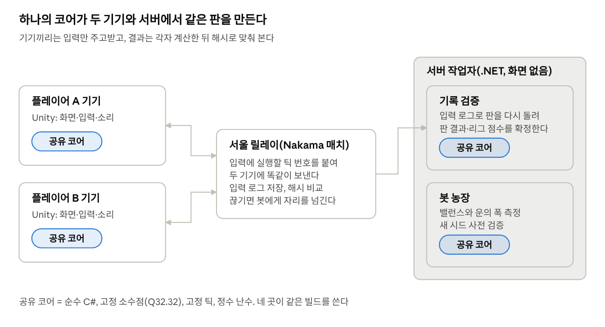
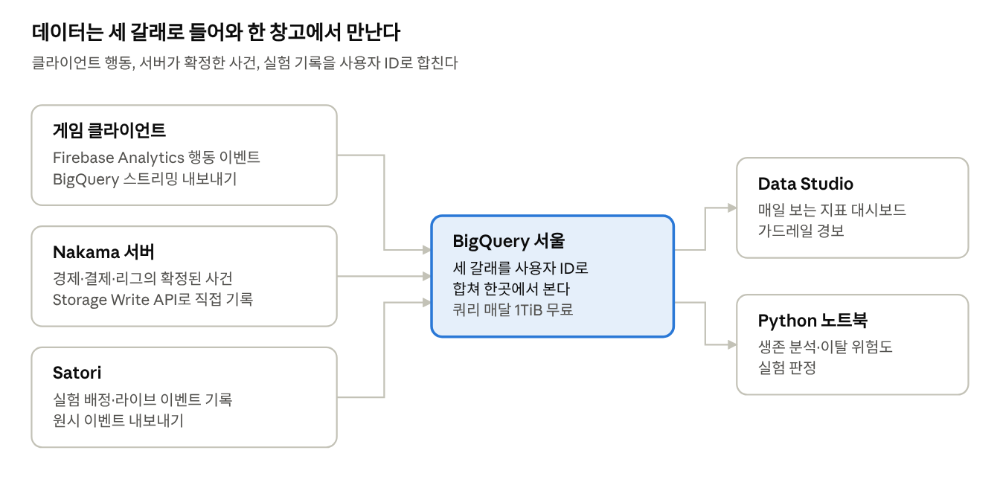
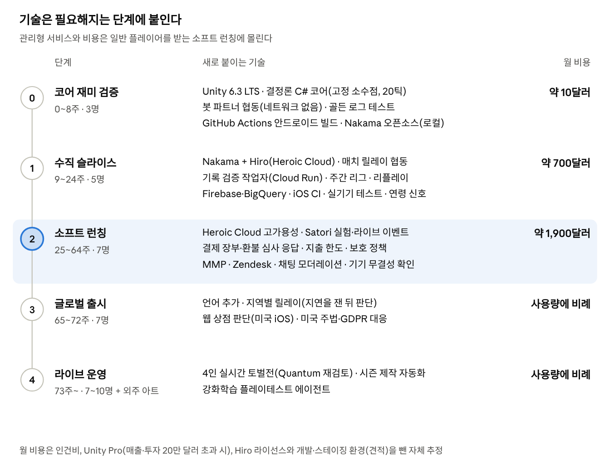

# 도깨비 방범대 기술 스택

작성일: 2026-10-01 · woweverstudio

> 이 문서는 Claude Docs 원본에서 내보낸 사본이다. 게임 설계는 [기획서](../README.md)에, 근거가 된 분야별 조사 노트는 [research/](research/README.md)에 있다.

## 요약

「도깨비 방범대」는 3명으로 시작해 7명까지 늘어나는 팀이 만드는 2인 협동 디펜스 로그라이트다. 이 문서의 선택은 네 가지 원칙을 따른다. 결정론 코어 하나를 기기와 서버가 함께 쓴다. 서버가 진실의 원천이다. 이 게임의 차별점만 직접 만들고 나머지는 관리형 서비스를 쓴다. 모든 결정을 측정할 수 있게 한다(2장).

| 영역 | 선택 | 대안 | 고른 이유 |
| --- | --- | --- | --- |
| 엔진 | Unity 6.3 LTS | Godot 4.7 | C# 코어를 서버와 공유하고, 결제·분석 SDK와 채용 시장이 가장 넓다(3장) |
| 시뮬레이션 | 직접 만든 순수 C# 결정론 코어(Q32.32 고정 소수점, 초당 20틱) | Photon Quantum 3 | 리그 검증·리플레이·봇을 평범한 .NET으로 돌릴 수 있다(4장) |
| 실시간 협동 | Nakama 서버 권위 매치를 입력 릴레이로(서울) | 직접 만든 C# 릴레이, Photon Quantum | 릴레이는 시뮬레이션을 돌릴 필요가 없어 운영할 서비스가 줄어든다(4장) |
| 게임 서버 | Nakama + Hiro, Heroic Cloud 서울 | Azure PlayFab, Nakama 직접 호스팅 | 리그·방범대·경제·결제 검증이 대부분 기본 기능이고 코어가 오픈소스다(5장) |
| 서버 작업자 | Cloud Run 서울: .NET 기록 검증·봇 작업자, 스토어 알림 수신기 | — | 결정론 코어를 그대로 싣고, 한가할 때는 비용이 거의 없다(5·7·8장) |
| 라이브옵스·실험 | Hiro 설정으로 시작해 소프트 런칭부터 Satori | Firebase A/B Testing | 홀드아웃과 라이브 이벤트를 한 곳에서 하고, 묶음 배정은 Nakama가 그룹을 만들 때 정한다(6장) |
| 데이터 | Firebase Analytics, BigQuery 서울, Data Studio, Python | GameAnalytics | 클라이언트 행동과 서버가 확정한 사건을 한 창고에서 합친다(6장) |
| 결제 | Unity IAP 5.4(StoreKit 2·Play 결제 9.0), Nakama 검증과 서버 장부 | RevenueCat | 유료 재화 없는 직접 판매에서 지출 한도·환불·미성년자 보호를 장부 하나로 처리한다(7장) |
| 웹 상점 | 글로벌 출시 때 판단(Unity Webshops와 판매대행) | Stash, Xsolla | 지금 이득이 분명한 곳은 미국 iOS뿐이다(7장) |
| 개발 운영 | GitHub과 Actions(GameCI·fastlane), Crashlytics, Unity Localization과 Crowdin, Zendesk | Unity Build Automation, Sentry, Localazy | 무료 구간이 넓고 Unity Personal로도 시작할 수 있다(8장) |
| 보안·연령 | 서버 재시뮬레이션, Play Integrity·App Attest, 스토어 연령 신호를 묶는 보호 정책 모듈 | — | 판정은 서버가 하고 기기 확인은 위험 신호로만 쓴다(9장) |

### 핵심 결정

1. **결정론 코어는 직접 만든다**: 협동, 리그 검증, 리플레이, 봇이 모두 이 코어에 기댄다. 격자 위의 정수 논리라 상용 엔진의 롤백·물리는 필요 없고, 평범한 .NET으로 돌리는 편이 싸고 단순하다. 0단계부터 골든 로그 CI로 지킨다.
2. **백엔드는 빌린다**: 계정·소셜·리그·경제·결제 검증은 Nakama와 Hiro가 맡고, 직접 만드는 것은 토벌 규칙, 협동 릴레이, 검증 작업자, 결제 장부와 지출 한도, 보호 정책, 운영 도구로 좁힌다. Nakama가 오픈소스라 갈아탈 길도 있다.
3. **결제는 스토어로, 장부는 우리 것으로**: 한국에서는 스토어 결제만 쓰고 웹 상점은 글로벌 출시 때 판단한다. 결제 경로와 무관한 장부 하나가 지출 한도, 환불, 미성년자 보호를 모두 받친다.
4. **비용은 소프트 런칭에 몰린다**: 월 비용은 0단계 약 10달러, 1단계 약 700달러, 2단계 약 1,900달러로 추정한다(인건비, 라이선스, 개발·스테이징 서버 환경 제외). 가장 큰 변수는 Unity Pro(매출·투자 20만 달러 초과 시 7석 기준 월 약 1,350달러)와 Hiro 라이선스 견적이다(10장).

### 지금 할 일

- 0단계 첫 주에 코어 어셈블리, 고정 소수점 라이브러리 선택, 골든 로그 CI부터 만든다(4·8장).
- Heroic Labs에 Hiro 라이선스와 Heroic Cloud 개발 환경 견적을 요청한다(5장).
- 투자 규모로 Unity Personal 자격을 판정하고, 넘으면 Pro 좌석을 예산에 넣는다(3·10장).
- 국내 사업자등록번호로 두 스토어 개발자 계정과 세금 정보를 등록한다(7장).

## 기획에서 나온 기술 요구사항

기술 선택은 기획서([신작 모바일 게임 기획서](../README.md))의 설계에서 출발한다. 아래 열두 가지가 이 문서의 모든 선택을 가르는 기준이고, 괄호는 기획서의 장이다.

| 요구사항 | 기획서 | 기술에 주는 뜻 |
| --- | --- | --- |
| 결정론적 시뮬레이션: 같은 시드와 같은 입력이면 어느 기기에서나 같은 결과 | 9장 | 고정 틱·고정 소수점. 시뮬레이션 코어를 렌더링과 분리하고, 기기 간 결과가 같은지 자동으로 검사한다 |
| 2인 실시간 협동: 입력만 주고받는 락스텝, 10초 안에 못 찾으면 봇, 30초 안 재접속 | 9·11장 | 저지연 릴레이 서버, 매칭, 연결 끊김 처리. 봇도 사람과 같은 입력 체계를 쓴다 |
| 주간 리그 기록 검증: 서버가 입력 기록으로 판을 다시 돌린다 | 11장 | 같은 시뮬레이션 코어를 서버에서 화면 없이 실행하는 검증 작업자와 작업 큐 |
| 리플레이·고스트·합체 하이라이트 공유 | 9·11·16장 | 시드와 입력 로그만 저장하고 재생기로 되살린다. 공유용 짧은 영상은 기기에서 만든다 |
| 방범대(20\~30명)·친구·채팅·비동기 대요괴 토벌 | 11장 | 그룹·친구·채팅 기능, 여러 명이 동시에 깎는 보스 체력 같은 공유 상태의 동시성 제어 |
| 서버 권위 경제: 엽전·조각·레벨, 확률을 공개하는 무료 상자 | 10·14·17장 | 재화와 보상은 서버에서 확정하고 거래 기록을 남긴다. 보상 난수·확률 로그와 변경 이력을 보관한다 |
| 결제 전용: 패스·구독·직접 판매, 지출 한도, 한 번에 해지 | 14·17장 | 스토어 결제와 영수증 서버 검증, 구독 상태 관리, 월 누적 결제액과 한도 계산 |
| 설정 기반 라이브옵스: 이벤트·상점·시드·지정 덱을 클라이언트 업데이트 없이 바꾼다 | 15장 | 원격 설정과 이벤트 허브, 스토어 심사 없이 내려받는 콘텐츠 묶음 |
| 텔레메트리·A/B 실험·홀드아웃·생존 분석 | 16장 | 이벤트 파이프라인과 데이터 창고. 리그 방·방범대 단위의 묶음 배정을 지원하는 실험 도구 |
| 봇 대량 플레이: 밸런스, 운의 폭 측정, 새 시드 사전 검증 | 12·15·16장 | 서버에서 수천\~수만 판을 돌리는 배치 작업과 결과 대시보드 |
| 한국과 글로벌, 미성년자 보호, 지역 간 동일 운영 | 15·17·18장 | 현지화 파이프라인, 연령 확인·보호자 동의, 지역별 규제 설정 |
| 저사양 기기와 짧은 세션: 웨이브마다 자동 저장, 앱 전환 후 이어하기 | 9·13장 | 메모리·발열·앱 용량 예산, 버전 호환되는 상태 저장, 빠른 첫 실행 |

### 설계 원칙

1. **시뮬레이션 코어는 하나다**: 클라이언트, 봇, 서버의 기록 검증, 밸런스 시뮬레이터가 같은 코드를 쓴다. 두 벌을 두면 결과가 갈라지고, 그 순간 리그 검증과 협동이 함께 깨진다.
2. **서버가 진실의 원천이다**: 재화, 결제, 리그 기록, 토벌 피해는 모두 서버가 확정한다. 클라이언트는 요청하고 보여 줄 뿐이다.
3. **차별점만 직접 만든다**: 결정론 코어, 리그 검증, 토벌 규칙처럼 이 게임만의 것은 직접 만들고, 계정·결제·분석·크래시 수집 같은 공통 기능은 관리형 서비스를 쓴다. 3명으로 시작하는 팀에게 가장 비싼 것은 운영 부담이다.
4. **모든 결정을 측정할 수 있게 한다**: 기획서의 수치는 모두 가설이므로, 기능을 넣을 때 그 기능을 켜고 끌 수 있는 설정과 측정 이벤트를 함께 넣는다.

## 클라이언트 엔진과 아트 파이프라인

엔진은 **Unity 6.3 LTS**로 한다. 2027년 12월까지 지원되고, 먼저 나온 6.0 LTS는 2026년 10월에 지원이 끝난다([Unity](https://unity.com/releases/unity-6/support)). 고른 이유는 세 가지다.

1. **시뮬레이션 코어를 서버와 공유한다**: Unity 6.3은 C# 9를 .NET Standard 2.1 기준으로 컴파일한다([Unity 문서](https://docs.unity3d.com/6000.3/Documentation/Manual/csharp-compiler.html)). 그래서 순수 C#으로 짠 결정론 코어 하나를 게임 빌드와 화면 없는 .NET 서버(리그 검증, 리플레이, 봇 시뮬레이션)에 함께 실을 수 있다(4장).
2. **스토어 연동이 최신이다**: Unity IAP 5.4.3(2026.9.3)은 Google Play 결제 라이브러리 9.0.0과 StoreKit 2를 쓴다([변경 기록](https://docs.unity3d.com/Packages/com.unity.purchasing@5.4/changelog/CHANGELOG.html)). Unity 6.3은 안드로이드 API 36을 타깃할 수 있고([Unity 문서](https://docs.unity3d.com/6000.3/Documentation/Manual/android-requirements-and-compatibility.html)), 16KB 페이지 요건도 맞춘다([Android](https://developer.android.com/games/engines/unity/unity-on-android)).
3. **한국에서 사람을 뽑을 수 있다**: 사람인 채용 공고는 'Unity' 239건, 'Godot' 1건이었다(2026.10.1 검색, 전 업종, [사람인](https://www.saramin.co.kr/zf_user/search/recruit?searchword=Unity)). 3명에서 7명으로 늘리는 로드맵에서 채용 속도는 기술 위험만큼 중요하다.

**비용**: 최근 12개월 매출과 투자금이 20만 달러 미만이면 Personal로 무료이고, 그 이상이면 Pro가 필요하다. Pro는 2026년 1월 12일부터 5% 오른 좌석당 연 2,310달러(월 결제는 월 210달러)다. 런타임 요금은 2024년 9월 취소됐다([Unity](https://unity.com/products/pricing-updates)). 최근 12개월 매출과 투자금의 합이 20만 달러를 넘으면 그때 인원만큼 Pro 좌석을 예산에 넣는다(7석이면 연 약 1만 6천 달러, 10장).

### 엔진 비교

| 엔진 | 강점 | 이 게임에서의 약점 | 판단 |
| --- | --- | --- | --- |
| Unity 6.3 LTS | C# 코어 공유, 결제·분석·어트리뷰션 SDK 생태계, 채용 시장 | 매출·투자 20만 달러를 넘으면 좌석당 연간 요금 | 선택 |
| Godot 4.7 | 무료(MIT), 가벼움. Godot 재단이 Play 결제·StoreKit 2 플러그인을 관리한다([Godot](https://godotengine.org/article/godot-mobile-update-apr-2026/)) | 안드로이드·iOS의 C# 지원이 아직 '실험적'이고([Godot 문서](https://docs.godotengine.org/en/stable/tutorials/scripting/c_sharp/index.html)), StoreKit 2 플러그인은 API가 안정되지 않았다고 밝힌다([GitHub](https://github.com/godot-sdk-integrations/godot-storekit2)) | C# 코어를 공유하는 라이브 서비스에는 위험 |
| Cocos Creator 3.8 | 2D 모바일에 강하고, Cocos 4는 2026년 MIT로 공개됐다([PR Newswire](https://www.prnewswire.com/news-releases/cocos-4-is-here-fully-open-source-302652264.html)) | JS/TS 중심이라 C# 코어를 서버와 공유할 수 없다 | 제외 |
| Defold 1.13 | 무료·로열티 없음, 작은 빌드([Defold](https://defold.com/2026/09/29/Defold-1-13-2/)) | Lua 스크립트, 작은 생태계 | 제외 |

### 아트·UI 파이프라인

- **렌더링**: 스프라이트 기반 2D에 ASTC로 압축한 아틀라스를 쓴다. 모든 연출은 풀링하고, 30fps 설정을 둔다.
- **UI**: uGUI로 시작한다. Unity 6.3 문서는 런타임 UI에 uGUI를 권장하고 UI Toolkit을 대안으로 둔다([Unity 문서](https://docs.unity3d.com/6000.3/Documentation/Manual/UI-system-compare.html)). 도감·상점처럼 데이터가 많은 메뉴만 나중에 UI Toolkit을 검토한다.
- **애니메이션**: 무료인 Unity 2D Animation을 기본으로 한다. Spine은 아트 방향이 요구할 때만 쓴다. 사용자당 Professional 379달러이고, 투자를 포함한 매출이 50만 달러를 넘으면 Enterprise(연 2,499달러 + 사용자당 379달러)가 필요하다([Spine](https://esotericsoftware.com/spine-purchase)).
- **에셋 배포**: Addressables로 시즌 콘텐츠를 내려받는다. Google Play는 기본 모듈을 500MB까지 허용하지만 200MB를 넘으면 모바일 데이터 경고를 띄운다([Google Play](https://support.google.com/googleplay/android-developer/answer/9859372)). Apple은 iOS 27부터 On-Demand Resources를 지원 중단 예정으로 지정하고 Background Assets를 권한다([Apple](https://developer.apple.com/help/app-store-connect/reference/on-demand-resources-size-limits/)). 첫 설치는 150MB 이하를 목표로 한다.
- **합체 하이라이트 영상**: 기기에서 리플레이를 다시 그려 짧은 영상으로 인코딩한다. 입력 로그만 있으면 되므로 서버에 영상을 올리지 않는다.

### 저사양 기기 예산

| 항목 | 우리 목표 | 외부 기준 |
| --- | --- | --- |
| 최소 사양 | RAM 4GB, OpenGL ES 3.0급 | Unity 6.3은 안드로이드 7.1 이상, GLES 2는 지원하지 않는다([Unity 문서](https://docs.unity3d.com/6000.3/Documentation/Manual/android-requirements-and-compatibility.html)) |
| 전면 메모리 | 1.5GB 이하 | Google Play의 게임 메모리 기준은 4GB 기기에서 2.25GB이고, 2027년 2월부터 노출에 영향을 준다([Android vitals](https://developer.android.com/topic/performance/vitals)) |
| 크래시·ANR | 각각 0.5%·0.2% 이하 | 노출 상한은 크래시 1.09%, ANR 0.47%, 기종별 8%다(같은 페이지) |
| 플랫폼 일정 | API 36 타깃, 16KB 페이지 | 2026년 8월 31일부터 새 앱·업데이트는 API 36을 타깃해야 하고([Google Play](https://support.google.com/googleplay/android-developer/answer/11926878)), 2027년 2월 1일부터 16KB 페이지를 지원하지 않는 업데이트는 출시할 수 없다([Android](https://developer.android.com/guide/practices/page-sizes)) |
| 테스트 기기 | 갤럭시 보급형·중급형과 아이폰 하위 모델 | 한국 모바일 웹 트래픽은 삼성 57%, 애플 38%다(2026년 9월, [StatCounter](https://gs.statcounter.com/vendor-market-share/mobile/south-korea)) |

크래시·ANR 목표는 노출 상한의 절반 아래로 둔 우리의 안전 여유다. 한국·동남아시아의 RAM 등급별 기기 분포는 공개 자료를 찾지 못했으므로, 소프트 런칭 때 우리 분석에 기기 메모리 용량을 기록해 최소 사양을 다시 정한다.

## 결정론 시뮬레이션과 실시간 협동

시뮬레이션은 **직접 만든 순수 C# 코어**로, 통신은 **서울 리전의 Nakama 서버 권위 매치**로 한다. 이 게임은 격자 위의 정수 논리이고 입력이 드물다(판당 수백 개, 설계 가정). 상용 결정론 엔진이 주는 물리·내비게이션·롤백은 대부분 쓸 일이 없다. 반면 리그 검증·리플레이·봇 시뮬레이션은 코어를 평범한 .NET 라이브러리로 돌릴 때 가장 싸고 단순하다. 릴레이는 시뮬레이션을 돌리지 않고 입력에 틱 번호를 붙여 나눠 주기만 하므로, 백엔드(5장)인 Nakama의 서버 권위 매치로 충분하다. 릴레이 서버를 따로 두지 않으니 운영할 서비스가 하나 줄어든다.

*실시간 협동 구조 · 기기 2대, 릴레이 1개, 서버 작업자 2종*

### 코어를 결정론적으로 만드는 규칙

- **고정 소수점**: 64비트 정수 기반 Q32.32 산술을 쓴다. MIT 라이선스인 [FixedMathSharp](https://github.com/mrdav30/FixedMathSharp)(7.1.0, 2026년 8월, netstandard2.1·net8.0 지원)나 C#·Java·C++에서 비트 단위로 같은 결과를 내는 [FixPointCS](https://github.com/XMunkki/FixPointCS)를 후보로 둔다. 2021년에 보관 처리된 [FixedMath.Net](https://github.com/asik/FixedMath.Net)은 쓰지 않는다.
- **부동소수점을 쓰지 않는다**: .NET의 Math.Sin 같은 함수는 운영체제·CPU에 따라 결과가 다를 수 있다고 문서에 적혀 있다([Microsoft](https://learn.microsoft.com/en-us/dotnet/api/system.math.sin)). Burst의 결정론 모드는 Burst로 컴파일한 코드에만 적용돼 .NET 서버에는 도움이 되지 않는다([Unity 문서](https://docs.unity3d.com/Packages/com.unity.burst@1.8/manual/compilation-burstcompile.html)). 체력·사거리 같은 콘텐츠 수치는 빌드 때 정수로 굽는다. Photon 문서도 시뮬레이션 안에서 부동소수점을 고정 소수점으로 바꾸면 반드시 어긋난다고 경고한다([Photon](https://doc.photonengine.com/quantum/v3/manual/quantum-ecs/fixed-point)).
- **순서가 정해지지 않은 것을 쓰지 않는다**: Array.Sort는 불안정 정렬이고, Dictionary의 순회 순서는 정해져 있지 않으며, string.GetHashCode는 구현마다 다를 수 있다([Microsoft](https://learn.microsoft.com/en-us/dotnet/api/system.string.gethashcode)). 안정 정렬과 동점 규칙, 순서가 있는 컨테이너, 자체 해시 함수를 쓴다.
- **엔진과 분리한다**: 코어 어셈블리가 UnityEngine을 참조하지 못하게 막는다(noEngineReferences). 화면은 코어의 상태를 읽어 그릴 뿐이다.
- **고정 틱**: 초당 20틱으로 돌리고 입력은 2\~3틱 뒤에 적용한다(100\~150밀리초). 디펜스 게임에서는 느껴지지 않는 지연이라고 보고, 프로토타입에서 확인한다(설계 가정).
- **기기 간 결과를 계속 비교한다**: 골든 입력 로그의 틱별 체크섬을 병합마다 x86-64 서버에서, 매일 밤 안드로이드·iOS 실기기에서 비교하고, 다르면 병합이나 출시 빌드를 막는다(8장).

### 협동 판의 흐름

1. **매칭**: 깊은 밤 단계가 비슷한 두 사람을 묶고, 10초 안에 못 찾으면 봇 파트너로 시작한다(기획서 11장). 기획서의 고스트 봇은 지난 판 입력을 그대로 재생하지 않는다. 협동 판에서는 상대 행동에 따라 같은 입력이 무효가 되므로, 플레이어 기록에서 뽑은 성향(배치·합체 선호, 반응 속도)을 따르는 규칙 기반 결정론 봇으로 만든다(설계 가정).
2. **진행**: 각 기기는 입력(소환·합체·배치·기운 보내기)만 릴레이로 보낸다. 릴레이는 입력에 실행할 틱 번호를 붙여 두 기기에 똑같이 보내고, 두 기기는 같은 입력으로 각자 시뮬레이션한다.
3. **어긋남 감지**: 기기는 몇 틱마다 상태 해시를 보내고 릴레이가 비교한다. 다르면 그 판을 거기서 끝내고 막은 웨이브만큼 보상하며, 입력 로그로 원인을 찾는다. 이렇게 끝난 판의 비율은 1단계 관문 지표다(기획서 18장 관문 2의 '협동 판 비정상 종료 2% 미만').
4. **끊김과 재접속**: 30초 안에 돌아오면 릴레이가 가진 입력 로그로 판을 처음부터 빠르게 다시 돌려 따라잡는다. 30초 안에 돌아오지 못하면 릴레이가 'T틱부터 N번 자리를 봇이 맡는다'는 입력을 보내고, 결정론 봇이 모든 기기에서 똑같이 그 자리를 이어받는다.
5. **판이 끝나면**: 릴레이가 입력 로그를 백엔드로 넘기면 기록 검증 작업자가 판을 다시 돌려 결과를 정하고, 보상은 그 결과로 서버가 확정한다. 대요괴 토벌 판도 같은 방식으로 피해를 확정한다. 혼자 하는 리그 기록 판은 기기가 입력 로그를 올리면 기록 검증 작업자가 다시 돌려 점수를 확정한다.

### 직접 구현과 상용 엔진 비교

| 선택지 | 무엇을 주나 | 비용 | 판단 |
| --- | --- | --- | --- |
| 직접 만든 C# 코어 + Nakama 서버 권위 매치(입력 릴레이) | 코어는 서버에서 평범한 .NET으로 돌고, 릴레이는 Nakama 서버 권위 매치가 틱마다 입력을 묶어 보낸다. Nakama 매치는 Go·Lua·TypeScript로만 쓸 수 있어 C# 코어를 실시간으로 돌리지는 못하지만([Heroic Labs](https://heroiclabs.com/docs/nakama/concepts/multiplayer/authoritative/)), 이 설계에서는 릴레이가 코어를 돌릴 필요가 없다 | 릴레이는 백엔드 비용에 포함되고(5장), 검증 작업자는 컴퓨팅 비용만 든다 | 선택 |
| 직접 만든 C# 릴레이 | 서버가 코어를 실시간 심판처럼 돌릴 수 있다 | 서버 비용과 운영할 서비스가 하나 늘어난다. 구글 클라우드는 서울 리전(asia-northeast3)을 운영한다([Google Cloud](https://cloud.google.com/compute/docs/regions-zones)) | 대안. 출시 뒤 4인 실시간 토벌전에서 서버가 실시간으로 판정해야 하거나 지역별 릴레이가 필요할 때 |
| Photon Quantum 3 | 결정론 ECS, 예측·롤백, 최대 128명, 리플레이 웹훅, 대체 봇 패턴, 서울 리전([Photon](https://doc.photonengine.com/quantum/v3/quantum-intro)) | 개발 20 CCU·출시 100 CCU 무료, 500 CCU 월 125달러, 1,000 CCU 월 250달러([Photon](https://www.photonengine.com/quantum/pricing)). 서버에서 시뮬레이션을 돌리려면 추가 비용이 드는 Enterprise Cloud가 필요하다([Photon](https://doc.photonengine.com/quantum/v3/manual/cheat-protection)) | 대비책. 출시 뒤 4인 실시간 토벌전이 액션 위주가 되면 다시 검토한다 |
| Photon Realtime | 범용 방 단위 릴레이, 서울 리전 | 500 CCU 월 95달러부터([Photon](https://www.photonengine.com/realtime/pricing)). 서버 로직은 별도 플러그인 계약이 필요하다([Photon](https://www.photonengine.com/gaming)) | 전송만 맡길 때의 대안 |
| Unity Relay | 전용 서버 없이 기기를 잇는다 | 평균 50 CCU까지 무료, 이후 CCU당 0.16달러([Unity](https://unity.com/products/gaming-services/pricing)) | 서울 리전이 없고 가장 가까운 곳이 도쿄다([Unity 문서](https://docs.unity.com/en-us/relay/locations-and-regions)). 제외 |

CCU는 동시 접속자 수다. 릴레이는 처음엔 서울 한 곳에 둔다. 글로벌 출시 뒤 먼 지역의 협동 지연이 문제로 측정되면 지역별 릴레이(직접 만든 C# 릴레이나 Photon)를 더한다. 수직 슬라이스가 끝나는 24주차에는 2인 협동의 어긋남·재접속 지표로 이 구조를 확정하고, Quantum 전환 여부는 출시 뒤 첫 대형 업데이트 후보인 4인 실시간 토벌전(기획서 15·18장)을 설계할 때 다시 판단한다.

## 게임 서버와 백엔드

백엔드는 **Nakama + Hiro를 Heroic Cloud 서울 리전**에서 쓴다. 소프트 런칭부터는 같은 회사의 Satori를 더해 라이브옵스와 실험을 맡긴다(6장). 고른 이유는 네 가지다.

1. **요구사항 대부분이 기본 기능이다**: Nakama는 기기·애플·구글 로그인, 친구, 그룹과 채팅, 리더보드·토너먼트, 매치메이커, 실시간 매치를 기본으로 주고([GitHub](https://github.com/heroiclabs/nakama)), 결제·구독 영수증 검증과 스토어 서버 알림도 처리한다([Heroic Labs](https://heroiclabs.com/docs/nakama/concepts/iap-validation/)). Hiro는 지갑·인벤토리·상점·가중치 보상·업적·우편함·팀(채팅 포함)을 주고, 그룹 크기·티어·승급과 강등 구간을 설정하는 이벤트 리더보드를 준다([Heroic Labs](https://heroiclabs.com/docs/hiro/concepts/event-leaderboards/)). 기획서의 30명 그룹·10티어 승급과 강등은 설정으로 만들고, 고스트로 빈자리 채우기·가입일 기준 신규 리그·기록 검증은 직접 붙인다.
2. **종속이 적다**: Nakama 서버는 Apache-2.0 오픈소스라 관리형에서 직접 호스팅으로 옮길 수 있다. Hiro와 Satori는 상용이다([Heroic Labs](https://heroiclabs.com/hiro/)).
3. **서울에서 돈다**: Heroic Cloud는 구글 클라우드 서울 리전(asia-northeast3)에 배포할 수 있다([Heroic Labs](https://heroiclabs.com/docs/heroic-cloud/concepts/titles/nakama-deployments/index.html)).
4. **비용을 예측할 수 있다**: 요금 계산기 기준으로 Nakama CPU당 월 400달러에 DB CPU당 월 200달러이고, 이용자·동시 접속자 한도가 없다. 고가용성 구성은 Nakama CPU 2개부터라 월 약 1,000달러, 단일 노드는 월 600달러다([Heroic Labs](https://heroiclabs.com/pricing/)). Hiro는 상용 라이선스이고, 가격과 과금 방식이 공개돼 있지 않아 견적을 받아야 한다.

서버 확장 코드는 Nakama가 지원하는 Go나 TypeScript로 쓴다. 클라이언트와 언어가 다르다는 것이 이 선택의 비용이다. 다만 결정론 코어가 필요한 일(기록 검증·봇 시뮬레이션)은 모두 .NET 작업자가 맡으므로, Nakama 쪽 코드는 규칙과 데이터 처리에 머문다.

### 백엔드 비교

| 백엔드 | 이 게임에 맞는 정도 | 서버 코드 | 판단 |
| --- | --- | --- | --- |
| Nakama + Hiro (Heroic Cloud) | 리그·방범대·경제·결제 검증까지 대부분 기본 기능이다 | Go·Lua·TypeScript | 선택 |
| Azure PlayFab | 경제·리더보드·친구는 있지만 Economy v2에 드롭 테이블이 없다. 사용량 과금이고 인벤토리 쓰기는 100만 건당 40달러다([Microsoft](https://developer.microsoft.com/en-us/games/products/playfab/pricing)). 무료인 Foundation 모드는 Xbox 출시가 조건이다([Microsoft](https://learn.microsoft.com/en-us/gaming/playfab/get-started/foundation-onboarding)) | Azure Functions(C# 가능) | 차선 |
| Unity Gaming Services | Cloud Code를 C#으로 쓸 수 있다. 하지만 Economy는 2026년 9월 8일부터 새 프로젝트를 받지 않고([Unity](https://docs.unity.com/en-us/economy)), Unity의 게임 서버 호스팅 서비스 Multiplay는 2026년 4월 1일 종료됐다([Unity](https://status.unity.com/info_notices/362941)). 무료 한도를 넘으면 결제 수단을 등록할 때까지 UGS 전체가 멈춘다([Unity](https://docs.unity.com/en-us/services/pricing-and-billing)) | C#·JavaScript | 제외 |
| Firebase | 인증·원격 설정·분석·푸시는 좋지만 매칭·길드·리그가 없다. Remote Config는 2026년 9월 1일부터 하루 10만 회를 넘는 조회가 유료다([Firebase](https://firebase.google.com/pricing)) | Cloud Functions | 백엔드로는 제외. 분석·크래시·푸시 SDK만 쓴다(6·8장) |
| NHN Cloud Gamebase | 네이버·페이코 로그인, 카카오게임 어댑터, 원스토어·갤럭시 스토어 결제, 점검·공지·쿠폰([NHN Cloud](https://docs.nhncloud.com/ko/Game/Gamebase/ko/Overview/)) | 해당 없음 | 현재 가격을 확인하지 못했다. 국내 대체 스토어로 넓힐 때 검토 |
| 자체 구축(Go·.NET + PostgreSQL) | 인증, 영수증, 장부, 채팅, 매칭, 설정, 운영 도구를 모두 직접 만든다 | 자유 | 제외. 서버 개발자가 여럿이어야 현실적이다 |

### 기능별 구현 위치

| 기능(기획서) | 구현 |
| --- | --- |
| 게스트·애플·구글 로그인 | Nakama 기본 기능 |
| 카카오 로그인 | Nakama의 사용자 정의 인증 훅에서 카카오 OIDC 토큰을 검증한다([Heroic Labs](https://heroiclabs.com/docs/nakama/concepts/authentication/), [카카오](https://developers.kakao.com/docs/en/kakaologin/common)) |
| 엽전·조각·레벨, 무료 상자(10·14장) | Hiro 경제·보상. 확률표와 변경 이력은 감사 로그로 따로 보관한다(9장) |
| 결제·구독 검증(14장) | Nakama 영수증 검증과 스토어 서버 알림(7장) |
| 친구·방범대·채팅(11장) | Nakama 친구·그룹·채팅, Hiro 팀 |
| 주간 리그(11장) | Hiro 이벤트 리더보드 + 기록 검증 작업자(직접) |
| 대요괴 토벌(11장) | 직접 만든다. 공유 체력과 방범대 중앙값 기준 피해 상한은 Hiro 팀에 없다([Heroic Labs](https://heroiclabs.com/docs/hiro/concepts/teams/)) |
| 협동 매칭·릴레이·봇 교대(11장) | Nakama 매치메이커 + 서버 권위 매치(4장) |
| 보상 우편함 | Hiro 우편함 |
| 원격 설정·이벤트·실험(15·16장) | Hiro의 설정 변경 기능으로 시작하고, 소프트 런칭부터 Satori(6장) |
| 지출 한도·월 누적 결제액(14·17장) | 직접 만든다(7장) |

### 직접 만드는 것

- **기록 검증 작업자**: 결정론 코어를 담은 .NET 컨테이너를 Cloud Run 서울 리전에서 작업 큐로 돌린다([Google Cloud](https://cloud.google.com/run/docs/locations)). 봇 농장도 같은 이미지를 쓴다.
- **토벌 규칙·협동 릴레이·카카오 인증 훅·지출 한도**: Nakama 서버 확장 코드로 만든다.
- **확률표와 감사 로그**: 한국은 2024년 3월 22일부터 확률형 아이템 확률 공개를 의무화했다([대한민국 정책브리핑](https://www.korea.kr/news/policyNewsView.do?newsId=148924297)). 유료 확률형은 없지만 무료 상자에도 같은 형식을 적용한다(기획서 17장).
- **서버 이벤트 기록기와 운영 도구**: 경제·결제·리그 이벤트를 데이터 창고로 보내는 기록기(6장)와 고객 지원·보상 지급 도구(8장).

예산이 더 빠듯하면 Nakama 오픈소스를 구글 클라우드 서울에 직접 올리는 방법이 있다. 단, 여러 노드를 묶는 클러스터링은 Enterprise 기능이라 단일 노드로만 돌릴 수 있다([Heroic Labs](https://heroiclabs.com/enterprise/)). 프로토타입에는 충분하고, 출시에는 관리형을 쓴다.

## 라이브옵스·데이터·실험

데이터는 세 갈래로 모은다. 플레이어의 행동은 클라이언트의 Firebase Analytics가, 재화·결제·리그처럼 서버가 확정하는 사건은 Nakama가, 실험 배정과 라이브 이벤트는 Satori가 BigQuery 서울로 보낸다. 세 갈래를 사용자 ID와 판 ID로 합쳐 기획서 16장의 분석을 한다.

*데이터 흐름 · 수집 3갈래, 창고 1곳, 활용 2가지*

### 도구 선택

| 영역 | 선택 | 비용(2026) | 이유와 대안 |
| --- | --- | --- | --- |
| 행동 분석 | Firebase Analytics | 무료. BigQuery 일일 내보내기는 하루 100만 이벤트까지이고, 스트리밍 내보내기는 한도 없이 GB당 0.05달러다([Google](https://support.google.com/analytics/answer/9358801)) | 크래시·푸시 SDK와 같은 생태계다. 대안은 MAU 제한 없이 무료인 GameAnalytics인데, 원시 데이터를 내보내려면 월 499달러부터다([GameAnalytics](https://www.gameanalytics.com/pricing)) |
| 데이터 창고 | BigQuery 서울 | 쿼리는 매달 1TiB 무료, 이후 1TiB당 7.50달러. 저장은 GiB당 월 0.023달러이고, 서버가 쓰는 Storage Write API는 매달 2TiB 무료다([Google Cloud](https://cloud.google.com/bigquery/pricing)) | Firebase와 바로 연결되고 서울 리전이 있다 |
| 대시보드 | Data Studio(옛 Looker Studio) | 무료. Pro는 사용자·프로젝트당 월 9달러다([Google Cloud](https://cloud.google.com/data-studio)) | 2026년 4월 이름이 바뀌었다. 대안은 오픈소스 Metabase다 |
| 실험·라이브 이벤트 | 소프트 런칭부터 Satori | 월 600달러부터([Heroic Labs](https://heroiclabs.com/pricing/)) | 오디언스·실험·홀드아웃·라이브 이벤트·푸시를 주고 원시 이벤트를 BigQuery로 내보낸다([Heroic Labs](https://heroiclabs.com/satori/)). Firebase A/B Testing은 무료지만 홀드아웃을 문서화하지 않았고([Firebase](https://firebase.google.com/docs/ab-testing/abtest-config)), GrowthBook은 홀드아웃이 Enterprise 요금제에만 있다([GrowthBook](https://www.growthbook.io/pricing)) |
| 생존 분석·실험 판정 | Python(lifelines, scikit-survival) | 무료 | 기획서 16장의 생존 곡선·이탈 위험도·표본 크기 계산 |
| 어트리뷰션(MMP) | AppsFlyer나 Singular의 무료 구간으로 시작 | AppsFlyer는 첫해 전환 1만 2천 건 무료, 이후 전환당 0.07달러([AppsFlyer](https://www.appsflyer.com/pricing/)). Singular는 유료 전환 1만 5천 건 무료, 이후 0.05달러([Singular](https://www.singular.net/pricing/)) | 출시 국가의 광고 매체 연동을 보고 고른다 |
| 푸시 | FCM(안드로이드)·APNs(iOS) | FCM은 무료이고([Firebase](https://firebase.google.com/pricing)), APNs는 연 99달러인 애플 개발자 프로그램에 포함된다([Apple](https://developer.apple.com/programs/whats-included/)) | 예약 발송·대상 지정은 Satori로 한다 |

Statsig는 2025년 OpenAI가 인수한 뒤 2026년 5월 브랜드와 고객이 Amplitude로 넘어갔다([Amplitude](https://amplitude.com/blog/amplitude-and-statsig-partnership)). 실험 도구는 수년을 써야 하므로 공급사의 연속성도 선택 기준에 넣었다.

### 운영 규칙

- **경제 수치는 서버 이벤트만 믿는다**: 클라이언트 이벤트는 행동을 보는 데 쓰고, 매출·재화·리그 기록은 서버가 확정한 이벤트로 계산한다. 두 갈래에는 같은 판 ID를 붙인다.
- **묶음 배정은 서버가 정한다**: 리그 방·방범대 단위 실험(기획서 16장)은 Nakama가 그룹을 만들 때 조건을 정하고, 실험 ID를 모든 이벤트에 남긴다.
- **원격 설정은 단계별로 옮긴다**: 프로토타입과 수직 슬라이스는 Hiro의 설정 변경 기능으로, 소프트 런칭부터는 Satori의 기능 플래그와 라이브 이벤트로 운영한다. 새 시드와 규칙은 공개 전에 봇 농장에서 돌려 본다(기획서 15장).
- **초대 링크는 MMP로 만든다**: Firebase Dynamic Links는 2025년 8월 25일 종료됐다([Firebase](https://firebase.google.com/support/dynamic-links-faq)). 친구·방범대 초대 링크는 MMP의 딥링크를 쓴다.
- **플랫폼 측정 방식을 따른다**: iOS는 SKAdNetwork와 호환되는 AdAttributionKit의 집계 데이터로 측정한다([Apple](https://developer.apple.com/videos/play/wwdc2025/221/)). 안드로이드 Privacy Sandbox는 2025년 10월 단계적 폐지가 발표됐다([Google](https://privacysandbox.google.com/blog/update-on-plans-for-privacy-sandbox-technologies)).
- **한국의 광고성 푸시 규칙을 지킨다**: 명시적 수신 동의, 오후 9시\~오전 8시 발송의 별도 동의, '(광고)' 표시, 2년마다 동의 재확인이 필요하다(정보통신망법 제50조, [업체 정리 자료](https://developers.fingerpush.com/app-push/guide/ads)). 이벤트 알림도 광고성으로 보고 같은 규칙을 적용한다.

## 결제·구독·스토어

결제는 **스토어 결제(Unity IAP 5.4)와 Nakama의 서버 장부**로 한다. 기획서는 유료 재화 없이 모든 상품을 실제 가격으로 직접 팔기로 했다(기획서 14장). 그래서 재화 환율이나 유료 잔액을 관리할 일이 없고, 장부에는 누가 무엇을 얼마에 사서 무엇을 받았는지만 남는다. 한국에서는 스토어 결제만 쓰고, 웹 상점은 글로벌 출시 때 판단한다.

### 클라이언트와 상품 등록

- **Unity IAP 5.4.x**: StoreKit 2를 기본으로 쓰고 Google Play 결제 라이브러리 9.0.0을 담는다([변경 기록](https://docs.unity3d.com/Packages/com.unity.purchasing@5.4/changelog/CHANGELOG.html)). Google은 2026년 8월 31일부터 새 앱과 업데이트에 결제 라이브러리 8 이상을 요구하고, 연장을 받으면 11월 1일까지 미룰 수 있다([Google Play](https://developer.android.com/google/play/billing/deprecation-faq)). 옛 StoreKit 결제 API는 iOS 18에서 지원 중단으로 표시됐다([Apple](https://developer.apple.com/documentation/storekit/skpaymentqueue)).
- **상품 유형은 스토어 정의를 따른다**: 아래 표처럼 등록한다. 비소모성 상품이 있으므로 Apple 심사 지침이 요구하는 구매 복원 기능을 넣는다([Apple](https://developer.apple.com/app-store/review/guidelines/)). 같은 스토어 계정의 거래는 처음 지급한 게임 계정에만 묶는다.
- **등록은 자동화한다**: 코스메틱이 시즌마다 늘어나므로 상품 등록과 가격 설정은 두 스토어의 API로 스크립트화한다.
- **가격은 스토어 값을 그대로 보여 준다**: 상점은 스토어가 돌려주는 현지 가격 문자열을 쓴다. 할인 전 가격을 직전 30일 최저가로 보여 주기 위해(기획서 14장 과금 규칙 5) 서버가 상품·국가별 가격 이력을 남긴다.

| 상품(기획서 14장) | 스토어 상품 유형 | 서버 처리 |
| --- | --- | --- |
| 스타터 팩, 코스메틱, 새 도깨비 | 비소모성 | 계정 소유로 기록한다 |
| 시즌 패스(프리미엄·프리미엄+) | 소모성 | 패스(4주)마다 다시 사므로 소모성으로 두고, 패스 기간마다 한 번만 팔도록 서버가 막는다(시즌마다 패스는 두 번 열린다, 기획서 9·15장) |
| 성장 묶음 | 소모성 | 결과물(예: 레벨 10 달성)을 지급하고, 이미 달성한 계정에는 제안하지 않는다 |
| 방범대 선물 팩 | 소모성 | 구매자와 방범대원 전원의 우편함으로 같은 코스메틱을 보낸다 |
| 월간 멤버십 | 자동 갱신 구독 | 스토어 알림으로 상태를 갱신하고 혜택을 켜고 끈다 |

### 서버 검증과 장부

1. **검증**: 클라이언트는 StoreKit 2의 서명된 거래(JWS)나 Google Play 구매 토큰을 Nakama로 보낸다. Nakama는 둘 다 검증하고(StoreKit 2는 3.37.0 이상), 이미 처리한 거래인지 알려 주는 seenBefore 값을 돌려준다([Heroic Labs](https://heroiclabs.com/docs/nakama/concepts/iap-validation/)).
2. **지급 뒤 확정**: 서버는 거래 ID를 키로 장부에 한 줄을 쓰고, 상품을 지급한 다음에 구매를 확정한다(Apple은 거래 완료, Google은 확인·소비). 같은 거래가 두 번 와도 한 번만 지급된다. Google은 3일 안에 확인하지 않은 구매를 자동 환불하므로([Google Play](https://developer.android.com/google/play/billing/integrate)), 지급에 실패한 거래는 재시도 큐에 넣고 경보를 띄운다.
3. **스토어 알림**: Nakama는 Apple App Store 서버 알림 V2와 Google 실시간 개발자 알림(RTDN)을 받아 구독·갱신·만료·해지·환불 다섯 가지로 정리하고, DB를 고친 뒤 우리 훅을 부른다(같은 문서). 훅은 장부와 혜택을 맞춘다.
4. **환불**: 되돌릴 수 있는 것(외형, 도깨비 소유권, 아직 받지 않은 패스 보상, 멤버십 혜택)만 회수하고, 이미 반영된 성장은 장부에 기록만 남긴다. 결제에 이의를 제기한 계정은 잠그지 않는다(기획서 14·17장).
5. **환불 심사에 답한다**: Apple은 모든 상품 유형의 환불 요청에 CONSUMPTION\_REQUEST를 보내고, 고객이 동의한 경우에만 12시간 안에 사용 정보를 받는다([Apple](https://developer.apple.com/documentation/appstoreserverapi/send-consumption-information)). Google은 개발자 검토가 필요한 차지백에 PendingRefundReviewNotification을 보내고, 24시간 안에 ReviewRefund API로 의견을 받는다([Google Play](https://developer.android.com/google/play/billing/rtdn-reference)). 둘 다 Nakama가 정리하는 다섯 가지에 없다. 그래서 Apple 알림을 먼저 받아 Nakama로 넘기는 작은 수신기를 Cloud Run에 두고, Google 알림은 Pub/Sub 구독을 하나 더 만들어 받는다. 수신기는 Apple의 공식 App Store Server Library가 있는 Node(TypeScript)로 쓴다([Apple](https://developer.apple.com/documentation/appstoreserverapi/simplifying-your-implementation-by-using-the-app-store-server-library)). Apple에 사용 정보를 보내는 데 필요한 고객 동의는 설정 화면에서 따로 받는다(옵트인).
6. **지출 한도는 결제창 앞에서**: 구매 버튼을 누르면 서버가 월 누적 결제액(환불을 뺀 장부 합계), 플레이어가 정한 월 한도, 연령 상태(9장)를 확인하고, 넘으면 스토어 결제창을 띄우지 않는다. 같은 장부를 읽으므로 웹 상점이 붙어도 그대로 쓴다.

### 구독: 월간 멤버십

- **혜택은 서버 상태로 켠다**: 클라이언트의 영수증이 아니라 Nakama의 구독 상태로 혜택을 켜고 끈다. 두 스토어의 결제 실패 유예 기간을 켜고, 유예 중에는 혜택을 유지한다.
- **한 번에 해지**: 게임 안의 '멤버십 해지' 버튼은 스토어의 구독 관리 화면을 바로 연다. 2025년 2월 14일 시행된 개정 전자상거래법은 숨은 갱신과 해지 방해를 금지한다([김앤장](https://www.kimchang.com/ko/insights/detail.kc?idx=32247)). 갱신 전에는 우편과 푸시로 알린다(기획서 17장).
- **체험권은 서버 혜택으로**: 친구에게 주는 7일 체험권(기획서 14장)은 스토어 무료 체험이 아니라 서버가 7일 동안 켜 주는 혜택으로 만든다. 자동 결제로 이어지지 않으므로, 한국에서 무료 체험이나 할인 가격이 정가로 바뀐 뒤 30일 안에 추가 동의를 받아야 하는 규정도 적용되지 않는다([Apple](https://developer.apple.com/news/?id=bo1b122z)). 나중에 스토어의 할인 첫 달을 쓰면, Apple은 이메일·푸시·앱 안 동의 화면으로 이 동의를 대신 받는다(같은 글).

### 한국: 스토어 결제만 쓴다

| 결제 경로 | 수수료 | 조건 |
| --- | --- | --- |
| Google Play 결제(지금) | 연 100만 달러까지 15%(15% 등급 가입 시), 초과분 30%, 구독 15%([Google Play](https://support.google.com/googleplay/android-developer/answer/112622)) | 없음 |
| Google Play 결제(2026년 12월 31일부터) | 첫 100만 달러와 자동 갱신 구독에 서비스 수수료 10%, 여기에 결제 수수료 5%([Google Play](https://support.google.com/googleplay/android-developer/answer/16954621), [Google 블로그](https://blog.google/intl/ko-kr/products/android-play-hardware/play-developer-update-2026-kr/)) | 100만 달러 초과분은 신규 설치 20%, 기존 설치 25%(결제 수수료 별도) |
| Google 대체 결제 | 지금은 위 수수료에서 4%p를 깎아 주고, 12월 31일부터는 결제 수수료 5%가 붙지 않는다. 결제대행 수수료는 따로 든다 | 대체 결제 API, PCI-DSS 준수, 거래마다 24시간 안에 보고([Google Play](https://support.google.com/googleplay/android-developer/answer/11222040)) |
| Apple 인앱 결제 | 소규모 사업자 프로그램 15%([Apple](https://developer.apple.com/app-store/small-business-program/)) | 전년도 수익 100만 달러 이하 |
| Apple 외부 결제(한국 권한) | 부가세 포함 가격의 26%([Apple](https://developer.apple.com/support/storekit-external-entitlement-kr/)) | 출시한 적 없는 번들 ID로 만든 한국 전용 앱, 결제대행사 1곳, 월간 보고 |

대체 결제로 아낄 수 있는 것은 Google에서 4\~5%p에서 결제대행 수수료를 뺀 정도이고, Apple에서는 오히려 비싸다. PCI-DSS, 거래 보고, 결제 경로별 가격 관리가 늘리는 부담이 더 크므로 출시 때는 스토어 결제만 쓴다. 제도가 바뀌면 다시 계산한다(11장).

- **부가세**: 두 스토어 모두 국내 개발자의 판매분 부가세를 대신 내지 않으므로 우리가 신고·납부한다. 두 스토어에 사업자등록번호를 등록한다. Google은 번호가 없으면 수수료에 부가세 10%를 더하고, Apple은 국내 개발자에게 번호 등록을 요구한다([Google Play](https://support.google.com/googleplay/android-developer/answer/138000), [Apple](https://developer.apple.com/support/downloads/terms/exhibits/Exhibits-to-Schedule-2-and-3-English.pdf)). 표시 가격은 세금 포함이다.
- **가격 포인트**: Apple은 800개 가격 포인트(요청하면 100개 더)에서 고르게 하고, 기준 스토어프런트의 가격은 그대로 둔 채 다른 나라 가격만 환율과 세금에 맞춰 조정한다([Apple](https://developer.apple.com/help/app-store-connect/manage-app-pricing/set-a-price)). 소프트 런칭 동안은 한국을 기준으로 둬 원화 가격을 고정하고, Google Play의 원화 가격도 같은 금액으로 맞춘다. 단일 상품 상한 $19.99(기획서 17장)는 원화 가격 포인트로도 정해 둔다. 다른 나라 가격은 스토어 자동 환산으로 시작해 가격 실험(기획서 16장)으로 조정한다.

### 웹 상점(D2C)은 글로벌 출시 때 판단한다

웹 상점의 이득이 분명한 곳은 지금 미국 iOS뿐이다.

- **Apple(미국)**: 미국 스토어프런트 앱은 별도 권한 없이 외부 결제 링크를 넣을 수 있고([Apple 심사 지침](https://developer.apple.com/app-store/review/guidelines/)), 지금은 그 결제에 수수료가 없다. 다만 미국 연방대법원은 2026년 6월 30일 이 사건을 심리하기로 했고, Apple은 8월에 일반 15%, 소규모 사업자 5%의 수수료를 법원에 제안했다([AppleInsider](https://appleinsider.com/articles/26/09/14/apple-standing-its-ground-in-epics-app-store-fee-suit), [미국 연방대법원](https://www.supremecourt.gov/search.aspx?filename=/docket/docketfiles/html/public/25-1311.html)). 결론에 따라 수수료가 생길 수 있다.
- **Google(미국)**: 2026년 6월 30일부터 첫 100만 달러에 대해 Play 결제는 10%에 결제 수수료 5%, 웹 링크는 10%다([Android 개발자 블로그](https://android-developers.googleblog.com/2026/06/play-expanded-billing.html)).
- **계산**: 판매대행(MoR)까지 맡기면 결제 비용은 약 6.4% + 30센트다(Stripe 2.9% + 30센트에 판매대행 3.5%, [Stripe](https://stripe.com/pricing)). 미국 iOS에서 15% 대신 이 비용을 내면 $19.99 상품은 약 7%p, $4.99 상품은 약 2.6%p가 남는다. 미국 안드로이드에서는 아끼는 5%p보다 결제 비용이 크다(자체 계산).
- **도구**: Unity IAP 5.4는 D2C 결제 대행사와 Unity Webshops를 지원한다. Webshops에는 Unity 수수료가 없고 Stripe나 Coda의 결제 수수료만 든다([Unity](https://unity.com/blog/unity-iap-d2c-launch-blog)). 게임 전문 업체로는 Stash와 Xsolla가 있다(수수료 약 5%, Stash 계산기 기준 결제 비용을 포함한 총비용은 약 10%, [Stash](https://stash.gg/legacy/fee-calculator), [Metaplay](https://metaplay.io/blog/picking-the-right-web-shop-for-your-mobile-game)).
- **붙일 때의 규칙**: 웹 상점도 같은 계정과 장부를 쓴다. $19.99 상한과 월 한도는 두 경로를 합쳐 계산하고, 미성년자 계정은 기본적으로 스토어 결제만 쓴다.
- **판단 시점**: 글로벌 출시 뒤 미국 iOS 매출에서 아낄 수 있는 몫(약 2.6\~7%p)이 웹 상점의 구축·운영비를 넘고, 수수료 소송의 방향이 보일 때 붙인다.

**RevenueCat은 대비책으로 둔다.** 스토어 결제를 감싸 영수증 검증, 구독 상태, 매출 지표를 주는 서비스다. 월 추적 매출 2,500달러까지 무료이고, 그 뒤로는 일회성 구매를 포함한 총매출의 1%다([RevenueCat](https://www.revenuecat.com/pricing)). Nakama가 같은 일을 하므로 지금은 쓰지 않고, Nakama의 결제 처리에서 풀기 어려운 문제가 생기면 꺼낸다.

## 개발 운영

작은 팀이 매주 빌드를 내고 시즌을 고정 주기로 운영하려면(기획서 15장) 사람이 하던 확인을 기계에 넘겨야 한다. 저장소와 빌드는 **GitHub과 GitHub Actions**(GameCI·fastlane)로, 크래시는 **Crashlytics**로, 현지화는 **Unity Localization과 Crowdin**으로, 고객 지원은 **Zendesk**로 한다.

### 저장소와 빌드

- **저장소**: GitHub에 Git으로 둔다. 아트 원본과 큰 바이너리는 Git LFS로 관리하는데, Free·Pro는 저장과 전송이 각각 10GiB까지 포함되고 Team은 250GiB다([GitHub](https://docs.github.com/en/billing/concepts/product-billing/git-lfs)). 팀이 5명이 되는 1단계에 Team 요금제(사용자당 월 4달러, 첫 12개월 기준, [GitHub](https://github.com/pricing))로 옮긴다.
- **CI/CD**: GitHub Actions에서 GameCI로 Unity 빌드를 돌리고, 서명과 스토어 업로드는 MIT 라이선스인 fastlane으로 한다. GameCI는 Unity Personal 라이선스로도 쓸 수 있다([GameCI](https://game.ci/docs/github/activation)). 비공개 저장소는 매달 2,000분이 무료이고, 그 뒤로는 Linux 분당 0.006달러, macOS 분당 0.062달러다. 자체 호스팅 러너는 무료다([GitHub](https://docs.github.com/en/billing/concepts/product-billing/github-actions)). iOS 빌드는 2026년 4월 28일부터 Xcode 26과 iOS 26 SDK가 필요하다([Apple](https://developer.apple.com/news/upcoming-requirements/)).
- **빌드 비용**: 매일 밤 iOS 빌드를 30분씩 돌리면 macOS 러너만 월 약 56달러다(자체 계산). 빌드가 잦아지면 사무실 Mac을 자체 러너로 붙인다.
- **대안**: Unity Build Automation은 매달 Windows 200분, Mac과 Linux 각 100분이 무료이고, 그 뒤 Windows 분당 0.02달러, Mac 분당 0.07달러다([Unity](https://support.unity.com/hc/en-us/articles/34748492914964)). Codemagic은 Unity Pro 라이선스가 필요해 Personal로 시작하는 우리에게는 맞지 않는다([Codemagic](https://docs.codemagic.io/yaml-quick-start/building-a-unity-app/)).
- **환경과 출시**: 개발·스테이징·운영 세 환경을 나눠 Nakama, Firebase 프로젝트, BigQuery 데이터셋을 따로 둔다. 내부 테스트는 TestFlight와 Play 내부 테스트 트랙으로 하고, 출시는 두 스토어의 단계적 출시로 크래시를 보며 넓힌다.
- **코어 버전 관리**: 판 기록에는 코어 버전을 함께 남긴다. 기록 검증 작업자는 지원 중인 클라이언트 버전의 코어를 모두 싣고, 기록에 적힌 버전으로 다시 돌린다. 그래야 업데이트 주간에도 리그 기록과 리플레이가 깨지지 않는다.

### 자동 테스트

1. **단위 테스트**: 코어는 엔진 밖의 평범한 .NET 테스트로, 화면과 입력 처리는 Unity Test Framework로 테스트한다. 코어 테스트는 Unity 없이 돌아 수초 안에 끝난다.
2. **결정론 테스트**: 골든 입력 로그(대표 판 수백 개)의 틱별 체크섬을 병합마다 x86-64 서버에서 확인하고, 매일 밤 ARM64 안드로이드와 iOS 실기기에서도 같은 값이 나오는지 비교한다. 서버에서 어긋나면 병합을, 실기기에서 어긋나면 출시 빌드를 막는다(4장). 안드로이드는 Firebase Test Lab의 게임 루프 테스트로, iOS는 사무실 실기기로 돌린다. Blaze 요금제는 실기기 하루 30분이 무료이고, 그 뒤는 기기·시간당 5달러다([Firebase](https://firebase.google.com/docs/test-lab/usage-quotas-pricing)).
3. **봇 대량 플레이**: 검증 작업자와 같은 .NET 이미지로 Cloud Run 작업에서 수천\~수만 판을 돌려 밸런스, 운의 폭, 새 시드를 검사하고(기획서 12·15·16장), 결과는 BigQuery와 대시보드로 본다. 시즌 데이터는 이 검사를 통과해야 공개한다.
4. **사전 출시 보고서**: Play Console은 테스트 트랙에 올린 빌드를 여러 기기에서 자동으로 돌려 안정성·호환성·성능·접근성 문제를 보고한다([Google Play](https://support.google.com/googleplay/android-developer/answer/9842757)).
5. **실기기 선반**: 갤럭시 보급형·중급형과 아이폰 하위 모델을 사무실에 두고, 주간 빌드마다 프레임·메모리·발열을 재서 저사양 예산(3장)을 지키는지 본다.

### 크래시와 성능 모니터링

| 영역 | 선택 | 비용 | 메모 |
| --- | --- | --- | --- |
| 크래시·ANR | Firebase Crashlytics | 무료([Firebase](https://firebase.google.com/pricing)) | IL2CPP 심볼은 CI에서 올린다. 대안은 Sentry(1명 무료, Team 월 26달러, [Sentry](https://sentry.io/pricing/))와 Backtrace(개발자 1명 무료, Mobile 사용자당 연 600달러, [Backtrace](https://backtrace.io/pricing)) |
| 안드로이드 품질 지표 | Android vitals | Play Console 기본 기능 | 크래시·ANR·메모리 기준(3장)을 매일 본다 |
| iOS 품질 지표 | Xcode Organizer | Apple 개발자 프로그램에 포함 | 실행 시간, 멈춤, 메모리, 비정상 종료 |
| 게임 성능 | 자체 텔레메트리 | 분석 비용에 포함(6장) | 판이 끝날 때 프레임 시간 분포, 최대 메모리, 로딩 시간, 기기 메모리 용량을 표본으로 남긴다 |
| 서버 경보 | Cloud Monitoring | 구글 클라우드 사용량 | 검증 큐 지연, 결제 지급 실패, 협동 판 비정상 종료 비율을 경보로 받는다 |

### 현지화

- **도구**: Unity Localization 패키지의 문자열 표를 Crowdin과 동기화한다. Crowdin은 무료 요금제가 있고 Pro는 월 50달러, Team은 월 150달러다([Crowdin](https://crowdin.com/pricing)). 문자열이 적을 때는 Localazy(키 200개까지 무료, 1,000개 월 41달러, [Localazy](https://localazy.com/pricing))도 충분하다. Lokalise는 월 149달러부터라 제외한다([Lokalise](https://lokalise.com/pricing)).
- **언어 순서**: 소프트 런칭은 한국어와 영어로 하고(기획서 18장), 글로벌 출시 언어는 소프트 런칭과 광고 소재 테스트 결과로 정한다.
- **용어집**: 도깨비·잡귀·대요괴 같은 민담 용어는 용어집과 문체 안내로 묶어 번역이 흔들리지 않게 한다. 해외에서도 읽히는 이름은 테마 검증(기획서 16장)과 함께 정한다.
- **글꼴과 UI**: 한글과 라틴 문자를 모두 담은 글꼴을 쓰고, 언어마다 길이가 다른 문장에 맞춰 늘어나는 UI를 만든다. 새 언어를 넣을 때는 가장 긴 문장으로 스크린샷 테스트를 돌린다.

### 고객 지원·커뮤니티·모더레이션

- **고객 지원**: Zendesk로 시작한다. Support Team은 상담원당 월 19달러, Suite Team은 55달러다(연간 결제, [Zendesk](https://www.zendesk.com/pricing/)). 게임 안 '문의' 버튼은 계정 ID·빌드·기기 정보를 채운 양식을 연다. 게임 전문인 Helpshift는 견적제라 규모가 커지면 비교한다([Helpshift](https://www.helpshift.com/pricing/)).
- **운영 도구**: 계정·저장소 조회는 Nakama 콘솔로 하고, 보상 지급·환불 확인·제재는 감사 로그가 남는 자체 운영 도구로 한다(5장). 누가 언제 무엇을 바꿨는지 남기는 것은 확률·경제 변경 이력(9장)과 같은 원칙이다.
- **커뮤니티**: 한국은 네이버 카페, 글로벌은 Discord에 공식 채널을 둔다. 공지와 점검 안내는 게임 안 우편과 함께 낸다.
- **채팅 모더레이션**: 모든 메시지를 Nakama의 메시지 훅에서 한국어·영어 금칙어 필터로 거른다. 한국어 금칙어 목록은 공개된 korcen([PyPI](https://pypi.org/project/korcen/))과 KISO가 무료로 푼 비속어 필터([전자신문](https://www.etnews.com/20230619000202))를 참고해 만든다. 걸리거나 신고된 메시지만 기계학습 분류기로 보낸다. Hive는 요청 1,000건당 0.50달러이고 한국어를 지원하지만, 셀프서비스는 하루 100건으로 제한돼 출시 전에 계약이 필요하다([Hive](https://thehive.ai/pricing)). GGWP는 채팅 모더레이션이 연 1만 2천 달러다([AWS Marketplace](https://aws.amazon.com/marketplace/pp/prodview-3cm2k5sugyrt6)). 한국어를 지원하던 Community Sift는 2026년 서비스를 접는다는 보도가 있어 제외한다([Lasso](https://www.lassomoderation.com/blog/what-is-community-sift)).
- **청소년 보호**: 청소년 계정은 자유 채팅을 기본으로 끄고 정해진 문구만 쓰게 한다. 신고와 원터치 음소거는 모든 채팅에 둔다(기획서 17장).

## 보안·개인정보·연령 대응

원칙은 두 가지다. 판정은 서버가 하고 기기 확인은 위험 신호로만 쓴다. 그리고 연령과 지역에 따라 달라지는 규칙은 서버의 **보호 정책 모듈** 한 곳에서 정한다. 채팅, 결제, 지출 한도, 푸시, 보상 방식이 모두 이 모듈의 값을 읽는다.

### 부정행위 방지

| 층 | 막는 것 | 구현 |
| --- | --- | --- |
| 서버 판정 | 재화·보상·기록 조작 | 재화와 보상은 서버가 확정하고(5장), 리그·협동·토벌 판의 결과는 입력 로그를 다시 돌려 확정한다(4장). 클라이언트가 보내는 것은 입력뿐이다 |
| 규칙 검사 | 불가능한 입력 | 조작된 클라이언트가 규칙 밖의 입력을 보내도, 서버가 다시 돌리는 판에서는 코어가 그 입력을 거부하고, 협동 판에서는 상대 기기와의 해시 불일치로 드러난다(4장) |
| 결제 검증 | 가짜 영수증, 영수증 재사용 | 서버 검증과 거래 ID 중복 차단(7장) |
| 기기 확인 | 변조 앱, 자동화 클라이언트, 요청 재전송 | Play Integrity는 Play에서 설치한 정품 앱이 인증된 기기에서 도는지 판정하고([Google Play](https://developer.android.com/google/play/integrity/overview)), App Attest는 Secure Enclave 키로 요청마다 서명하게 한다([Apple](https://developer.apple.com/documentation/devicecheck/establishing-your-app-s-integrity)). 세션을 시작할 때와 보상을 받을 때 확인한다 |
| 이상 탐지 | 사람이 아닌 플레이, 비정상적인 재화 흐름 | 입력 간격·정확도가 사람의 범위를 벗어난 리그 기록과 짧은 시간의 비정상적인 재화 흐름을 검토 대기열로 보낸다 |

기기 확인을 통과하지 못해도 플레이는 막지 않고, 리그 순위와 희귀 보상에서만 뺀다. 루팅한 기기를 쓰는 평범한 플레이어까지 잃지 않기 위해서다. Play Integrity의 기본 한도는 하루 토큰 요청과 복호화가 각각 1만 건이고, 늘리려면 구글 클라우드 프로젝트를 연결해 신청한다([Google Play](https://developer.android.com/google/play/integrity/setup)). 예를 들어 하루 5만 명이 세션 시작(하루 4\~6회)과 판 보상(하루 4\~12판)마다 확인하면 하루 40만\~90만 건이므로(자체 계산, 기획서 9장 기준), 소프트 런칭 전에 상향을 신청한다.

### 연령 확인

보호 정책 모듈은 스토어의 연령 신호와 첫 실행의 나이 확인 화면을 입력으로 받아 연령대와 보호자 동의 상태를 정한다. 나이 경계는 지역마다 필요한 값(한국은 개인정보 동의 기준인 14세와 성년 기준인 19세)을 골라 요청한다. 연령 신호는 보호 목적으로만 쓰고 분석·광고로 보내지 않는다.

| 신호 | 주는 정보 | 범위와 제약 |
| --- | --- | --- |
| Apple Declared Age Range(iOS 26 이상) | 개발자가 정한 나이 경계(최대 3개)를 기준으로 한 2년 이상 폭의 연령대, 나이를 신고한 방식, 보호자 통제 여부, 규제 지역 여부([Apple](https://developer.apple.com/documentation/declaredagerange/requesting-people-share-their-age-range-with-your-app)) | 전 세계에서 쓸 수 있다. 텍사스에서는 13세 미만·13\~15세·16\~17세·18세 이상 구분이 2026년 6월 4일 이후 만든 Apple 계정에 적용된다([Apple](https://developer.apple.com/news/?id=sg176nne)) |
| Google Play Age Signals(베타) | 공유 상태(공유·미공유·확인 필요), 연령 범위, 정보 출처, 중요한 변경에 대한 보호자 승인일([Google Play](https://developer.android.com/google/play/age-signals/overview)) | 브라질(2026년 3월 17일부터)과 2026년 5월 28일 이후 만든 텍사스 계정에서 동작한다. 광고와 분석에는 쓸 수 없다(같은 문서) |
| 첫 실행 나이 확인 | 자기 신고한 생년 | 스토어 신호가 없을 때의 기본값이다. 특정 답을 유도하지 않는 중립 화면으로 만든다 |

미국 주법은 글로벌 출시 전에 대부분 시행된다. 텍사스 SB 2420은 1심의 시행 금지 명령이 항소심에서 정지됐고, 미국 연방대법원이 2026년 7월 6일 이 정지를 풀지 않아 시행 중이다([미국 연방대법원](https://www.supremecourt.gov/orders/courtorders/070626zr1_dc8f.pdf)). 앨라배마와 캘리포니아는 2027년 1월 1일([Hunton](https://www.hunton.com/privacy-and-cybersecurity-law-blog/alabama-enacts-app-store-accountability-act-requiring-age-verification), [캘리포니아 의회](https://leginfo.legislature.ca.gov/faces/billNavClient.xhtml?bill_id=202520260AB1043)), 유타는 2027년 5월 6일([유타 의회](https://le.utah.gov/Session/2026/bills/enrolled/HB0498.pdf)), 루이지애나는 2027년 7월 1일([루이지애나 의회](https://legis.la.gov/legis/BillInfo.aspx?s=26RS&b=HB977))부터다. 유타법은 스토어 연령 정보에 기대면 책임을 덜어 주고, 캘리포니아법은 앱이 실행될 때 연령 신호를 요청하게 한다. 그래서 스토어 연령 신호는 1단계부터 붙인다.

### 미성년자 보호 기본값

| 항목 | 미성년자 기본값 | 근거 |
| --- | --- | --- |
| 결제 | 보호자 동의 전에는 막고, 동의 뒤에도 월 한도를 켠 채 시작한다. 기본 한도는 국내 PC 게임의 청소년 월 7만 원 한도를 참고해 정한다 | EU 원칙은 성인 전용이 아닌 게임에서 보호자 통제의 기본값을 결제 차단으로 둔다([EU 집행위원회](https://commission.europa.eu/document/download/8af13e88-6540-436c-b137-9853e7fe866a_en)). 한국 모바일 게임에는 법정 결제 한도가 없다([김앤장](https://www.kimchang.com/ko/insights/detail.kc?idx=19895)) |
| 결제 취소 | 보호자의 취소 요청을 고객 지원에서 받아 스토어 환불로 안내하고, 장부는 환불과 같게 처리한다(7장) | 법정대리인 동의 없이 한 미성년자의 법률행위는 취소할 수 있다(민법 제5조, [국가법령정보센터](https://www.law.go.kr/lsLinkProc.do?lsNm=%EB%AF%BC%EB%B2%95&joNo=000500)) |
| 개인정보 | 14세 미만은 법정대리인 동의 전까지 게임에 꼭 필요한 정보만 처리한다 | 개인정보보호법 제22조의2([국가법령정보센터](https://www.law.go.kr/LSW/lsInfoP.do?lsiSeq=270351)) |
| 채팅 | 자유 채팅을 끄고 정해진 문구만 허용한다. 모르는 사람과의 1:1 대화를 막는다 | 기획서 17장 |
| 푸시 | 광고성 푸시를 보내지 않는다 | 6장 운영 규칙 |
| 무료 상자 | 지역 정책에 따라 확정 보상으로 바꿀 수 있게 만든다 | 브라질은 미성년자가 이용할 수 있는 게임의 확률형 상자를 금지했고(기획서 17장), EU는 2026년 9월 30일 확률형 보상을 겨냥한 소비자 보호 공동 조치도 시작했다(기획서 17장) |

### 한국의 등급과 확률 공개

- **등급**: 스토어에 내는 게임은 게임산업법의 자체등급분류로 등급을 받는다(청소년이용불가 제외, [게임물관리위원회](https://www.grac.or.kr/Institution/AutonomicGradePlan.aspx)). Google Play는 IARC 설문을 쓴다([게임물관리위원회](https://www.grac.or.kr/Institution/IARC.aspx)). Apple은 2026년 10월부터 한국에서 드물게 나오는 비속어를 12+로 올리고, 게임물관리위원회 등급 번호로 Apple 등급을 대신할 수 있게 했다([Apple](https://developer.apple.com/news/?id=oj3r9pvw)). 등급 설문의 답과 채팅 필터(8장)의 실제 동작이 맞아야 한다.
- **확률 공개**: 공개 의무는 직접·간접으로 유료인 확률형 아이템에 적용되고, 완전히 무료인 것은 제외된다([대한민국 정책브리핑](https://www.korea.kr/multi/visualNewsView.do?newsId=148926167)). 무료 상자가 간접 유료가 되지 않도록, 유료 상품이나 프리미엄 패스 보상에 랜덤 보상이 들어가면 경제 설정 검사기가 배포를 막는다. 무료 상자의 확률은 그래도 공개한다(기획서 17장).
- **기록**: 보상 난수는 서버에서 굴리고, 확률표는 버전을 붙여 설정 저장소에 둔다. 상자 화면은 서버의 현재 확률표를 그대로 보여 주고, 결과는 확률표 버전과 함께 기록한다. 2025년 8월 1일부터 고의 위반은 최대 3배 배상이고 입증 책임이 사업자에게 있으므로([법률신문](https://www.lawtimes.co.kr/news/articleView.html?idxno=210245)), 이 기록이 곧 방어 수단이다.

### 개인정보

- **최소 수집**: 기기·스토어 로그인 ID와 게임 데이터만 쓴다. 이름·전화번호를 받지 않고, 생년은 연령대와 그 연령대가 끝나는 연월만 남기고 원본을 지운다. 그래야 나이가 바뀔 때 보호 정책을 다시 적용할 수 있다.
- **데이터 위치**: 핵심 데이터(Nakama, BigQuery)는 서울 리전에 둔다. Firebase, Zendesk처럼 해외에서 처리되는 서비스는 개인정보 처리방침에 이전 국가와 항목을 적는다.
- **계정 삭제**: 앱 안에서 계정을 지울 수 있게 하고([Apple 심사 지침](https://developer.apple.com/app-store/review/guidelines/) 5.1.1(v)), Google Play에는 웹 삭제 요청 링크도 등록한다. 계정을 멈추는 것만으로는 안 되고 관련 데이터를 지워야 한다([Google Play](https://support.google.com/googleplay/android-developer/answer/13327111)). 삭제 요청은 Nakama, Satori, BigQuery, Firebase, Zendesk, MMP의 사용자 데이터를 한 번에 지우는 작업으로 처리한다. 결제 장부와 확률 기록처럼 법으로 보관해야 하는 기록은 가명 처리해 정해진 기간 남긴다(보관 기간은 법률 검토로 정한다).
- **스토어 표시**: Apple 개인정보 라벨과 Google 데이터 보안 양식을 실제 SDK 목록과 맞추고, SDK를 더할 때마다 고친다.
- **EU**: EU 출시 때 GDPR을 적용한다. 정보 처리 동의 연령은 16세이고 회원국이 13세까지 낮출 수 있다([GDPR 제8조](https://gdpr-info.eu/art-8-gdpr/)). 2026년 9월 17일 발표된 EU KIDS Act 제안은 온라인 게임에도 적용되며, 과도한 이용을 부르는 보상 장치와 수면 시간의 푸시 알림을 제한하고 모르는 사람의 원치 않는 접촉을 금지한다([EU 집행위원회](https://commission.europa.eu/news-and-media/news/eu-kids-act-helping-children-navigate-safer-online-world-2026-09-17_en)). EU 출시 전에 연속 접속 보상, 야간 푸시, 무료 상자를 다시 본다.

## 단계별 도입 계획과 비용

기술도 기획서 18장의 관문을 따라 붙인다. 관문을 넘기 전에는 다음 단계의 서비스에 돈을 쓰지 않는다. 0단계는 엔진과 결정론 코어만으로 재미를 검증한다. 1단계는 비공개 테스트(1천\~3천 명, 기획서 18장)에 필요한 서버와 분석만 붙이고, 돈이 많이 드는 관리형 서비스는 일반 플레이어를 받는 2단계에 몰린다.

*단계별 기술 도입 · 5단계, 단계마다 새로 붙이는 기술과 월 비용*

### 단계마다 확인할 기술 지표

관문의 재미·리텐션 수치(기획서 18장)와 함께, 다음 단계의 기술이 기댈 바닥을 확인한다.

| 단계 끝 | 기술 지표 | 이유 |
| --- | --- | --- |
| 0단계 | 골든 로그 수백 개의 체크섬이 ARM64와 x86-64에서 같다. 서버에서 한 판을 다시 돌리는 데 CPU 0.3초 이하(설계 가정) | 1단계의 협동과 리그 검증이 모두 결정론에 기대고, 검증 비용은 판당 CPU 시간에 비례한다 |
| 1단계 | 협동 판 비정상 종료 2% 미만(기획서 18장 관문 2), 30초 안 재접속 성공, 리그 기록 검증이 제출 뒤 1분 안에 끝남(설계 가정), 크래시·ANR 각각 0.5%·0.2% 이하(3장) | 소프트 런칭에서 일반 플레이어를 받기 전에, 비공개 테스트에서 협동과 리그가 안정적이어야 한다 |
| 2단계 | 결제 지급 누락·중복 0건, 환불·해지 경로 점검 완료, 전날 데이터가 아침까지 대시보드에 반영됨 | 매출과 실험 판정의 숫자를 믿을 수 있어야 글로벌 출시에 돈을 쓴다 |
| 3단계 | 지역별 협동 지연과 비정상 종료율, 미국 iOS 매출 비중 | 지역별 릴레이(4장)와 웹 상점(7장)을 붙일지 정한다 |

### 역할별 기술 담당

| 역할 | 합류 | 맡는 기술 |
| --- | --- | --- |
| 기획 겸 클라이언트(리드) | 0단계 | 결정론 코어 설계와 규칙 코드, 밸런스 시뮬레이터, 0단계 골든 로그 CI(1단계에 서버 담당에게 넘긴다), 기술 결정 |
| 클라이언트 | 0단계 | Unity 화면·입력·UI, 리플레이 재생기와 하이라이트 영상, 결제·연령 신호의 클라이언트 연동 |
| 아트 | 0단계 | 2D 파이프라인(아틀라스·애니메이션), 앱 용량과 메모리 예산 |
| 서버 | 1단계 | Nakama·Hiro 설정과 확장 코드, 협동 릴레이, 기록 검증 작업자, 결제 장부, 보호 정책 모듈, CI/CD와 클라우드 |
| 아트 | 1단계 | 도깨비·코스메틱 제작, Addressables 콘텐츠 묶음 |
| 라이브옵스·데이터 | 2단계 | Satori 실험·라이브 이벤트, BigQuery·대시보드·생존 분석, MMP, 고객 지원·모더레이션 운영 |
| UI·아트 | 2단계 | 상점·도감·패스 UI, 현지화 레이아웃 |

서버 개발자가 한 명뿐이므로 서버 확장 코드와 운영 절차는 처음부터 문서로 남기고, 리드가 기록 검증 작업자를 함께 맡는다(11장).

### 월간 비용 추정

단위는 달러이고, 단가는 앞 장의 출처를 따른 자체 추정이다. 인건비, 아트 외주, 광고비는 뺐다.

| 항목 | 0단계 | 1단계 | 2단계 | 근거 |
| --- | --- | --- | --- | --- |
| 게임 서버(Nakama·Hiro 호스팅) | 0(로컬) | 600 | 1,000 | Heroic Cloud 단일 노드와 고가용성 구성(5장). 개발·스테이징 환경(8장) 요금은 견적을 받아 더한다 |
| 라이브옵스(Satori) | 0 | 0 | 600 | 6장 |
| 검증·봇 작업자(Cloud Run) | 0 | 0\~10 | 10\~50 | 작업은 매달 24만 vCPU초가 무료이고 그 뒤로 사용량만큼 낸다([Google Cloud](https://cloud.google.com/run/pricing)). 판당 CPU 0.3초를 가정했다 |
| 데이터(BigQuery·스트리밍 내보내기) | 0 | 0\~10 | 10\~50 | 6장 |
| CI(GitHub Team·macOS 러너) | 0 | 약 80 | 약 85 | 8장 |
| 현지화(Crowdin Pro) | 0 | 0 | 50 | 8장 |
| 고객 지원(Zendesk 2명) | 0 | 0 | 40\~110 | 8장 |
| 채팅 모더레이션(Hive) | 0 | 0 | 사용량과 계약 | 8장 |
| 어트리뷰션(MMP) | 0 | 0 | 0(무료 구간) | 6장 |
| 스토어 개발자 계정 | 약 8 | 약 8 | 약 8 | Apple 연 99달러, Google Play 1회 25달러 |
| **합계(라이선스 제외)** | **약 10** | **약 700** | **약 1,900** |  |
| Unity Pro(매출·투자 20만 달러 초과 시) | 3석 약 580 | 5석 약 960 | 7석 약 1,350 | 좌석당 연 2,310달러(3장) |
| Hiro 라이선스 | 0 | 견적 | 견적 | 과금 방식은 견적으로 확인(5장) |

글로벌 출시 뒤에는 비용이 사용량을 따라 늘어난다. Nakama는 CPU 하나에 월 400달러, DB CPU 하나에 200달러씩 늘고(5장), MMP는 무료 구간 뒤 전환당 0.05\~0.07달러(6장), 웹 상점은 결제액의 약 6.4% + 30센트다(7장). 서버·도구 비용은 매달 매출 대비 비율로 보고, 크게 늘어난 항목은 그때 대안(직접 호스팅, 다른 MMP)과 다시 비교한다.

## 리스크와 대안

기술 리스크는 대부분 남이 정한 것이 바뀌는 일이다. 그래서 바꾸기 어려운 것(결정론 코어, 결제 장부, 데이터)은 우리가 갖고, 바꾸기 쉬운 것(호스팅, 도구, SDK)은 빌려 쓰되 갈아탈 길을 열어 둔다.

| 리스크 | 조기 신호 | 대응 | 대안 |
| --- | --- | --- | --- |
| Unity 가격·약관 변경 | 요금·약관 개정 발표 | 코어는 엔진을 참조하지 않는 순수 C#이라(4장), 엔진을 바꿔도 화면·입력·스토어 연동만 다시 만든다. Unity는 2023년에 발표한 런타임 요금을 2024년 9월 취소한 적이 있다([Unity](https://unity.com/products/pricing-updates)) | Godot의 모바일 C# 지원이 정식이 되는지 해마다 확인한다(3장) |
| Heroic Labs 종속 | Hiro 견적·갱신 가격, 제품 방향 변경 | Nakama는 Apache-2.0이라 직접 호스팅으로 옮길 수 있다(5장). 경제 규칙은 우리 설정 파일로, 원시 이벤트는 BigQuery로 우리 쪽에 둔다 | Hiro가 맞지 않으면 Nakama 저장소 위에 경제·리그를 직접 만들고, Satori 대신 Firebase A/B Testing과 Nakama의 자체 배정으로 실험한다 |
| 결정론 어긋남 | CI 체크섬 불일치, 협동 판 비정상 종료율 | 골든 로그 CI(8장), 틱별 해시 비교, 어긋난 판의 입력 로그 자동 수집(4장) | 서버가 코어를 실시간으로 돌리는 C# 릴레이, 또는 Photon Quantum(4장) |
| 스토어 수수료·정책·기한 | 한국 Google 요금 개편(2026년 12월 31일), 미국 소송 결과, 결제 라이브러리·타깃 API·Xcode 기한 | 결제 경로와 무관한 장부(7장)를 두고, 제도가 바뀔 때마다 결제 경로의 손익을 다시 계산한다. 국내에서는 두 회사에 대한 방송미디어통신위원회의 과징금 결정도 남아 있다([지디넷코리아](https://zdnet.co.kr/view/?no=20260812192259)). 플랫폼 기한은 달력으로 관리하고 분기마다 엔진·SDK를 올린다. 예를 들어 결제 라이브러리 8은 2027년 8월 31일까지만 받는다([Google Play](https://developer.android.com/google/play/billing/deprecation-faq)) | 대체 결제와 웹 상점(7장) |
| 공급사 서비스 종료 | 종료·인수 공지 | 최근에도 Unity Economy 신규 접수 중단(2026년 9월), Multiplay 종료(2026년 4월), Firebase Dynamic Links 종료(2025년 8월), Statsig의 Amplitude 이관(2026년 5월)이 있었다(5·6장). SDK는 우리 인터페이스 뒤에 감추고, 데이터를 내보낼 수 있는 서비스만 고른다 | 장마다 적은 대안 |
| 글로벌 협동 지연 | 지역별 입력 지연과 비정상 종료율 | 소프트 런칭의 영어권 국가에서 서울 릴레이까지의 지연을 재고, 매칭은 가까운 지역끼리 먼저 묶는다 | 지역별 릴레이(4장) |
| 소형 팀 운영 부담 | 경보 피로, 시즌 일정 지연, 서버 담당이 1명 | 관리형 서비스, 운영 절차 문서, 조치가 필요한 경보만 남기기, 설정 기반 라이브옵스(6장) | Heroic Labs의 유료 지원([Heroic Labs](https://heroiclabs.com/pricing/))이나 외부 운영 대행으로 야간·주말 대응을 보완한다 |
| 사용량 비용 급증 | 매출 대비 월 비용, BigQuery 쿼리량, Play Integrity 한도 | 클라우드 예산 경보, 날짜별로 나눈 테이블, 한도 상향 사전 신청(9장) | 직접 호스팅, 다른 MMP(10장) |
| 개인정보 사고 | 비정상 접근, 대량 조회 | 최소 수집(9장), 운영 도구 권한 분리와 감사 로그(8장), 통지·신고 절차를 출시 전에 정한다 | 법률 검토와 사고 대응 훈련 |

가장 큰 기술 리스크는 여전히 결정론이다. 협동, 리그 검증, 리플레이, 봇 시뮬레이션이 모두 여기에 기대므로, 0단계에서 골든 로그 CI부터 만들어 가장 먼저 검증한다(10장).

## 참고 자료

본문에 인용한 자료를 처음 인용한 장 순서로 모았다. 모든 페이지는 2026년 10월 1일에 확인했고, 가격과 정책은 바뀔 수 있으니 계약 전에 다시 확인한다. 게임 설계의 근거는 [신작 모바일 게임 기획서](../README.md)에 있다.

### 엔진과 클라이언트(3장)

- Unity — Unity 6 버전별 지원 기간 ([링크](https://unity.com/releases/unity-6/support))
- Unity 문서 — C# 컴파일러와 .NET Standard 2.1 ([링크](https://docs.unity3d.com/6000.3/Documentation/Manual/csharp-compiler.html))
- Unity — Unity IAP 5.4 변경 기록 ([링크](https://docs.unity3d.com/Packages/com.unity.purchasing@5.4/changelog/CHANGELOG.html))
- Unity 문서 — 안드로이드 요구 사항과 호환성 ([링크](https://docs.unity3d.com/6000.3/Documentation/Manual/android-requirements-and-compatibility.html))
- Android — Unity 게임의 안드로이드 요건(16KB 페이지 등) ([링크](https://developer.android.com/games/engines/unity/unity-on-android))
- 사람인 — 'Unity' 채용 공고 검색 ([링크](https://www.saramin.co.kr/zf_user/search/recruit?searchword=Unity))
- Unity — 요금제 변경과 런타임 요금 취소 ([링크](https://unity.com/products/pricing-updates))
- Godot — 2026년 4월 모바일 업데이트(스토어 결제 플러그인) ([링크](https://godotengine.org/article/godot-mobile-update-apr-2026/))
- Godot 문서 — C# 지원 범위 ([링크](https://docs.godotengine.org/en/stable/tutorials/scripting/c_sharp/index.html))
- GitHub — Godot StoreKit 2 플러그인 ([링크](https://github.com/godot-sdk-integrations/godot-storekit2))
- PR Newswire — Cocos 4 오픈소스 공개 ([링크](https://www.prnewswire.com/news-releases/cocos-4-is-here-fully-open-source-302652264.html))
- Defold — 1.13.2 릴리스 ([링크](https://defold.com/2026/09/29/Defold-1-13-2/))
- Unity 문서 — UI 시스템 비교 ([링크](https://docs.unity3d.com/6000.3/Documentation/Manual/UI-system-compare.html))
- Esoteric Software — Spine 라이선스 가격 ([링크](https://esotericsoftware.com/spine-purchase))
- Google Play — 앱 크기 제한 ([링크](https://support.google.com/googleplay/android-developer/answer/9859372))
- Apple — On-Demand Resources 크기 제한과 중단 예정 ([링크](https://developer.apple.com/help/app-store-connect/reference/on-demand-resources-size-limits/))
- Android — Android vitals 기준 ([링크](https://developer.android.com/topic/performance/vitals))
- Google Play — 대상 API 수준 요구 사항 ([링크](https://support.google.com/googleplay/android-developer/answer/11926878))
- Android — 16KB 페이지 크기 지원 ([링크](https://developer.android.com/guide/practices/page-sizes))
- StatCounter — 한국 모바일 제조사 점유율 ([링크](https://gs.statcounter.com/vendor-market-share/mobile/south-korea))

### 결정론 시뮬레이션과 협동(4장)

- GitHub — FixedMathSharp 저장소 ([링크](https://github.com/mrdav30/FixedMathSharp))
- GitHub — FixPointCS 저장소 ([링크](https://github.com/XMunkki/FixPointCS))
- GitHub — FixedMath.Net 저장소(보관됨) ([링크](https://github.com/asik/FixedMath.Net))
- Microsoft — Math.Sin의 플랫폼별 결과 차이 ([링크](https://learn.microsoft.com/en-us/dotnet/api/system.math.sin))
- Unity 문서 — Burst 컴파일과 결정론 모드 ([링크](https://docs.unity3d.com/Packages/com.unity.burst@1.8/manual/compilation-burstcompile.html))
- Photon — Quantum의 고정 소수점 ([링크](https://doc.photonengine.com/quantum/v3/manual/quantum-ecs/fixed-point))
- Microsoft — String.GetHashCode의 구현별 차이 ([링크](https://learn.microsoft.com/en-us/dotnet/api/system.string.gethashcode))
- Heroic Labs — Nakama 서버 권위 매치 ([링크](https://heroiclabs.com/docs/nakama/concepts/multiplayer/authoritative/))
- Google Cloud — 리전과 영역 ([링크](https://cloud.google.com/compute/docs/regions-zones))
- Photon — Quantum 3 소개 ([링크](https://doc.photonengine.com/quantum/v3/quantum-intro))
- Photon — Quantum 가격 ([링크](https://www.photonengine.com/quantum/pricing))
- Photon — Quantum 치트 방지와 서버 시뮬레이션 ([링크](https://doc.photonengine.com/quantum/v3/manual/cheat-protection))
- Photon — Realtime 가격 ([링크](https://www.photonengine.com/realtime/pricing))
- Photon — 게임용 요금제(Gaming Circle·Enterprise Cloud) ([링크](https://www.photonengine.com/gaming))
- Unity — Gaming Services 가격 ([링크](https://unity.com/products/gaming-services/pricing))
- Unity 문서 — Relay 리전 ([링크](https://docs.unity.com/en-us/relay/locations-and-regions))

### 게임 서버와 백엔드(5장)

- GitHub — Nakama 저장소(Apache-2.0) ([링크](https://github.com/heroiclabs/nakama))
- Heroic Labs — Nakama 결제 검증과 스토어 알림 ([링크](https://heroiclabs.com/docs/nakama/concepts/iap-validation/))
- Heroic Labs — Hiro 이벤트 리더보드 ([링크](https://heroiclabs.com/docs/hiro/concepts/event-leaderboards/))
- Heroic Labs — Hiro 소개 ([링크](https://heroiclabs.com/hiro/))
- Heroic Labs — Heroic Cloud의 Nakama 배포 리전 ([링크](https://heroiclabs.com/docs/heroic-cloud/concepts/titles/nakama-deployments/index.html))
- Heroic Labs — Heroic Cloud·Satori·지원 가격 ([링크](https://heroiclabs.com/pricing/))
- Microsoft — Azure PlayFab 가격 ([링크](https://developer.microsoft.com/en-us/games/products/playfab/pricing))
- Microsoft — PlayFab Foundation 모드 ([링크](https://learn.microsoft.com/en-us/gaming/playfab/get-started/foundation-onboarding))
- Unity 문서 — Economy 신규 프로젝트 접수 중단 ([링크](https://docs.unity.com/en-us/economy))
- Unity — Multiplay 서비스 종료 공지 ([링크](https://status.unity.com/info_notices/362941))
- Unity 문서 — Gaming Services 과금 규칙 ([링크](https://docs.unity.com/en-us/services/pricing-and-billing))
- Firebase — 가격 ([링크](https://firebase.google.com/pricing))
- NHN Cloud — Gamebase 개요 ([링크](https://docs.nhncloud.com/ko/Game/Gamebase/ko/Overview/))
- Heroic Labs — Nakama 인증과 사용자 정의 인증 ([링크](https://heroiclabs.com/docs/nakama/concepts/authentication/))
- 카카오 — 카카오 로그인(OIDC) ([링크](https://developers.kakao.com/docs/en/kakaologin/common))
- Heroic Labs — Hiro 팀 ([링크](https://heroiclabs.com/docs/hiro/concepts/teams/))
- Google Cloud — Cloud Run 리전 ([링크](https://cloud.google.com/run/docs/locations))
- 대한민국 정책브리핑 — 확률형 아이템 정보 공개 의무화 ([링크](https://www.korea.kr/news/policyNewsView.do?newsId=148924297))
- Heroic Labs — Enterprise(클러스터링) ([링크](https://heroiclabs.com/enterprise/))

### 라이브옵스·데이터·실험(6장)

- Google — 애널리틱스의 BigQuery 내보내기 한도 ([링크](https://support.google.com/analytics/answer/9358801))
- GameAnalytics — 가격 ([링크](https://www.gameanalytics.com/pricing))
- Google Cloud — BigQuery 가격 ([링크](https://cloud.google.com/bigquery/pricing))
- Google Cloud — Data Studio ([링크](https://cloud.google.com/data-studio))
- Heroic Labs — Satori 소개 ([링크](https://heroiclabs.com/satori/))
- Firebase — A/B Testing 실험 구성 ([링크](https://firebase.google.com/docs/ab-testing/abtest-config))
- GrowthBook — 가격 ([링크](https://www.growthbook.io/pricing))
- AppsFlyer — 가격 ([링크](https://www.appsflyer.com/pricing/))
- Singular — 가격 ([링크](https://www.singular.net/pricing/))
- Apple — 개발자 프로그램 포함 항목 ([링크](https://developer.apple.com/programs/whats-included/))
- Amplitude — Statsig 고객 이관 ([링크](https://amplitude.com/blog/amplitude-and-statsig-partnership))
- Firebase — Dynamic Links 종료 ([링크](https://firebase.google.com/support/dynamic-links-faq))
- Apple — WWDC25 AdAttributionKit 세션 ([링크](https://developer.apple.com/videos/play/wwdc2025/221/))
- Google — Privacy Sandbox 계획 변경 ([링크](https://privacysandbox.google.com/blog/update-on-plans-for-privacy-sandbox-technologies))
- 핑거푸시 — 광고성 앱 푸시 규정 정리 ([링크](https://developers.fingerpush.com/app-push/guide/ads))

### 결제·구독·스토어(7장)

- Google Play — 결제 라이브러리 지원 중단 일정 ([링크](https://developer.android.com/google/play/billing/deprecation-faq))
- Apple — SKPaymentQueue(원래 StoreKit API) 지원 중단 ([링크](https://developer.apple.com/documentation/storekit/skpaymentqueue))
- Apple — 앱 심사 지침 ([링크](https://developer.apple.com/app-store/review/guidelines/))
- Google Play — 결제 통합과 구매 확인 ([링크](https://developer.android.com/google/play/billing/integrate))
- Apple — 소비 정보 보내기(환불 심사) ([링크](https://developer.apple.com/documentation/appstoreserverapi/send-consumption-information))
- Google Play — 실시간 개발자 알림 ([링크](https://developer.android.com/google/play/billing/rtdn-reference))
- Apple — App Store Server Library ([링크](https://developer.apple.com/documentation/appstoreserverapi/simplifying-your-implementation-by-using-the-app-store-server-library))
- 김앤장 — 개정 전자상거래법(다크 패턴 규제) 시행 ([링크](https://www.kimchang.com/ko/insights/detail.kc?idx=32247))
- Apple — 한국 구독 체험·할인의 추가 동의 ([링크](https://developer.apple.com/news/?id=bo1b122z))
- Google Play — 서비스 수수료 ([링크](https://support.google.com/googleplay/android-developer/answer/112622))
- Google Play — 새 수수료 모델과 국가별 시행일 ([링크](https://support.google.com/googleplay/android-developer/answer/16954621))
- Google 한국 블로그 — 2026 Play 개발자 정책 업데이트 ([링크](https://blog.google/intl/ko-kr/products/android-play-hardware/play-developer-update-2026-kr/))
- Google Play — 한국 사용자 대상 대체 결제 ([링크](https://support.google.com/googleplay/android-developer/answer/11222040))
- Apple — 소규모 사업자 프로그램 ([링크](https://developer.apple.com/app-store/small-business-program/))
- Apple — 한국 외부 결제 권한 ([링크](https://developer.apple.com/support/storekit-external-entitlement-kr/))
- Google Play — 세금과 부가가치세 ([링크](https://support.google.com/googleplay/android-developer/answer/138000))
- Apple — 유료 앱 계약 별첨(세금) ([링크](https://developer.apple.com/support/downloads/terms/exhibits/Exhibits-to-Schedule-2-and-3-English.pdf))
- Apple — 가격 설정과 기준 스토어프런트 ([링크](https://developer.apple.com/help/app-store-connect/manage-app-pricing/set-a-price))
- AppleInsider — Epic 소송과 Apple의 수수료 제안(2026.9.14) ([링크](https://appleinsider.com/articles/26/09/14/apple-standing-its-ground-in-epics-app-store-fee-suit))
- 미국 연방대법원 — 사건 25-1311 기록 ([링크](https://www.supremecourt.gov/search.aspx?filename=/docket/docketfiles/html/public/25-1311.html))
- Android 개발자 블로그 — 미국 결제 선택지 확대(2026.6) ([링크](https://android-developers.googleblog.com/2026/06/play-expanded-billing.html))
- Stripe — 가격 ([링크](https://stripe.com/pricing))
- Unity — IAP의 D2C 결제와 Webshops 출시 ([링크](https://unity.com/blog/unity-iap-d2c-launch-blog))
- Stash — 수수료 계산기 ([링크](https://stash.gg/legacy/fee-calculator))
- Metaplay — 모바일 게임 웹 상점 업체 비교 ([링크](https://metaplay.io/blog/picking-the-right-web-shop-for-your-mobile-game))
- RevenueCat — 가격 ([링크](https://www.revenuecat.com/pricing))

### 개발 운영(8장)

- GitHub 문서 — Git LFS 과금 ([링크](https://docs.github.com/en/billing/concepts/product-billing/git-lfs))
- GitHub — 가격 ([링크](https://github.com/pricing))
- GameCI — Unity 라이선스 활성화 ([링크](https://game.ci/docs/github/activation))
- GitHub 문서 — Actions 과금 ([링크](https://docs.github.com/en/billing/concepts/product-billing/github-actions))
- Apple — 앱 제출 요건 일정 ([링크](https://developer.apple.com/news/upcoming-requirements/))
- Unity — Build Automation 가격 ([링크](https://support.unity.com/hc/en-us/articles/34748492914964))
- Codemagic 문서 — Unity 앱 빌드 ([링크](https://docs.codemagic.io/yaml-quick-start/building-a-unity-app/))
- Firebase — Test Lab 한도와 가격 ([링크](https://firebase.google.com/docs/test-lab/usage-quotas-pricing))
- Google Play — 사전 출시 보고서 ([링크](https://support.google.com/googleplay/android-developer/answer/9842757))
- Sentry — 가격 ([링크](https://sentry.io/pricing/))
- Backtrace — 가격 ([링크](https://backtrace.io/pricing))
- Crowdin — 가격 ([링크](https://crowdin.com/pricing))
- Localazy — 가격 ([링크](https://localazy.com/pricing))
- Lokalise — 가격 ([링크](https://lokalise.com/pricing))
- Zendesk — 가격 ([링크](https://www.zendesk.com/pricing/))
- Helpshift — 가격 ([링크](https://www.helpshift.com/pricing/))
- PyPI — korcen(한국어 비속어 필터) ([링크](https://pypi.org/project/korcen/))
- 전자신문 — KISO 욕설 필터링 API(KSS) 무상 배포(2023) ([링크](https://www.etnews.com/20230619000202))
- Hive — 가격 ([링크](https://thehive.ai/pricing))
- AWS Marketplace — GGWP 채팅 모더레이션 ([링크](https://aws.amazon.com/marketplace/pp/prodview-3cm2k5sugyrt6))
- Lasso — Community Sift 서비스 종료 소식 ([링크](https://www.lassomoderation.com/blog/what-is-community-sift))

### 보안·개인정보·연령(9장)

- Google Play — Play Integrity API 개요 ([링크](https://developer.android.com/google/play/integrity/overview))
- Apple — App Attest로 앱 무결성 확인 ([링크](https://developer.apple.com/documentation/devicecheck/establishing-your-app-s-integrity))
- Google Play — Play Integrity 설정과 사용 한도 ([링크](https://developer.android.com/google/play/integrity/setup))
- Apple — Declared Age Range ([링크](https://developer.apple.com/documentation/declaredagerange/requesting-people-share-their-age-range-with-your-app))
- Apple — 텍사스 연령 확인 요건 적용(2026.6) ([링크](https://developer.apple.com/news/?id=sg176nne))
- Google Play — Age Signals ([링크](https://developer.android.com/google/play/age-signals/overview))
- 미국 연방대법원 — 2026년 7월 6일 명령 목록 ([링크](https://www.supremecourt.gov/orders/courtorders/070626zr1_dc8f.pdf))
- Hunton — 앨라배마 앱스토어 책임법 ([링크](https://www.hunton.com/privacy-and-cybersecurity-law-blog/alabama-enacts-app-store-accountability-act-requiring-age-verification))
- 캘리포니아 의회 — AB 1043 ([링크](https://leginfo.legislature.ca.gov/faces/billNavClient.xhtml?bill_id=202520260AB1043))
- 유타 의회 — HB 498 ([링크](https://le.utah.gov/Session/2026/bills/enrolled/HB0498.pdf))
- 루이지애나 의회 — HB 977 ([링크](https://legis.la.gov/legis/BillInfo.aspx?s=26RS&b=HB977))
- EU 집행위원회 — 게임 내 가상화폐 핵심 원칙 ([링크](https://commission.europa.eu/document/download/8af13e88-6540-436c-b137-9853e7fe866a_en))
- 김앤장 — 성인 PC 온라인 게임 월 결제 한도 폐지(2019) ([링크](https://www.kimchang.com/ko/insights/detail.kc?idx=19895))
- 국가법령정보센터 — 민법 제5조 ([링크](https://www.law.go.kr/lsLinkProc.do?lsNm=%EB%AF%BC%EB%B2%95&joNo=000500))
- 국가법령정보센터 — 개인정보 보호법 ([링크](https://www.law.go.kr/LSW/lsInfoP.do?lsiSeq=270351))
- 게임물관리위원회 — 자체등급분류 제도 ([링크](https://www.grac.or.kr/Institution/AutonomicGradePlan.aspx))
- 게임물관리위원회 — IARC ([링크](https://www.grac.or.kr/Institution/IARC.aspx))
- Apple — 한국 연령 등급 변경(2026.8) ([링크](https://developer.apple.com/news/?id=oj3r9pvw))
- 대한민국 정책브리핑 — 확률 정보 공개 대상 ([링크](https://www.korea.kr/multi/visualNewsView.do?newsId=148926167))
- 법률신문 — 게임산업법 손해배상 강화 시행 ([링크](https://www.lawtimes.co.kr/news/articleView.html?idxno=210245))
- Google Play — 앱 계정 삭제 요건 ([링크](https://support.google.com/googleplay/android-developer/answer/13327111))
- GDPR 제8조 — 아동 동의 연령 ([링크](https://gdpr-info.eu/art-8-gdpr/))
- EU 집행위원회 — EU KIDS Act 제안(2026.9.17) ([링크](https://commission.europa.eu/news-and-media/news/eu-kids-act-helping-children-navigate-safer-online-world-2026-09-17_en))

### 비용과 리스크(10·11장)

- Google Cloud — Cloud Run 가격 ([링크](https://cloud.google.com/run/pricing))
- 지디넷코리아 — 인앱결제 과징금 의견 청취(2026.8.12) ([링크](https://zdnet.co.kr/view/?no=20260812192259))
